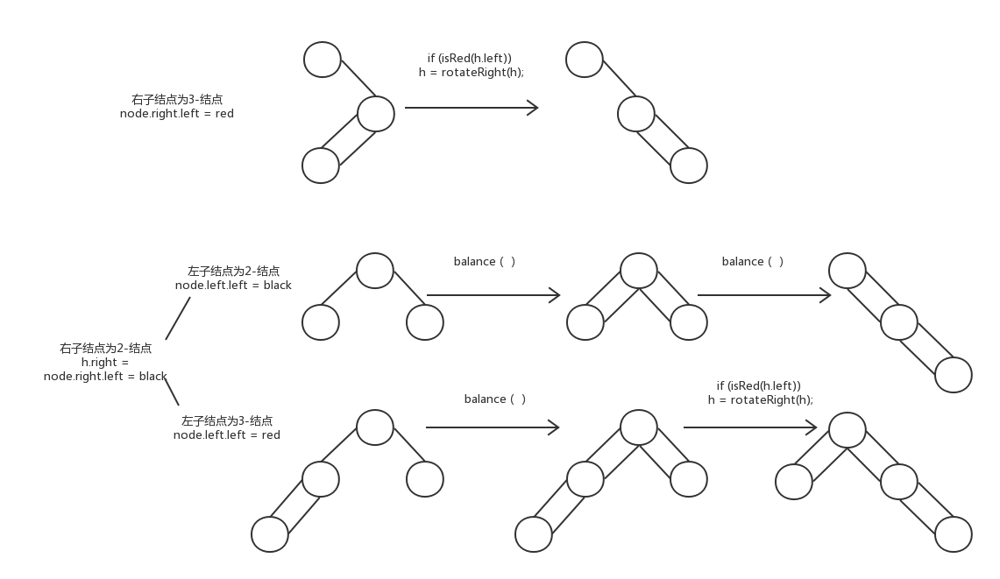

### 一些概念：

如果一个结点只存储一个键值对，那么叫做`2-结点`，所组成的树叫做`2-树`。同理，存储两个键值对的结点叫做`3-结点`。如果一个树中含有这两种结点，那么称作`2-3树`。

红黑树是一种基于有序符号表的二叉平衡树的实现。

红黑树二叉查找树，定义是满足下面条件的二叉查找树：

1. 红链接均为左链接
2. 没有任何一个结点同时和两条红链接相连
3. 该树是完美黑色平衡的，即任意空链接到根结点的路径上的黑链接数量相同
 这样的树和2-3树是一一对应的。

### 下面说明一下实现
#### 存储结点
```java
public class RedBlackBST<K extends Comparable<K>, V> {
    private Node root;

    private static final boolean RED = true;
    private static final boolean BLACK = false;

    private class Node {
        private K k;
        private V v;
        private Node left, right;
        private int N;
        private boolean color;  //结点的颜色，表示指向该结点的链接的颜色

        Node(K k, V v, int n, boolean color) {
            this.k = k;
            this.v = v;
            N = n;
            this.color = color;
        }
    }
}
```

#### 基本方法
左旋和右旋。左旋即把左边的红链接转换到右边去；右旋相反

在红黑树的变换中，是通过不断的左旋与右旋来实现的，故需要实现这两个方法。

左旋
```java
    private Node rotateLeft(Node h){
        /*
        将一个右链接为红色的结点左旋。涉及到子树中结点位置的变换，颜色的改变，结点数量的改变。
         */
        Node x = h.right;
        h.right = x.left;
        x.left = h;
        x.color = h.color;
        h.color = RED;

        x.N = h.N;
        h.N = size(h.left) + size(h.right) + 1;

        return x;
    }
```
右旋只需将方向相反即可。

颜色转换
在插入的过程中可能会出现两个子结点都为红色的情况，此时相当于变成了`4-结点`，所以需要将中间结点提取出来，变成两个`2-结点`，将中间的结点放到父结点中继续处理。
```java
    private void flipColor(Node h, boolean reverse){
        
        if (reverse){
            /*
            删除操作的转换，为了构造3-或4-子结点。转换一个结点的两个黑色结点的颜色，并将自己变为黑色结点。
             */
            h.color = BLACK;
            h.right.color = h.left.color = RED;
        }else {
            /*
            插入操作的转换。转换一个结点的两个红色结点的颜色，并将自己变为红色结点，相当于把自己送入到父节点中。
             */
            h.color = RED;
            h.right.color = h.left.color = BLACK;
        }
    }
```

#### 插入操作
将新结点不断的向下遍历，直到成为叶子节点。

插入新的结点后可能会出现三种情况：

1. 若右子结点是红色而左子结点是黑色，那么左旋
2. 若左子结点为红色并且它的左子结点也为红色，即存在两个相连的红链，那么先右旋顶部的结点，再执行3.
3. 若两个子结点都为红色，那么改变颜色

```java
    void put(K k, V v){
        root = put(root, k, v);
        root.color = BLACK;
    }

    private Node put(Node h, K k, V v){
        //插入新的结点，注意是红色结点
        if (h == null){
            return new Node(k, v, 1, RED);
        }

        //向下遍历
        int re = k.compareTo(h.k);
        if (re == 0){
            //这里不能直接返回，不知道为什么？？？
            h.v = v;
        }else if (re > 0){
            h.right = put(h.right, k, v);
        }else {
            h.left = put(h.left, k, v);
        }

        //1.左旋
        if (isRed(h.right) && !isRed(h.left)){
            h = rotateLeft(h);
        }

        //2.右旋
        if (isRed(h.left) && isRed(h.left.left)){
            h = rotateRight(h);
        }

        //3.转换
        if (isRed(h.left) && isRed(h.right)){
            flipColor(h, false);
        }

        h.N = size(h.left) + size(h.right) + 1;
        return h;
    }
```

#### 删除最小的键值对
删除的时候允许临时的`4-结点`存在。

在删除最小键的时候，因要保持树的平衡，所以需要确保每个左子结点都不是`2-结点`，即将遇到的每个2-结点都转化为3-结点或4-结点，这样删除的时候树仍然是平衡的。

```java

    private Node balance(Node h){
        /*平衡红黑树，只要在put()方法的后五句加上此句就能达到效果???*/
        //对可能出现的不平衡的情况做预处理
        if (isRed(h.right)){
            h = rotateLeft(h);
        }

        if (isRed(h.right) && !isRed(h.left)){
            h = rotateLeft(h);
        }

        if (isRed(h.left) && isRed(h.left.left)){
            h = rotateRight(h);
        }

        if (isRed(h.left) && isRed(h.right)){
            flipColor(h, false);
        }

        h.N = size(h.left) + size(h.right) + 1;
        return h;
    }

    private Node moveRedLeft(Node h){
        //变为h是黑色（为了不会产生5-结点），两个子结点是红色，先将h变成了一个3-结点，保证左子结点不是2-结点
        flipColor(h, true);
        //若右子树的根结点不是2-结点，将一个键移动到左子结点中，h继续变成一个4-结点；此时因为已经将右结点变为红色，所以无需判断其颜色。
        if (isRed(h.right.left)){
            h.right = rotateRight(h.right);  //右旋h的右子树，变为右边的4-结点
            h = rotateLeft(h);  //再左旋h，将左子树变为4-结点
        }
        return h;
    }

    void deleteMin() {
        //不知道为什么要转变颜色???
        if(!isRed(root.left) && !isRed(root.right)){
            root.color = RED;
        }
        root = deleteMin(root);
        if (!isEmpty()){
            root.color = BLACK;
        }
    }

    private Node deleteMin(Node h){
        //删除最小结点
        if (h.left == null){
            return null;
        }

        //左子树的根结点是2-结点，转换为非2-结点，可能是3-结点或4-结点
        if (!isRed(h.left) && !isRed(h.left.left)){
            h = moveRedLeft(h);
        }

        //此时已经保证了左子树的根结点不是2-结点
        //向下删除结点，改变红黑树结构
        h.left = deleteMin(h.left);
        //向上平衡红黑树，消除临时产生的4-结点，平衡之后再更新结点大小
        return balance(h);
    }
```

#### 删除最大的键值对
因红链接都为左链接，所以有稍微不同。

```java
    private Node moveRedRight(Node h){
        //变为h是黑色，两个子结点是红色，先将h变成右边的3-结点，保证右子结点不是2-结点
        flipColor(h, true);

        //h的左子结点也是2-结点，将h的右子结点继续变为右边的4-结点
        if (!isRed(h.left.left)){
            h = rotateRight(h);
        }

        return h;
    }

    void deleteMax() {
        if (!isRed(root.left) && !isRed(root.right)){
            root.color = RED;
        }
        root = deleteMax(root);
        if (!isEmpty()){
            root.color = BLACK;
        }
    }

    private Node deleteMax(Node h){
        //将为红色的左根结点直接转到右边来
        if (isRed(h.left)){
            h = rotateRight(h);
        }

        //删除最大结点
        if (h.right == null){
            return null;
        }

        //h的右子结点是黑色结点，并且右子树不是3-结点。
        //因为第一步已经直接把为红色的左根结点转到右边，保证了此右树是右边的3-结点，所以不需要再进行变幻，要将其过滤
        if (!isRed(h.right) && !isRed(h.right.left)){
            h = moveRedRight(h);
        }

        //向下删除结点
        h.right = deleteMax(h.right);

        //向上平衡二叉树
        return balance(h);
    }
```

#### 删除操作
将删除最小值和最大值结合起来完成删除操作。

```java
    void delete(K k) {
        if(!isRed(root.left) && !isRed(root.right)){
            root.color = RED;
        }

        root = delete(root, k);
        if (!isEmpty()){
            root.color = BLACK;
        }
    }

    private Node delete(Node h, K k){
        //在左子树中
        if (k.compareTo(h.k) < 0){
            if (!isRed(h.left) && !isRed(h.left.left)){
                h = moveRedLeft(h);
            }
            h.left = delete(h.left, k);
        }
        //找到了该结点或在右子树中
        else {
            if (isRed(h.left)){
                h = rotateRight(h);
            }

            //找到该结点，并且右子树为空，无需调整结构，删除该结点
            if (k.compareTo(h.k) == 0 && (h.right == null)){
                return null;
            }

            //右子树是2-结点，转化为右边的4-或3-结点
            if (!isRed(h.right) && !isRed(h.right.left)){
                h = moveRedRight(h);
            }

            //找到了该结点，但是右子树不为空，所以需要调整结构；与二叉树的删除方法类似
            if (k.compareTo(h.k) == 0){
                h.v = get(h.right, min(h.right).k);
                h.k = min(h.right).k;
                h.right = deleteMin(h.right);
            }
            //该结点在右子树中
            else {
                h.right = delete(h.right, k);
            }
        }
        return balance(h);
    }
```

#### 其它方法
对于其它方法，因为不会涉及到颜色转换，所以可以直接使用二叉树的方法。

