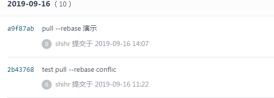

参考：https://github.com/geeeeeeeeek/git-recipes/wiki/3.2-%E4%BF%9D%E6%8C%81%E5%90%8C%E6%AD%A5

## git fetch

将远程仓库的提交存储到本地仓库的远程分支中。此命令可以在将变更整合到本地之前查看其他人的修改。

即将远程仓库master的内容存储到`origin/master`中，而不是本地的master分支。

可以对`origin/master`进行正常的`git log`、`git checkout`等操作。

```
git fetch [<options>] [<repository> [<refspec>...]]
git fetch [<options>] <group>
git fetch --multiple [<options>] [(<repository> | <group>)...]
git fetch --all [<options>]
```

```bash
[root@dev git-test]# git fetch
remote: Enumerating objects: 5, done.
remote: Counting objects: 100% (5/5), done.
remote: Compressing objects: 100% (3/3), done.
remote: Total 3 (delta 1), reused 0 (delta 0)
Unpacking objects: 100% (3/3), done.
From gitee.com:ignorantshr/git-test
   8a52ff8..2b43768  master     -> origin/master
```

当你相要应用远程的变更时，可以使用`git merge <repository>/<refspec>`命令合并到本地分支。

```bash
[root@dev git-test]# git merge origin/master
Updating 8a52ff8..2b43768
Fast-forward
 pull-test | 1 +
 1 file changed, 1 insertion(+)
```

而`git pull`是两者的快捷命令。

## git pull

`git pull`相当于先执行`git fetch`，然后执行`git merge`。

```
git pull [options] [<repository> [<refspec>...]]
```

`-r`或`--rebase`选项使你可以将合并变为线性提交，防止合并提交（merge commits）的产生。使用该选项意味着：我想要将自己的提交放在最新的提交之后而不产生一个合并的提交。


例子：

1. 远程仓库状态



2. 本地提交一个修改

```bash
[root@dev git-test]# git log --oneline
6e87ba5 conflict commit
2b43768 test pull --rebase conflic
```

现在6e87ba5与远程仓库的a9f87ab冲突。

3. 执行`git pull`

```bash
[root@dev git-test]# git pull -r
remote: Enumerating objects: 5, done.
remote: Counting objects: 100% (5/5), done.
remote: Compressing objects: 100% (2/2), done.
remote: Total 3 (delta 1), reused 0 (delta 0)
Unpacking objects: 100% (3/3), done.
From gitee.com:ignorantshr/git-test
   2b43768..a9f87ab  master     -> origin/master
First, rewinding head to replay your work on top of it...
Applying: conflict commit
Using index info to reconstruct a base tree...
M       pull-test
Falling back to patching base and 3-way merge...
Auto-merging pull-test
```

此时自动合并了冲突，还有不能自动合并冲突的状况，根据git的提示来执行操作即可。

4. 查看本地提交记录

```bash
[root@dev git-test]# git log --oneline
fdd2dad conflict commit
a9f87ab pull --rebase 演示
2b43768 test pull --rebase conflic
```

会发现自己本地的提交在最后一个，并没有`merge commits`产生，保持了线性提交历史。

