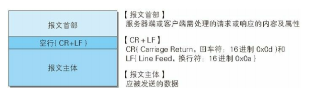
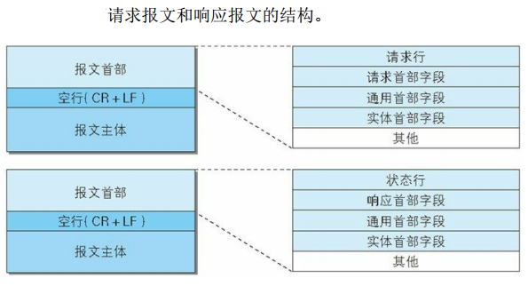
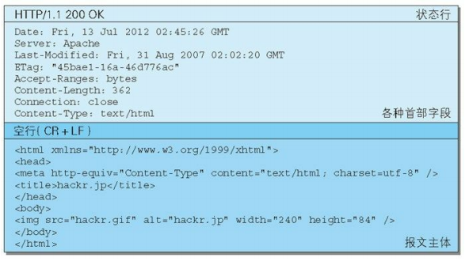
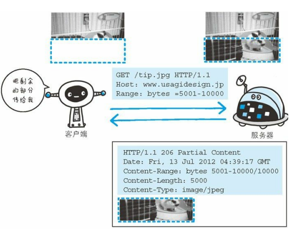

## HTTP报文

用于 HTTP  协议交互的信息被称为 HTTP  报文。

请求行

> 包含用于请求的方法，请求 U RI  和 HTTP  版本。

状态行

> 包含表明响应结果的状态码，原因短语和 HTTP  版本。

首部字段

> 包含表示请求和响应的各种条件和属性的各类首部。
>
> 一般有 4 种首部，分别是：通用首部、请求首部、响应首部和实体首部。
> 其他可能包含 HTTP  的 RFC 里未定义的首部（Cook ie 等）。

## 编码提升传输速率

### 报文主体和实体主体的差异

- 报文（message ）

    > 是 HTTP  通信中的基本单位，由 8 位组字节流（octet  sequence，
    > 其中 octet  为 8 个比特）组成，通过 HTTP  通信传输。

- 实体（entity）

    > 作为请求或响应的有效载荷数据（补充项）被传输，其内容由实
    > 体首部和实体主体组成。

HTTP  报文的主体用于传输请求或响应的实体主体。

通常，报文主体等于实体主体。只有当传输中进行编码操作时，实体主体的内容发生变化，才导致它和报文主体产生差异。

### 压缩传输的内容编码

将实体编码压缩后进行传输。服务端压缩，客户端恢复。

内容编码的类型：

- gzip （GNU zip）
- compress（UNIX  系统的标准压缩）
- deflate （zlib ）
- identity（不进行编码）

### 分割发送的分块传输编码

把实体主体分块传输。这种功能叫做`分块传输编码`（Chunked Transfer Coding）。服务端压缩，客户端解码恢复。

每一块都会用十六进制来标记块的大小，而实体主体的最后一块会使用“0(CR+L F)”来标记。

## 发送多种数据的多部分对象集合

HTTP  协议中也采纳了多部分对象集合，发送的一份报文主体内可含有多种类型实体。

多部分对象集合包含的对象如下：

- multipart/form-data

    > 在 W eb 表单文件上传时使用。 

- multipart/byteranges

    > 状态码 206（Partial  Content，部分内容）响应报文包含了多个范围的内容时使用。

在 HTTP  报文中使用多部分对象集合时，需要在首部字段里加上Content-type。
使用 boundary  字符串来划分多部分对象集合指明的各类实体。

多部分对象集合的每个部分类型中，都可以含有首部字段。另外，可以在某个部分中嵌套使用多部分对象集合。

## 获取部分内容的范围请求

指定范围发送的请求叫做范围请求（Range Request）。该技术可用于断点续传。

针对范围请求，响应会返回状态码为 206 Partial  Content  的响应报文。另外，对于多重范围的范围请求，响应会在首部字段 Content Type 标明 multipart/byteranges 后返回响应报文。

如果服务器端无法响应范围请求，则会返回状态码 200 OK 和完整的实体内容。

## 内容协商返回最合适的内容

内容协商机制是指客户端和服务器端就响应的资源内容进行交涉，然后提供给客户端最为适合的资源。内容协商会以响应资源的语言、字符集、编码方式等作为判断的基准。

包含在请求报文中的某些首部字段（如下） 就是判断的基准：

- Accept
- Accept-Charset
- Accept-Encoding
- Accept-Language
- Content-Language

协商技术有以下三种类型：

- 服务器驱动协商（Server-driven  Negotiation）
- 客户端驱动协商（Agent-driven  Negotiation）
- 透明协商（Transparent  Negotiation）