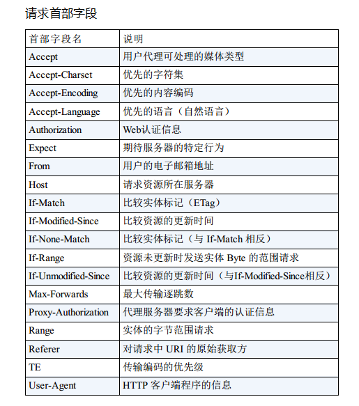
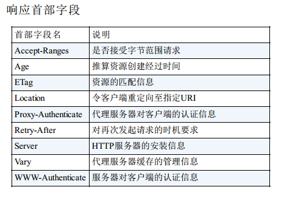
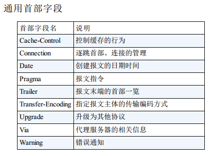
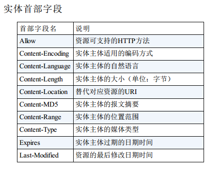
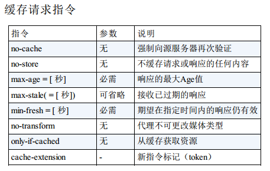
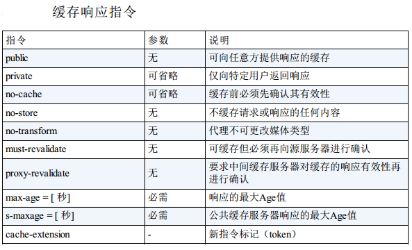
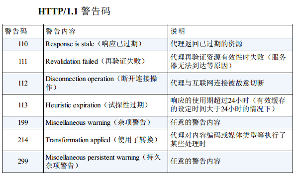
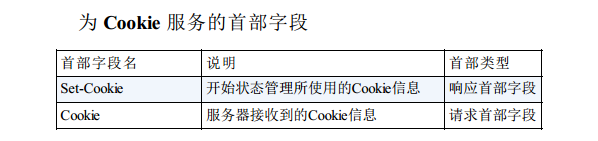
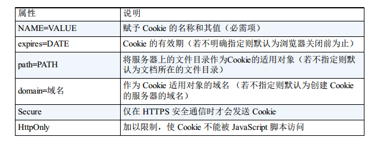

 HTTP  首部结构，以及首部中各字段的用法。

## HTTP  报文首部

参考 [HTTP 报文内的 HTTP 信息](HTTP 报文内的 HTTP 信息.md)，本书主要涉及 HTTP/1.1 及常用的首部字段。

## HTTP  首部字段

HTTP 首部字段根据实际用途被分为以下 4 种类型：

- 通用首部字段（ General Header Fields）
    请求报文和响应报文两方都会使用的首部。
- 请求首部字段（ Request Header Fields）
    从客户端向服务器端发送请求报文时使用的首部。 补充了请求的附加
    内容、 客户端信息、 响应内容相关优先级等信息。
- 响应首部字段（ Response Header Fields）
    从服务器端向客户端返回响应报文时使用的首部。 补充了响应的附加
    内容， 也会要求客户端附加额外的内容信息。
- 实体首部字段（ Entity Header Fields）
    针对请求报文和响应报文的实体部分使用的首部。 补充了资源内容更
    新时间等与实体有关的信息。 

### HTTP 首部字段结构

```json
首部字段名: 字段值1,字段值2,...
```

HTTP  首部字段重复的处理方式根据浏览器内部的逻辑决定。

### 各种字段概览









### 非 HTTP/1.1 首部字段

不限于 RFC2616 中定义的 47 种首部字段，其它非正式的首部字段统一归纳在 RFC4229 HTTP  Header Field
Registrations 中。

### End-to-end 首部和 Hop-by-hop 首部

HTTP  首部字段将定义成缓存代理和非缓存代理的行为，分成 2 种类型。

- 端到端首部（End-to-end  Header）

> 分在此类别中的首部会转发给请求 /  响应对应的最终接收目标，且必须保存在由缓存生成的响应中，另外规定它必须被转发。

- 逐跳首部（Hop-by-hop  Header）

> 分在此类别中的首部只对单次转发有效，会因通过缓存或代理而不再转发。HTTP/1.1 和之后版本中，如果要使用 hop-by -hop 首部，需提供 Connection  首部字段。

除这 8 个首部字段之外，其他所有字段都属于端到端首部：

- Connection
- Keep-Alive
- Proxy-Authenticate
- Proxy-Authorization
- Trailer
- TE
- Transfer-Encoding
- Upgrade

## HTTP/1.1 通用首部字段

### Cache -Control

控制缓存的行为。

指令一览：





详细说明参考《图解HTTP》6.3.1 节。

### Connecti on

- 控制不再转发给代理的首部字段

    > Connection: 不再转发的首部字段名

- 管理持久连接

    > Connection: close/Keep-Alive
    >
    > HTTP/1.1之后默认是持久化连接；之前是非持久化连接。使用此首部改变连接的持久化状态。

### Date

HTTP/1.1 协议使用在 RFC1123 中规定的日期时间的格式：

```json
Date: Tue, 03 Jul 2012 04:40:59 GMT
```

前的 HTTP  协议版本中使用在 RFC850 中定义的格式：

```json
Date: Tue, 03-Jul-12 04:40:59 GMT
```

还有一种格式。它与 C 标准库内的 asct im e() 函数的输出格式一致：

```json
Date: Tue Jul 03 04:40:59 2012
```

### Pragma

Pragma 是 HTTP/1.1 之前版本的历史遗留字段，仅作为与 HTTP/1.0的向后兼容而定义。

```json
Pragma: no-cache
```

该首部字段属于通用首部字段，但只用在客户端发送的请求中。客户端会要求所有的中间服务器不返回缓存的资源。

发送的请求会同时含有下面两个首部字段来保证所有版本的HTTP协议有相同的缓存方式：

```json
Cache-Control: no-cache
Pragma: no-cache
```

### Trailer

Trailer 会事先说明在报文主体后记录了哪些首部字段。该首部字段可应用在 HTTP/1.1 版本分块传输编码时。

```json
...
Trailer: Expires
...(报文主体)...
Expires: Tue, 28 Sep 2004 23:59:59 GMT
```

### Transfer-Encoding

规定了传输报文主体时采用的编码方式。仅对分块传输编码有效。

```json
...
Transfer-Encoding: chunked
Connection: keep-alive
cf0    ←16进制(10进制为3312)
...3312字节分块数据...
392    ←16进制(10进制为914)
...914字节分块数据...
0
```

### Upgrade

用于检测 HTTP  协议及其他协议是否可使用更高的版本进行通信，其参数值可以用来指定一个完全不同的通信协议。

Upgrade 首部字段产生作用的 Upgrade 对象仅限于客户端和邻接服务器之间。因此，使用首部字段 Upgrade 时，还需要额外指定`Connection :Upgrade`。

服务器可用 `101 Switching Protocols` 状态码作为响应返回。

### Via

为了追踪客户端与服务器之间的请求和响应报文的传输路径。

报文经过代理或网关时，会先在首部字段 Via 中附加该服务器的信息，然后再进行转发。

首部字段 Via 不仅用于追踪报文的转发，还可避免请求回环的发生，所以必须在经过代理时附加该首部字段内容。

Via 首部是为了追踪传输路径，所以经常会和 TRACE 方法一起使用。

### Warning

该首部通常会告知用户一些与缓存相关的问题的警告。

格式（日期可省略）：

```json
Warning: [警告码][警告的主机:端口号]“[警告内容]”([日期时间])
```



## 请求首部字段

用于补充请求的附加信息、客户端信息、对响应内容相关的优先级等内容。

### Accept 

Accept  首部字段可通知服务器，用户代理能够处理的媒体类型及媒体类型的相对优先级。可使用 `type/subtype` 这种形式，一次指定多种媒体类型。

使用 q= 来额外表示权重值，用分号（;）进行分隔。范围是 0~1（可精确到小数点后 3 位），且 1 为最大值，默认值是1.0。

例子，优先发送plain文本文件：

```json
Accept: text/html; q=0.5, text/plain 
```

### Accept-Charset

Accept-Charset  首部字段可用来通知服务器用户代理支持的字符集及字符集的相对优先顺序。也可指定权重值。

该首部字段应用于内容协商机制的服务器驱动协商。

### Accept-Encoding

Accept-Encoding  首部字段用来告知服务器用户代理支持的内容编码及内容编码的优先级顺序。

```json
Accept-Encoding: gzip, deflate
```

- gzip （GNU zip）
- compress（UNIX  系统的标准压缩）
- deflate （zlib ）
- identity（不进行编码）

采用权重 q 值来表示相对优先级，也可使用星号（*）作为通配符，指定任意的编码格式。

### Accept-Language

Accept-Language 用来告知服务器用户代理能够处理的自然语言集（指中文或英文等），以及自然语言集的相对优先级。

支持 q 值。

### Authorization

Authorization  是用来告知服务器，用户代理的认证信息（证书值）。通常，想要通过服务器认证的用户代理会在接收到返回的 401 状态码响应后，把首部字段 Authorization  加入请求中。

### Expect 

Expect  来告知服务器，期望出现的某种特定行为。

因服务器无法理解客户端的期望作出回应而发生错误时，会返回状态码 417 Expectation  Failed。

等待状态码 100 响应的客户端在发生请求时，需要指定 `Expectt :100-continue`。

### From

用来告知服务器使用用户代理的用户的电子邮件地址。使用代理时，应尽可能包含 From  首部字段（但
可能会因代理不同，将电子邮件地址记录在 User-Agent  首部字段内）。

### Host

告知服务器请求的资源所处的互联网主机名和端口号。唯一一个必须被包含在请求内的首部字段。

若服务器未设定主机名，那直接发送一个空值即可。

### If-Match

形如 If-xxx  这种样式的请求首部字段，都可称为条件请求。服务器接收到附带条件的请求后，只有判断指定条件为真时，才会执行请求。否则返回状态码 `412 Precondition Failed` 的响应。

If-Match 它会告知服务器匹配资源所用的实体标记（ETag ）值。这时的服务器无法使用弱 ETag  值。

还可以使用星号（*）指定 If -Match  的字段值。针对这种情况，服务器将会忽略 ETag  的值，只要资源存在就处理请求。

### If-None-Match

与 If-Match 相反。在 GET 或 HEAD 方法中使用首部字段 If-None-Match  可获取最新的资源。

### If-Modified-Since

它会告知服务器若 If-Modified-Since 字段值早于资源的更新时间，则希望能处理该请求。如果请求的资源都没有过更新，则返回状态码 `304 Not Modified` 的响应。

用于确认代理或客户端拥有的本地资源的有效性。获取资源的更新日期时间，可通过确认首部字段 Last-Modified 来确
定。

### If-Unmodified-Since

和首部字段 If-Modified-Since 的作用相反。如果在指定日期时间后发生了更新，则以状态码 `412 Precondition Failed` 作为响应返回。

### If-Range

它告知服务器若指定的 If-Range 字段值（ETag  值或者时间）和请求资源的 ETag  值或时间相一致时，则作为范围请求处理。反之，则返回全体资源。

### Max-Forwards

通过 TRACE 方法或 OPTIONS 方法，发送包含首部字段 Max-Forwards 的请求时，该字段以十进制整数形式指定可经过的服务器最大数目。每次转发数值减 1。当数值变 0 时直接返回响应。

### Proxy-Authorization

接收到从代理服务器发来的认证质询时，客户端会发送包含该首部字段的请求，以告知服务器认证所需要的信息。

这个行为是与客户端和服务器之间的 HTTP 访问认证相类似的，不同之处在于，认证行为发生在客户端与代理之间。客户端与服务器之间的认证，使用首部字段 Authorization  可起到相同作用。

### Range

对于只需获取部分资源的范围请求，包含首部字段 Range 即可告知服务器资源的指定范围。

 处理请求之后返回状态码为 `206 Partial Content` 的响应。无法处理该范围请求时，则会返回状态码 200 OK 的响应及全部资源。

### Referer

会告知服务器请求的原始资源的 URI。

### TE

告知服务器客户端能够处理响应的传输编码方式及相对优先级。它和首部字段 Accept-Encoding  的功能很相像，但是用于传输编码。

还可以指定伴随 trailer 字段的分块传输编码的方式。应用后者时，只需把 trailers 赋值给该字段值：

```json
TE: trailers
```

## 响应首部字段

用于补充响应的附加信息、服务器信息，以及对客户端的附加要求等信息。

参考《图解HTTP》6.5 节

强 ETag  值，不论实体发生多么细微的变化都会改变其值。

弱 ETag  值只用于提示资源是否相同。只有资源发生了根本改变，产生差异时才会改变 ETag 值。这时，会在字段值最开始处附加 `W/`。

## 实体首部字段

用于补充内容的更新时间等与实体相关的信息。

参考《图解HTTP》6.6 节

## 为 Cookie 服务的首部字段

Cookie 的工作机制是用户识别及状态管理。



### Set-Cookie

当服务器准备开始管理客户端的状态时，会事先告知各种信息。

Set-Cookie  字段的属性



**expires**

> 指定浏览器可发送 Cookie 的有效期。
>
> 当省略 expires 属性时，其有效期仅限于维持浏览器会话（Session ）
> 时间段内。
>
> 另外，一旦 Cookie  从服务器端发送至客户端，服务器端就不存在可
> 以显式删除 Cookie  的方法。但可通过覆盖已过期的 Cookie ，实现对
> 客户端 Cookie  的实质性删除操作。

**path**

> 可用于限制指定 Cookie 的发送范围的文件目录。

**domain**

>  通过 Cookie 的 domain 属性指定的域名可做到与结尾匹配一致。
>
> 因此，除了针对具体指定的多个域名发送 Cookie 之 外，不指定
> domain  属性显得更安全。

**secure**

> Cookie 的 secure 属性用于限制 Web 页面仅在 HTTPS 安全连接时，才
> 可以发送 Cookie。

格式：

```http
Set-Cookie: name=value; secure
```

**HttpOnly**

> 是 Cookie 的扩展功能，它使 JavaScript  脚本
> 无法获得 Cookie。其主要目的为防止跨站脚本攻击（Cross-site scripting ，XSS）对 Cookie 的信息窃取。

格式：

```http
Set-Cookie: name=value; HttpOnly
```

### Cookie

```http
Cookie: status=enable
```

首部字段 Cookie 会告知服务器，当客户端想获得 HTTP  状态管理支持时，就会在请求中包含从服务器接收到的 Cookie。接收到多个 Cookie 时，同样可以以多个 Cookie 形式发送。

## 其他首部字段

主要是保护不受攻击的字段。

参考《图解HTTP》6.8 节