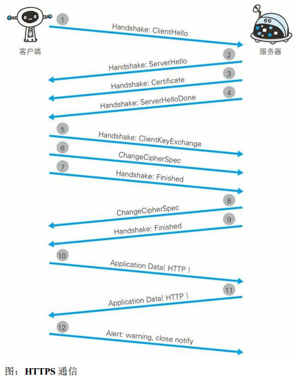
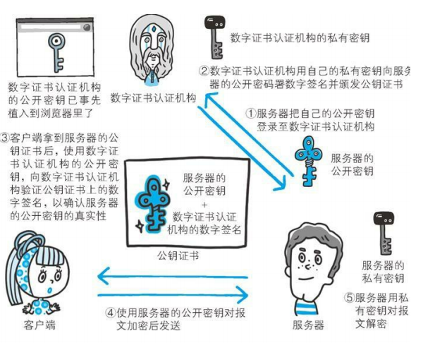

## HTTP 的缺点

- 通信使用明文（ 不加密） ， 内容可能会被窃听
- 不验证通信方的身份， 因此有可能遭遇伪装
    - 无法确定请求发送至目标的 Web 服务器是否是按真实意图返回响应的那台服务器。 有可能是已伪装的 Web 服务器。
    - 无法确定响应返回到的客户端是否是按真实意图接收响应的那个客户端。 有可能是已伪装的客户端。
    - 无法确定正在通信的对方是否具备访问权限。 因为某些Web 服务器上保存着重要的信息， 只想发给特定用户通信的权限。
    - 无法判定请求是来自何方、 出自谁手。
    - 即使是无意义的请求也会照单全收。 无法阻止海量请求下的 **DoS 攻击**（ Denial of Service， 拒绝服务攻击） 。 
- 无法证明报文的完整性， 所以有可能已遭篡改 
    - 请求或响应在传输途中，遭攻击者拦截并篡改内容的攻击称为**中间人攻击**（Man-in-the-Middle attack， MITM） 。 

## HTTPS

**HTTP+ 加密 + 认证 + 完整性保护 = HTTPS**

我们把添加了加密及认证机制的 HTTP 称为 HTTPS（HTTP Secure）。

通常，HTTP  直接和 TCP  通信。当使用 SSL  时，则演变成先和 SSL  通信，再由 SSL  和 TCP  通信了。

混合加密机制：在交换密钥环节使用**非对称密钥**加密方式，之后的建立通信交换报文阶段则使用**对称密钥**加密方式。

数字证书认证机构（CA，Certificate Authority）和其相关机关颁发的公开密钥证书用于证明公开密钥正确性。数字证书认证机构处于客户端与服务器双方都可信赖的第三方机构的立场上。

接到证书的客户端可使用数字证书认证机构的公开密钥，对那张证书上的数字签名进行验证，一旦验证通过，客户端便可明确两件事：

- 认证服务器的公开密钥的是真实有效的数字证书认证机构。
- 服务器的公开密钥是值得信赖的。

### HTTPS 的安全通信机制 

TLS协议握手协议首先还是要经过TCP三次握手建立连接，然后才是TLS握手的开始：

1. ClientHello：Client端将自己的TLS协议版本，加密套件，压缩方法，随机数，SessionID(未填充)发送给Server端

2. ServerHello：Server端将选择后的SSL协议版本，压缩算法，密码套件，填充SessionID，生成的随机数等信息发送给Client端

3. ServerCertificates：Server端将自己的数字证书(包含公钥)，发送给Client端。(证书需要从数字证书认证机构(CA)申请，证书是对于服务端的一种认证)，若要进行更为安全的数据通信，Server端还可以向Client端发送Cerficate Request来要去客户端发送对方的证书进行合法性的认证。

4. ServerHelloDone：当完成ServerHello后，Server端会发送Server Hello Done的消息给客户端，表示ServerHello 结束了。

5. ClientKeyExchage：当Client端收到Server端的证书等信息后，会先对服务端的证书进行检查，检查证书的完整性以及证书跟服务端域名是否吻合，然后使用加密算法生成一个PreMaster Secret，并通过Server端的公钥进行加密，然后发送给Server端。

6. ChangeCipherSpec：接着Client端继续发送 Change Cipher Spec(一种协议，数据只有一字节) 报文，用于告知Server端我（Client端）已经切换到之前协商好的加密套件的状态，准备使用之前协商好的加密套件加密数据并进行传输了。 
7. ClientFinishd：Client端使用Master Secret(通过两个随机数、PreMaster Secret和加密算法计算得出)加密一段Finish报文（该报文包含连接至今全部报文的整体校验值 ）传送给服务端，此数据是为了在正式传输应用数据之前对刚刚握手建立起来的加解密通道进行验证。
8. ChangeCipherSpec：Sever端在接收到Client端传过来的加密数据后，使用私钥对这段加密数据进行解密，并对数据进行验证。然后告知Client端我（Server端）已经切换到之前协商好的加密套件的状态，准备使用之前协商好的加密套件加密数据并进行传输了 。
9. Server Finishd：服务端也会使用Master Secret加密一段Finish报文发送给客户端，以验证之前通过握手建立起来的加解密通道是否成功。
10. 从此处开始进行应用层协议的通信， 即发送 HTTP 请求。 
11. 同上。
12. 最后由客户端断开连接。 断开连接时， 发送 close_notify 报文。 这步之后再发送 TCP FIN 报文来关闭与 TCP
    的通信。 

在以上流程中， 应用层发送数据时会附加一种叫做 MAC（Message Authentication Code） 的报文摘要。 MAC 能够查知报文是否遭到篡改， 从而保护报文的完整性。 

如何获取认证机构的公开密钥：多数浏览器会事先在内部植入常用认证机关的公开密钥。

SSL 的慢分两种。一种是指通信慢。另一种是指由于大量消耗CPU 及内存等资源，导致处理速度变慢。

详细通信过程解读参考《图解HTTP》7.2 节。

更多HTTP介绍参考《图解HTTP》。