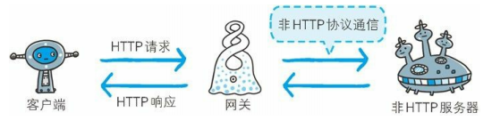

## 用单台虚拟主机实现多个域名

HTTP/1.1 规范允许一台 HTTP  服务器搭建多个 Web 站点。利用了虚拟主机（Virtual Host，又称虚拟服务器）的功能。

在相同的 IP  地址下，由于虚拟主机可以寄存多个不同主机名和域名的 W eb 网站，因此在发送 HTTP  请求时，必须在 Host  首部内完整指定主机名或域名的 URI。

## 通信数据转发程序 ：代理、网关、隧道

代理是一种有转发功能的应用程序。

网关是转发其他服务器通信数据的服务器，接收从客户端发送来的请求时，它就像自己拥有资源的源服务器一样对请求进行处理。

隧道是在相隔甚远的客户端和服务器两者之间进行中转，并保持双方通信连接的应用程序。

### 代理

代理服务器的基本行为就是接收客户端发送的请求后转发给其他服务器。代理不改变请求 URI，会直接发送给前方持有资源的目标服务器。

转发时，需要附加 Via 首部字段以标记出经过的主机信息。

使用场景：

- 利用缓存技术（稍后讲解）减少网络带宽的流量
- 组织内部针对特定网站的访问控制
- 以获取访问日志为主要目的
- ......

代理的分类：

- 缓存代理

> 代理转发响应时，缓存代理（Caching  Proxy）会预先将资源的副本
> （缓存）保存在代理服务器上。

- 透明代理

> 转发请求或响应时，不对报文做任何加工的代理类型被称为透明代理
> （Transparent  Proxy）。

- 非透明代理

### 网关

网关能使通信线路上的服务器提供非 HTTP  协议服务。

### 隧道

隧道可按要求建立起一条与其他服务器的通信线路，届时使用 SSL  等加密手段进行通信。隧道的目的是确保客户端能与服务器进行安全的通信。

隧道本身不会去解析 HTTP  请求。也就是说，请求保持原样中转给之后的服务器。隧道会在通信双方断开连接时结束。

隧道本身是透明的，客户端不用在意隧道的存在。

## 保存资源的缓存

`缓存`指代理服务器或客户端本地磁盘内保存的资源副本。

### 缓存的有效期限

即使存在缓存，也会因为客户端的要求、缓存的有效期等因素，向源服务器确认资源的有效性。若判断缓存失效， 缓存服务器将会再次从源服务器上获取“更新”后的资源。 

### 客户端的缓存

存在客户端浏览器中。也会确认资源的有效性。

