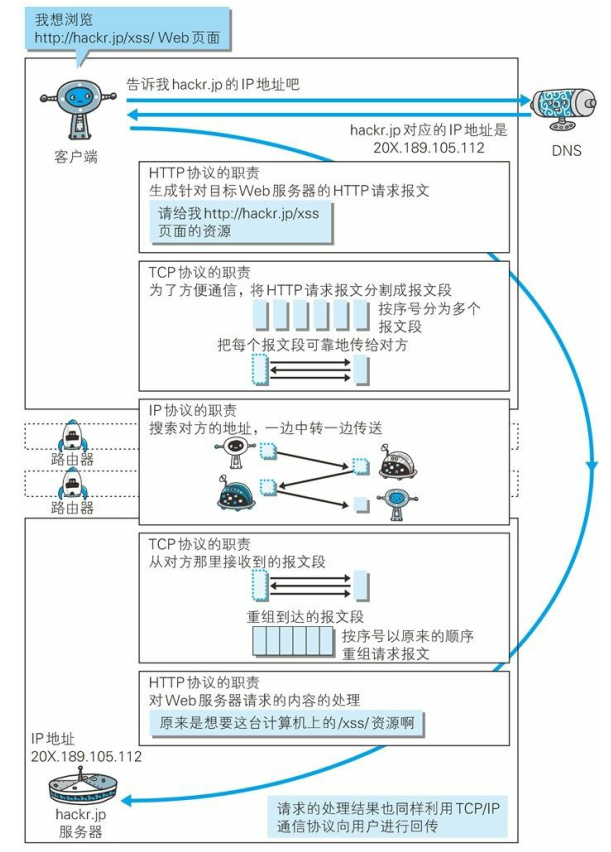
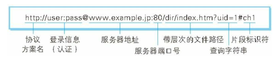
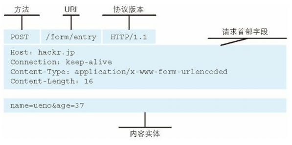
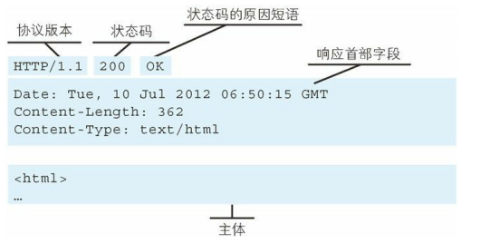
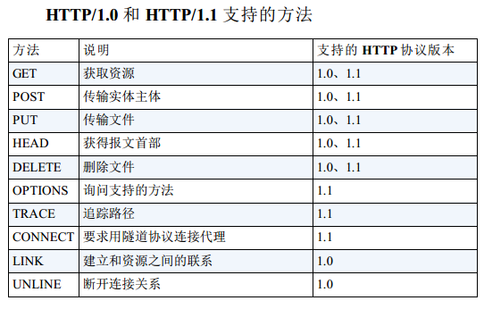

参考《图解HTTP》一书，如有不同之处，请以此书为准。

## 网络基础

### TCP/IP协议族

​	把与互联网相关联的协议集合起来总称为 `TCP/IP`。

​	TCP/ IP  协议族按层次分别分为以下 4 层：应用层、传输层、网络层和数据链路层。

​	IP  协议的作用是把各种数据包传送给对方。

​	TCP  协议采用了三次握手（three-way handshaking）策略，握手过程中使用了 TCP  的标志（flag ） —— SYN（synchronize） 和 ACK（acknowledgement）。

​	发送端首先发送一个带 SYN 标志的数据包给对方。接收端收到后，回传一个带有 SYN/ACK 标志的数据包以示传达确认信息。最后，发送端再回传一个带 ACK 标志的数据包，代表“握手”结束。

### 各种协议与http协议的关系

### URI和URL

URI（统一资源标识符）， URL （Uniform Resource Locator，统一资源定位符）。

- Uniform：规定统一的格式可方便处理多种不同类型的资源， 而不用根据上下文环境来识别资源指定的访问方式。 另外， 加入新增的协议方案（如http: 或 ftp:） 也更容易。 
- 资源的定义是“可标识的任何东西”。 
- 表示可标识的对象。  

综上，URI  就是由某个协议方案表示的资源的定位标识符。URI 的格式：

URI  用字符串标识某一互联网资源， URL 表示资源的地点（互联网上所处的位置）。可见 URL  是 URI  的子集。

## 简单的 HTTP 协议

### 请求报文

请求报文是由请求方法、请求 URI、协议版本、可选的请求首部字段和内容实体构成的：

### 响应报文

响应报文基本上由协议版本、状态码（表示请求成功或失败的数字代码）、用以解释状态码的原因短语、可选的响应首部字段以及实体主体构成：

### 无状态协议

HTTP本身不保存请求和响应之间的通信状态。为了实现期望的保持状态的功能，引入了`cookie`技术。

### HTTP 方法

`GET`：获取资源

`POST`：传输实体主体

> 虽然用 GET 方法也可以传输实体的主体，但一般不用 GET 方法进行传输，而是用 POST 方法。虽说 POST 的功能与 GET 很相似，但POST 的主要目的并不是获取响应的主体内容。

`PUT`：传输文件

> 自身没有验证机制，所以一般不用。

`DELETE`：删除文件

> 自身没有验证机制，所以一般不用。

`HEAD`：获得报文首部

> HEAD 方法和 GET 方法一样，只是不返回内容主体，用于确认 URI 的有效性及资源更新的日期时间等。

`OPTIONS`：询问支持的方法

> OPTIONS 方法用来查询针对请求 URI  指定的资源支持的方法。

`TRACE`：追踪路径

> TRACE 方法是让 W eb 服务器端将之前的请求通信环回给客户端的方法。
> 发送请求时，在 Max -Forwards 首部字段中填入数值，每经过一个服务器端就将该数字减 1，当数值刚好减到 0 时，就停止继续传输，最后接收到请求的服务器端则返回状态码 200 OK 的响应。
> 很少使用。

`CONNECT`：要求用隧道协议连接代理

> CONNECT 方法要求在与代理服务器通信时建立隧道，实现用隧道协议进行 TCP  通信。主要使用 SSL （Secure Sockets Layer，安全套接层）和 TLS（Transport  Layer Security，传输层安全）协议把通信内容加密后经网络隧道传输。
>
>
> 格式：`CONNECT 代理服务器名:端口号 HTTP版本`。

#### 方法总结

下表列出了 HTTP/1.0 和 HTTP/1.1 支持的方法。另外，方法名区分大小写，注意要用大写字母。

### 持久连接

持久连接的特点是，只要任意一端没有明确提出断开连接，则`保持 TCP  连接状态`。持久连接旨在建立 1 次 TCP  连接后进行多次请求和响应的交互。在 HTTP/1.1 中，所有的连接默认都是持久连接，但在 HTTP/1.0 内并未标准化。 

`管线化`技术出现后，不用等待响应亦可直接发送下一个请求。

### 使用Cookie 进行状态管理

Cookie 技术通过在请求和响应报文中写入 Cookie 信息来控制客户端的状态。

Cookie 会根据从服务器端发送的响应报文内的一个叫做 `Set-Cookie` 的首部字段信息，通知客户端保存 Cookie。当下次客户端再往该服务器发送请求时，客户端会自动在请求报文中加入 Cookie 值后发送出去。

服务器端发现客户端发送过来的 Cookie 后，会去检查究竟是从哪一个客户端发来的连接请求，然后对比服务器上的记录，最后得到之前的状态信息。