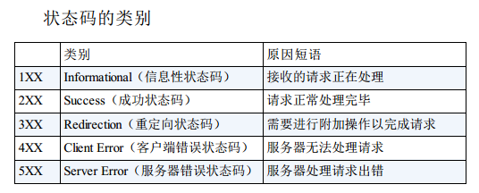

以 3 位数字和原因短语组成。

数字中的第一位指定了响应类别，后两位无分类。

下面介绍代表性的14种状态码。

## 2XX 成功

### 200 OK

在响应报文内，随状态码一起返回的信息会因方法的不同而发生改变。

### 204 No Content

该状态码代表服务器接收的请求已成功处理，但在返回的响应报文中不含实体的主体部分。

### 206 Partial  Content

响应报文中包含由 Content-Range 指定范围的实体内容。

## 3XX 重定向

3XX 响应结果表明浏览器需要执行某些特殊的处理以正确处理请求。

### 301 Moved Permanently

永久性重定向。该状态码表示请求的资源已被分配了新的 URI，以后应使用资源现在所指的 URI。

### 302 Found

临时性重定向。该状态码表示请求的资源已被分配了新的 URI，希望用户（本次）能使用新的 URI  访问。

 302 状态码代表的资源不是被永久移动，只是临时性质的。换句话说，已移动的资源对应的 URI 将来还有可能发生改变。

### 303 See  Other

该状态码表示由于请求对应的资源存在着另一个 URI，应使用 GET 方法定向获取请求的资源。

303 状态码和 302 Found 状态码有着相同的功能，但 303 状态码明确表示客户端应当采用 GET 方法获取资源。

**`注意`**：当 301、302、303 响应状态码返回时，几乎所有的浏览器都会把POST 改成 GET，并删除请求报文内的主体，之后请求会自动再次发送。
301、302 标准是禁止将 POST 方法改变成 GET 方法的，但实际使用时大家都会这么做。

### 304 Not Modified

该状态码表示客户端发送附带条件的请求（附带条件的请求是指采用 GET  方法的请求报文中包含 If-Match，If-ModifiedSince，If-None-Match，If-Range，If-Unmodified-Since 中任一首部）时，服务器端允许请求访问资源，但未满足条件的情况。304 状态码返回时，不包含任何响应的主体部分。

### 307 Temporary Redirect

临时重定向。该状态码与 302 Found 有着相同的含义。

区别就是 307 会遵照浏览器标准，不会从 POST 变成 GET。但是，对于处理响应时的行为，每种浏览器有可能出现不同的情况。

## 4XX 客户端错误

### 400 Bad Request

该状态码表示请求报文中存在语法错误。另外，浏览器会像 200 OK 一样对待该状态码。

### 401 Unauthorized

该状态码表示发送的请求需要有通过 HTTP  认证（BASIC 认证、DIGEST 认证）的认证信息。当浏览器初次接收到 401 响应，会弹出认证用的对话窗口；再次接收到请求并返回该状态码时，则表示认证失败。

### 403 Forbidden

对请求资源的访问被服务器拒绝了。可以在实体的主体部分对原因作描述。

### 404 Not Found

服务器上无法找到请求的资源。除此之外，也可以在服务器端拒绝请求且不想说明理由时使用。

## 5XX 服务器错误

### 500 Internal  Server Error

表明服务器端在执行请求时发生了错误。

### 503 Service  Unavailable

表明服务器暂时处于超负载或正在进行停机维护，现在无法处理请求。

