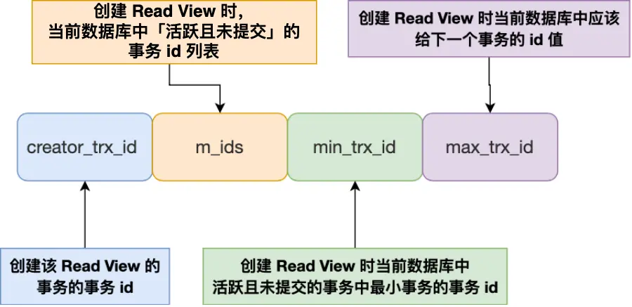
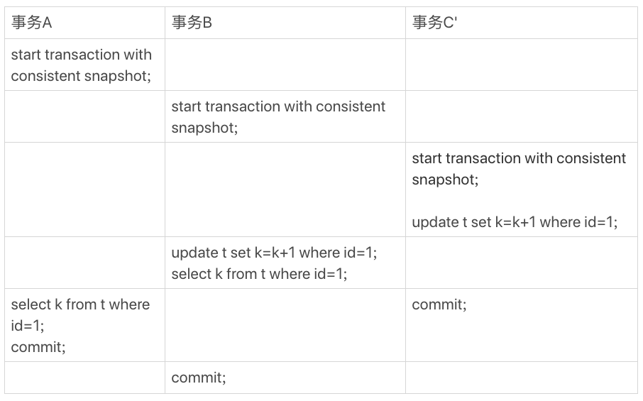

[TOC]
# 事务

## 事务的特性

MyISAM 引擎就不支持事务。

事务（Transaction）的四个特性：

- **原子性（Atomicity）**：一个事务中的操作，要么全部完成，要么全部不完成。如果事务在执行过程中发生错误，会被回滚到事务开始前的状态，就像从未发生过一样。
- **一致性（Consistency）**：指事务操作前和操作后，数据满足完整性约束，数据库保持一致性状态。
- **隔离性（Isolation）**：允许多个并发事务同时对数据进行读写和修改的能力。隔离性可以防止多个事务并发执行时由于交叉执行而导致的数据不一致，因为多个事务同时使用相同的数据时，不会相互干扰，每个事务都有一个完整的数据空间，对其他并发事务是隔离的。
- **持久性（Durability）**：事务处理结束后，对数据的修改是持久化的，不是临时的，即使系统故障也不会丢失。

InnoDB 引擎通过什么技术来保证事务的这四个特性：

- 原子性是通过 undo log（回滚日志） 来保证的
- 持久性是通过 redo log （重做日志）来保证的
- 隔离性是通过 MVCC （多版本并发控制）来保证的
- 一致性是通过 原子性+持久性+隔离性 保证的
### 事务的隔离性

#### 并行事务会引发什么问题

同时处理多个事务的时候，就可能出现以下现象，按照严重性从高到低排序：

- 脏读（dirty read）
- 不可重复读（non-repeatable read）
- 幻读（phantom read）
##### 脏读

一个事务读取到了另一个事务的修改后还未提交的数据，就发生了脏读。

因为事务是还没提交事务的，也就是它随时可能发生回滚操作，可能会导致其他事务读取到了过期的数据。


##### 不可重复读

在一个事务内多次读取同一个数据，如果前后数据不一致，就发生了不可重复读。

在一个事务内两次读取过程中，如果发生了其他事务修改并提交了这个数据，就会导致不可重复读发生。


##### 幻读

在一个事务内多次查询符合某个条件的【记录数量】，如果出现前后记录数量不一致的情况，就是发生了幻读。

因为其他事务可能会修改符合查询条件的数据。


#### 事务的隔离级别

SQL 标准提出了四种隔离级别来规避上述这些现象，隔离级别越高，性能效率就越低：

- **读未提交（read uncommitted）**：一个事务还没提交，它的变更就能被其它事务看到。可能出现：
	- 脏读
    - 不可重复读
    - 幻读
- **读提交（read committed）**：一个事务提交之后，它的变更才能被其它事务看到。可能出现：
	- 不可重复读
    - 幻读
- **可重复读（repeatable read）**：一个事务中执行过程中，和该事务启动时看到的数据是一致的。**InnoDB 的默认隔离级别**。可能出现：
	- 幻读
- **串行化（serializable）**：会对记录加上读写锁，多个事务同时对这条记录进行读写时，发生了冲突之后，其它事务**必须等待**当前事务执行完毕才能继续执行

查看隔离等级：
```sql
show variables like 'transaction_isolation'
```

不同的数据库厂商对 SQL 标准中规定的 4 种隔离级别的支持不一样，有的数据库只实现了其中几种隔离级别， **MySQL 虽然支持 4 种隔离级别，但是与 SQL 标准中规定的各级隔离级别允许发生的现象却有些出入**。

MySQL InnoDB 引擎的默认隔离级别虽然是「可重复读」，但是它**很大程度上避免幻读现象，并不是完全解决了**，详见[此文](https://xiaolincoding.com/mysql/transaction/phantom.html)，解决的方案有两种：

- 针对**快照读**（普通select 语句），是通过 **MVCC 方式**解决的。因为在此隔离级别下，事务执行过程中看到的数据，一直跟这个事务启动时看到的数据一致，即使中途有其它事务插入了一条数据，也查询不出来，所以就能避免幻读。
- 针对**当前读**（select … for update 等语句），是通过 **next-key lock（记录锁+间隙锁）**解决的。因为在执行这种语句时会加上 `next-key lock`，如果有其它事务在这个锁的范围内插入了一条记录，那么这个插入语句就会被阻塞，所以就避免了幻读。
#### 四种隔离级别如何实现

- 对于「读未提交」隔离级别的事务来说，因为可以读到未提交事务修改的数据，所以直接读取最新的数据就好了；
- 对于「串行化」隔离级别的事务来说，通过加读写锁的方式来避免并行访问；
- 对于「读提交」和「可重复读」隔离级别的事务来说，它们是通过**Read View来实现的，它们的区别在于创建的 Read View 的时机不同。「读提交」是在*每个语句执行前*都会创建一个 Read View ，而「可重复读」是在*启动事务时*生成一个 Read View，然后整个事务期间都用这个  Read View**。

注意，执行「开始事务」命令，并不意味着启动了事务。在 MySQL 有两种开启事务的命令，这两种开启事务的命令，事务的启动时机是不同的：

- 执行了 `begin/start transaction` 命令后，并不代表事务启动了。只有在执行到它们之后的第一个操作InnoDB表的语句（第一个快照读语句），才是事务真正启动的时机；
- 执行了 `start transaction with consistent snapshot` 命令，就会马上启动事务。

#### Read View 在 MVCC 里如何工作

##### Read View 中的字段



- `creator_trx_id`: 创建该 Read View 的事务的事务ID
- `m_ids`: 创建 Read View 时，当前数据库中**活跃事务**的事务ID列表，**活跃事务是指启动了但未提交的事务**
- `min_trx_id`: 创建 Read View 时，活跃事务列表中事务ID最小的事务ID，即`m_ids`的最小值
- `max_trx_id`: 创建 Read View 时，**当前数据库应该分配给下一个事务的ID**，即全局事务中最大的事务ID值+1
##### 聚簇索引记录中的两个隐藏列


对于使用 InnoDB 存储引擎的数据库表，它的聚簇索引记录中都包含下面两个隐藏列：

- trx_id：当一个事务对某条聚簇索引记录改动时，就会把**该事务ID记录在这里**
- roll_pointer：每次对某条聚簇索引记录进行改动时，都会把旧版本的记录写入到 undo 日志中，然后这个**隐藏列是个指针，指向每一个旧版本记录，于是就可以通过它找到修改前的记录**。
##### MVCC

**通过「版本链」来控制并发事务访问同一个记录时的行为就叫 MVCC（多版本并发控制）**。

在创建 Read View 后，我们可以将记录中的 trx_id 划分这三种情况：


一个事务去访问记录时，除了**自己的更新记录总是可见**外，还有以下几种情况，若记录的 `trx_id` 值：

- 【小于】 Read View 中的  `min_trx_id` ，表示这个版本的记录是在创建 read view 之前已提交的事务生成的，所以该版本的记录对当前事务**可见**。
- 【大于等于】 Read View 中的  `max_trx_id` ，表示这个版本的记录是在创建 read view 之后才启动的事务提交的，所以该版本记录对当前事务**不可见**。
- 在 `min_trx_id` 和 `max_trx_id` 之间
  - 【在】`m_ids` 列表中，表示生成该版本记录的是活跃事务，所以该版本记录对当前事务**不可见**。
  - 【不在】`m_ids` 列表中，表示生成该版本记录的活跃事务已被提交，所以该版本记录对当前事务**可见**。

```go
func visiable() bool {
  // 判断顺序不可颠倒
  
  if trx_id < min_trx_id {
	return true
  }
  if trx_id >= max_trx_id {
	return fasle
  }
  if trx_id in m_ids {
	return fasle
  }
  if trx_id not in m_ids {
	return true
  }
}
```

注意，每次需要恢复某个版本数据的时候都是根据当前版本和undo log计算出来的，旧版本数据库并不是物理存在的，而是通过更新时的逆运算来计算出来的。

#### 可重复读如何工作

首先区分两个概念：

- 快照读/一致性读。读取事务启动时的数据。
- 当前读。读取最新数据。

两者针对的都是一条语句，不会改变其它语句的读取方式。

##### 读

**可重复读隔离级别是启动事务时生成一个 Read View，然后整个事务期间都在用这个 Read View**。

假设事务 A（事务 id 为 51）启动后，紧接着事务 B（事务 id 为 52）也启动了，那这两个事务创建的 Read View 如下：	


接着，在可重复读隔离级别下，事务 A 和事务 B 按顺序执行了以下操作：

1. 事务 B 读取小林的账户余额记录，读到余额是 100 万；

事务 B 第一次读小林的账户余额记录，在找到记录后，它会先看这条记录的 trx_id，此时发现 trx_id 为 50，比事务 B 的 Read View 中的 min_trx_id 值（51）还小，这意味着**修改这条记录的事务早就在事务 B 启动前提交过了，所以该版本的记录对事务 B 可见的**，也就是事务 B 可以获取到这条记录。

2. 事务 A 将小林的账户余额记录修改成 200 万，并没有提交事务；

这时 MySQL 会记录相应的** undo log，并以链表的方式串联起来，形成版本链**，如下图：


3. 事务 B 读取小林的账户余额记录，读到余额还是 100 万；

此时B去读余额记录，发现 trx_id 为 51，但是 51 在自己的 read view 中的 m_ids 中，说明是还未提交的活跃事务的修改，所以不可见。这时事务 B 并不会读取这个版本的记录。而是沿着 undo log 链条往下找旧版本的记录，直到找到 trx_id 可见的第一条记录（**trx_id「小于」事务 B 的 Read View 中的 min_trx_id 值，或者 trx_id 在事务 B 的 Read View 的 min_trx_id 和 max_trx_id 之间，但是不在 m_ids 范围内**），读取出 trx_id 为 50 的记录的余额。

4. 事务 A 提交事务；

5. 事务 B 读取小林的账户余额记录，读到余额依然还是 100 万；

此时B去读余额记录，发现 trx_id 为 51，但还是在启动事务时创建的 Read View 中的 m_ids 中，认为是还未提交的活跃事务的修改，所以不可见。接着通过版本链找到第一个可见版本，读取出 trx_id 为 50 的记录的余额。
##### 写

读的时候是按照 read-view 来读取的数据。但是，当事务自己要去更新数据的时候，就不能再在历史版本上更新了，否则已提交事务的更新就丢失了。

**更新数据都是先读后写的，而这个读，只能读当前的值（即最新的值），称为“当前读”（current read）**。

例如：


事务B查到的k的值是3，而事务A查到的k的值是1。这就是快照读的结果。

如果把事务A的查询语句`select * from t where id=1`修改一下，加上`lock in share mode` 或 `for update`，就是分别加上读锁（S锁，共享锁）和写锁（X锁，排他锁），返回的k的值是3。

再次执行事务A的查询语句`select * from t where id=1`返回的 k 的值仍然是 1。


根据两阶段锁协议，事务C’没提交，也就是说(1,2)这个版本上的写锁还没释放。而事务B是当前读，必须要读最新版本，而且必须加锁，因此就被锁住了，必须等到事务C’释放这个锁，才能继续它的当前读。
##### “乐观锁”

事务隔离级别是可重复读。现在，我要把所有“字段c和id值相等的行”的c值清零，但是却发现了一个“诡异”的、改不掉的情况：


如何复现：
RR下，用另外一个事物在update执行之前，先把所有c值修改，应该就可以。比如`update t set c = id + 1`。在这个例子中，trx_id 没有变成自身事务的 id，同一个事务中再次 select 还是旧值，就会出现“明明值没变可就是更新不了”的“异象”（anomaly）。

这个实际场景还挺常见——即所谓的“乐观锁”。解决方案就是基于version字段对row进行 CAS（Check And Set）式的更新，类似`update ...set ... where id = xxx and version = xxx`。如果version被其他事务抢先更新，则会在自己事务中更新失败（是否成功的标准是 affected_rows 是不是等于预期值）。每次 CAS 更新，不管成功失败，结束当前事务。如果失败则重新起一个事务进行查询更新。

似乎只有MySQL是在一致性视图下采用这种宽松的 update 机制。其他数据库大多在内部实现 CAS，只是失败后下一步动作有区别。
例如 pgsql 会出现错误：`ERROR:  could not serialize access due to concurrent update`（由于并发更新，访问无法序列化）。

!!! note
	CAS（Check And Set）是一种乐观锁机制，它是一种处理竞态条件的典型方法。
	CAS的概念通常实现为一个原子操作，该操作会首先检查当前值是否和预期值一致，如果一致，则更新为新值，否则操作失败。
	在并发环境中，CAS常用于解决数据一致性问题。例如，当多个线程尝试更新同一条数据时，通过CAS操作可以确保只有一个线程能够成功更新，其他线程会因为验证失败而终止更新。
	CAS操作通常包括以下步骤：
	1. 获取当前值。
	2. 基于当前值执行一些计算，得到新的预期值。
	3. 试图将当前值替换为新的预期值。这一步是原子的，即要么成功要么失败。如果这一步成功，表示这个值在我们获取和替换之间没有被其他线程修改；如果失败，表示这个值已经被其他线程修改。
	4. 如果上一步失败，那么通常需要重试以上步骤，直到成功为止。
	需要注意的是，CAS操作是乐观的，它假设冲突发生的概率很低，所以在高并发的场景下，可能会导致高重试率。此外，CAS无法防止ABA问题，这是因为CAS无法确认在获取值和试图替换值之间，是否有其他线程修改了这个值。这种问题可以通过引入版本号等机制来避免。希望这对你有所帮助。
#### 读提交如何工作

**读提交隔离级别是在每个语句执行前，都会生成一个新的 Read View**。

还是上一小节的例子，前几步都大同小异，重点说下最后一步。

在事务 A 提交后，由于隔离级别是「读提交」，所以事务 B 在读数据的时候，会重新创建 Read View，此时事务 B 第三次读取数据时创建的 Read View 如下：


事务 B 在找到这条记录时，会发现**这条记录的 trx_id 是 51，比事务 B 的 Read View 中的 min_trx_id 值（52）还小，这意味着修改这条记录的事务早就在创建 Read View 前提交过了**，所以该版本的记录对事务 B 是可见的。

## 启动事务

MySQL的事务启动方式有以下几种：

- 显式启动事务语句， begin 或 start transaction。配套的提交语句是commit，回滚语句是rollback。

- `set autocommit=0`，这个命令会将这个线程的自动提交关掉。意味着如果你只执行一个select语句，这个事务就启动了，而且并不会自动提交。这个事务持续存在直到你主动执行commit 或 rollback 语句，或者断开连接。

在`autocommit=1`的情况下，用`begin`显式启动的事务，如果执行`commit`则提交事务。如果执行 `commit work and chain`，则是提交事务并自动启动下一个事务，这样也省去了再次执行begin语句的开销。同时带来的好处是从程序开发的角度明确地知道每个语句是否处于事务中。

查找持续时间超过60s的长事务：
```sql
select * from information_schema.innodb_trx where TIME_TO_SEC(timediff(now(),trx_started))>60
```
## 如何避免长事务对业务的影响

[04讲深入浅出索引(上)](https://funnylog.gitee.io/mysql45/04%E8%AE%B2%E6%B7%B1%E5%85%A5%E6%B5%85%E5%87%BA%E7%B4%A2%E5%BC%95(%E4%B8%8A).html)

首先，从应用开发端来看：

- 确认是否使用了set autocommit=0。这个确认工作可以在测试环境中开展，把MySQL的general_log开起来，然后随便跑一个业务逻辑，通过general_log的日志来确认。一般框架如果会设置这个值，也就会提供参数来控制行为，你的目标就是把它改成1。
- 确认是否有不必要的只读事务。有些框架会习惯不管什么语句先用begin/commit框起来。我见过有些是业务并没有这个需要，但是也把好几个select语句放到了事务中。这种只读事务可以去掉。
- 业务连接数据库的时候，根据业务本身的预估，通过SET MAX_EXECUTION_TIME命令，来控制每个语句执行的最长时间，避免单个语句意外执行太长时间。（为什么会意外？在后续的文章中会提到这类案例）

其次，从数据库端来看：

- 监控 information_schema.Innodb_trx表，设置长事务阈值，超过就报警/或者kill；
- Percona的pt-kill这个工具不错，推荐使用；
- 在业务功能测试阶段要求输出所有的general_log，分析日志行为提前发现问题；
- 如果使用的是MySQL 5.6或者更新版本，把innodb_undo_tablespaces设置成2（或更大的值）。如果真的出现大事务导致回滚段过大，这样设置后清理起来更方便。
