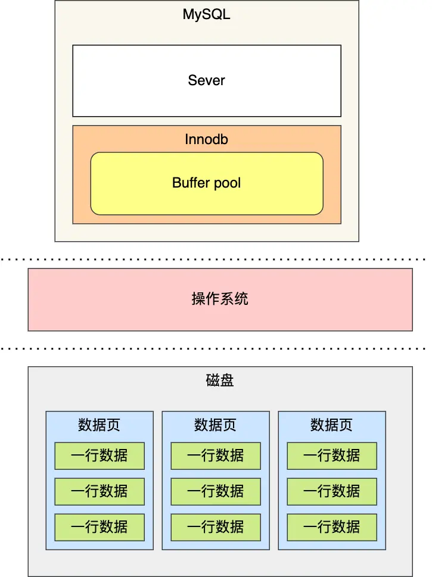
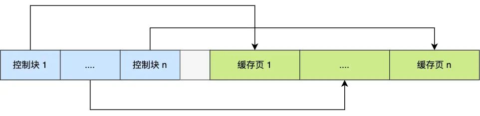
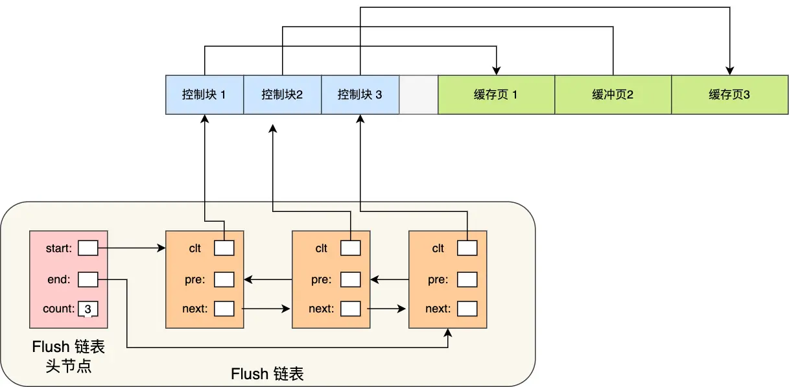
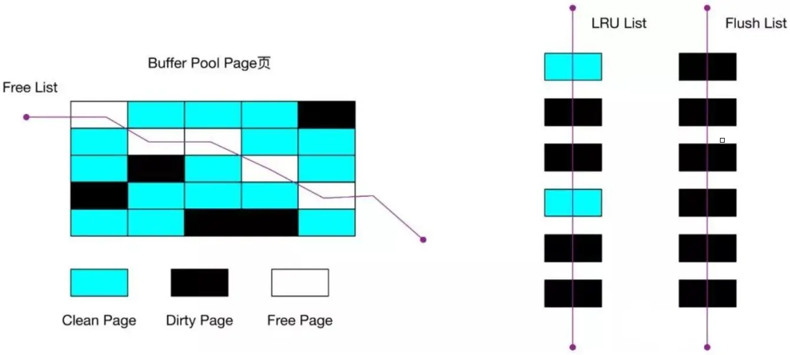
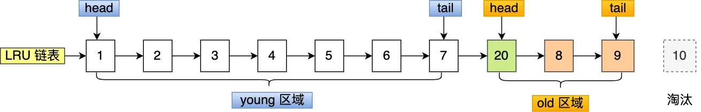
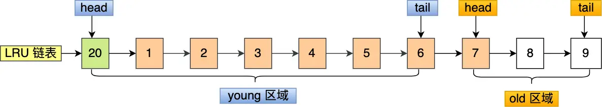

[TOC]
# Buffer Pool

Innodb 存储引擎设计了一个缓冲池 `Buffer Pool`，来提高数据库的读写性能。

- 当读取数据时，如果数据存在于 Buffer Pool 中，客户端就会直接读取 Buffer Pool 中的数据，否则再去磁盘中读取。
- 当修改数据时
	- 如果数据存在于 Buffer Pool 中，首先是修改 Buffer Pool 中数据所在的页，然后将其页设置为脏页，最后由后台线程将脏页写入到磁盘。
	- 如果数据不存在于 Buffer Pool 中，则会将更新操作缓存到 change buffer 中
## Buffer Pool 有多大

Buffer Pool 是在 MySQL 启动的时候，向操作系统申请的一片连续的内存空间，默认配置下 Buffer Pool 只有 128MB 。

可以通过调整 `innodb_buffer_pool_size` 参数来设置 Buffer Pool 的大小，一般建议设置成可用物理内存的 60%~80%。

## Buffer Pool 缓存什么

在 MySQL 启动的时候，**InnoDB 会为 Buffer Pool 申请一片连续的内存空间，然后按照默认的16KB的大小划分出一个个的页，Buffer Pool 中的页就叫做缓存页**。此时这些缓存页都是空闲的，之后随着程序的运行，才会有磁盘上的页被缓存到 Buffer Pool 中。

为了更好的管理这些在 Buffer Pool 中的缓存页，InnoDB 为每一个缓存页都创建了一个**控制块**，控制块信息包括`缓存页的表空间、页号、缓存页地址、链表节点`等等。

控制块也是占有内存空间的，它是放在 Buffer Pool 的最前面，接着才是缓存页，如下图：

上图中控制块和缓存页之间灰色部分称为碎片空间。
每一个控制块都对应一个缓存页，那在分配足够多的控制块和缓存页后，可能剩余的那点儿空间不够一对控制块和缓存页的大小，这个用不到的那点儿内存空间就被称为碎片了。

当我们查询一条记录时，InnoDB 是会把**整个页**的数据加载到 Buffer Pool 中，因为，**通过索引只能定位到磁盘中的页，而不能定位到页中的一条记录**。将页加载到 Buffer Pool 后，再通过页里的页目录去定位到某条具体的记录。

## 如何管理 Buffer Pool

### 如何管理空闲页

从磁盘读取数据的时候，不能通过遍历这一片连续的内存空间来找到空闲的缓存页，这样效率太低了。

可以使用链表结构，将空闲缓存页的「控制块」作为链表的节点，这个链表称为 **Free 链表（空闲链表）**。

Free 链表上除了有控制块，还有一个头节点，该头节点包含链表的头节点地址，尾节点地址，以及当前链表中节点的数量等信息。

### 如何管理脏页

设计 Buffer Pool 除了能提高读性能，还能提高写性能，也就是更新数据的时候，不需要每次都要写入磁盘，而是将 Buffer Pool 对应的缓存页标记为脏页，然后再由后台线程将脏页写入到磁盘。

为了能快速知道哪些缓存页是脏的，于是就设计出 **Flush 链表**，它跟 Free 链表类似的，链表的节点也是控制块，区别在于 Flush 链表的元素都是脏页。

### 如何提高缓存命中率

Buffer Pool 的大小是有限的，对于一些频繁访问的数据我们希望可以一直留在 Buffer Pool 中，而一些很少访问的数据希望可以在某些时机可以淘汰掉，从而保证 Buffer Pool 不会因为满了而导致无法再缓存新的数据，同时还能保证常用数据留在 Buffer Pool 中。

#### 简单的 LRU 算法

要实现这个，最容易想到的就是 **LRU（Least recently used）算法**。

该算法的思路是，链表头部的节点是最近使用的，而链表末尾的节点是最久没被使用的。那么，当空间不够了，就淘汰最久没被使用的节点，从而腾出空间。

简单的 LRU 算法（**并没有被 MySQL 使用**）的实现思路是这样的：

- 当访问的页在 buffer pool 里，就直接把该页对应的 LRU 链表节点移动到链表的头部
- 当访问的页不在 buffer pool 里，先淘汰链表的末尾节点，然后把该页放到 LRU 链表的头部

#### 三种页和链表

- Free Page（空闲页），表示此页未被使用，位于 Free 链表；
- Clean Page（干净页），表示此页已被使用，但是页面未发生修改，位于 LRU 链表。
- Dirty Page（脏页），表示此页「已被使用」且「已经被修改」，其数据和磁盘上的数据已经不一致。当脏页上的数据写入磁盘后，内存数据和磁盘数据一致，那么该页就变成了干净页，然后从 Flush 链表移除，但仍然待在 LRU 链表。脏页同时存在于 LRU 链表和 Flush 链表。
#### MySQL 使用的 LRU 算法

简单的 LRU 算法并没有被 MySQL 使用，因为简单的 LRU 算法无法避免下面这两个问题：

- 预读失效；
- Buffer Pool 污染；

可以一起对比着**Linux 操作系统**的解决方法来看（操作系统-内存管理-预读失效和缓存污染）。
##### 预读失效

程序是有空间局部性的，靠近当前被访问数据的数据，在未来很大概率会被访问到。

所以，MySQL 在加载数据页时，会提前把它**相邻的数据页**一并加载进来，目的是为了减少磁盘 IO。

但是**可能这些被提前加载进来的数据页，并没有被访问，相当于这个预读是白做了，这个就是预读失效**。

如果使用简单的 LRU 算法，就会把预读页放到 LRU 链表头部，而当 Buffer Pool 空间不够的时候，还需要把末尾的页淘汰掉。

如果这些预读页如果一直不会被访问到，就会出现一个很奇怪的问题，不会被访问的预读页却占用了 LRU 链表前排的位置，而末尾淘汰的页，可能是频繁访问的页，这样就大大*降低了缓存命中率*。

###### 怎么解决

不能因为害怕预读失效，而将预读机制去掉，大部分情况下，局部性原理还是成立的。

最好就是**让预读的页停留在 buffer pool 中的时间尽可能的短，让真正被访问的也才移动到 LRU 链表的头部，从而保证真正被读取的热数据留在 buffer pool 里面的时间尽可能长**。

MySQL 改进了 LRU 算法，将 LRU 划分了 2 个区域：**old 区域** 和 **young 区域**：

划分之后，**预读的页加入到 old 区域的头部，当页真正被访问的时候，才将页插入到 young 区域的头部**。如果预读的页一直没有被访问，就会从 old 区域移除，不会影响 young 的热点数据。

old 区域占整个 LRU 链表长度的比例可以通过 `innodb_old_blocks_pct` 参数来设置，默认是 37，代表整个 LRU 链表中 young 区域与 old 区域比例是 `63:37`。

假设现在有个编号为 20 的页被预读了，这个页只会被插入到 old 区域头部，而 old 区域末尾的页（10号）会被淘汰掉：

如果 20 号页一直不会被访问，它也没有占用到 young 区域的位置，而且还会比 young 区域的数据更早被淘汰出去。

如果 20 号页被预读后，立刻被访问了，那么就会将它插入到 young 区域的头部，young 区域末尾的页（7 号），会被挤到 old 区域，作为 old 区域的头部，这个过程并不会有页被淘汰：

##### Buffer Pool 污染

在 Buffer Pool 空间比较有限的情况下，一些操作可能会**将 Buffer Pool 里的所有页都替换出去，导致大量热数据被淘汰了**，等这些热数据又被再次访问的时候，由于缓存未命中，就会产生大量的磁盘 IO，MySQL 性能就会急剧下降，这个过程被称为 **Buffer Pool 污染**。

比如 当某一个 SQL 语句扫描了大量的数据时；在一个数据量非常大的表使用了会发生索引失效的语句，其查询过程是全表扫描：

- 从磁盘读到的页加入到 LRU 链表的 old 区域头部；
- 当从页里读取行记录时，也就是页被访问的时候，就要将该页放到 young 区域头部；
- 接下来拿行记录进行匹配，如果符合条件，就加入到结果集里；
- 如此往复，直到扫描完表中的所有记录。

如此一来，原本 young 区域的热点数据都会被替换掉。

###### 怎么解决

像前面这种全表扫描的查询，很多缓冲页其实只会被访问一次，但是它却只因为被访问了一次而进入到 young 区域，从而导致热点数据被替换了。

提高进入到 young 区域的门槛，就能有效地保证 young 区域里的热点数据不会被替换掉。

MySQL 对于进入到 young 区域条件增加了一个**停留在 old 区域的时间判断**。在对某个处在old 区域的页第一次访问时，就在它对应的控制块中记录下访问的时间：

- 如果第二次访问时间与第一次访问的时间**在某个时间间隔内**，该缓存页**不会**被从 old 移动到 young 的头部
- 如果第二次访问时间与第一次访问的时间**不在某个时间间隔内**，把该缓存页**移动**到 young 的头部

这个间隔时间是由 `innodb_old_blocks_time` 控制的，默认是 1000 ms。

也就说，**只有同时满足「被访问」与「在 old 区域停留时间超过 1 秒」两个条件，才会被插入到 young 区域头部**，这样就解决了 Buffer Pool 污染的问题。

另外，MySQL 针对 young 区域其实做了一个优化，为了防止 young 区域节点频繁移动到头部。young 区域前面 1/4 被访问不会移动到链表头部，只有后面的 3/4 被访问了才会移动到头部。

### 脏页什么时候刷盘

脏页需要被刷入磁盘，保证缓存和磁盘数据一致，但是若每次修改数据都刷入磁盘，则性能会很差，因此一般都会在一定时机进行批量刷盘。

InnoDB 的更新操作采用的是 `Write Ahead Log` 策略，即先写日志，再写入磁盘，通过 redo log 日志让 MySQL 拥有了崩溃恢复能力。

下面几种情况会触发脏页的刷新：

- 当 redo log 日志满了的情况下会主动触发脏页刷新到磁盘
- Buffer Pool 空间不足时，需要将一部分数据页淘汰掉，如果淘汰的是脏页，需要将脏页同步到磁盘
- MySQL 认为空闲时，后台线程会定期将适量的脏页刷入到磁盘
- MySQL 正常关闭之前，会把所有的脏页刷入到磁盘

在我们开启了慢 SQL 监控后，如果你发现**偶尔会出现一些用时稍长的 SQL**，这可能是因为脏页在刷新到磁盘时可能会给数据库带来性能开销，导致数据库操作抖动。

如果间断出现这种现象，就需要调大 Buffer Pool 空间或 redo log 日志的大小。

