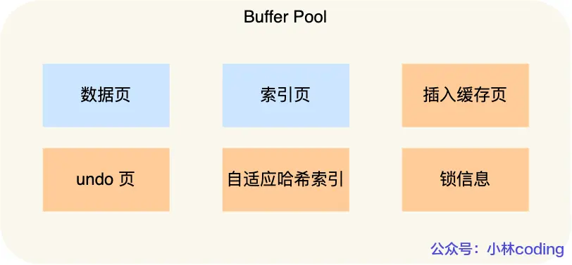
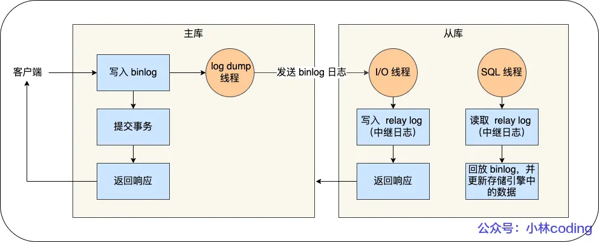
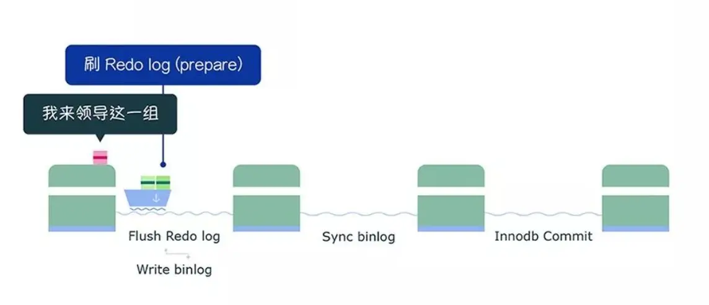

[TOC]
# MySQL 日志

[MySQL 日志](https://xiaolincoding.com/mysql/log/how_update.html)

我们在执行执行一条“增删改”语句的时候，虽然没有输入 begin 开启事务和 commit 提交事务，但是 **MySQL 会隐式开启事务来执行“增删改”语句的，执行完就自动提交事务的**，这样就保证了执行完“增删改”语句后，我们可以及时在数据库表看到“增删改”的结果了。

执行一条语句是否自动提交事务，是由 `autocommit` 参数决定的，默认是开启。所以，执行一条 update 语句也是会使用事务的。
## undo log

**undo log（回滚日志）**，它保证了事务的原子性（Atomicity）。

两大作用：

- 实现事务回滚，保障事务的原子性。
- 实现 MVCC（多版本并发控制）关键因素之一。

!!! note
	undo log 和数据页的刷盘策略是一样的，都需要通过 redo log 保证持久化。
 	buffer pool 中有 undo 页，对 undo 页的修改也都会记录到 redo log。redo log 会每秒刷盘，提交事务时也会刷盘，数据页和 undo 页都是靠这个机制保证持久化的。

### 事务回滚

在事务没提交之前，MySQL 会先记录更新前的数据到 undo log 日志文件里面，当事务回滚时，可以利用 undo log 来进行回滚。


每当 InnoDB 引擎对一条记录进行操作（修改、删除、新增）时，要把回滚时需要的信息都记录到 undo log 里，比如：

- 在【插入】一条记录时，要把这条记录的**主键值**记下来，这样之后回滚时只需要把这个主键值对应的记录**删掉**就好了；
- 在【删除】一条记录时，要把这条记录中的**内容**都记下来，这样之后回滚时再把由这些内容组成的记录**插入**到表中就好了；
- 在【更新】一条记录时，要把**被更新的列的旧值**记下来，这样之后回滚时再把这些列**更新**为旧值就好了。

### MVCC

不同的操作，需要记录的内容也是不同的，所以不同类型的操作（修改、删除、新增）产生的 undo log 的格式也是不同的。

一条记录的每一次**更新**操作产生的 undo log 格式都有一个 `roll_pointer` 指针和一个 `trx_id` 事务 id：

- 通过 `trx_id` 可以知道该记录是被哪个事务修改的；
- 通过 `roll_pointer` 指针可以将这些 undo log 串成一个链表，这个链表就被称为版本链；

所以，undo log 还有一个作用，就是通过 `ReadView + undo log` 实现 `MVCC`（多版本并发控制）。参考前文《MySQL 事务》-> 事务的隔离性 - > Read View 在 MVCC 里如何工作 小节。

## Buffer Pool

Innodb 存储引擎设计了一个缓冲池（Buffer Pool），来提高数据库的读写性能。

- 当读取数据时，如果数据存在于 Buffer Pool 中，客户端就会直接读取 Buffer Pool 中的数据，否则再去磁盘中读取。
- 当修改数据时，如果数据存在于 Buffer Pool 中，那就直接修改 buffer pool 中数据所在的页，然后将其设置为脏页（因为该页的数据在内存中和磁盘上不一致了），为了减少磁盘I/O，不会立即将脏页写入磁盘，后续由后台线程选择合适的时机将脏页写入磁盘。

在 MySQL 启动的时候，**InnoDB 会为 Buffer Pool 申请一片连续的内存空间，然后按照默认的16KB的大小划分出一个个的页， Buffer Pool 中的页就叫做缓存页**。此时这些缓存页都是空闲的。



当我们查询一条记录时，InnoDB 是会把**整个页的数据**加载到 Buffer Pool 中，将页加载到 Buffer Pool 后，再通过页里的「页目录」去定位到某条具体的记录。

## redo log

Buffer Pool 是基于内存的，而内存总是不可靠，万一断电重启，还没来得及落盘的脏页数据就会丢失。

为了防止断电导致数据丢失的问题，当有一条记录需要更新的时候，InnoDB 引擎就会先更新内存（同时标记为脏页），然后将本次对这个页的修改以 redo log 的形式记录下来，这个时候**更新就算完成了**。

redo log 是物理日志，记录了某个数据页做了什么修改，比如对 XXX 表空间中的 YYY 数据页 ZZZ 偏移量的地方做了 AAA 更新。

后续，InnoDB 引擎会在适当的时候，由后台线程将缓存在 Buffer Pool 的脏页刷新到磁盘里，这就是 **WAL（Write-Ahead Logging）技术**。

WAL 技术指的是，**MySQL 的写操作并不是立刻写到磁盘上，而是先写日志，然后在合适的时间再写到磁盘上**。

所以有了 redo log，再通过 WAL 技术，InnoDB 就可以保证即使数据库发生异常重启，之前已提交的记录都不会丢失，这个能力称为 **crash-safe（崩溃恢复）**。可以看出来， redo log 保证了事务四大特性中的**持久性**。


### undo log 和 redo log

开启事务后，InnoDB 层更新记录前，首先要记录相应的 undo log，如果是更新操作，需要把被更新的列的旧值记下来，也就是要生成一条 undo log，undo log 会写入 Buffer Pool 中的 Undo 页面。

不过，**在内存修改该 Undo 页面后，需要记录对应的 redo log**。

这两种日志都是属于 InnoDB 存储引擎的日志，它们的区别在于：

- undo log 记录的是**事务提交之前**的数据状态，记录的是数据**更新之前**的值
- redo log 记录的是**事务提交之后**的数据状态，记录的是数据**更新之后**的值

事务提交值发生了崩溃，MySQL 重启后通过 undo log 回滚事务，事务提交之后发生了崩溃，重启后通过 redo log 恢复事务。

### redo log 要写到磁盘，数据也要写磁盘，为什么要多此一举

写入 redo log 的方式使用了追加操作，所以磁盘操作是**顺序写**，而写入数据需要先找到写入位置，然后才写到磁盘，所以磁盘操作是**随机写**。

可以说这是 WAL 技术的另外一个优点：MySQL 的写操作从磁盘的「随机写」变成了「顺序写」，提升语句的执行性能。
### 为什么需要 redo log

至此，针对为什么需要 redo log 这个问题我们有两个答案：

实现事务的持久性，让 MySQL 有 crash-safe 的能力，能够保证 MySQL 在任何时间段突然崩溃，重启后之前已提交的记录都不会丢失；
将写操作从「随机写」变成了「顺序写」，提升 MySQL 写入磁盘的性能。
### redo log buffer

实际上，执行一个事务的过程中，产生的 redo log 也不是直接写入磁盘的，因为这样会产生大量的 I/O 操作，而且磁盘的运行速度远慢于内存。

所以，redo log 也有自己的缓存—— **redo log buffer**，每当产生一条 redo log 时，会先写入到 redo log buffer，后续在持久化到磁盘如下图：


redo log buffer 默认大小 16 MB，可以通过 `innodb_log_Buffer_size` 参数动态的调整大小，增大它的大小可以让 MySQL 处理「大事务」是不必写入磁盘，进而提升写 IO 性能。
### redo log 什么时候刷盘

缓存在 redo log buffer 里的 redo log 还是在内存中，它会在以下几个时机刷新到磁盘中：

- MySQL 正常关闭时
- 当 `redo log buffer` 中记录的写入量大于 `redo log buffer` 内存空间的一半时，会触发落盘
- InnoDB 的后台线程每隔 1 秒，将 redo log buffer 持久化到磁盘。
- 每次事务提交时都将缓存在 redo log buffer 里的 redo log 直接持久化到磁盘（这个策略可由 innodb_flush_log_at_trx_commit 参数控制）

在执行更新语句的过程中，生成的 redo log 先写入到 redo log buffer 中，然后等事务提交的时候，再将缓存在 redo log buffer 中的 redo log 按组的方式「顺序写」到磁盘。 这个默认的行为。

这种刷盘策略是由  `innodb_flush_log_at_trx_commit` 参数控制的：

- 当设置该参数为 `0` 时，表示每次事务提交时，还是**将 redo log 留在 redo log buffer 中** ，该模式下在事务提交时不会主动触发写入磁盘的操作。
- 当设置该参数为 `1` 时，表示每次事务提交时，都**将缓存在 redo log buffer 里的 redo log 直接持久化到磁盘**，这样可以保证 MySQL 异常重启之后数据不会丢失。
- 当设置该参数为 `2` 时，表示每次事务提交时，都只是**将缓存在 redo log buffer 里的 redo log 写到 redo log 文件**，注意写入到「redo log 文件」并不意味着写入到了磁盘，因为操作系统的文件系统中有个 [`Page Cache`](https://xiaolincoding.com/os/6_file_system/pagecache.html)，Page Cache 是专门用来缓存文件数据的，所以写入「redo log 文件」意味着写入到了**操作系统的文件缓存**。

InnoDB 的后台线程每隔 1 秒：

- 针对参数 0：会把缓存在 redo log buffer 中的 redo log，通过调用 `write() `写到操作系统的 Page Cache，然后调用 `fsync()` 持久化到磁盘。**所以参数为 0 的策略，MySQL 进程的崩溃会导致上一秒钟所有事务数据的丢失**;
- 针对参数 2：调用 `fsync`，将缓存在操作系统中 Page Cache 里的 redo log 持久化到磁盘。所以**参数为 2 的策略，较取值为 0 情况下更安全，因为 MySQL 进程的崩溃并不会丢失数据，只有在操作系统崩溃或者系统断电的情况下，上一秒钟所有事务数据才可能丢失**。


三个参数的数据安全性和写入性能的比较如下：

- 数据安全性：参数 1 > 参数 2 > 参数 0
- 写入性能：参数 0 > 参数 2> 参数 1
### redo log 文件写满了怎么办

默认情况下，InnoDB 存储引擎有 1 个`重做日志文件组` ( redo log Group），「重做日志文件组」由有 2 个 redo log 文件组成，这两个 redo 日志的文件名叫：`ib_logfile0` 和 `ib_logfile1` 。

在重做日志组中，每个 redo log File 的大小是固定且一致的，假设每个 redo log File 设置的上限是 1 GB，那么总共就可以记录 2GB 的操作。

重做日志文件组是以**循环写**的方式工作的，从头开始写，写到末尾就又回到开头，相当于一个环形。
InnoDB 用 `write pos` 表示 redo log 当前记录写到的位置，用 `check point` 表示当前要擦除的位置，如下图：


- write pos 和 check point 的移动都是顺时针方向；
- write pos ～ check point 之间的部分（图中的红色部分），用来记录新的更新操作；
- check point ～ write pos 之间的部分（图中蓝色部分）：待落盘的脏数据页记录；

**如果 write pos 追上了 check point，就意味着 redo log 文件满了，这时 MySQL 不能再执行新的更新操作，也就是说 MySQL 会被阻塞（因此所以针对并发量大的系统，适当设置 redo log 的文件大小非常重要），此时会停下来将 Buffer Pool 中的脏页刷新到磁盘中，然后标记 redo log 哪些记录可以被擦除，接着对旧的 redo log 记录进行擦除，等擦除完旧记录腾出了空间，check point 就会往后移动（图中顺时针），然后 MySQL 恢复正常运行，继续执行新的更新操作**。

## binlog

undo log 和 redo log 这两个日志都是 Innodb 存储引擎生成的。

MySQL 在完成一条更新操作后，Server 层还会生成一条 binlog，等之后事务提交的时候，会将该事物执行过程中产生的所有 binlog 统一写 入 binlog 文件。

binlog 文件记录了所有**数据库表结构变更和表数据修改的日志**，不会记录查询类的操作。


### redo log 和 binlog 的区别

1. 适用对象不同：

  - binlog 是 MySQL 的 Server 层实现的日志，所有存储引擎都可以使用；
  - redo log 是 Innodb 存储引擎实现的日志；

2. 文件格式不同：

  - binlog 有 3 种格式类型，分别是 STATEMENT（MySQL 5.7.7之前的默认值）、ROW（MySQL 5.7.7之后的默认值）、MIXED，区别如下：

    - STATEMENT：每一条修改数据的 SQL 都会被记录到 binlog 中（相当于记录了逻辑操作，所以针对这种格式，binlog 可以称为逻辑日志），主从复制中 slave 端再根据 SQL 语句重现。但 STATEMENT 有动态函数的问题，比如你用了 uuid 或者 now 这些函数，你在主库上执行的结果并不是你在从库执行的结果，这种随时在变的函数会导致复制的数据不一致；
    - ROW：记录行数据最终被修改成什么样了（这种格式的日志，就不能称为逻辑日志了），不会出现 STATEMENT 下动态函数的问题。但 ROW 的缺点是每行数据的变化结果都会被记录，比如执行批量 update 语句，更新多少行数据就会产生多少条记录，使 binlog 文件过大，而在 STATEMENT 格式下只会记录一个 update 语句而已；
    - MIXED：包含了 STATEMENT 和 ROW 模式，它会根据不同的情况自动使用 ROW 模式和 STATEMENT 模式；

  - redo log 是物理日志，记录的是在某个数据页做了什么修改

3. 写入方式不同：

  - binlog 是追加写，写满一个文件，就创建一个新的文件继续写，不会覆盖以前的日志，保存的是全量的日志。
  - redo log 是循环写，日志空间大小是固定，全部写满就从头开始，保存未被刷入磁盘的脏页日志。

4. 用途不同：

  - binlog 用于备份恢复、主从复制；
  - redo log 用于掉电等故障恢复。
### 主从复制

#### 主从复制是怎么实现

MySQL 的主从复制依赖于 `binlog`，也就是记录 MySQL 上的所有变化并以二进制形式保存在磁盘上。复制的过程就是将 binlog 中的数据从主库传输到从库上。

这个过程一般是**异步的**，也就是主库上执行事务操作的线程不会等待复制 binlog 的线程同步完成。



MySQL 集群的主从复制过程梳理成 3 个阶段：

1. 写入 Binlog：主库写 binlog 日志，提交事务，并更新本地存储数据。
MySQL 主库在收到客户端提交事务的请求之后，会先写入 binlog，再提交事务，更新存储引擎中的数据，事务提交完成后，返回给客户端“操作成功”的响应。

2. 同步 Binlog：把 binlog 复制到所有从库上，每个从库把 binlog 写到暂存日志中。
从库会创建一个专门的 I/O 线程，连接主库的 log dump 线程，来接收主库的 binlog 日志，再把 binlog 信息写入 relay log 的中继日志里，再返回给主库“复制成功”的响应。

3. 回放 Binlog：回放 binlog，并更新存储引擎中的数据。
从库会创建一个用于回放 binlog 的线程，去读 relay log 中继日志，然后回放 binlog 更新存储引擎中的数据，最终实现主从的数据一致性。

在完成主从复制之后，你就可以在写数据时只写主库，在读数据时只读从库，这样**即使写请求会锁表或者锁记录，也不会影响读请求的执行**。

#### 从库是不是越多越好

不是的。

因为从库数量增加，从库连接上来的 I/O 线程也比较多，**主库也要创建同样多的 log dump 线程来处理复制的请求，对主库资源消耗比较高，同时还受限于主库的网络带宽**。

所以在实际使用中，一个主库一般跟 2～3 个从库（1 套数据库，1 主 2 从 1 备主），这就是一主多从的 MySQL 集群结构。

#### MySQL 主从复制有哪些模型

主要有三种：

- 同步复制：MySQL 主库提交事务的线程要等待所有从库的复制成功响应，才返回客户端结果。这种方式在实际项目中，基本上没法用，原因有两个：一是性能很差，因为要复制到所有节点才返回响应；二是可用性也很差，主库和所有从库任何一个数据库出问题，都会影响业务。
- 异步复制（默认模型）：MySQL 主库提交事务的线程并不会等待 binlog 同步到各从库，就返回客户端结果。这种模式一旦主库宕机，数据就会发生丢失。
- 同步复制：MySQL 5.7 版本之后增加的一种复制方式，介于两者之间，事务线程不用等待所有的从库复制成功响应，只要一部分复制成功响应回来就行，比如一主二从的集群，只要数据成功复制到任意一个从库上，主库的事务线程就可以返回给客户端。这种**半同步复制的方式，兼顾了异步复制和同步复制的优点，即使出现主库宕机，至少还有一个从库有最新的数据，不存在数据丢失的风险**。
### binlog 什么时候刷盘

事务执行过程中，先把日志写到 `binlog cache`（Server 层的 cache），事务提交的时候，再把 binlog cache 写到 binlog 文件中。

MySQL 给 `binlog cache` 分配了一片内存，每个线程一个，参数 `binlog_cache_size` 用于控制单个线程内 binlog cache 所占内存的大小。如果超过了这个参数规定的大小，就要暂存到磁盘。
#### 什么时候 binlog cache 会写到 binlog 文件

在事务提交的时候，执行器把 binlog cache 里的完整事务写入到 binlog 文件中，并清空 binlog cache。


虽然每个线程有自己 binlog cache，但是最终都写到同一个 binlog 文件：

- 图中的 `write`，指的就是指把日志写入到 binlog 文件，但是并没有把数据持久化到磁盘，因为数据还缓存在文件系统的 `page cache` 里，write 的写入速度还是比较快的，因为不涉及磁盘 I/O。
- 图中的 `fsync`，才是将数据持久化到磁盘的操作，这里就会涉及磁盘 I/O，所以频繁的 fsync 会导致磁盘的 I/O 升高。

MySQL 提供一个 `sync_binlog` 参数来控制数据库的 binlog 刷到磁盘上的频率：

-  = 0 的时候，表示每次提交事务都只 write，不 fsync，后续交由操作系统决定何时将数据持久化到磁盘；
-  = 1 的时候，表示每次提交事务都会 write，然后马上执行 fsync；**默认值**
-  = N(N>1) 的时候，表示每次提交事务都 write，但累积 N 个事务后才 fsync。

如果能容忍少量事务的 binlog 日志存在丢失风险的情况下，同时为了提高写入的性能，一般可以将 sync_binlog 设置为 100~1000 中的某个数值。
## update 语句的执行过程

例子：
```sql
UPDATE t_user SET name = 'xiaolin' WHERE id = 1;
```

1. 执行器负责具体的执行，会调用存储引擎的接口，通过聚簇索引获取 id=1 这一行记录：
	- 若此行所在的数据页本来就在 buffer pool 中，就直接返回给执行器
    - 否则将数据页从磁盘读入到 buffer pool 中，返回记录给执行器
2. 执行器得到聚簇索引记录后，会看一下更新前的记录和更新后的记录是否一样：
	- 一样就不进行后续的更新流程了
    - 否则就把更新前后的记录当作参数传给 InnoDB ，让 InnoDB 执行真正的更新记录操作
3. 开启事务，InnoDB 更新前，首先记录相应的 undo log，undo log 会被写入到 buffer pool 中的 undo 页面，在内存修改 该 undo 页面后，需要记录对应的 redo log。
4. InnoDB 开始更新记录，先更新内存（同时标记为脏页），然后将记录写入到 redo log。
5. 此时一条记录就算更新完成了。
6. 在一条更新语句执行完成后，就开始记录对应的 binlog。
7. 事务提交，剩下的就是【两阶段提交】的事情了。
## 两阶段提交

事务提交后，redo log 和 binlog 都要持久化到磁盘，但是这两个是**独立的逻辑**，可能出现半成功的状态，这样就造成两份日志之间的逻辑不一致。

### 为什么需要两阶段提交

事务提交后，redo log 和 binlog 都要持久化到磁盘，但是这两个是**独立的逻辑**，可能出现**半成功的状态，这样就造成两份日志之间的逻辑不一致**。

如果在持久化 redo log 和 binlog 两个日志的过程中，出现了半成功状态，那么就有两种情况：

- **如果在将 redo log 刷入到磁盘之后，MySQL 突然宕机了，而 binlog 还没有来得及写入**。MySQL 重启后，通过 redo log 能更新数据，但是 binlog 里面没有记录这条更新语句，在主从架构中，binlog 会被复制到从库，由于 binlog 丢失了这条更新语句，从库的这一行记录是旧值，与主库的值不一致；
- **如果在将 binlog 刷入到磁盘之后，MySQL 突然宕机了，而 redo log 还没有来得及写入**。由于 redo log 还没写，崩溃恢复以后这个事务无效，所以这行数据的字段还是旧值，而 binlog 里面记录了这条更新语句，在主从架构中，binlog 会被复制到从库，从库执行了这条更新语句，那么这一行数据的字段是新值，与主库的值不一致；

可以看到，在持久化 redo log 和 binlog 这两份日志的时候，如果出现半成功的状态，就会造成主从环境的数据不一致性。这是**因为 redo log 影响主库的数据，binlog 影响从库的数据**，所以 redo log 和 binlog 必须保持一致才能保证主从数据一致。

### 什么是两阶段提交

**两阶段提交就是把单个事务的提交分成两个阶段：准备（Prepare）阶段、提交（Commit）阶段。**

每个阶段都由协调者（Coordinator）和参与者（Participant）共同完成。commit 语句执行的时候，会包含提交（Commit）阶段。


### 两阶段提交的过程

在 MySQL 的 InnoDB 存储引擎中，开启 binlog 的情况下，MySQL 会同时维护 binlog 日志与 InnoDB 的 redo log，为了保证这两个日志的一致性，MySQL 使用了**内部 XA 事务**（也有外部 XA 事务，跟本文不太相关），**内部 XA 事务由 binlog 作为协调者，存储引擎是参与者。**

当客户端执行 commit 语句或者在自动提交的情况下，MySQL 内部开启一个 XA 事务，分两阶段来完成 XA 事务的提交，如下图：


从图可知，**两阶段提交就是把 redo log 的写入拆成了准备和提交两个步骤，中间穿插写入 binlog**：

- prepare 阶段：将 XID（内部XA事务ID）写入到 redo log，同时将 redo log 对应的事务状态设置为 prepare，然后将 redo log 刷新到磁盘；
- commit 阶段：把 XID 写入到binlog，然后将binlog刷新到磁盘，接着调用存储引擎的提交事务接口，将 redo log 状态设置为 commit。将事务设置为 commit 状态后，刷入到磁盘 redo log  文件，所以 commit 状态也是会刷盘的。
### 异常重启会出现什么现象


不管是时刻 A（已经 redo log，还没写入 binlog），还是时刻 B（已经写入 redo log 和 binlog，还没写入 commit 标识）崩溃，**此时的 redo log 都处于 prepare 状态。**

在 MySQL 重启后会按顺序扫描 redo log 文件，碰到处于 prepare 状态的 redo log，就拿着 redo log 中的 XID 去 binlog 查看是否存在此 XID：

- 不存在，说明 redo log 完成了刷盘，但是 binlog 没有刷盘，回滚事务。对应时刻 A 崩溃恢复的情况。
- 存在，说明 redo log 和 binlog 都已经完成了刷盘，提交事务；对应时刻 B 崩溃恢复的情况。

所以，**两阶段提交是以 binlog 写成功为事务提交成功的标识**。
### 两阶段提交有什么问题

两阶段提交虽然保证了两个日志文件的数据一致性，但是性能很差，主要有两个方面的影响：

- **磁盘 I/O 次数高**：对于【双1】（`innodb_flush_log_at_trx_commit=1` 、`sync_binlog=1` ）配置，每个事务提交都会进行两次 fsync（刷盘），一次是 redo log 刷盘，另一次是 binlog 刷盘。
- **锁竞争激烈**：两阶段提交虽然能够保证「单事务」两个日志的内容一致，但在「多事务」的情况下，却不能保证两者的提交顺序一致，因此，在两阶段提交的流程基础上，还需要加一个**锁来保证提交的原子性**，从而保证多事务的情况下，两个日志的提交顺序一致。

在早期的 MySQL 版本中，通过使用 `prepare_commit_mutex` 锁来保证事务提交的顺序，在一个事务获取到锁时才能进入 prepare 阶段，一直到 commit 阶段结束才能释放锁，下个事务才可以继续进行 prepare 操作。

通过加锁虽然完美地解决了顺序一致性的问题，但在并发量较大的时候，就会导致对锁的争用，性能不佳。
#### binlog 组提交

MySQL 引入了 binlog **组提交（group commit）**机制，当有多个事务提交的时候，会将多个 binlog 刷盘操作合并成一个，从而减少磁盘 IO 的次数。

引入了组提交机制后，prepare 阶段不变，只针对 commit 阶段，将 commit 阶段拆分为三个过程：

- **flush 阶段**：多个事务按进入的顺序将 binlog  从 cache 写入文件（不刷盘）
- **sync 阶段**：对 binlog 文件做 fsync 操作（多个事务的 binlog 合并成一次刷盘）
- **commit 阶段**：各个事务按顺序做 InnoDB commit 操作

上面的**每个阶段都有一个队列，每个阶段有锁进行保护**，因此保证了事务写入的顺序，第一个进入队列的事务会成为 leader，leader领导所在队列的所有事务，全权负责整队的操作，完成后通知队内其他事务操作结束。


#### redo log 组提交

在 MySQL 5.6 的组提交逻辑中，每个事务各自执行 prepare 阶段，也就是各自将 redo log 刷盘，这样就没办法对 redo log 进行组提交。

所以在 MySQL 5.7 版本中，做了个改进，在 prepare 阶段不再让事务各自执行 redo log 刷盘操作，而是推迟到组提交的 flush 阶段，也就是说 prepare 阶段融合在了 flush 阶段。

这个优化是将 redo log 的刷盘延迟到了 flush 阶段之中，sync 阶段之前。通过延迟写 redo log 的方式，为 redolog 做了一次组写入，这样 binlog 和 redo log 都进行了优化。

下面针对【双 1】（`innodb_flush_log_at_trx_commit=1` 、`sync_binlog=1` ）配置进行说明。
##### flush 阶段

第一个事务会成为 flush 阶段的 Leader，此时后面到来的事务都是 Follower。

接着，获取队列中的事务组，由绿色事务组的 Leader  `对 rodo log 做一次write + fsync`，即一次**将同组事务的 redolog 刷盘**：


完成了 prepare 阶段后，将绿色这一组事务执行过程中产生的 binlog `写入 binlog 文件`（调用 **write，不会调用 fsync，所以不会刷盘，binlog 缓存在操作系统的文件系统中**）。

从上面这个过程，可以知道 **flush 阶段队列的作用是用于支撑 redo log 的组提交。**
###### 崩溃

如果在这一步完成后数据库崩溃，由于 binlog 中没有该组事务的记录，所以 MySQL 会在重启后回滚该组事务。
##### sync 阶段

绿色这一组事务的 binlog 写入到 binlog 文件后，**并不会马上执行刷盘的操作，而是会等待一段时间**，这个等待的时长由 `binlog_group_commit_sync_delay` 参数控制，目的是**为了组合更多事务的 binlog**，然后再一起刷盘：


不过，在等待的过程中，如果事务的数量提前达到了 `binlog_group_commit_sync_no_delay_count` 参数设置的值，就不用继续等待了，就马上将 binlog 刷盘。

从上面的过程，可以知道 **sync 阶段队列的作用是用于支持 binlog 的组提交**。

如果想提升 binlog 组提交的效果，可以通过设置下面这两个参数来实现：

- `binlog_group_commit_sync_delay= N`，表示在等待 N 微妙后，直接调用 `fsync`，将处于文件系统中 `page cache` 中的 binlog 刷盘，也就是将「binlog 文件」持久化到磁盘。
- `binlog_group_commit_sync_no_delay_count=N`，表示如果队列中的事务数达到 N 个，就忽视 `binlog_group_commit_sync_delay` 的设置，直接调用 `fsync`，将处于文件系统中 `page cache` 中的 binlog 刷盘。

###### 崩溃

如果在这一步完成后数据库崩溃，由于 binlog 中已经有了事务记录，MySQL 会在重启后通过 redo log 刷盘的数据继续进行事务的提交。
##### commit 阶段

最后进入 commit 阶段，调用引擎的提交事务接口，将 redo log 状态设置为 commit。

**commit 阶段队列的作用是承接 sync 阶段的事务，完成最后的引擎提交，使得 sync 可以尽早的处理下一组事务，最大化组提交的效率**。

## MySQL 磁盘 I/O 优化

现在我们知道事务在提交的时候，需要将 binlog 和 redo log 持久化到磁盘，那么如果出现 MySQL 磁盘 I/O 很高的现象，我们可以通过控制以下参数，来 “延迟” binlog 和 redo log 刷盘的时机，从而降低磁盘 I/O 的频率：

- 设置组提交的两个参数： `binlog_group_commit_sync_delay` 和 `binlog_group_commit_sync_no_delay_count` 参数，延迟 binlog 刷盘的时机，从而减少 binlog 的刷盘次数。这个方法是基于“额外的故意等待”来实现的，因此**可能会增加语句的响应时间**，但即使 MySQL 进程中途挂了，也没有丢失数据的风险，因为 binlog 早被写入到 page cache 了，只要系统没有宕机，缓存在 page cache 里的 binlog 就会被持久化到磁盘。**主机掉电时可能会丢 N 个事务的 binlog 日志**。
- 将 `sync_binlog` 设置为大于 1 的值（比较常见是 100~1000），表示每次提交事务都 write，但累积 N 个事务后才 fsync，相当于延迟了 binlog 刷盘的时机。但是这样做的风险是，**主机掉电时会丢 N 个事务的 binlog 日志**。
- 将 `innodb_flush_log_at_trx_commit` 设置为 2。表示每次事务提交时，都只是缓存在 redo log buffer 里的 redo log 写到 redo log 文件，注意写入到「 redo log 文件」并不意味着写入到了磁盘，因为操作系统的文件系统中有个 Page Cache，专门用来缓存文件数据的，所以写入「 redo log文件」意味着写入到了操作系统的文件缓存，然后交由操作系统控制持久化到磁盘的时机。但是这样做的风险是，**主机掉电的时候会丢数据**。
