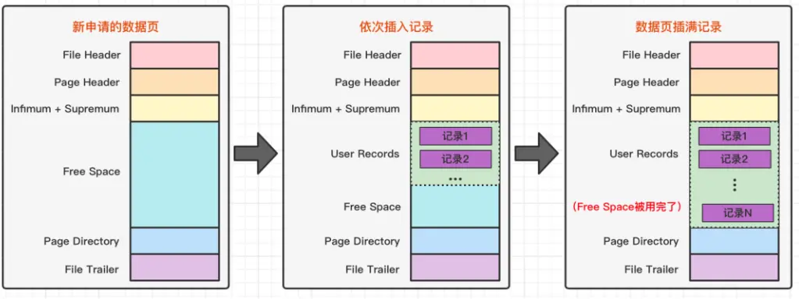
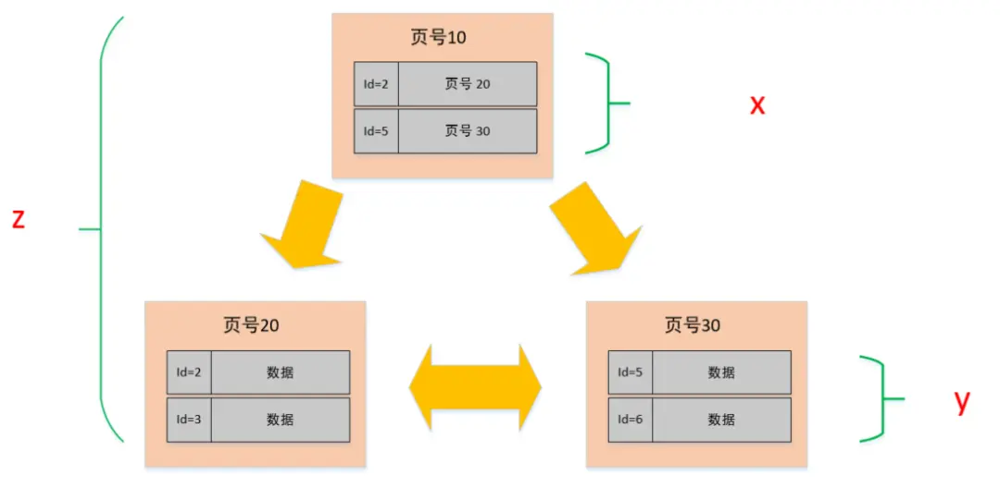

[TOC]
# MySQL 单表不要超过 2000W 行?

## 单表数量限制

如果是自增主键，那么其大小可以限制表的上限：

- 如果主键声明 int 类型，也就是 32 位，那么支持 2^32-1 ~ 21 亿；
- 如果主键声明 bigint 类型，那就是 2^62-1（36893488147419103232），难以想象这个的多大了，一般还没有到这个限制之前，可能数据库已经爆满了！！
## 表空间

表数据，在硬盘上实际是放在一个叫 `<table_name>.ibd`（innodb data）的文件中，也叫做表空间；虽然数据表中，他们看起来是一条连着一条，但是实际上在文件中它被分成很多小份的数据页，而且每一份都是 16K。

在表空间中还有段、区、组等很多概念。
## 页的数据结构

在一开始生成页的时候，其实并没有 User Records 这个部分，每当我们插入一条记录，都会从 Free Space 部分，也就是尚未使用的存储空间中申请一个记录大小的空间划分到 User Records 部分。

当 Free Space 部分的空间全部被 User Records 部分替代掉之后，也就意味着这个页使用完了，如果还有新的记录插入的话，就需要去申请新的页了。

这个过程的图示如下：

## 索引的数据结构

在 MySQL 中索引的数据结构和刚刚描述的页几乎是一模一样的，而且大小也是 16K,。

但是在索引页中记录的是页 (数据页，索引页) 的最小主键 id 和页号，以及在索引页中增加了层级的信息，从 0 开始往上算，所以页与页之间就有了上下层级的概念。

最下面那一层的 page level =0, 也就是叶子节点，其余都是非叶子节点。

非叶子节点（索引页），在它的内容区中有 id 和 页号地址两部分：

- id：对应页中记录的最小记录 id 值；id 的也是顺序的
- 页号：地址是指向对应页的指针；

## 单表建议值

假设：

- 非叶子节点内指向其他页的数量为 x
- 叶子节点内能容纳的数据行数为 y
- B+ 数的层数为 z

`Total =x^(z-1) *y` 也就是说总数会等于 【X】的【Z-1 次方】 与 【Y】 的乘积。

> x=?

索引页和数据页一样，都会有 File Header (38 byte)、Page Header (56 Byte)、Infimum + Supermum（26 byte）、File Trailer（8byte）, 再加上页目录，大概 1k 左右。

那整个页的大小是 16K, 剩下 15k 用于存数据，在索引页中主要记录的是主键与页号，主键我们假设是 Bigint (8 byte), 而页号也是固定的（4Byte）, 那么索引页中的一条数据也就是 12byte。

所以 `X=15*1024/12≈1280` 行。

> Y=?

叶子节点和非叶子节点的结构是一样的，同理，能放数据的空间也是 15k。

但是叶子节点中存放的是真正的行数据，这个影响的因素就会多很多，比如，字段的类型，字段的数量。每行数据占用空间越大，页中所放的行数量就会越少。

暂时按一条行数据 1k 来算，那一页就能存下 15 条，`Y = 15*1024/1000 ≈15`。

根据上述的公式，Total =x^(z-1) * y，已知 x=1280，y=15：

- 假设 B+ 树是两层，那就是 z = 2，Total = （1280 ^1）\* 15 = 19200
- 假设 B+ 树是三层，那就是 z = 3，Total = （1280 ^2） \* 15 = 24576000（约 2.45kw）

正好就是最大行数建议值 2000W。

如果是 4 层，除了查询的时候磁盘 IO 次数会增加，而且这个 Total 值大概应该是 3 百多亿吧，也不太合理，所以，3 层应该是比较合理的一个值。

我们刚刚在说 Y 的值时候假设的是 1K，那比如我实际当行的数据占用空间不是 1K , 而是 5K, 那么单个数据页最多只能放下 3 条数据。

同样，还是按照 z = 3 的值来计算，那 Total = （1280 ^2） * 3 = 4915200（近 500w）

所以，在保持相同的层级（相似查询性能）的情况下，在行数据大小不同的情况下，其实这个最大建议值也是不同的，而且影响查询性能的还有很多其他因素，比如，数据库版本，服务器配置，sql 的编写等等。

MySQL 为了提高性能，会将表的索引装载到内存中，在 `InnoDB buffer size` 足够的情况下，其能完成全加载进内存，查询不会有问题。

但是，当单表数据库到达某个量级的上限时，导致内存无法存储其索引，使得之后的 SQL 查询会产生磁盘 IO，从而导致性能下降，所以增加硬件配置（比如把内存当磁盘使），可能会带来立竿见影的性能提升。
