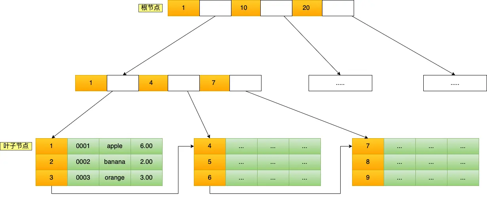
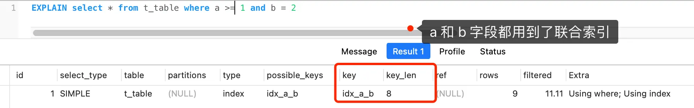

[TOC]
# MySQL 索引

[详见此文](https://github.com/xiaolincoder/CS-Base/blob/main/mysql/index/index_interview.md)

## 索引的分类

可以按照四个角度来分类索引：

- 数据结构： B+ 树索引、Hash 索引、Full-text 索引
- 物理存储：聚簇索引（主键索引）、二级索引（辅助索引）
- 字段特性：主键索引、唯一索引、普通索引、前缀索引
- 字段个数：单列索引、联合索引
### 按数据结构分类

B+ 树索引、Hash 索引、Full-text 索引。

每一种存储引擎支持的索引类型不一定相同，例如 InnoDB 就不支持 hash 索引（但在内存结构中有一个自适应的 hash 索引）。

在创建表时，InnoDB 存储引擎会根据不同的场景选择不同的列作为索引：

- 如果有主键，默认使用主键作为聚簇索引的索引键（key）
- 如果没有主键，使用第一个不包含NULL值的唯一列作为聚簇索引的索引键（key）
- 在以上两个条件都不满足的话，InnoDB 将自动生成一个隐式自增 id 列作为聚簇索引的索引键（key）

其它索引都属于辅助索引，也叫 二级索引或非聚簇索引。**创建的主键索引和二级索引默认使用的是 B+ 树索引**。


#### B+ 树索引的存储和查询

 B+ 树是多叉树，叶子节点存放数据，非叶子节点存放索引，而且每个节点里的数据是**按主键顺序存放的**。
 每一层父节点的索引值都会出现在下层子节点的索引值中，因此在叶子节点中包含了所有索引值信息。
 并且每一个叶子节点都指向下一个叶子节点，形成一个链表结构。
 
下面举例说明 B+ 树索引的存储和查询方式：
```SQL
CREATE TABLE `product`  (
  `id` int(11) NOT NULL,
  `product_no` varchar(20)  DEFAULT NULL,
  `name` varchar(255) DEFAULT NULL,
  `price` decimal(10, 2) DEFAULT NULL,
  PRIMARY KEY (`id`) USING BTREE
) CHARACTER SET = utf8 COLLATE = utf8_general_ci ROW_FORMAT = Dynamic;
```

 
 
> 通过主键查询商品数据的过程

使用主键索引查询 id 号为 5 的商品。查询过程是这样的，B+Tree 会自顶向下逐层进行查找：

- 将 5 与根节点的索引数据 (1，10，20) 比较，5 在 1 和 10 之间，所以根据 B+Tree 的搜索逻辑，找到第二层的索引数据 (1，4，7)；
- 在第二层的索引数据 (1，4，7) 中进行查找，因为 5 在 4 和 7 之间，所以找到第三层的索引数据（4，5，6）；
- 在叶子节点的索引数据（4，5，6）中进行查找，然后我们找到了索引值为 5 的行数据。

数据库的索引和数据都是存储在硬盘的，我们可以把读取一个节点当作一次磁盘 I/O 操作。

B+Tree 存储千万级的数据只需要 3-4 层高度就可以满足，这意味着从千万级的表查询目标数据最多需要 3-4 次磁盘 I/O，所以**B+Tree 相比于 B 树和二叉树来说，最大的优势在于查询效率很高，因为即使在数据量很大的情况，查询一个数据的磁盘 I/O 依然维持在 3-4 次**。

> 通过二级索引查询商品数据的过程

主键索引的 B+Tree 和二级索引的 B+Tree 区别如下：

- 主键索引的 B+Tree 的叶子节点存放的是实际数据，**所有完整的用户记录都存放在主键索引的 B+Tree 的叶子节点里**；
- 二级索引的 B+Tree 的叶子节点存放的是**主键值**，而不是实际数据。


如果使用二级索引查询数据，会先检查二级索引中的 B+Tree 的索引值，找到对应的叶子节点，然后获取主键值，然后再通过主键索引中的 B+Tree 查询到对应的叶子节点，然后获取整行数据。这个过程叫**回表**，也就是说要查两个 B+Tree 才能查到数据。

不过，当查询的数据是能在二级索引的 B+Tree 的叶子节点里查询到，这时就不用再去主键索引中查寻了。这种在二级索引的 B+Tree 就能查询到结果的过程就叫作**覆盖索引**，也就是只需要查一个 B+Tree 就能找到数据。
#### Full-text 索引

TODO

> ChatGPT

MySQL的全文索引（Full-text Index）是一种特殰的索引类型，它使得数据库可以执行快速的全文搜索。全文索引需要在一个包含全文数据的CHAR，VARCHAR或TEXT列上创建。创建全文索引使得数据库可以快速地找到包含指定词条的所有表记录，甚至是包含一个以上词条的记录，还可以按照相关度进行排序。

在创建全文索引后，MySQL可以高效地解决以下类型的查询：
1. 包含和不包含某个词的记录。
2. 包含至少一个词条的记录，可能包含更多词条，返回的记录按照相关度排序。
3. 包含某组词条，并按照这组词条出现的频率（即，相关度）进行排序。

创建全文索引的基本语法是：
```
CREATE FULLTEXT INDEX index_name
ON table_name(column1, column2,...)
```

一旦全文索引被创建，就可以使用`MATCH()` 和 `AGAINST()` 函数进行全文搜索。`MATCH()`函数列出了被搜索的列，而`AGAINST()`函数则包含了搜索的词条。

例如，如果想要搜索包含词条"database"和"SQL"的所有记录，可以使用下面的查询语句：
```
SELECT *
FROM table_name
WHERE MATCH (column1, column2, column3)
AGAINST ('database SQL');
```

请注意，全文索引更适用于大型的文本数据集，而不是小型的、离散的数据集。在小数据集上使用全文索引可能无法获得预期的效果。各种类型的数据库和存储引擎对全文索引的支持也会有所不同，所以在实现全文索引时，应首先查看数据库文档以了解其具体的行为和限制。
### 按物理存储分类

聚簇索引（主键索引）、二级索引（辅助索引）。

区别：

- 主键索引的 B+Tree 的叶子节点存放的是实际数据，所有完整的用户记录都存放在主键索引的 B+Tree 的叶子节点里；
- 二级索引的 B+Tree 的叶子节点存放的是主键值，而不是实际数据。

### 按字段特性分类

主键索引、唯一索引、普通索引、前缀索引。

- 主键索引就是建立在主键字段上的索引，通常在创建表的时候一起创建，一张表最多只有一个主键索引，索引列的值不允许有空值。

```
CREATE TABLE table_name  (
  ....
  PRIMARY KEY (index_column_1) USING BTREE
);
```

- 唯一索引建立在 `UNIQUE` 字段上的索引，一张表可以有多个唯一索引，索引列的值必须唯一，但是允许有空值。

```SQL
CREATE TABLE table_name  (
  ....
  UNIQUE KEY(index_column_1,index_column_2,...) 
);

CREATE UNIQUE INDEX index_name
ON table_name(index_column_1,index_column_2,...); 
```

- 普通索引就是建立在普通字段上的索引，既不要求字段为主键，也不要求字段为 UNIQUE。

```SQL
CREATE TABLE table_name  (
  ....
  INDEX(index_column_1,index_column_2,...) 
);

CREATE INDEX index_name
ON table_name(index_column_1,index_column_2,...); 
```

- 前缀索引是指对字符类型字段的前几个字符建立的索引，而不是在整个字段上建立的索引，前缀索引可以建立在字段类型为 char、varchar、binary、varbinary 的列上。
使用前缀索引的目的是为了减少索引占用的存储空间，提升查询效率。

```SQL
CREATE TABLE table_name(
    column_list,
    INDEX(column_name(length))
); 

CREATE INDEX index_name
ON table_name(column_name(length)); 
```
#### 前缀索引

[MySQL 实战 45 讲](https://funnylog.gitee.io/mysql45/11%E8%AE%B2%E6%80%8E%E4%B9%88%E7%BB%99%E5%AD%97%E7%AC%A6%E4%B8%B2%E5%AD%97%E6%AE%B5%E5%8A%A0%E7%B4%A2%E5%BC%95.html)

前缀索引结构中每个被索引的字段都只取前 N 个字节，所以占用的空间会更小，这就是使用前缀索引的优势。

但，这同时带来的损失是，可能会增加额外的记录扫描次数。下面是一个例子。


%20索引结构.png)

如果使用的是index1（即email整个字符串的索引结构），执行顺序是这样的：

1. 从index1索引树找到满足索引值是’zhangssxyz@xxx.com’的这条记录，取得ID2的值；
1. 到主键上查到主键值是ID2的行，判断email的值是正确的，将这行记录加入结果集；
1. 取index1索引树上刚刚查到的位置的下一条记录，发现已经不满足email='zhangssxyz@xxx.com’的条件了，循环结束。
1. 这个过程中，只需要回主键索引取一次数据，所以系统认为只扫描了一行。

如果使用的是index2（即email(6)索引结构），执行顺序是这样的：

1. 从index2索引树找到满足索引值是’zhangs’的记录，找到的第一个是ID1；
1. 到主键上查到主键值是ID1的行，判断出email的值不是’zhangssxyz@xxx.com’，这行记录丢弃；
1. 取index2上刚刚查到的位置的下一条记录，发现仍然是’zhangs’，取出ID2，再到ID索引上取整行然后判断，这次值对了，将这行记录加入结果集；
1. 重复上一步，直到在idxe2上取到的值不是’zhangs’时，循环结束。

在这个过程中，要回主键索引取4次数据，也就是扫描了4行。
但是，对于这个查询语句来说，如果取email字段的前7个字节来构建索引的话，即满足前缀’zhangss’的记录只有一个，也能够直接查到ID2，只扫描一行就结束了。

也就是说**使用前缀索引，定义好长度，就可以做到既节省空间，又不用额外增加太多的查询成本**。

##### 如何确定前缀的长度

在建立索引时关注的是区分度，区分度越高越好。因此，我们可以通过统计索引上有多少个不同的值来判断要使用多长的前缀。

首先，使用下面这个语句，算出这个列上总共有多少个不同的值：

```sql
mysql> select count(distinct email) as L from SUser;
```

然后，依次选取不同长度的前缀来看这个值，比如我们要看一下4~7个字节的前缀索引，可以用这个语句：

```sql
mysql> select 
  count(distinct left(email,4)）as L4,
  count(distinct left(email,5)）as L5,
  count(distinct left(email,6)）as L6,
  count(distinct left(email,7)）as L7,
from SUser;
```

使用前缀索引很可能会损失区分度，选择一个可以接受的损失比例，比如5%。
##### 对覆盖索引的影响

下面这个语句只要求返回id和email字段：

```sql
select id,email from SUser where email='zhangssxyz@xxx.com';
```

如果使用index1（即email整个字符串的索引结构）的话，可以利用覆盖索引，从index1查到结果后直接就返回了，不需要回到ID索引再去查一次。而如果使用index2（即email(6)索引结构）的话，就不得不回到ID索引再去判断email字段的值。

即使你将index2的定义修改为email(18)的前缀索引，这时候虽然index2已经包含了所有的信息，但InnoDB还是要回到id索引再查一下，因为系统并不确定前缀索引的定义是否截断了完整信息。

也就是说，使用前缀索引就用不上覆盖索引对查询性能的优化了。
##### 其他方式

对于类似于邮箱这样的字段来说，使用前缀索引的效果可能还不错。但是，遇到前缀的区分度不够好的情况时，就要另谋他法了。

如果我们能够确定业务需求里面只有**等值查询**的需求，下面的两种方法既可以占用更小的空间，也能达到相同的查询效率。

###### 倒序存储

**第一种方式是使用倒序存储**。如果你存储身份证号的时候把它倒过来存，还是用的前缀索引的方式，每次查询的时候，可以这么写：

```sql
mysql> select field_list from t where id_card = reverse('input_id_card_string');
```

由于身份证号的最后6位没有地址码这样的重复逻辑，所以最后这6位很可能就提供了足够的区分度。当然了，实践中不要忘记使用`count(distinct)`方法去做个验证。

###### hash字段

**第二种方式是使用hash字段**。你可以在表上再创建一个整数字段，来保存身份证的校验码，同时在这个字段上创建索引。

```sql
mysql> alter table t add id_card_crc int unsigned, add index(id_card_crc);
```

然后每次插入新记录的时候，都同时用`crc32()`这个函数得到校验码填到这个新字段。由于校验码可能存在冲突，也就是说两个不同的身份证号通过 crc32() 函数得到的结果可能是相同的，所以你的查询语句 where 部分要判断 id_card 的值是否精确相同。

```sql
mysql> select field_list from t where id_card_crc=crc32('input_id_card_string') and id_card='input_id_card_string'
```

这样，索引的长度变成了4个字节，比原来小了很多。

###### 两种方法的异同点

相同点是，**都不支持范围查询**。

区别主要体现在以下三个方面：

1. 从占用的额外空间来看，倒序存储方式在主键索引上，不会消耗额外的存储空间，而hash字段方法需要增加一个字段。当然，倒序存储方式使用4个字节的前缀长度应该是不够的，如果再长一点，这个消耗跟额外这个hash字段也差不多抵消了。
1. 在CPU消耗方面，倒序方式每次写和读的时候，都需要额外调用一次reverse函数，而hash字段的方式需要额外调用一次crc32()函数。如果只从这两个函数的计算复杂度来看的话，reverse函数额外消耗的CPU资源会更小些。
1. 从查询效率上看，使用hash字段方式的查询性能相对更稳定一些。因为crc32算出来的值虽然有冲突的概率，但是概率非常小，可以认为每次查询的平均扫描行数接近1。而**倒序存储方式毕竟还是用的前缀索引的方式，也就是说还是会增加扫描行数**。

### 按字段个数分类

单列索引、联合索引（复合索引）。

联合索引的存储方式：


联合索引的非叶子节点用两个字段的值作为 B+Tree 的 key 值。当在联合索引查询数据时，先按 product_no 字段比较，在 product_no 相同的情况下再按 name 字段比较。

因此，使用联合索引时，存在**最左匹配原则，也就是按照最左优先的方式进行索引的匹配**。在使用联合索引进行查询的时候，如果不遵循「最左匹配原则」，联合索引会失效，这样就无法利用到索引快速查询的特性了。

因为联合索引中除了第一列是全局有序的之外，其它列是全局无序，局部相对有序的（第一列相等时才有序）。**利用索引的前提是索引里的 key 是有序的**。
#### 联合索引范围查询

**并不是查询过程使用了联合索引查询，就代表联合索引中的所有字段都用到了联合索引进行索引查询**。

这种特殊情况就发生在范围查询。联合索引的最左匹配原则会一直向右匹配直到遇到「范围查询」就会停止匹配。也就是**范围查询的字段可以用到联合索引，但是在范围查询字段的后面的字段无法用到联合索引**。

##### 例1

`select * from t_table where a > 1 and b = 2`，联合索引（a, b）哪一个字段用到了联合索引的 B+Tree？

由于联合索引（二级索引）是先按照 a 字段的值排序的，所以符合 a > 1 条件的二级索引记录肯定是相邻，于是在进行索引扫描的时候，可以定位到符合 a > 1 条件的第一条记录，然后沿着记录所在的链表向后扫描，直到某条记录不符合 a > 1 条件位置。所以 a 字段可以在联合索引的 B+Tree 中进行索引查询。

**但是在符合 a > 1 条件的二级索引记录的范围里，b 字段的值是无序的。**

因此，我们不能根据查询条件 b = 2 来进一步减少需要扫描的记录数量（b 字段无法利用联合索引进行索引查询的意思）。

所以在执行 Q1 这条查询语句的时候，对应的扫描区间是 (2, + ∞)，形成该扫描区间的边界条件是 a > 1，与 b = 2 无关。

因此，Q1 这条查询语句只有 a 字段用到了联合索引进行索引查询，而 b 字段并没有使用到联合索引。


##### 例2

`select * from t_table where a >= 1 and b = 2`，联合索引（a, b）哪一个字段用到了联合索引的 B+Tree？

由例1可知，a 字段可以在联合索引的 B+Tree 中进行索引查询。

虽然在符合 a>= 1 条件的二级索引记录的范围里，b 字段的值是「无序」的，**但是对于符合 a = 1 的二级索引记录的范围里，b 字段的值是「有序」的**（因为对于联合索引，是先按照 a 字段的值排序，然后在 a 字段的值相同的情况下，再按照 b 字段的值进行排序）。

于是，在确定需要扫描的二级索引的范围时，当二级索引记录的 a 字段值为 1 时，可以通过 b = 2 条件减少需要扫描的二级索引记录范围（b 字段可以利用联合索引进行索引查询的意思）。也就是说，从符合 a = 1 and b = 2 条件的第一条记录开始扫描，而不需要从第一个 a 字段值为 1 的记录开始扫描。

所以，这条查询语句 a 和 b 字段都用到了联合索引进行索引查询。


验证：


也可以在执行计划中的 `key_len` 知道这一点。执行计划如下，可以看到 key_len 为 8 字节，说明优化器使用了 2 个字段的查询条件来形成扫描区间的边界条件，也就是 a 和 b 字段都用到了联合索引进行索引查询。

##### 例3

`SELECT * FROM t_table WHERE a BETWEEN 2 AND 8 AND b = 2`，联合索引（a, b）哪一个字段用到了联合索引的 B+Tree？

在 MySQL 中，BETWEEN 包含了 value1 和 value2 边界值，类似于 **>= and =<**。而有的数据库则不包含 value1 和 value2 边界值（类似于 > and <）。

因此这条查询语句 a 和 b 字段都用到了联合索引进行索引查询。
##### 例4

`SELECT * FROM t_user WHERE name like 'j%' and age = 22`，联合索引（name, age）哪一个字段用到了联合索引的 B+Tree？

由于联合索引（二级索引）是先按照 name 字段的值排序的，所以前缀为‘j’的 name 字段的二级索引记录都是相邻的，于是在进行索引扫描的时候，可以定位到符合前缀为‘j’的 name 字段的第一条记录，然后沿着记录所在的链表向后扫描，直到某条记录的 name 前缀不为‘j’为止。

所以 a 字段可以在联合索引的 B+Tree 中进行索引查询，形成的扫描区间是`['j','k')`。

虽然在符合前缀为‘j’的 name 字段的二级索引记录的范围里，age 字段的值是「无序」的，**但是对于符合 name = j 的二级索引记录的范围里，age 字段的值是「有序」的**。

于是，在确定需要扫描的二级索引的范围时，当二级索引记录的 name 字段值为‘j’时，可以通过 age = 22 条件减少需要扫描的二级索引记录范围（age 字段可以利用联合索引进行索引查询的意思）。也就是说，从符合 `name = 'j' and age = 22` 条件的第一条记录时开始扫描，而不需要从第一个 name 为 j 的记录开始扫描。如下图的右边：


所以，这条查询语句两个字段都用到了联合索引进行索引查询。
##### 例外

最左匹配原则不一定会生效。

```sql
create table t1 (id int primary key, a int, b int, key t1_a_b (a,b));
explain select * from t1 where b=1;
+----+-------------+-------+------------+-------+---------------+--------+---------+--------+------+----------+--------------------------+
| id | select_type | table | partitions | type  | possible_keys | key    | key_len | ref    | rows | filtered | Extra                    |
+----+-------------+-------+------------+-------+---------------+--------+---------+--------+------+----------+--------------------------+
| 1  | SIMPLE      | t1    | <null>     | index | t1_a_b        | t1_a_b | 10      | <null> | 1    | 100.0    | Using where; Using index |
+----+-------------+-------+------------+-------+---------------+--------+---------+--------+------+----------+--------------------------+
```

当在MySQL中执行一个查询的时候，优化器会决定哪个索引最合适执行搜索。联合索引的选择是依据索引的最左前缀原则，也被称为最左匹配原则。
然而在你的例子中，查询条件是 `WHERE b = 1`， 它只在索引 `t1_a_b(a, b)` 的第二列使用，而不是最左列，那么为什么这个查询仍然使用了这个联合索引呢？

> ChatGPT 的回答

这是因为MySQL查询优化器有一个叫做"Index Range Scan"的机制。即使查询条件没有以索引的最左列开始，优化器仍然可能选择扫描索引的一部分来优化查询。
在你的例子中，由于查询只涉及到b列等于一个特定值，优化器可能决定扫描索引的对应部分以找到匹配的行，然后用"Using Index"条件过滤，这个过滤条件表示在存储引擎层就已经读取了所有需要的信息，各列的值都是从索引中读取，不再需要回表（因为二级索引的叶结点存储的是主键值）。这个过程叫做覆盖索引。
最后需要强调的是，索引的创建和选择都应该基于表的特定数据以及查询需求，有时候，调整索引可能会提高查询性能。对于复杂的查询，可能需要深入理解数据以及MySQL的查询优化器如何工作。
##### 总结

联合索引的最左匹配原则，在遇到范围查询（如 >、<）的时候，就会停止匹配，也就是范围查询的字段可以用到联合索引，但是在范围查询字段的后面的字段无法用到联合索引。注意，对于 >=、<=、BETWEEN、like 前缀匹配的范围查询，并不会停止匹配。
#### 索引下推

现在我们知道，对于联合索引（a, b），在执行 `select * from table where a > 1 and b = 2` 语句的时候，只有 a 字段能用到索引，那在联合索引的 B+Tree 找到第一个满足条件的主键值（ID 为 2）后，还需要判断其他条件是否满足（看 b 是否等于 2），那是在联合索引里判断？还是回主键索引去判断呢？

- 在 MySQL 5.6 之前，只能从 ID2（主键值）开始一个个回表，到「主键索引」上找出数据行，再对比 b 字段值。

- 而 MySQL 5.6 引入的索引下推优化（index condition pushdown)， 可以在联合索引遍历过程中，对联合索引中包含的字段先做判断，直接过滤掉不满足条件的记录，减少回表次数。

当你的查询语句的执行计划里，出现了 Extra 为 `Using index condition`，那么说明使用了索引下推的优化。
#### 索引区分度

实际开发工作中建立联合索引时，要把区分度大的字段排在前面，这样区分度大的字段越有可能被更多的 SQL 使用到。说人话就是把频率高的排在前面。


如果索引的区分度很小，假设字段的值分布均匀，那么无论搜索哪个值都可能得到一半的数据。在这些情况下，还不如不要索引，因为 MySQL 还有一个查询优化器，查询优化器发现某个值出现在表的数据行中的百分比（惯用的百分比界线是"30%"）很高的时候，它一般会忽略索引，进行全表扫描。
#### 联合索引进行排序

针对针对下面这条 SQL，怎么通过索引来提高查询效率：
```sql
select * from order where status = 1 order by create_time asc;
```

给 status 和 create_time 列建立一个联合索引，因为这样可以避免 MySQL 数据库发生文件排序。

因为在查询时，如果只用到 status 的索引，但是这条语句还要对 create_time 排序，这时就要用文件排序 filesort，也就是在 SQL 执行计划中，Extra 列会出现 `Using filesort`。

所以，要利用索引的有序性，在 status 和 create_time 列建立联合索引，这样根据 status 筛选后的数据就是按照 create_time 排好序的，避免在文件排序，提高了查询效率。
#### 复合主键

```sql
CREATE TABLE `geek` (
  `a` int(11) NOT NULL,
  `b` int(11) NOT NULL,
  `c` int(11) NOT NULL,
  `d` int(11) NOT NULL,
  PRIMARY KEY (`a`,`b`),
  KEY `c` (`c`),
  KEY `ca` (`c`,`a`),
  KEY `cb` (`c`,`b`)
) ENGINE=InnoDB;
```

- 索引 ca 的组织是先按c排序，再按a排序，同时记录主键部分b（注意，这里不是ab，而是只有b）。
这个跟索引c的数据是一模一样的，所以ca可以去掉。
- 索引 cb 的组织是先按c排序，再按b排序，同时记录主键部分a。
### B+Tree 相比于 B 树、二叉树或 Hash 索引结构的优势

[为什么MySQL选择 B+ 树](https://xiaolincoding.com/mysql/index/why_index_chose_bpuls_tree.html)

1. B+Tree vs B Tree

B+Tree 只在叶子节点存储数据，而 B 树 的非叶子节点也要存储数据，所以 B+Tree 的单个节点的数据量更小，在相同的磁盘 I/O 次数下，就能查询更多的节点。

另外，B+Tree 叶子节点采用的是双链表连接，适合 MySQL 中常见的基于范围的顺序查找，而 B 树无法做到这一点。

> ChatGPT
  B+树（BplusTree）相对于B树（B-Tree）有以下几个主要的优点：
  1. 查询效率更高：B+树的所有键值都存储在叶子结点，这使得查询跨度更大的数据范围时只需要遍历链表，而不是在B树中那样需要频繁的跳跃。这使得B+树在范围查询方面更加高效。
  2. 磁盘读写代价更低：在B+树中，非叶子结点只包含导航信息，不包括实际的数据。这使得相比于B树，B+树每个非叶子节点可以存储更多的键值，树的深度更浅，从而减少了从磁盘读取数据的次数。
  3. 更稳定的查询性能：由于B+树所有关键字都位于叶子结点，查询任何数据到达叶子结点就不再需要继续搜索，因此每个数据在树中的查询路径长度相等，查询性能稳定。
  4. 支持顺序访问和高效的范围查询：B+树的叶子节点之间通过指针相连，形成了一个有序链表，这使得在需要对一定范围内的节点进行访问时，可以大大提高效率。而B树则不支持这种操作。
  5. 更新和维护更高效：在B+树中，非叶子结点不再存储实际数据，所有数据的添加、删除或修改都只会影响叶子结点。这意味着数据的更新和维护可以更高效、更快速地完成。

2. B+Tree vs 二叉树

对于有 N 个叶子节点的 B+Tree，其搜索复杂度为`O(logdN)`，其中 d 表示节点允许的最大子节点个数为 d 个。

在实际的应用当中，d 值是大于 100 的，这样就保证了，即使数据达到千万级别时，B+Tree 的高度依然维持在 3 ~ 4 层左右，也就是说一次数据查询操作只需要做 3 ~ 4 次的磁盘 I/O 操作就能查询到目标数据。

而二叉树的每个父节点的儿子节点个数只能是 2 个，意味着其搜索复杂度为 `O(logN)`，这已经比 B+Tree 高出不少，因此二叉树检索到目标数据所经历的磁盘 I/O 次数要更多。

3. B+Tree vs Hash

Hash 在做等值查询的时候效率贼快，搜索复杂度为 O(1)。

但是 Hash 表不适合做范围查询，它更适合做等值查询，这也是 B+Tree 索引要比 Hash 表索引有着更广泛的适用场景的原因。
## 何时使用索引

索引最大的好处是提高查询速度，但是索引也是有缺点的:

- 占用物理空间，数据越大，占用的空间越大
- 索引的创建和维护需要耗费时间，随着数据量增大而增大
- 会降低表的 增删改效率，因为每次增删改索引，B+ 树为了维护索引有序性，都需要进行动态维护

### 适用场景

- 字段具有唯一性
- 经常用 where 条件查询的字段，如果查询的不是一个字段，可以建立联合索引
- 经常用 group by 和 order by 查询的字段，这样就不需要二次排序了
### 不适用场景

- where 条件、group by 和 order by 里用不到或很少用到的字段，不要为其创建索引
- 存在大量重复数据的字段，不要为其创建索引
- 表数据太少的时候
- 经常更新的字段不要创建索引，因为索引字段频繁修改，由于要维护 B+Tree 的有序性，那么就需要频繁的重建索引，这个过程是会影响数据库性能的。
## 索引优化

### 前缀索引优化

前缀索引就是使用某个字段中字符串的前几个字符建立索引。

使用前缀索引是为了减小索引字段大小，可以增加一个索引页中存储的索引值，有效提高索引的查询速度。在一些大字符串的字段作为索引时，使用前缀索引可以帮助我们减小索引项的大小。

不过，前缀索引有一定的局限性，例如：

- order by 无法使用前缀索引
- 无法应用于覆盖索引的场景
### 覆盖索引优化

覆盖索引是指从二级索引中查询得到记录，而不需要通过聚簇索引查询获得，可以避免回表的操作。

使用覆盖索引的好处就是，不需要查询出包含整行记录的所有信息，也就减少了大量的 I/O 操作。
### 主键索引最好是自增的

InnoDB 创建主键索引默认为聚簇索引，数据被存放在了 B+Tree 的叶子节点上。也就是说，同一个叶子节点内的各个数据是按主键顺序存放的，因此，每当有一条新的数据插入时，数据库会根据主键将其插入到对应的叶子节点中。

- 如果使用自增主键

那么每次插入的新数据就会按顺序添加到当前索引节点的位置，不需要移动已有的数据，当页面写满，就会自动**开辟一个新页面**。因为**每次插入一条新记录，都是追加操作，不需要重新移动数据**，因此这种插入数据的方法效率非常高。

- 如果使用非自增主键

如果每次插入主键的索引值都是随机的，那么每次插入新的数据时，就可能会插入到现有数据页中间的某个位置，这将不得不移动其它数据来满足新数据的插入，甚至需要从一个页面**复制**数据到另外一个页面，我们通常将这种情况称为**页分裂**。页分裂还有可能会造成**大量的内存碎片，导致索引结构不紧凑，从而影响查询效率**。有分裂就有合并。当相邻两个页由于删除了数据，利用率很低之后，会将数据页做合并。

【如何避免】：可以自行实现主键递增算法，比如雪花算法。

另外，主键字段的长度不要太大，因为**主键字段长度越小，意味着二级索引的叶子节点越小（二级索引的叶子节点存放的数据是主键值），这样二级索引占用的空间也就越小**。

适合用业务字段直接做主键的场景：

- 只有一个索引；
- 该索引必须是唯一索引。

这就是典型的KV场景。
### 分布式主键索引的选取

TODO

雪花算法
### 索引最好设置为 NOT NULL

有两个原因：

1. 索引列存在NULL就会导致优化器在做索引选择的时候更加复杂，更加难以优化。因为可为 NULL 的列会使索引、索引统计和值比较更复杂，比如进行索引统计时，count 会省略值为 NULL 的行
1. NULL 值没有意义，但是会占用物理空间
### 防止索引失效

[索引失效](https://mp.weixin.qq.com/s/lEx6iRRP3MbwJ82Xwp675w)

常见的发生索引失效的情况：

- 当我们使用左或者左右模糊匹配的时候，也就是 `like %xx` 或者 `like %xx%`这两种方式都会造成索引失效；
- 当我们在查询条件中对索引列做了计算、函数、类型转换操作，这些情况下都会造成索引失效；
- 联合索引要能正确使用需要遵循最左匹配原则，也就是按照最左优先的方式进行索引的匹配，否则就会导致索引失效（其实也不一定）。
- 在 WHERE 子句中，如果在 OR 前的条件列是索引列，而在 OR 后的条件列不是索引列，那么索引会失效。

实际过程中，可能会出现其他的索引失效场景，这时我们就需要查看执行计划。
### 执行计划

一个没有使用索引，并且是一个全表扫描的查询语句：


对于执行计划，各字段的意义：

- possible_keys 字段表示可能用到的索引
- key 字段表示实际用的索引，如果这一项为 NULL，说明没有使用索引
- key_len 表示索引的长度
- rows 表示扫描的数据行数
- type 表示数据扫描类型
- extra
    - Using filesort：当查询语句中包含 order by 操作，而且无法利用索引完成排序操作的时候，这时不得不选择相应的排序算法进行，甚至可能会通过文件排序，效率是很低的，所以要避免这种问题的出现。
    - Using temporary：使了用临时表保存中间结果，MySQL 在对查询结果排序时使用临时表，常见于排序 order by 和分组查询 group by。效率低，要避免这种问题的出现。
    - Using index：所需数据只需在索引即可全部获得，不须要再到表中取数据，也就是使用了覆盖索引，避免了回表操作，效率不错。

#### 执行效率

type 字段就是描述了找到所需数据时使用的扫描方式是什么，常见扫描类型的执行效率**从低到高**的顺序为：

- All，全表扫描
- index，全索引扫描
- range，索引范围扫描
- ref，非唯一索引扫描
- eq_ref，唯一索引扫描
- const，结果只有一条的主键或唯一索引扫描

index 和 all 差不多，只不过 index 对索引表进行全扫描，这样做的好处是不再需要对数据进行排序，但是开销依然很大。所以，要尽量避免全表扫描和全索引扫描。

range 表示采用了索引范围扫描，一般在 where 子句中使用 `< 、>、in、between` 等关键词，只检索给定范围的行，属于范围查找。**从这一级别开始，索引的作用会越来越明显，因此我们需要尽量让 SQL 查询可以使用到 range 这一级别及以上的 type 访问方式**。

ref 类型表示采用了非唯一索引，或者是唯一索引的非唯一性前缀，返回数据返回可能是多条。因为虽然使用了索引，但该索引列的值并不唯一，有重复。这样即使使用索引快速查找到了第一条数据，仍然不能停止，要进行目标值附近的小范围扫描。但它的好处是它并不需要扫全表，因为索引是有序的，即便有重复值，也是在一个非常小的范围内扫描。

eq_ref 类型是使用主键或唯一索引时产生的访问方式，通常使用在**多表联查中**。比如，对两张表进行联查，关联条件是两张表的 user_id 相等，且 user_id 是唯一索引，那么使用 EXPLAIN 进行执行计划查看的时候，type 就会显示 eq_ref。

const 类型表示使用了主键或者唯一索引与常量值进行比较，比如 `select name from product where id=1`。

需要说明的是 const 类型和 eq_ref 都使用了主键或唯一索引，不过这两个类型有所区别，const 是与常量进行比较，查询效率会更快，而 eq_ref 通常用于多表联查中。
## 重建索引

重建索引的两个SQL语句：

```sql
alter table T drop index k;
alter table T add index(k);
```
重建索引k的做法是合理的，可以达到省空间的目的。

重建主键索引，也可以这么写：

```sql
alter table T drop primary key;
alter table T add primary key(id);
```

但是，重建主键的过程不合理。不论是删除主键还是创建主键，都会将整个表重建。所以连着执行这两个语句的话，第一个语句就白做了。这两个语句，可以用这个语句代替 ： `alter table T engine=InnoDB`。TODO
## 为什么有时候会选错索引

[MySQL 实战 45 讲——10讲MySQL为什么有时候会选错索引](https://funnylog.gitee.io/mysql45/10%E8%AE%B2MySQL%E4%B8%BA%E4%BB%80%E4%B9%88%E6%9C%89%E6%97%B6%E5%80%99%E4%BC%9A%E9%80%89%E9%94%99%E7%B4%A2%E5%BC%95.html)

MySQL 8.2.0没有复现出来。

优化器选择索引的目的，是找到一个最优的执行方案，并用最小的代价去执行语句。在数据库里面，扫描行数是影响执行代价的因素之一。扫描的行数越少，意味着访问磁盘数据的次数越少，消耗的CPU资源越少。

当然，扫描行数并不是唯一的判断标准，优化器还会结合是否使用临时表、是否排序等因素进行综合判断。

### 扫描行数是怎么判断的

MySQL在真正开始执行语句之前，并不能精确地知道满足这个条件的记录有多少条，而只能根据统计信息来估算记录数。

这个统计信息就是索引的“区分度”。显然，一个索引上不同的值越多，这个索引的区分度就越好。而一个索引上不同的值的个数，我们称之为“基数”（cardinality）。也就是说，这个基数越大，索引的区分度越好。

使用`show index from table`，可以看到一个索引的基数。但是在统计信息中，索引的基数值其实都不准确。


#### 怎样得到索引的基数的

简单介绍一下MySQL采样统计的方法。

采样统计的时候，InnoDB默认会选择`N`个数据页，统计这些页面上的不同值，得到一个平均值，然后乘以这个索引的页面数，就得到了这个索引的基数。

而数据表是会持续更新的，索引统计信息也不会固定不变。所以，当变更的数据行数超过`1/M`的时候，会自动触发重新做一次索引统计。例如，如果 M 是 10，那么 1/M 就是 10%。这意味着，只要数据表的变更行数超过了表总行数的 10%，就会自动触发重新统计索引的过程。

在MySQL中，有两种存储索引统计的方式，可以通过设置参数`innodb_stats_persistent`的值来选择：

- 设置为on的时候，表示统计信息会持久化存储。这时，默认的N是20，M是10。
- 设置为off的时候，表示统计信息只存储在内存中。这时，默认的N是8，M是16。

`analyze table t` 命令，可以用来重新统计索引信息。

### 索引选择异常和处理

1. 采用force index强行选择一个索引。
1. 考虑修改语句，引导MySQL使用我们期望的索引。
1. 在有些场景下，我们可以新建一个更合适的索引，来提供给优化器做选择，或删掉误用的索引。
