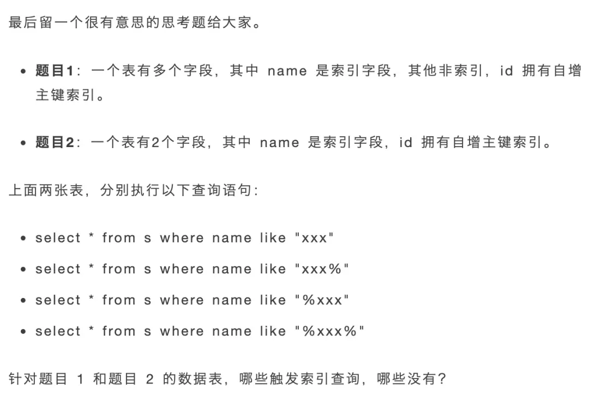

[TOC]
# 索引失效

## 索引的存储结构

InnoDB 和 MyISAM 都支持 B+ 树索引，但是它们数据的存储结构实现方式不同。不同之处在于：

- InnoDB 存储引擎：B+ 树索引的叶子节点保存数据本身；
- MyISAM 存储引擎：B+ 树索引的叶子节点保存数据的物理地址；

在使用「二级索引」字段作为条件查询的时候，如果要查询的数据都在「聚簇索引」的叶子节点里，那么需要检索两颗 B+树，这个过程叫做**回表**：

1. 先在「二级索引」的 B+ 树找到对应的叶子节点，获取主键值；
1. 然后用上一步获取的主键值，在「聚簇索引」中的 B+ 树检索到对应的叶子节点，然后获取要查询的数据。

如果要查询的数据在「二级索引」的叶子节点，那么只需要在「二级索引」的 B+ 树找到对应的叶子节点，然后读取要查询的数据，这个过程叫做**覆盖索引**。

查询条件用上了索引列，并不意味着查询过程就一定都用上索引。
## 对索引使用函数

如果**查询条件**中对索引字段使用函数，就会导致索引失效。

因为索引保存的是**索引字段的原始值**，而不是经过函数计算后的值，自然就没办法走索引了。

不过，从 MySQL 8.0 开始，索引特性增加了**函数索引**，即可以针对函数计算后的值建立一个索引，也就是说该索引的值是函数计算后的值，所以就可以通过扫描索引来查询数据。

```sql
alter table t_user add key idx_name_length ((length(name)));
```
## 对索引进行表达式计算

在**查询条件**中对索引进行表达式计算，也是无法走索引的。

执行计划中 `type = ALL`，说明是通过全表扫描的方式查询数据的：
```sql
explain select * from t_user where id + 1 = 10;
```

但是，如果把查询语句的条件改成 `where id = 10 - 1`，这样就不是在索引字段进行表达式计算了，于是就可以走索引查询了。
## 对索引隐式类型转换

- 如果索引字段是字符串类型，但是在条件查询中，输入的参数是整型的话，在执行计划的结果发现这条语句会走全表扫描。
- 但是如果索引字段是整型类型，查询条件中的输入参数即使字符串，是不会导致索引失效，还是可以走索引扫描。

原因是 MySQL 在**遇到字符串和数字比较的时候，会自动把字符串转为数字，然后再进行比较**。
 
 转换使用了 CAST 函数，而第一种情况下相当于对索引使用了函数，所以导致了索引失效！：
```sql
 select * from t_user where CAST(phone AS signed int) = 1320000;
```

第二种情况下则是在输入参数使用，故可以走索引：
```sql
select * from t_user where id = CAST("1" AS signed int);
```

## 联合索引非最左匹配

原因是，在联合索引的情况下，数据是按照索引第一列排序，第一列数据相同时才会按照第二列排序。
也就是说，如果我们想使用联合索引中尽可能多的列，查询条件中的各个列必须是联合索引中从最左边开始连续的列。如果我们仅仅按照第二列搜索，肯定无法走索引。

创建联合索引时，我们需要注意创建时的顺序问题，因为联合索引 (a, b, c) 和 (c, b, a) 在使用的时候会存在差别。

联合索引要能正确使用需要遵循**最左匹配原则。**

比如，如果创建了一个 (a, b, c) 联合索引，如果查询条件是以下这几种，就可以匹配上联合索引：

- where a=1.
- where a=1 and b=2 and c=3.
- where a=1 and b=2.

需要注意的是，因为有查询优化器，所以 **a 字段在 where 子句的顺序并不重要**。

但是，如果查询条件是以下这几种，因为不符合最左匹配原则，所以就无法匹配上联合索引，联合索引就会失效：

- where b=2.
- where c=3.
- where b=2 and c=3.


有一个比较特殊的查询条件：`where a = 1 and c = 3`，符合最左匹配吗？

这种其实严格意义上来说是属于`索引截断`，不同版本处理方式也不一样。

MySQL 5.5 的话，前面 a 会走索引，在联合索引找到主键值后，开始**回表**，到主键索引读取数据行，然后再比对 c 字段的值。

从 MySQL 5.6 之后，有一个**索引下推**功能，可以在索引遍历过程中，对索引中包含的字段先做判断，直接过滤掉不满足条件的记录，减少回表次数。

## WHERE 子句中的 OR

因为 OR 的含义就是两个只要满足一个即可，因此只有一个条件列是索引列是没有意义的，只要有条件列不是索引列，就会进行全表扫描。

解决办法很简单，为 非索引 字段设置添加索引即可。

通过执行计划可以看到 `type=index merge`，index merge 的意思就是对 id 和 age 分别进行了扫描，然后将这两个结果集进行了合并，这样做的好处就是避免了全表扫描。
## 对索引使用左或者左右模糊匹配

`like %xx` 或者 `like %xx%` 这两种方式都会造成索引失效。

因为索引 B+ 树是按照「索引值」有序排列存储的，只能根据**前缀**进行比较。
## MySQL 使用 like "%x"，索引一定会失效吗



题目 2 的数据库表特别之处在于，只有两个字段，一个是主键索引 id，另外一个是二级索引 name。

第一条和第二条模糊查询语句也是一样可以走索引扫描，第二条查询语句的执行计划如下，Extra 里的 Using index 说明用上了覆盖索引：


第三条查询语句的执行计划（第四条也是一样的结果）：

从执行计划的结果中，可以看到 key=index_name，也就是说用上了二级索引，而且从 Extra 里的 Using index 说明用上了覆盖索引。

> 原因

这张表的字段没有「非索引」字段，所以 select * 相当于 select id,name，然后**这个查询的数据都在二级索引的 B+ 树，因为二级索引的 B+ 树的叶子节点包含「索引值 + 主键值」，所以查二级索引的 B+ 树就能查到全部结果了，这个就是覆盖索引**。

但是执行计划里的 type 是 `index`，这代表着是通过**全扫描二级索引的 B+ 树的方式查询到数据的，也就是遍历了整颗索引树**。

而第一和第二条查询语句的执行计划中 type 是 `range`，表示对索引列进行范围查询，也就是利用了索引树的有序性的特点，通过查询比较的方式，快速定位到了数据行。

> 为什么选择全扫描二级索引树，而不扫描聚簇索引树呢？

因为**二级索引树的记录东西很少，就只有「索引列 + 主键值」，而聚簇索引记录的东西会更多**，比如聚簇索引中的叶子节点则记录了主键值、事务 id、用于事务和 MVCC 的回滚指针以及所有的剩余列。

再加上，这个 select * 不用执行回表操作。

所以，MySQL 优化器认为**直接遍历二级索引树要比遍历聚簇索引树的成本要小的多，因此 MySQL 选择了「全扫描二级索引树」的方式查询数据**。

> 为什么这个数据表加了非索引字段，执行同样的查询语句后，怎么变成走的是全表扫描呢？

加了其他字段后，`select * from t_user where name like "%xx"`; 要查询的数据就不能只在二级索引树里找了，得**需要回表**操作才能完成查询的工作，再加上是左模糊匹配，**无法利用索引树的有序性来快速定位数据**，所以得在二级索引树逐一遍历，获取主键值后，再到聚簇索引树检索到对应的数据行，这样实在太累了。

所以，优化器认为上面这样的查询过程的成本实在太高了，所以直接选择全表扫描的方式来查询数据。

> 举一反三

从上文可知，使用左模糊匹配（like "%xx"）并不一定会走全表扫描，关键还是看数据表中的字段。

一个相似的情况是，我们都知道联合索引要遵循最左匹配才能走索引，但是如果**数据库表中的字段都是索引的话，即使查询过程中，没有遵循最左匹配原则，也是走全扫描二级索引树 (type=index)**。
