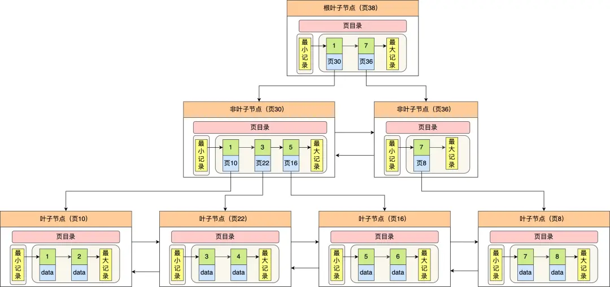

[TOC]
# 从数据页的角度看 B+ 树

## InnoDB 是如何存储数据的

InnoDB 的数据是按「数据页」为单位来读写的，也就是说，当需要读一条记录的时候，并不是将这个记录本身从磁盘读出来，而是以页为单位，将其整体读入内存。默认大小是 16KB。

### 数据页结构

这七个部分的作用如下：

- 文件头。表示页的信息
- 页头。表示页的状态信息
- 最小记录、最大记录。两个虚拟的伪记录，分别表示页中的最小记录和最大记录
- 用户记录。存储行记录内容
- 空闲空间。页中还没被使用的空间
- 页目录。存储用户记录的相对位置，对记录起到索引作用
- 文件尾。校验页是否完整

在 File Header 中有两个指针，分别指向上一个数据页和下一个数据页，连接起来的页相当于一个双向的链表，如下图所示：

采用链表的结构是让数据页之间不需要是物理上的连续的，而是逻辑上的连续。
### 页目录与记录的关系

数据页中的记录按照「主键」顺序组成**单向链表**，单向链表的特点就是插入、删除非常方便，但是检索效率不高，最差的情况下需要遍历链表上的所有节点才能完成检索。

因此，数据页中有一个页目录，起到记录的索引作用。

页目录创建的过程如下：

1. 将所有记录划分为几个组，这些记录包括最小记录和最大记录，但不包括标记为【已删除】的记录
1. 每个记录组的最后一条记录就是组内的最大记录，并且最后一条记录的头信息中会存储该组中一共有多少条记录，作为 `n_owned` 字段
1. 页目录用来存储每组最后一条记录的地址偏移量，这些偏移量会按照先后顺序存储起来，每组的地址偏移量也被称之为**槽（slot），每个槽相当于指针指向了不同组的最后一个记录**

由上图可知，**页目录是由多个槽组成的，槽相当于分组记录的索引**。因为记录是按照主键值从小到大排序的，所以**通过槽查找记录时，可以使用二分法快速定位要查询的记录在哪个槽（分组），定位到槽后，再遍历槽内的所有记录，即可找到对应记录**，无需从最小记录开始遍历整个页中的记录链表。

以上面那张图举个例子，5 个槽的编号分别为 0，1，2，3，4，我想查找主键为 11 的用户记录：

1. 先二分得出槽中间位是 (0+4)/2=2，2 号槽里最大的记录为 8。因为 11 > 8，所以需要从 2 号槽后继续搜索记录；
1. 再使用二分搜索出 2 号和 4 槽的中间位是 (2+4)/2= 3，3 号槽里最大的记录为 12。因为 11 < 12，所以主键为 11 的记录在 3 号槽里；
1. 但是这里有个问题，我们需要从槽中最小的记录开始遍历，可是「槽对应的值都是这个组的主键最大的记录，如何找到组里最小的记录」？比如槽 3 对应最大主键是 12 的记录，那如何找到最小记录 9。解决办法是：通过槽 3 找到 槽 2 对应的记录，也就是主键为 8 的记录。主键为 8 的记录的下一条记录就是槽 3 当中主键最小的 9 记录，然后开始向下搜索 2 次，定位到主键为 11 的记录，取出该条记录的信息即为我们想要查找的内容。

### 每个分组中的记录条数

InnoDB 对每个分组中的记录条数都是有规定的，槽内的记录就只有几条：

- 第一个分组中的记录只能有 1 条记录；
- 最后一个分组中的记录条数范围只能在 1-8 条之间；
- 剩下的分组中记录条数范围只能在 4-8 条之间。
## B+ 树是如何进行查询的

当我们需要存储大量的记录时，就需要多个数据页，这时我们就需要考虑如何建立合适的索引，才能方便定位记录所在的页。

为了解决这个问题，InnoDB 采用了 B+ 树作为索引。磁盘的 I/O 操作次数对索引的使用效率至关重要，因此在构造索引的时候，我们更倾向于采用**矮胖**的 B+ 树数据结构，这样所需要进行的磁盘 I/O 次数更少，而且 B+ 树 更适合进行关键字的**范围查询**。

### B+ 树的特点

InnoDB 里的 B+ 树中的**每个节点都是一个数据页**，结构示意图如下：

通过上图，我们看出 B+ 树的特点：

- 只有叶子节点才存放数据，其他非叶子节点只存放目录项作为索引
- 非叶子节点分为不同的层次，通过分层来降低每一层的搜索量
- 每层所有节点按照索引键大小排序，构成一个双向链表，便于范围查询

### B+ 树查询记录

我们再看看 B+ 树如何实现快速查找主键为 6 的记录，以上图为例子：

1. 从根节点开始，通过二分法快速定位到符合页内范围包含查询值的页，因为查询的主键值为 6，在[1, 7) 范围之间，所以到页 30 中查找更详细的目录项；
1. 在非叶子节点（页 30）中，继续通过二分法快速定位到符合页内范围包含查询值的页，主键值大于 5，所以就到叶子节点（页 16）查找记录；
1. 接着，在叶子节点（页 16）中，通过槽查找记录时，使用二分法快速定位要查询的记录在哪个槽（哪个记录分组），定位到槽后，再遍历槽内的所有记录，找到主键为 6 的记录。
1. 可以看到，在定位记录所在哪一个页时，也是通过二分法快速定位到包含该记录的页。定位到该页后，又会在该页内进行二分法快速定位记录所在的分组（槽号），最后在分组内进行遍历查找。
	
可以看到，在定位记录所在哪一个页时，也是通过二分法快速定位到包含该记录的页。定位到该页后，又会在该页内进行二分法快速定位记录所在的分组（槽号），最后在分组内进行遍历查找。

## 聚簇索引和二级索引

索引又可以分成聚簇索引和非聚簇索引（二级索引），它们区别就在于叶子节点存放的是什么数据：

- 聚簇索引的叶子节点存放的是实际数据，所有完整的用户记录都存放在聚簇索引的叶子节点；
- 二级索引的叶子节点存放的是主键值，而不是实际数据。

因为表的数据都是存放在聚簇索引的叶子节点里，所以 InnoDB 存储引擎一定会为表创建一个聚簇索引，且由于数据在物理上只会保存一份，所以聚簇索引只能有一个。

一张表只能有一个聚簇索引，那为了实现非主键字段的快速搜索，就引出了二级索引（非聚簇索引/辅助索引），它也是利用了 B+ 树的数据结构，但是二级索引的叶子节点存放的是主键值，不是实际数据。

二级索引的 B+ 树如下图，数据部分为主键值：

因此，**如果某个查询语句使用了二级索引，但是查询的数据不是主键值，这时在二级索引找到主键值后，需要去聚簇索引中获得数据行，这个过程就叫作「回表」，也就是说要查两个 B+ 树才能查到数据。不过，当查询的数据是主键值时，因为只在二级索引就能查询到，不用再去聚簇索引查，这个过程就叫作「索引覆盖」，也就是只需要查一个 B+ 树就能找到数据**。
