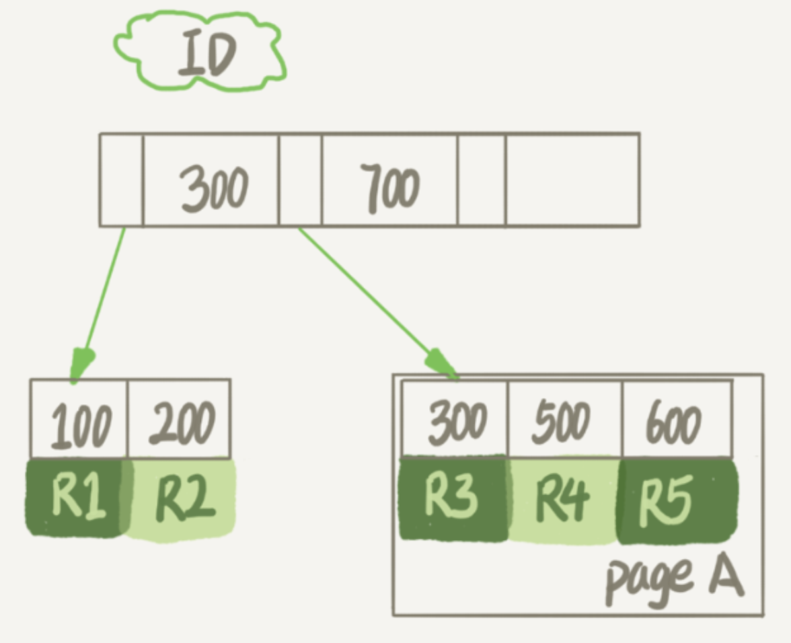
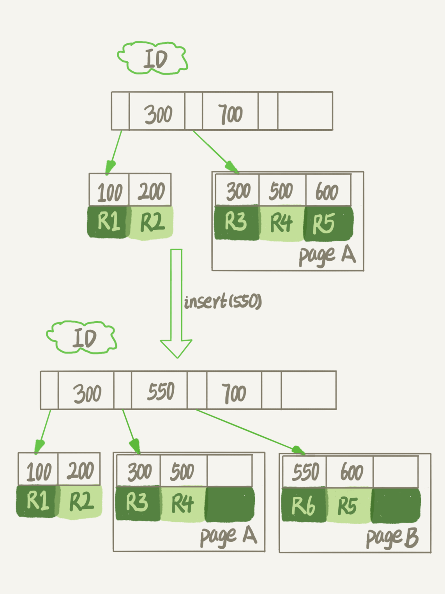

[TOC]
# 正确回收表空间

[MySQL 实战 45 讲](https://funnylog.gitee.io/mysql45/13%E8%AE%B2%E4%B8%BA%E4%BB%80%E4%B9%88%E8%A1%A8%E6%95%B0%E6%8D%AE%E5%88%A0%E6%8E%89%E4%B8%80%E5%8D%8A%EF%BC%8C%E8%A1%A8%E6%96%87%E4%BB%B6%E5%A4%A7%E5%B0%8F%E4%B8%8D%E5%8F%98.html)
## InnoDB表数据存储位置

一个InnoDB表包含两部分，即：表结构定义和数据。

在MySQL 8.0版本以前，表结构是存在以`.frm`为后缀的文件里。而MySQL 8.0版本，则已经允许把表结构定义放在系统数据表中了。

**表数据**既可以存在共享表空间里，也可以是单独的文件。这个行为是由参数`innodb_file_per_table`控制的：

- OFF，表的数据放在系统共享表空间，也就是跟数据字典放在一起；
- ON，每个InnoDB表数据存储在一个以 `.ibd`为后缀的文件中。从MySQL 5.6.6版本开始成为默认值。

建议你不论使用MySQL的哪个版本，都将这个值设置为ON。因为，一个表单独存储为一个文件更容易管理，而且在你不需要这个表的时候，通过`drop table`命令，系统就会直接删除这个文件。而**如果是放在共享表空间中，即使表删掉了，空间也是不会回收的**。

接下来的讨论都是基于这个设置展开的。

我们在删除整个表的时候，可以使用`drop table`命令回收表空间。但是，我们遇到的更多的删除数据的场景是删除某些行，这时就遇到了问题：表中的数据被删除了，但是表空间却没有被回收。

## 数据删除流程

InnoDB里的数据都是用B+树的结构组织的:



假设，我们要删掉R4这个记录，**InnoDB引擎只会把R4这个记录标记为删除**。如果之后要再插入一个ID在300和600之间的记录时，可能会**复用**这个位置。但是，磁盘文件的大小并不会缩小。

如果我们删掉了一个数据页上的所有记录，整个数据页就可以被复用了。但是，**数据页的复用跟记录的复用是不同的**。

- 记录的复用，只限于符合范围条件的数据。比如上面的这个例子，R4这条记录被删除后，如果插入一个ID是400的行，可以直接复用这个空间。但如果插入的是一个ID是800的行，就不能复用这个位置了。
- 而当整个页从B+树里面摘掉以后，可以复用到任何位置。以上图为例，如果将数据页page A上的所有记录删除以后，page A会被标记为可复用。这时候如果要插入一条ID=50的记录需要使用新页的时候，page A是可以被复用的。

如果相邻的两个数据页利用率都很小，系统就会把这两个页上的数据合到其中一个页上，另外一个数据页就被标记为可复用。

进一步地，如果用delete命令把整个表的数据删除，结果就是，所有的数据页都会被标记为可复用。但是磁盘上，文件不会变小。

也就是说，通过delete命令是不能回收表空间的。这些可以复用，而没有被使用的空间，看起来就像是“空洞”。

实际上，**不止是删除数据会造成空洞，插入数据也会**。

如果数据是按照索引递增顺序插入的，那么索引是紧凑的。但如果数据是随机插入的，就可能造成索引的数据页分裂：



另外，更新索引上的值，可以理解为删除一个旧的值，再插入一个新值。这也是会造成空洞的。

也就是说，经过大量增删改的表，都是可能是存在空洞的。所以，如果能够把这些空洞去掉，就能达到收缩表空间的目的。

## 重建表

如果你现在有一个表A，需要做空间收缩，为了把表中存在的空洞去掉，现有两种做法。
### 法1：DDL

可以新建一个与表A结构相同的表B，然后按照主键ID递增的顺序，把数据一行一行地从表A里读出来再插入到表B中。

如果我们把表B作为临时表，数据从表A导入表B的操作完成后，用表B替换A，从效果上看，就起到了收缩表A空间的作用。

这里，你可以使用

```sql
alter table A engine=InnoDB;
```

命令来重建表。在MySQL 5.5版本之前，这个命令的执行流程跟我们描述的差不多，区别只是这个临时表B不需要你自己创建，MySQL会自动完成转存数据、交换表名、删除旧表的操作。


显然，花时间最多的步骤是往临时表插入数据的过程，如果在这个过程中，有新的数据要写入到表A的话，就会造成数据丢失。因此，**在整个DDL过程中，表A中不能有更新。也就是说，这个DDL不是Online的。**

在MySQL 5.6版本开始引入的Online DDL，对这个操作流程做了优化。

### 法 2：Online DDL

引入了Online DDL之后，重建表的流程：

1. 建立一个临时文件，扫描表 A 主键的所有数据页
1. 用数据页中表 A 的记录生成 B+ 树，存储到临时文件中
1. 生成临时文件的过程中，将所有对 A 的操作记录在一个日志文件（raw log）中，对应图中 state2 的状态
1. 临时文件生成后，将日志文件中的操作应用到临时文件，得到一个逻辑上与表 A 相同的数据文件，对应图中 state3 的状态
1. 用临时文件替换表 A 的数据文件


与法 1 过程的不同之处在于，由于日志文件记录和重放操作这个功能的存在，这个方案**在重建表的过程中，允许对表A做增删改操作**。这也就是Online DDL名字的来源。

在这个流程中，alter语句在启动的时候需要获取 MDL 写锁，但是这个写锁在真正拷贝数据之前就退化成读锁了。

退化是为了实现 Online，MDL读锁不会阻塞增删改操作。

不干脆直接解锁是为了保护自己，禁止其他线程对这个表同时做DDL。

而对于一个大表来说，Online DDL最耗时的过程就是拷贝数据到临时表的过程，这个步骤的执行期间可以接受增删改操作。所以，相对于整个DDL过程来说，锁的时间非常短。对业务来说，就可以认为是Online的。

需要补充说明的是，上述的这些重建方法都会扫描原表数据和构建临时文件。对于很大的表来说，这个操作是很消耗IO和CPU资源的。因此，如果是线上服务，你要很小心地控制操作时间。如果想要比较安全的操作的话，推荐你使用GitHub开源的[gh-ost](https://github.com/github/gh-ost)来做。

补充资料：[白话Online DDL](http://mysql.taobao.org/monthly/2021/03/06/)
#### DDL 的基本过程

Online DDL 会不会锁表？要回答这个问题，首先要明确“锁表”的含义。很多 MySQL 用户经常在表无法正常的进行 DML 时就觉得是锁表了，这种说法其实过于宽泛，实际上能够影响 DML 操作的锁至少包括以下几种（默认为 InnoDB 表）：

- MDL 锁
- 表锁
- 行锁
- GAP 锁

其中除了 MDL 锁是在 Server 层加的之外，其它三种都是在 InnoDB 层加的。具体的加锁逻辑不在此进行展开，但是需要明确一点：所有的操作（不管是 DDL 还是 DML 还是查询语句）都需要先拿 Server 层的 MDL 锁，然后再去拿 InnoDB 层的某个需要的锁。一个 DDL 的基本过程是这样的：

1. 首先，在开始进行 DDL 时，需要拿到对应表的 MDL X 锁，然后进行一系列的准备工作；
1. 然后将 MDL X 锁降级为 MDL S 锁，进行真正的 DDL 操作；
1. 最后再次将 MDL S 锁升级为 MDL X 锁，完成 DDL 操作，释放 MDL 锁；

所以在真正执行 DDL 操作期间，确实是不会“锁表”的，但是如果在第一阶段拿 MDL X 锁时无法正常获取，那就可能真的会“锁表了”。

## Online 和 inplace

在法 1 中，我们把表A中的数据导出来的存放位置叫作 tmp_table。这是一个临时表，是在server层创建的。

在法 2 中，根据表A重建出来的数据是放在“tmp_file”里的，这个临时文件是InnoDB在内部创建出来的。**整个DDL过程都在InnoDB内部完成**。对于server层来说，没有把数据挪动到临时表，是一个“原地”操作，这就是“inplace”名称的来源。在重建表的时候，InnoDB不会把整张表占满，每个页留了1/16给后续的更新用。也就是说，其实重建表之后不是“最”紧凑的。

重建表的这个语句`alter table t engine=InnoDB`，其实隐含的意思是：

```sql
alter table t engine=innodb,ALGORITHM=inplace;
```

跟inplace对应的就是拷贝表的方式了，用法是：

```sql
alter table t engine=innodb,ALGORITHM=copy;
```
表示的是强制拷贝表，对应的流程就是法 1 的操作过程。

inplace跟Online是不是就是一个意思？

其实不是的，只是在重建表这个逻辑中刚好是这样而已。

比如，如果我要给InnoDB表的一个字段加全文索引，写法是：

```sql
alter table t add FULLTEXT(field_name);
```

这个过程是inplace的，但会阻塞增删改操作，是非Online的。

如果说这两个逻辑之间的关系是什么的话，可以概括为：

- DDL过程如果是Online的，就一定是inplace的；
- 反过来未必，也就是说inplace的DDL，有可能不是Online的。截止到MySQL 8.0，添加全文索引（FULLTEXT index）和空间索引(SPATIAL index)就属于这种情况。

总结一句话就是：online 就是不阻塞增删改；INPLACE 描述的是表，而不是数据文件，**只要不创建临时表，那么都是 INPLACE 的**。

拓展：

- 从MySQL 5.6版本开始，alter table t engine = InnoDB（也就是recreate）默认的就是上面法 2 的流程了；
- analyze table t 其实不是重建表，只是对表的索引信息做重新统计，没有修改数据，这个过程中加了MDL读锁；
- optimize table t 等于recreate+analyze。

MySQL 8.0 对 DDL 的实现重新进行了设计，其中一个最大的改进是 DDL 操作支持了原子特性。另外，Online DDL 的 ALGORITHM 参数增加了一个新的选项：INSTANT，只需修改数据字典中的元数据，无需拷贝数据也无需重建表，同样也无需加排他 MDL 锁，原表数据也不受影响。整个 DDL 过程几乎是瞬间完成的，也不会阻塞 DML。
