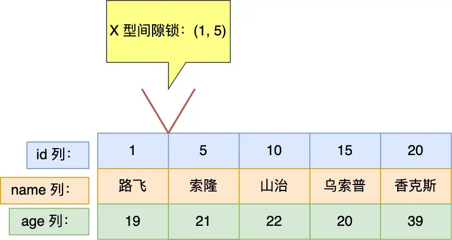

[TOC]
# MySQL 如何加锁

[MySQL 是怎么加锁的](https://xiaolincoding.com/mysql/lock/how_to_lock.html#%E4%BB%80%E4%B9%88-sql-%E8%AF%AD%E5%8F%A5%E4%BC%9A%E5%8A%A0%E8%A1%8C%E7%BA%A7%E9%94%81)

**加锁的对象是索引，加锁的基本单位是 next-key lock，next-key lock 是前开后闭区间，而间隙锁是前开后开区间**。

锁退化原则：
**在能使用记录锁或者间隙锁就能 *避免幻读* 现象的场景下，next-key lock 就会退化成记录锁或间隙锁**。

MySQL 如何加锁可分为五种情况进行讨论：

- 唯一索引下的
	- 等值查询
    - 范围查询
- 非唯一索引的
	- 等值查询
    - 范围查询
- 没有使用索引查询的情况

**如果是用二级索引（不管是不是非唯一索引，还是唯一索引）进行锁定读查询的时候，除了会对二级索引项加行级锁（如果是唯一索引的二级索引，加锁规则和主键索引的案例相同），而且还会对查询到的记录的主键索引项上加「记录锁」**。
## 什么 SQL 语句会加行级锁

参考《MySQL 锁类型》-> 行级锁 小节。
## 阅读说明

本文以这些缩写表示对应的概念：

- ssr：supremum pseudo-record
- nkl：next-key lock

本文所述的例子没有很详细，详细的文章说明参考[小林 coding《MySQL 是怎么加锁的》](https://xiaolincoding.com/mysql/lock/how_to_lock.html)

本文以下面这个表结构来进行实验说明：

```sql
CREATE TABLE `user` (
  `id` bigint NOT NULL AUTO_INCREMENT,
  `name` varchar(30) COLLATE utf8mb4_unicode_ci NOT NULL,
  `age` int NOT NULL,
  PRIMARY KEY (`id`),
  KEY `index_age` (`age`) USING BTREE
) ENGINE=InnoDB  DEFAULT CHARSET=utf8mb4 COLLATE=utf8mb4_unicode_ci;
```

其中，id 是主键索引（唯一索引），age 是普通索引（非唯一索引），name 是普通的列。

表中的有这些行记录：


## 唯一索引等值查询

- 记录存在，该记录索引中的 next-key lock 会**退化成 记录锁**
- 记录不存在，
	- **如果下一条记录是 ssr，则对 ssr 加 nkl**
    - 如果下一条记录不是 ssr 而是用户记录，下一条记录的索引中的 nkl 会**退化成 间隙锁**

本篇文章的「唯一索引」是用「主键索引」作为案例说明的，加锁只加在主键索引项上。
如果是用二级索引（不管是不是唯一索引）进行锁定读查询的时候，除了会对二级索引项加行级锁（如果是唯一索引的二级索引，加锁规则和主键索引的案例相同），而且还会对查询到的记录的主键索引项上加「记录锁」。

### 例1 记录存在的情况

在该场景下，该记录的索引中的 next-key lock 会退化成记录锁的原因就是在唯一索引等值查询并且查询记录存在的场景下，仅靠记录锁也能避免幻读的问题。

```sql
mysql> begin;
Query OK, 0 rows affected (0.00 sec)

mysql> select * from user where id = 1 for update;
+----+--------+-----+
| id | name   | age |
+----+--------+-----+
|  1 | 路飞   |  19 |
+----+--------+-----+
1 row in set (0.02 sec)
```


因为事务 A 对 id = 1 的记录加了 X 型的记录锁，所以事务 B 在修改 id=1 的记录时会被阻塞，事务 C 在删除 id=1 的记录时也会被阻塞。

### 加锁分析语句

可以通过 `select * from performance_schema.data_locks\G;` 这条语句，查看事务执行 SQL 过程中加了什么锁。

事务 A 加锁：


事务 B 加锁：


图中 LOCK_TYPE 中的 RECORD 表示行级锁，而不是记录锁的意思。

通过 `LOCK_MODE` 可以确认是 next-key 锁，还是间隙锁，还是记录锁：

- 如果 LOCK_MODE 为 `X`，说明是 next-key 锁；
- 如果 LOCK_MODE 为 `X, REC_NOT_GAP`，说明是记录锁；
- 如果 LOCK_MODE 为 `X, GAP`，说明是间隙锁；
- 如果 LOCK_MODE 为 `X,GAP,INSERT_INTENTION`，说明是插入意向锁；

### 例2 记录不存在的情况

```sql
mysql> begin;
Query OK, 0 rows affected (0.00 sec)

mysql> select * from user where id = 2 for update;
Empty set (0.03 sec)
```


因此，此时事务 A 在 id = 5 记录的主键索引上加的是间隙锁，锁住的范围是 (1, 5)。




接下来，如果有其他事务插入 id 值为 2、3、4 这一些记录的话，这些插入语句都会发生**阻塞**。

注意，如果其他事务插入的 id = 1 或者 id = 5 的记录话，并不会发生阻塞，而是报**主键冲突**的错误，因为表中已经存在 id = 1 和 id = 5 的记录了。

```sql
mysql> begin;
Query OK, 0 rows affected (0.00 sec)

mysql> select * from user where id = 30 for update;
Empty set (0.03 sec)
```

## 唯一索引范围查询

查询条件：

- 大于的情况
	- 记录存在
	- 记录不存在
**所有**满足条件的记录都加 next-key lock，还有一个最后记录这个特殊的记录也是 next-key lock

- 大于等于的情况，
	- 记录存在，等值记录（也就是第一个记录）加记录锁，其它满足条件的记录和 ssr 加 nkl
	- 记录不存在，所有满足条件的记录和 ssr 加 nkl

- 小于的情况
	- 记录存在，满足条件的记录都加 nkl，下一条记录（也即是等值记录）加 间隙锁
	- 记录不存在，满足条件的记录都加 nk，下一条记录加 间隙锁

- 小于等于的情况，
	- 记录存在，满足条件的记录都加 nkl，**下一条记录不必加锁**
	- 记录不存在，满足条件的记录加 nkl，下一条记录加 间隙锁

### 例1 针对「大于」的范围查询的情况

```sql
mysql> begin;
Query OK, 0 rows affected (0.00 sec)

mysql> select * from user where id > 15 for update;
+----+-----------+-----+
| id | name      | age |
+----+-----------+-----+
| 20 | 香克斯    |  39 |
+----+-----------+-----+
1 row in set (0.01 sec)
```

事务 A 加锁变化过程如下：

1. 最开始要找的第一行是 id = 20，由于查询该记录不是一个等值查询（不是大于等于条件查询），所以对该主键索引加的是范围为 (15, 20] 的 next-key 锁；
2. 由于是范围查找，就会继续往后找存在的记录，虽然我们看见表中最后一条记录是 id = 20 的记录，但是实际在 Innodb 存储引擎中，会用一个特殊的记录来标识最后一条记录，该特殊的记录的名字叫 `supremum pseudo-record`，所以扫描第二行的时候，也就扫描到了这个特殊记录的时候，会对该主键索引加的是范围为 `(20, +∞]` 的 next-key 锁。
3. 停止扫描。


### 例2 针对「大于等于」的范围查询的情况

```sql
mysql> begin;
Query OK, 0 rows affected (0.00 sec)

mysql> select * from user where id >= 15 for update;
+----+-----------+-----+
| id | name      | age |
+----+-----------+-----+
| 15 | 乌索普    |  20 |
| 20 | 香克斯    |  39 |
+----+-----------+-----+
2 rows in set (0.00 sec)
```


### 例3 针对「小于」的范围查询时，查询条件值的记录「不存在」表中的情况

```sql
mysql> begin;
Query OK, 0 rows affected (0.00 sec)

mysql> select * from user where id < 6 for update;
+----+--------+-----+
| id | name   | age |
+----+--------+-----+
|  1 | 路飞   |  19 |
|  5 | 索隆   |  21 |
+----+--------+-----+
3 rows in set (0.00 sec)
```


### 例4 针对「小于等于」的范围查询时，查询条件值的记录「存在」表中的情况

```sql
mysql> begin;
Query OK, 0 rows affected (0.00 sec)

mysql> select * from user where id <= 5 for update;
+----+--------+-----+
| id | name   | age |
+----+--------+-----+
|  1 | 路飞   |  19 |
|  5 | 索隆   |  21 |
+----+--------+-----+
2 rows in set (0.00 sec)
```


### 例5 针对「小于」的范围查询时，查询条件值的记录「存在」表中的情况。

```sql
select * from user where id < 5 for update;
```


## 非唯一索引等值查询

非唯一索引除了在二级索引上加锁，还需要在主键索引（聚簇索引）上面加锁。**对主键索引加锁的时候，只有满足查询条件的记录才会对它们的主键索引加锁**。

结论：

- 记录存在，满足条件的记录加 nkl，对应的聚簇索引加 记录锁，二级索引的下一条记录加间隙锁
- 记录不存在，二级索引的下一条记录加 间隙锁（遇到 ssr 则加 nkl），聚簇索引不加锁

原因：

- 当查询的记录「存在」时，由于不是唯一索引，所以肯定存在索引值相同的记录，于是**非唯一索引等值查询的过程是一个扫描的过程，直到扫描到第一个不符合条件的二级索引记录就停止扫描**，然后在扫描的过程中，对**扫描到的二级索引记录加的是 next-key 锁**，而对于**第一个不符合条件的二级索引记录，该二级索引的 next-key 锁会退化成间隙锁**。同时，在**符合查询条件的记录的主键索引上加记录锁**。
- 当查询的记录「不存在」时，扫描到**第一条不符合条件的二级索引记录，该二级索引的 next-key 锁会退化成间隙锁**。因为不存在满足查询条件的记录，所以不会对主键索引加锁。

### 例1 针对非唯一索引等值查询时，查询的值不存在的情况

```SQL
mysql> begin;
Query OK, 0 rows affected (0.00 sec)

mysql> select * from user where age = 25 for update;
Empty set (0.00 sec)
```


行级锁内容：


- 39 是二级索引的值
- 20 是聚簇索引的值

此时，如果有其他事务插入了 age 值为 23、24、25、26、……、38 这些新记录，那么这些插入语句都会发生阻塞。但是对于 `age = 22` 和 `age = 39` 这些边界条件需要分情况讨论。

**插入语句在插入一条记录之前，需要先定位到该记录在 B+树 的位置，如果插入的位置的下一条记录的索引上有间隙锁，才会发生阻塞**。

**二级索引树是按照二级索引值按顺序存放的，在相同的二级索引值情况下，再按主键 id 的顺序存放**。知道了这个前提，我们才能知道执行插入语句的时候，插入的位置的下一条记录是谁。

插入 `age = 22` 记录的成功和失败的情况分别如下：

- 当其他事务插入一条 `age = 22，id = 3` 的记录的时候，在二级索引树上定位到插入的位置，而该位置的下一条是 **id = 10、age = 22 的记录，该记录的二级索引上没有间隙锁，所以这条插入语句可以执行成功**。
- 当其他事务插入一条 `age = 22，id = 12` 的记录的时候，在二级索引树上定位到插入的位置，而该位置的下一条是 **id = 20、age = 39 的记录，正好该记录的二级索引上有间隙锁，所以这条插入语句会被阻塞，无法插入成功**。

插入 `age = 39` 记录的成功和失败的情况分别如下：

- 当其他事务插入一条 `age = 39，id = 3` 的记录的时候，在二级索引树上定位到插入的位置，而该位置的下一条是 **id = 20、age = 39 的记录，正好该记录的二级索引上有间隙锁，所以这条插入语句会被阻塞，无法插入成功**。
- 当其他事务插入一条 `age = 39，id = 21` 的记录的时候，在二级索引树上定位到插入的位置，而该位置的**下一条记录不存在，也就没有间隙锁了，所以这条插入语句可以插入成功**。

分析输出结果：


- LOCK_DATA 第一个数值，也就是 39，它代表的是 age 值。从前面我们也知道了，LOCK_DATA 第一个数值是 **next-key 锁和间隙锁锁住的范围的右边界值**。
- LOCK_DATA 第二个数值，也就是 20，它代表的是 id 值。

因此， `LOCK_DATA：39，20` + `LOCK_MODE : X, GAP` 的意思是，事务 A 在 age = 39 记录的二级索引上（INDEX_NAME: index_age），加了 age 值范围为 (22, 39) 的 X 型间隙锁，**同时针对其他事务插入 age 值为 39 的新记录时，不允许插入的新记录的 id 值小于 20**。如果插入的新记录的 id 值大于 20，则可以插入成功。
### 例2 针对非唯一索引等值查询时，查询的值存在的情况

```SQL
mysql> begin;
Query OK, 0 rows affected (0.00 sec)

mysql> select * from user where age = 22 for update;
+----+--------+-----+
| id | name   | age |
+----+--------+-----+
| 10 | 山治   |  22 |
+----+--------+-----+
1 row in set (0.00 sec)
```


在 age = 22 这条记录的二级索引上，加了范围为 (21, 22] 的 next-key 锁，意味着其他事务无法更新或者删除 age = 22 的这一项记录，针对是否可以插入 age = 21 和 age = 22 的新记录，分析如下：

  - 是否可以插入 age = 21 的新记录，还要看插入的新记录的 id 值，**如果插入 age = 21 新记录的 id 值小于 5，那么就可以插入成功**，因为此时插入的位置的下一条记录是 id = 5，age = 21 的记录，该记录的二级索引上没有间隙锁。**如果插入 age = 21 新记录的 id 值大于 5，那么就无法插入成功**，因为此时插入的位置的下一条记录是 id = 20，age = 39 的记录，该记录的二级索引上有间隙锁。
  - 是否可以插入 age = 22 的新记录，还要看插入的新记录的 id 值，从 `LOCK_DATA : 22, 10` 可以得知，其他事务插入 age 值为 22 的新记录时，**如果插入的新记录的 id 值小于 10，那么插入语句会发生阻塞；如果插入的新记录的 id 大于 10，还要看该新记录插入的位置的下一条记录是否有间隙锁，如果没有间隙锁则可以插入成功，如果有间隙锁，则无法插入成功**。

在 age = 39 这条记录的二级索引上，加了范围 (22, 39) 的间隙锁。意味着其他事务无法插入 age 值为 23、24、…… 、38 的这一些新记录，针对是否可以插入 age = 22 和 age = 39 的新记录，分析如下：

  - 是否可以插入 age = 22 的新记录，还要看插入的新记录的 id 值，**如果插入 age = 22 新记录的 id 值小于 10，那么插入语句会被阻塞**，无法插入，因为此时插入的位置的下一条记录是 id = 10，age = 22 的记录，该记录的二级索引上有 next-key 锁）。**如果插入 age = 21 新记录的 id 值大于 10，也无法插入**，因为此时插入的位置的下一条记录是 id = 20，age = 39 的记录，该记录的二级索引上有间隙锁。
  - 是否可以插入 age = 39 的新记录，还要看插入的新记录的 id 值，从 `LOCK_DATA : 39, 20` 可以得知，其他事务**插入 age 值为 39 的新记录时，如果插入的新记录的 id 值小于 20，那么插入语句会发生阻塞，如果插入的新记录的 id 大于 20，则可以插入成功**。

## 非唯一索引范围查询

非唯一索引范围查询，索引的 next-key lock 不会有退化为间隙锁和记录锁的情况，也就是**非唯一索引进行范围查询时，对二级索引记录加锁都是加 next-key 锁**。

因为 age 字段是非唯一索引，不具有唯一性，所以如果只加记录锁（记录锁无法防止插入，只能防止删除或者修改），就会导致其他事务插入一条 age = 22 的记录，这样前后两次查询的结果集就不相同了，出现了幻读现象。

查询条件：

- 大于的情况
	- 记录存在
	- 记录不存在
所有满足条件的记录和 ssr 加 nkl，对应的聚簇索引加 记录锁

- 大于等于的情况
	- 记录存在
	- 记录不存在
所有满足条件的记录和 ssr 加 nkl，对应的聚簇索引加 记录锁

- 小于的情况
	- 记录存在
	- 记录不存在
所有满足条件的记录加 nkl，对应的聚簇索引加 记录锁，二级索引的下一条记录加 nkl

- 小于等于的情况
	- 记录存在，所有满足条件的记录加 nkl，对应的聚簇索引加 记录锁，二级索引的下一条记录加 nkl
	- 记录不存在，所有满足条件的记录加 nkl，对应的聚簇索引加 记录锁，二级索引的下一条记录加 nkl

### 例2 针对「大于等于」的范围查询情况

```sql
mysql> begin;
Query OK, 0 rows affected (0.00 sec)

mysql> select * from user where age >= 22  for update;
+----+-----------+-----+
| id | name      | age |
+----+-----------+-----+
| 10 | 山治      |  22 |
| 20 | 香克斯    |  39 |
+----+-----------+-----+
2 rows in set (0.01 sec)
```


## 没有使用索引的情况

如果*锁定读*查询语句，没有使用索引列作为查询条件，或者*锁定读*查询语句没有走索引查询，导致扫描是全表扫描。那么，**每一条记录的索引上都会加 next-key 锁，这样就相当于锁住了全表，这时如果其他事务对该表进行增、删、改操作的时候，都会被阻塞**。

update 和 delete 语句 同理。

### update 语句的 where 带上索引就能避免全表记录加锁了吗

并不是，关键还得看这条语句在执行过程中，优化器最终选择的是索引扫描，还是全表扫描，如果走了全表扫描，就会对全表的记录加锁了。

如何避免：
将 MySQL 里的 `sql_safe_updates` 参数设置为 1（默认是0），开启安全更新模式。

此时 update 语句必须满足如下条件之一才能执行成功：

- 使用 where，并且 where 条件中必须有索引列；
- 使用 limit；
- 同时使用 where 和 limit，此时 where 条件中可以没有索引列；

delete 语句必须满足以下条件能执行成功：

- 同时使用 where 和 limit，此时 where 条件中可以没有索引列；

如果 where 条件带上了索引列，但是优化器最终扫描选择的是全表，而不是索引的话，我们可以使用 `force index([index_name])` 可以告诉优化器使用哪个索引，以此避免有几率锁全表带来的隐患。
