[TOC]
# MySQL 死锁

## 死锁的发生

使用存储引擎 Innodb，隔离级别为可重复读（RR）。

例：
```sql
CREATE TABLE `t_order` (
  `id` int NOT NULL AUTO_INCREMENT,
  `order_no` int DEFAULT NULL,
  `create_date` datetime DEFAULT NULL,
  PRIMARY KEY (`id`),
  KEY `index_order` (`order_no`) USING BTREE
) ENGINE=InnoDB ;
```

表中已有的记录：
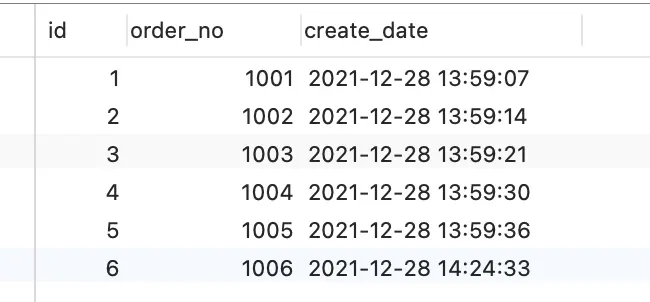

假设这时有两事务，一个事务要插入订单 1007，另外一个事务要插入订单 1008，因为需要对订单做幂等性校验，所以两个事务先要查询该订单是否存在，不存在才插入记录，过程如下：
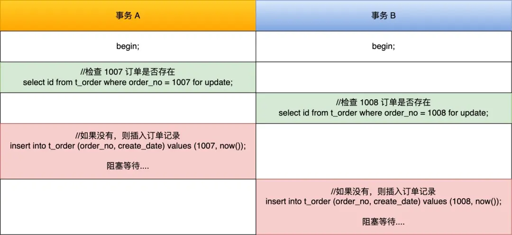

可以看到，两个事务都陷入了等待状态（前提没有打开死锁检测），也就是发生了死锁，因为都在相互等待对方释放锁。

如果没有使用 select ... for update 语句，而使用了单纯的 select 语句，如果是两个订单号一样的请求同时进来，就会出现两个重复的订单，有可能出现幻读，如下图：
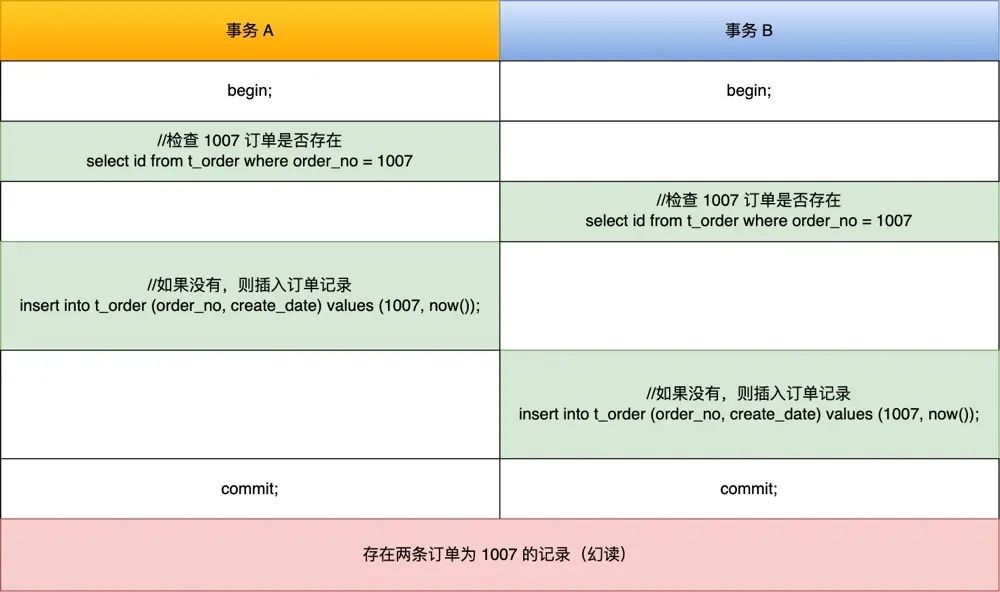
## 为什么会产生死锁

**普通的 select 语句是不会对记录加锁的，因为它是通过 MVCC 的机制实现的快照读**，如果要在查询时对记录加行锁，可以使用下面这两个方式：

```sql
begin;
//对读取的记录加共享锁
select ... lock in share mode;
commit; //锁释放

begin;
//对读取的记录加排他锁
select ... for update;
commit; //锁释放
```

**行锁的释放时机是在事务提交（commit）后，锁就会被释放，并不是一条语句执行完就释放行锁**。

事务 A 在二级索引（INDEX_NAME : index_order）上加的是 X 型的 `next-key 锁`，锁范围是(1006, +∞]：

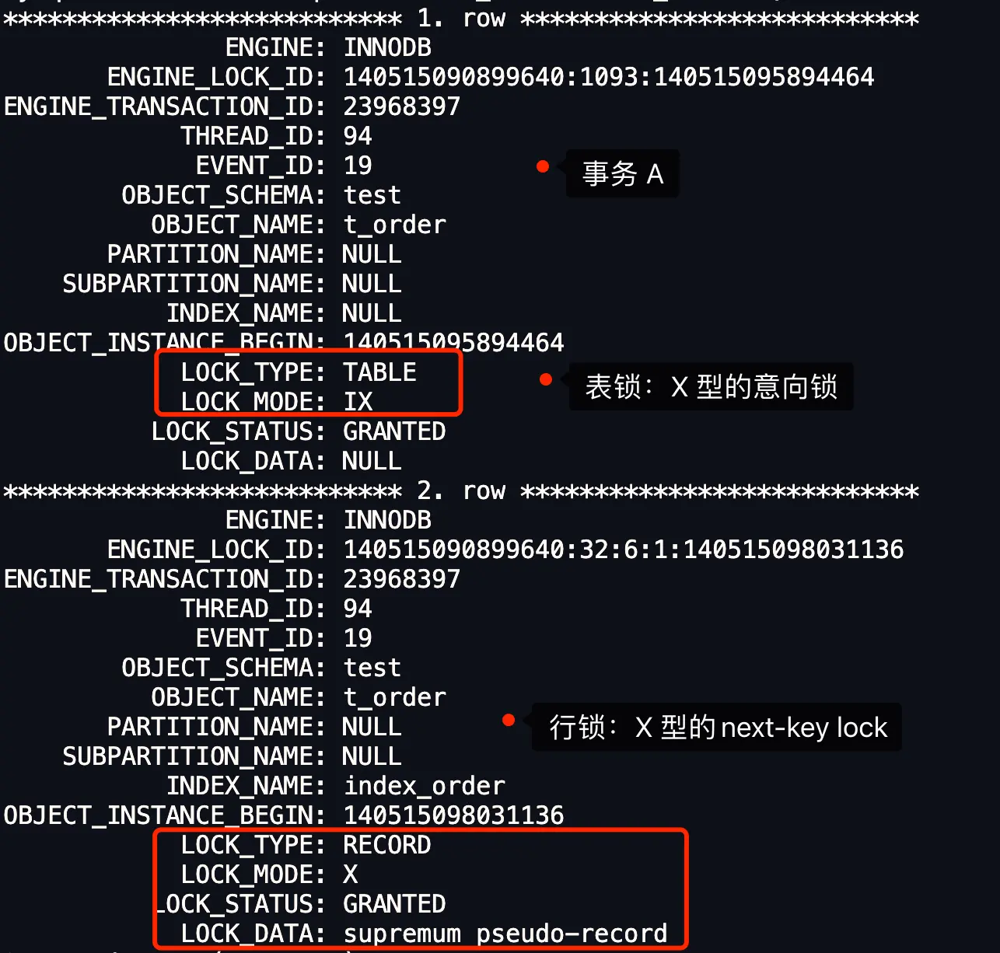

当事务 B 往事务 A next-key 锁的范围 (1006, +∞] 里插入 id = 1008 的记录就会被锁住。

因为当执行以上语句的时候，**间隙锁之间是兼容的，所以两个事务中的`select … for update`语句不会相互影响**。但在执行插入语句时，会在插入间隙上获取插入意向锁，而**插入意向锁和间隙锁是冲突的**，所以当其它事务持有该间隙的间隙锁时，需要等待其它事务释放间隙锁之后，才能获取到插入意向锁。

此例中两个事务执行完 `select … for update` 之后都持有范围相同的 next-key lock，而接下来的插入操作为了获取插入意向锁，都在等待对方事务的间隙锁释放，于是就造成了死锁。

## next-key lock 一定互斥吗

next-key lock 是包含间隙锁 + 记录锁的，**如果一个事务获取了 X 型的 next-key lock，那么另外一个事务在获取相同范围的 X 型的 next-key lock 时，是会被阻塞的**。

比如，一个事务持有了范围为 (1, 10] 的 X 型的 next-key lock，那么另外一个事务在获取相同范围的 X 型的 next-key lock 时，就会被阻塞。

这是因为虽然相同范围的间隙锁是多个事务相互兼容的，但对于记录锁，我们是要考虑 X 型与 S 型关系。X 型的记录锁与 X 型的记录锁是冲突的，比如一个事务执行了 `select ... where id = 1 for update`，后一个事务在执行这条语句的时候，就会被阻塞的。

但是！对于这种范围为 `(1006, +∞]` 的 next-key lock，两个事务是可以同时持有的，不会冲突。因为 **+∞ 并不是一个真实的记录，自然就不需要考虑 X 型与 S 型关系**。
## Insert 语句是怎么加行级锁的

当事务需要加锁的时，如果这个锁不可能发生冲突，InnoDB 会跳过加锁环节，这种机制称为隐式锁。隐式锁是 InnoDB 实现的一种延迟加锁机制，其特点是只有在可能发生冲突时才加锁，从而减少了锁的数量，提高了系统整体性能。

Insert 语句在正常执行时是不会生成锁结构的，它是靠聚簇索引记录自带的 `trx_id` 隐藏列来作为**隐式锁**来保护记录的。

隐式锁就是在 Insert 过程中不加锁，只有在特殊情况下，才会将隐式锁转换为显式锁，这里我们列举两个场景。

- 如果记录之间加有间隙锁，为了避免幻读，此时是不能插入记录的；
- 如果 Insert 的记录和已有记录存在唯一键冲突，此时也不能插入记录；

### 记录之间加有间隙锁

每插入一条新记录，都需要看一下待插入记录的下一条记录上是否已经被加了间隙锁，如果已加间隙锁，此时会生成一个插入意向锁，然后锁的状态设置为等待状态（PS：MySQL 加锁时，是先生成锁结构，然后设置锁的状态，如果锁状态是等待状态，并不是意味着事务成功获取到了锁，只有当锁状态为正常状态时，才代表事务成功获取到了锁），现象就是 Insert 语句会被阻塞。

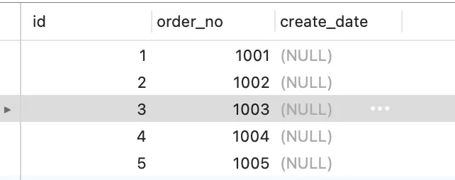

事务 A 执行：
```sql
# 事务 A
mysql> begin;
Query OK, 0 rows affected (0.01 sec)

mysql> select * from t_order where order_no = 1006 for update;
Empty set (0.01 sec)
```

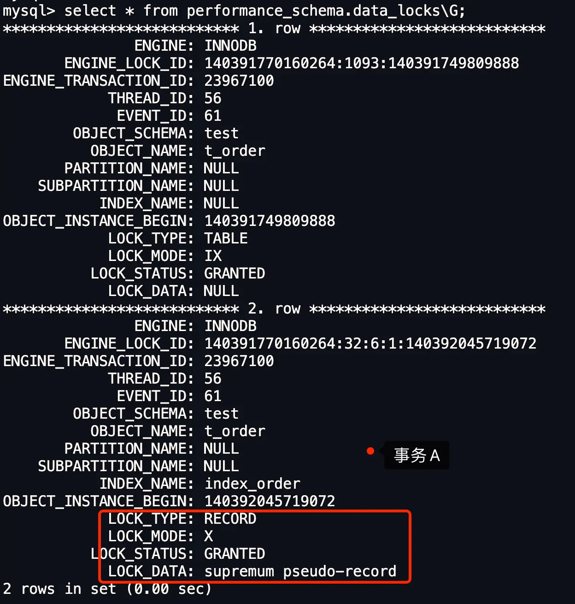

可见，加的是 next-key 锁（记录锁 + 间隙锁），锁范围是（1005, +∞]。

然后，有个事务 B 在这个间隙锁中，插入了一个记录，那么此时该事务 B 就会被阻塞：
```sql
# 事务 B 插入一条记录
mysql> begin;
Query OK, 0 rows affected (0.01 sec)

mysql> insert into t_order(order_no, create_date) values(1010,now());
### 阻塞状态。。。。
```

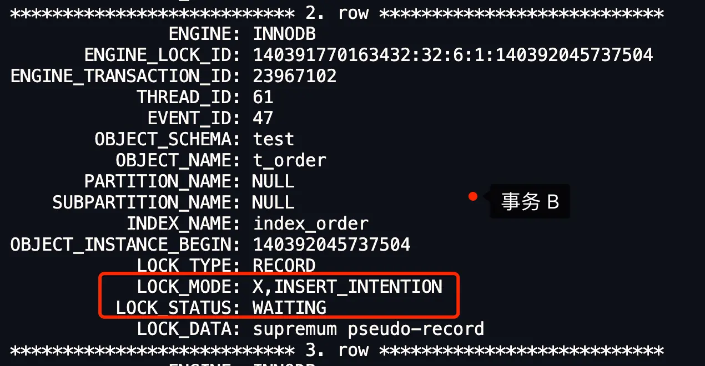

事务 B 生成了一个插入意向锁（`LOCK_MODE: X,INSERT_INTENTION`），状态为等待状态（`LOCK_STATUS: WAITING`）。
锁的状态是等待状态，意味着事务 B 并没有成功获取到插入意向锁，因此事务 B 发生阻塞。
### 遇到唯一键冲突

如果在插入新记录时，插入了一个与「已有的记录的主键或者唯一二级索引列值相同」的记录（不过可以有多条记录的唯一二级索引列的值同时为 NULL，这里不考虑这种情况），此时插入就会失败，然后对于这条记录加上了 `S 型的锁`。

- 如果主键索引重复，插入新记录的事务会给已存在的主键值重复的聚簇索引记录添加 **S 型记录锁**。
- 如果唯一二级索引重复，插入新记录的事务都会给已存在的二级索引列值重复的二级索引记录添加 **S 型 next-key 锁**。
#### 主键索引冲突

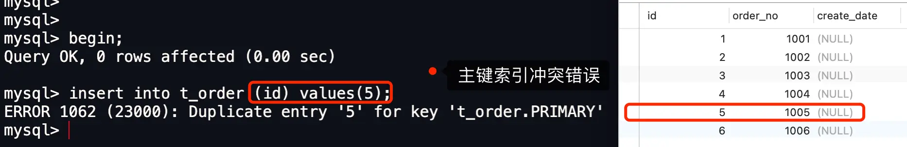

但是除了报错之外，还做一个很重要的事情，就是对 id 为 5 的这条记录加上了 S 型的记录锁：
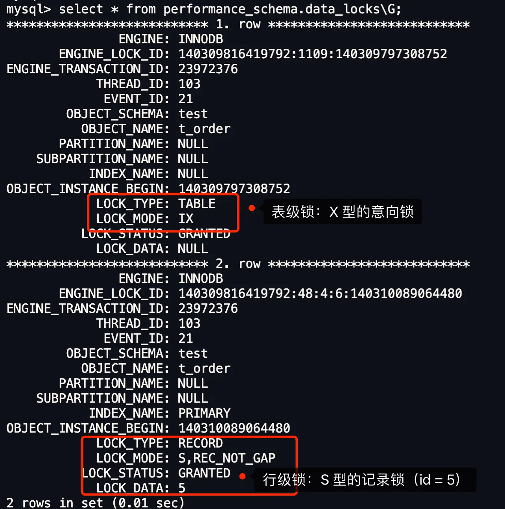
#### 唯一二级索引冲突

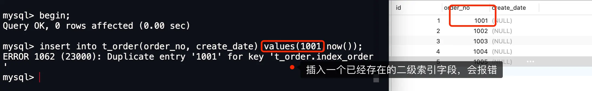

但是除了报错之外，还做一个很重要的事情，就是对 order_no 值为 1001 这条记录加上了 S 型的 next-key 锁：
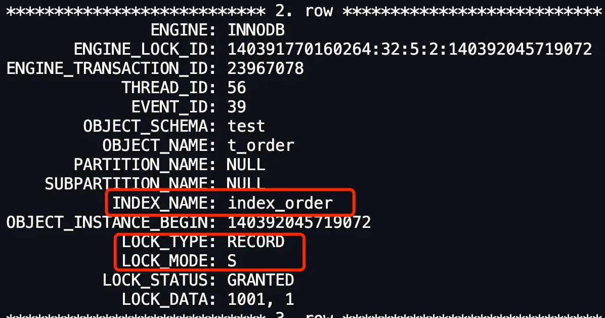

index_order 二级索引加了 S 型的 next-key 锁，范围是 (-∞, 1001]。

此时，事务 B 执行了 select * from t_order where order_no = 1001 for update; 就会阻塞，因为这条语句想加 X 型的锁，是与 S 型的锁是冲突的，所以就会被阻塞：
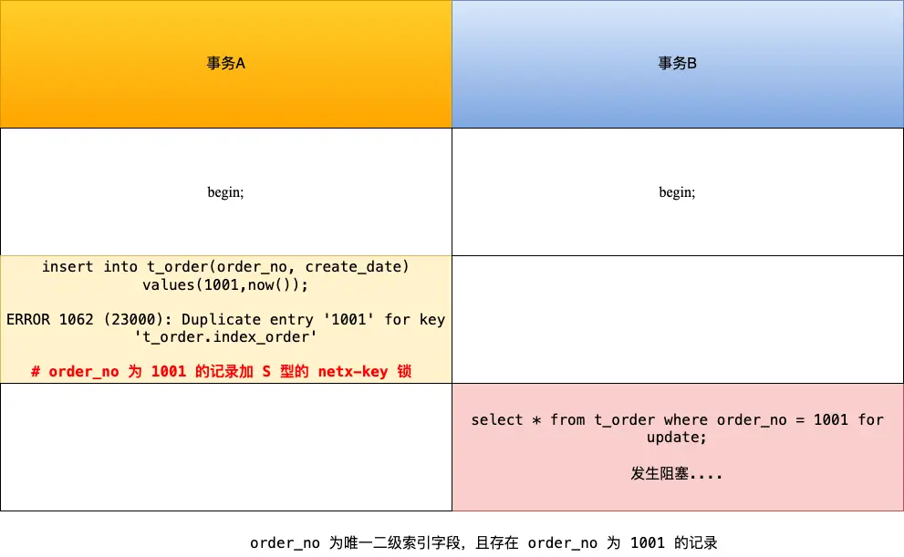

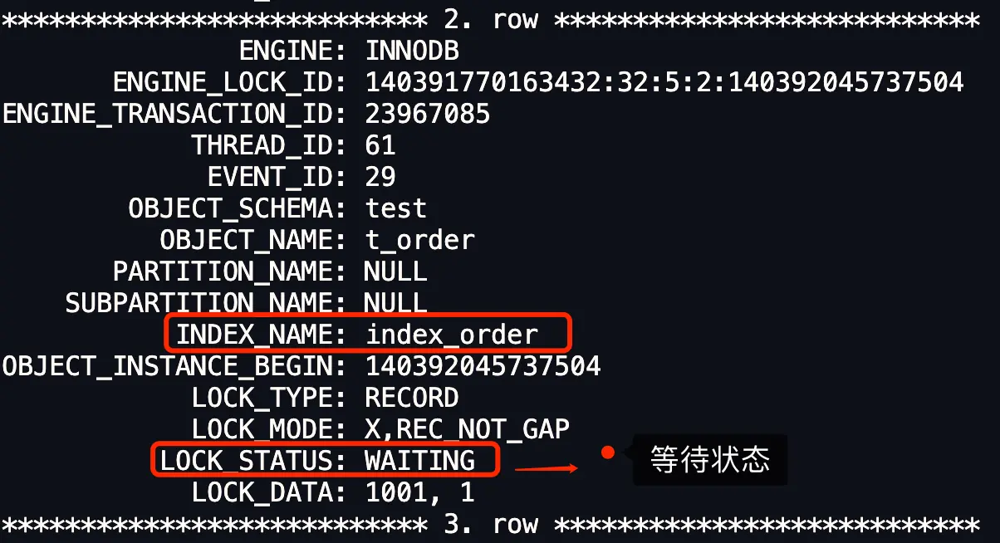
事务 B 的状态（LOCK_STATUS）是等待状态，加锁的类型 X 型的记录锁（LOCK_MODE: X,REC_NOT_GAP）。
#### 两个事务执行了相同的 insert 语句

现在 t_order 表中，只有这些数据，order_no 为唯一二级索引：


在隔离级别可重复读的情况下，开启两个事务，前后执行相同的 Insert 语句，此时事务 B 的 Insert 语句会发生阻塞：
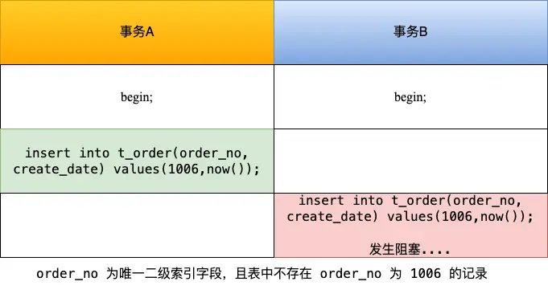

两个事务的加锁过程：

- 事务 A 先插入 order_no 为 1006 的记录，可以插入成功，**此时对应的唯一二级索引记录被「隐式锁」保护，此时还没有实际的锁结构**（执行完这里的时候，查 performance_schema.data_locks 信息，可以看到这条记录是没有加任何锁的）；
- 接着，事务 B 也插入 order_no 为 1006 的记录，由于事务 A 已经插入 order_no 值为 1006 的记录，所以事务 B 在插入二级索引记录时会遇到重复的唯一二级索引列值，此时事务 B 想获取一个 S 型 next-key 锁，但是事务 A 并未提交，事务 A 插入的 order_no 值为 1006 的记录上的「隐式锁」会变「显示锁」且锁类型为 X 型的记录锁，所以事务 B 向获取 S 型 next-key 锁时会遇到锁冲突，事务 B 进入阻塞状态。

事务 A 对 order_no 为 1006 记录加上了类型为 **X 型的记录锁**（注意，这个是在执行事务 B 之后才产生的锁，没执行事务 B 之前，该记录还是隐式锁）：
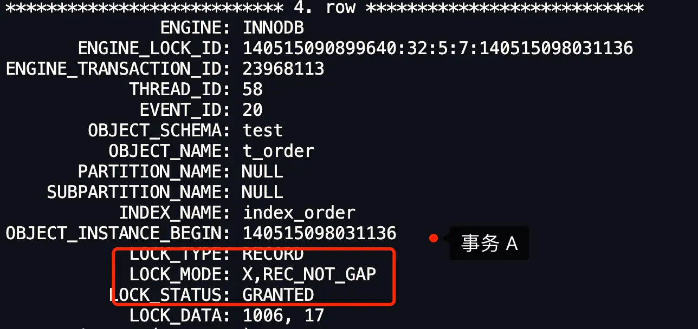

事务 B 想对 order_no 为 1006 的记录加 S 型的 next-key 锁，但是由于事务 A 在该记录上持有了 **X 型的记录锁**，这两个锁是冲突的，所以导致事务 B 处于等待状态：
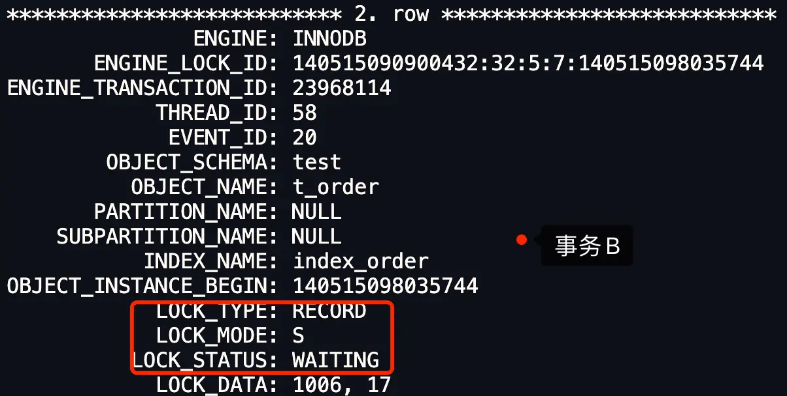

并发多个事务的时候，第一个事务插入的记录，并不会加锁，而是会用隐式锁保护唯一二级索引的记录。

但是当第一个事务还未提交的时候，有其他事务插入了与第一个事务相同的记录，**第二个事务就会被阻塞，因为此时第一事务插入的记录中的隐式锁会变为显示锁且类型是 X 型的记录锁，而第二个事务是想对该记录加上 S 型的 next-key 锁**，X 型与 S 型的锁是冲突的，所以导致第二个事务会等待，直到第一个事务提交后，释放了锁。
## 如何避免死锁

死锁的四个必要条件：**互斥、占有且等待、不可强占用、循环等待**。只要系统发生死锁，这些条件必然成立，但是只要破坏任意一个条件就死锁就不会成立。

在数据库层面，有两种策略通过「打破循环等待条件」来解除死锁状态：

- **设置事务等待锁的超时时间**。当一个事务的等待时间超过该值后，就对这个事务进行回滚，于是锁就释放了，另一个事务就可以继续执行了。在 InnoDB 中，参数 `innodb_lock_wait_timeout` 是用来设置超时时间的，默认值时 50 秒。

当发生超时后，就出现下面这个提示：


- **开启主动死锁检测**。主动死锁检测在发现死锁后，主动回滚死锁链条中的某一个事务，让其他事务得以继续执行。将参数 `innodb_deadlock_detect` 设置为 on，表示开启这个逻辑，默认就开启。

当检测到死锁后，就会出现下面这个提示：


