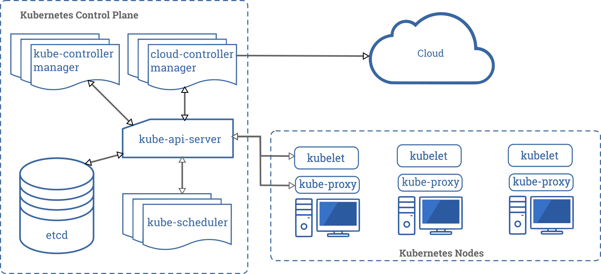

## 控制平面组件（Control Plane Components）

控制平面的组件对集群做出全局决策(比如调度)，以及检测和响应集群事件（例如，当不满足部署的 `replicas` 字段时，启动新的 [pod ](https://kubernetes.io/docs/concepts/workloads/pods/pod-overview/)）。

控制平面组件可以在集群中的任何节点上运行。然而，为了简单起见，设置脚本通常会在同一个计算机上启动所有控制平面组件，并且不会在此计算机上运行用户容器。请参阅[构建高可用性集群](https://kubernetes.io/docs/admin/high-availability/)中对于多主机 VM 的设置示例。

### kube-apiserver

主节点上负责提供 Kubernetes API 服务的组件；它是 Kubernetes 控制面的前端。

### etcd

etcd 是兼具一致性和高可用性的键值数据库，可以作为保存 Kubernetes 所有集群数据的后台数据库。通常需要有个备份计划。

### kube-scheduler

主节点上的组件，该组件监视那些新创建的未指定运行节点的 Pod，并选择节点让 Pod 在上面运行。

调度决策考虑的因素包括单个 Pod 和 Pod 集合的资源需求、硬件/软件/策略约束、亲和性和反亲和性规范、数据位置、工作负载间的干扰和最后时限。

### kube-controller-manager

在主节点上运行[控制器 ](https://kubernetes.io/docs/admin/kube-controller-manager/)的组件。

从逻辑上讲，每个[控制器 ](https://kubernetes.io/docs/admin/kube-controller-manager/)都是一个单独的进程，但是为了降低复杂性，它们都被编译到同一个可执行文件，并在一个进程中运行。

这些控制器包括:

- 节点控制器（Node Controller）: 负责在节点出现故障时进行通知和响应。
- 副本控制器（Replication Controller）: 负责为系统中的每个副本控制器对象维护正确数量的 Pod。
- 端点控制器（Endpoints Controller）: 填充端点(Endpoints)对象(即加入 Service 与 Pod)。
- 服务帐户和令牌控制器（Service Account & Token Controllers）: 为新的命名空间创建默认帐户和 API 访问令牌。

### [云控制器管理器-(cloud-controller-manager)](https://kubernetes.io/zh/docs/concepts/overview/components/#云控制器管理器-cloud-controller-manager)

略。

## Node 组件

### kubelet

一个在集群中每个节点上运行的代理。它保证容器都运行在 Pod 中。

kubelet 接收一组通过各类机制提供给它的 PodSpecs，确保这些 PodSpecs 中描述的容器处于运行状态且健康。kubelet 不会管理不是由 Kubernetes 创建的容器。

### kube-proxy

[kube-proxy](https://kubernetes.io/docs/reference/command-line-tools-reference/kube-proxy/) 是集群中每个节点上运行的网络代理,实现 Kubernetes [Service](https://kubernetes.io/docs/concepts/services-networking/service/) 概念的一部分。

kube-proxy 维护节点上的网络规则。这些网络规则允许从集群内部或外部的网络会话与 Pod 进行网络通信。

如果操作系统提供了数据包过滤层并可用的话，kube-proxy会通过它来实现网络规则。否则，kube-proxy 仅转发流量本身。

### 容器运行环境(Container Runtime)

容器运行环境是负责运行容器的软件。

Kubernetes 支持多个容器运行环境: [Docker](http://www.docker.com)、 [containerd](https://containerd.io)、[cri-o](https://cri-o.io/)、 [rktlet](https://github.com/kubernetes-incubator/rktlet) 以及任何实现 [Kubernetes CRI (容器运行环境接口)](https://github.com/kubernetes/community/blob/master/contributors/devel/sig-node/container-runtime-interface.md)。

## 插件(Addons)

插件使用 Kubernetes 资源 ([DaemonSet ](https://kubernetes.io/docs/concepts/workloads/controllers/daemonset), [Deployment ](https://kubernetes.io/docs/concepts/workloads/controllers/deployment/)等) 实现集群功能。因为这些提供集群级别的功能，所以插件的命名空间资源属于 `kube-system` 命名空间。

所选的插件如下所述：有关可用插件的扩展列表，请参见[插件 (Addons)](https://kubernetes.io/docs/concepts/cluster-administration/addons/)。

### DNS

Cluster DNS 是一个 DNS 服务器，和您部署环境中的其他 DNS 服务器一起工作，为 Kubernetes 服务提供DNS记录。

Kubernetes 启动的容器自动将 DNS 服务器包含在 DNS 搜索中。

### 用户界面(Dashboard)

[Dashboard](https://kubernetes.io/docs/tasks/access-application-cluster/web-ui-dashboard/) 是 Kubernetes 集群的通用基于 Web 的 UI。它使用户可以管理集群中运行的应用程序以及集群本身并进行故障排除。

### 容器资源监控

[容器资源监控](https://kubernetes.io/zh/docs/tasks/debug-application-cluster/resource-usage-monitoring/)将关于容器的一些常见的时间序列度量值保存到一个集中的数据库中，并提供用于浏览这些数据的界面。

### 集群层面日志

[集群层面日志](https://kubernetes.io/zh/docs/concepts/cluster-administration/logging/) 机制负责将容器的日志数据保存到一个集中的日志存储中，该存储能够提供搜索和浏览接口。