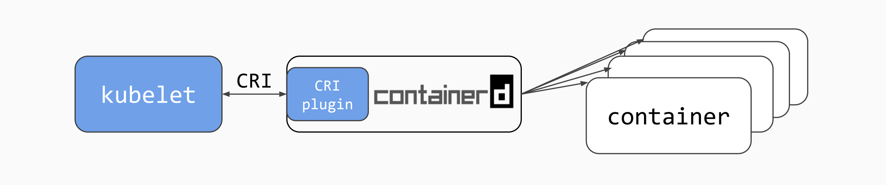

更新时间：2020-6-12

k8s+containerd+kata-containers 安装。



## 环境

主机要求， VMware Workstation：三台 CentOS7，使用 CentOS-7-x86_64-Minimal-1810.iso 镜像：

| 角色        | 主机名      | IP地址           | 要求                                |
| ----------- | ----------- | ---------------- | ----------------------------------- |
| 控制主机    | controller  | 192.168.75.5/24  | 安装 ansible ，用于协助其节点的安装 |
| k8s控制节点 | manager.k8s | 192.168.75.41/24 | 至少 2核4G，开启CPU虚拟化           |
| k8s计算节点 | node1.k8s   | 192.168.75.42/24 | 至少 2核4G，开启CPU虚拟化           |

**注意**：在下文中出现的任何 `inventory` 文件都需要自行更改 IP 地址，不再提醒。

软件版本：

- Kubernetes v1.18.3
- containerd v1.3.0 36cf5b690dcc00ff0f34ff7799209050c3d0c59a
- kata-containers v1.11.0-rc0

配置ssh免密登录：

```
[root@controller ~]# ssh-copy-id root@192.168.75.41
[root@controller ~]# ssh-copy-id root@192.168.75.42
[root@controller ~]# eval $(ssh-agent -s)
Agent pid 1849
[root@controller ~]# ssh-add
Identity added: /root/.ssh/id_rsa (/root/.ssh/id_rsa)
```

## 安装

所有的非安装包文件都可以在 [`file`](https://github.com/ignorantshr/person-blog/tree/master/docs/kata-containers/file) 目录下找到。安装包需自行下载，所要放置的位置及文件已做标记。

### kata

参考文章：https://github.com/kata-containers/documentation/blob/master/install/centos-installation-guide.md

复制 `playbooks/roles/` 、 `playbooks/install-kata.yml`、`playbooks/install-pre-k8s.yml `、`playbooks/inventory` 到 controller 的 `/usr/share/ansible/playbooks/` 目录下。

#### 联网安装

国内可能会出现访问过慢的情况。

执行：

```
[root@controller ~]# cd /usr/share/ansible/playbooks/
[root@controller playbooks]# ansible-playbook -i inventory install-kata.yml
```

#### 本地安装

可选的，你可以创建本地 yum 仓库（所需要的 RPM 包在 `rpms/kata/` 下面，或从[此页面](https://ftp.gwdg.de/pub/opensuse/repositories/home:/katacontainers:/releases:/x86_64:/master/CentOS_7/x86_64/)下载），然后修改 `install-kata.yml` 的变量为 `use_local_repo: true` ，在`roles/install-kata/defaults/main.yml`中修改 `baseurl` 成你自己的网址，然后执行上述命令。

**注意**：若你已经执行过了联网安装步骤，那么你还需要在k8s节点上面删除类似于`/etc/yum.repos.d/home:katacontainers:releases:x86_64:master.repo`的文件，再继续执行安装指令，否则仍会从互联网上下载。

#### 检验

在节点上面查看是否有`kata-runtime`命令。

### containerd

参考文章：

- https://github.com/kata-containers/documentation/blob/master/how-to/containerd-kata.md#install-kata-containers
- https://github.com/containerd/cri/blob/master/contrib/ansible/README.md

复制 `cri-ansible/` 到 controller 的任意目录，我这里复制到了`/usr/share/ansible`下面。

```
[root@controller cri-ansible]# ansible-playbook -i inventory cri-containerd.yaml
```

由于安装源被墙，所以更改了 cri-ansible 中的一些文件。

#### 检验

在节点上执行：

```
command -v containerd
```

安装好之后，`ctr`、`cri-tools`也都已经安装了。

```
ctr image pull docker.io/library/busybox:latest
ctr run  -t --rm docker.io/library/busybox:latest hello sh
```

### k8s

https://github.com/kata-containers/documentation/blob/master/how-to/run-kata-with-k8s.md

其实在安装 containerd 的时候`kubeadm`就已经安装了，这条指令的目的是打开防火墙端口及关闭 swap：

```
[root@controller ~]# cd /usr/share/ansible/playbooks/
[root@controller playbooks]# ansible-playbook -i inventory install-pre-k8s.yml
```

在节点的`/etc/hosts`文件中写入主机名与IP地址的映射：

```
127.0.0.1   localhost localhost.localdomain localhost4 localhost4.localdomain4
::1         localhost localhost.localdomain localhost6 localhost6.localdomain6

192.168.75.41 manager.k8s
192.168.75.42 node1.k8s
```

#### manager

初始化 manager 节点：

```
[root@manager ~]# firewall-cmd --add-port=6443/tcp
[root@manager ~]# firewall-cmd --runtime-to-permanent
# 初始化的速度取决于网速
# 还可以加上 --kubernetes-version=1.18.2 参数指定 k8s 的版本。
[root@manager ~]# kubeadm init --cri-socket /run/containerd/containerd.sock --pod-network-cidr=10.244.0.0/16 --image-repository registry.aliyuncs.com/google_containers
……
To start using your cluster, you need to run the following as a regular user:

# 按照提示进行操作：
  mkdir -p $HOME/.kube
  sudo cp -i /etc/kubernetes/admin.conf $HOME/.kube/config
  sudo chown $(id -u):$(id -g) $HOME/.kube/config

You should now deploy a pod network to the cluster.
Run "kubectl apply -f [podnetwork].yaml" with one of the options listed at:
  https://kubernetes.io/docs/concepts/cluster-administration/addons/

Then you can join any number of worker nodes by running the following on each as root:

kubeadm join 192.168.75.41:6443 --token 7ep11g.s1tvweyj87v7v9cd \
    --discovery-token-ca-cert-hash sha256:491f0xxxxbcf2f
```

#### node1

根据初始化 manager 节点时生成的 token 将自己加入集群

```
[root@node1 ~]# kubeadm join 192.168.75.41:6443 --token 7ep11g.s1tvweyj87v7v9cd \
    --discovery-token-ca-cert-hash sha256:491f0d296142xxxxc9bcf2f
……
Run 'kubectl get nodes' on the control-plane to see this node join the cluster.
```

#### 检验

在 manager 上面查看状态：

```
[root@manager ~]# kubectl get nodes,pods -A
NAME               STATUS   ROLES    AGE     VERSION
node/manager.k8s   Ready    master   5m29s   v1.18.3
node/node1.k8s     Ready    <none>   3m21s   v1.18.3

NAMESPACE     NAME                                      READY   STATUS    RESTARTS   AGE
kube-system   pod/coredns-7ff77c879f-cmklp              1/1     Running   0          5m8s
kube-system   pod/coredns-7ff77c879f-k8jzz              1/1     Running   0          5m8s
kube-system   pod/etcd-manager.k8s                      1/1     Running   0          5m25s
kube-system   pod/kube-apiserver-manager.k8s            1/1     Running   0          5m25s
kube-system   pod/kube-controller-manager-manager.k8s   1/1     Running   0          5m25s
kube-system   pod/kube-proxy-6nkc7                      1/1     Running   0          5m8s
kube-system   pod/kube-proxy-6stqw                      1/1     Running   0          3m20s
kube-system   pod/kube-scheduler-manager.k8s            1/1     Running   0          5m25s
```

<br/>

k8s 使用教程可以参考：

- https://kuboard.cn/learning/
- https://kubernetes.io/zh/docs/home/
- https://kubernetes.io/docs/home/

#### 安装 dashboard （可选）

参考：

- https://github.com/kubernetes/dashboard
- https://github.com/kubernetes/dashboard/blob/master/docs/user/access-control/creating-sample-user.md

```
[root@manager yml]# curl -k https://raw.githubusercontent.com/kubernetes/dashboard/v2.0.1/aio/deploy/recommended.yaml -o dashboard-recommended.yaml
```

如果下载失败，应该是域名被污染，去 https://www.ipaddress.com/search/ 网站查询其 IP 地址并写入到 `/etc/hosts` 文件中再次下载。

下载完成后修改服务端口：

```yml
kind: Service
apiVersion: v1
metadata:
  labels:
    k8s-app: kubernetes-dashboard
  name: kubernetes-dashboard
  namespace: kubernetes-dashboard
spec:
  ports:
    - port: 443
      # 这里
      nodePort: 30002
      targetPort: 8443
  # 这里
  type: NodePort
  selector:
    k8s-app: kubernetes-dashboard
```

或者直接从`yml`文件夹拿过来应用。

加上从`yml`下获取的`dashboard-adminuser.yaml`应用：

```
[root@manager yml]# kubectl apply -f dashboard-recommended.yaml -f dashboard-adminuser.yaml
```

获取用户 token：

```
[root@manager yml]# kubectl -n kubernetes-dashboard describe secret $(kubectl -n kubernetes-dashboard get secret | grep admin-user | awk '{print $1}')
Name:         admin-user-token-cbxtj
Namespace:    kubernetes-dashboard
Labels:       <none>
Annotations:  kubernetes.io/service-account.name: admin-user
              kubernetes.io/service-account.uid: c397203d-2210-4e74-94cc-95f3512324ec

Type:  kubernetes.io/service-account-token

Data
====
ca.crt:     1025 bytes
namespace:  20 bytes
token:      eyJhbGciOiJSUzI1NiIsImtpZCI6InZhbjdWZzViMWE4a1lDSkRNdzkzcmpZLVJOVGpmbEZ1Ulp2a1BXQkx5UVkifQ.eyJpc3MiOiJrdWJlcm5ldGVzL3NlcnZpY2VhY2NvdW50Iiwia3ViZXJuZXRlcy5pby9zZXJ2aWNlYWNjb3VudC9uYW1lc3BhY2UiOiJrdWJlcm5ldGVzLWRhc2hib2FyZCIsImt1YmVybmV0ZXMuaW8vc2VydmljZWFjY291bnQvc2VjcmV0Lm5hbWUiOiJhZG1pbi11c2VyLXRva2VuLWNieHRqIiwia3ViZXJuZXRlcy5pby9zZXJ2aWNlYWNjb3VudC9zZXJ2aWNlLWFjY291bnQubmFtZSI6ImFkbWluLXVzZXIiLCJrdWJlcm5ldGVzLmlvL3NlcnZpY2VhY2NvdW50L3NlcnZpY2UtYWNjb3VudC51aWQiOiJjMzk3MjAzZC0yMjEwLTRlNzQtOTRjYy05NWYzNTEyMzI0ZWMiLCJzdWIiOiJzeXN0ZW06c2VydmljZWFjY291bnQ6a3ViZXJuZXRlcy1kYXNoYm9hcmQ6YWRtaW4tdXNlciJ9.iWlKTwhNVAHsRiKQ8pDqtPWOShdFo-QVxEVc-iXNUMuId53TT5jLABOAZmC7i002QnqCJ9bx5Y8pZ8cpBWnlyE67h77dWr4poYqbGDLFz4y0QgiFTKRRyByiQ-YzyF8CHsdH6cpWcBIkGnqrMvOdRjXw_aDYTQ3eYR4LXSnCsa95btKbRg4iM3ivZVcJSbZg86K8irRqppFLbRZT9Uo39scY10AZrFYAnTRomN-55sFkMEYbtvk2oh9XbTz8kd0yjr4yG_vXmF0ZRoDpOCObRpQ9f48ViMcOieV9EwgQDoGVmbraM8ZHqI_3LR4pVLbWGh-F333IlsfbX5NnerLnzw
```

打开计算节点防火墙端口：

```
[root@node1 ~]# firewall-cmd --add-port=30002/tcp
[root@node1 ~]# firewall-cmd --runtime-to-permanent
```

然后从计算节点访问：https://192.168.75.42:30002/

## 使用 kata 作为 runtime

### 创建 RuntimeClass

参考文章：https://kubernetes.io/docs/concepts/containers/runtime-class/#cri-configuration

```yml
[root@manager yml]# cat runtimeclass.yml
apiVersion: node.k8s.io/v1beta1  # RuntimeClass is defined in the node.k8s.io API group
kind: RuntimeClass
metadata:
  name: kataclass  # The name the RuntimeClass will be referenced by
  # RuntimeClass is a non-namespaced resource
handler: kata  # The name of the corresponding CRI configuration
```

```
[root@manager yml]# kubectl apply -f runtimeclass.yml
```

### 使用

需要在 pod 中指定 runtimeclass：

```yml
[root@manager yml]# cat nginx-deployment.yml
apiVersion: apps/v1
kind: Deployment
metadata:
  name: nginx-deployment
spec:
  replicas: 3
  selector:
    matchLabels:
      test: nginx
  template:
    metadata:
      labels:
        test: nginx
    spec:
      runtimeClassName: kataclass
      containers:
      - name: nginx
        image: nginx
```

```
[root@manager yml]# kubectl apply -f nginx-deployment.yml
```

打开一个 pod 看看是否使用了 kata：

```
[root@manager yml]# kubectl exec nginx-deployment-6f65964f7d-jkb89 -it -- /bin/bash
root@nginx-deployment-6f65964f7d-jkb89:/# uname -a
Linux nginx-deployment-6f65964f7d-jkb89 5.4.32-62.2.container #1 SMP Thu Jan 1 00:00:00 UTC 1970 x86_64 GNU/Linux
```

看到`.container`即为成功使用！

也可以在计算节点上面查看进程信息：

```
[root@node1 ~]# ps -ef | grep kata
root      13809      1  0 00:35 ?        00:00:03 /usr/bin/containerd-shim-kata-v2 -namespace k8s.io -address /run/containerd/containerd.sock -publish-binary /usr/local/bin/containerd -id 2415e1bffd9fe0fe0ab088bd64c510572311393b21ddfa63e31f73ade7102ffe
……
```

