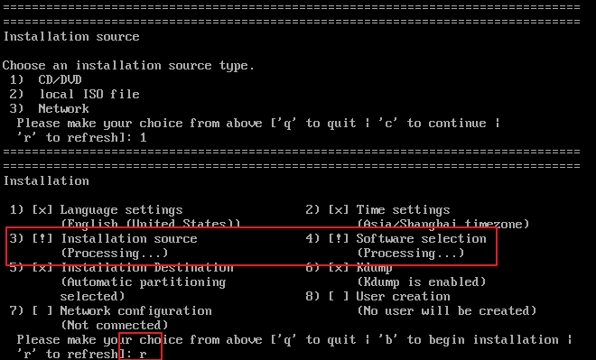
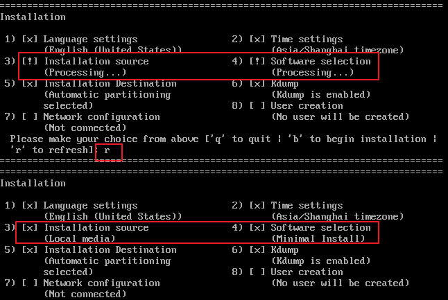

自动化安装`centos7`时，如果有多个磁盘存在，会自动地把系统装在多个磁盘上面，此时入股需要手动选择磁盘，则需要在`.cfg`文件中加入以下语句：

```shell
#交互式的选择磁盘
#ignoredisk --only-use=sda
ignoredisk --interactive
#注释掉自动分区
#autopart --type=lvm
```

修改完成后，安装时会出现一个bug，就是选择完磁盘之后，会出现**软件选择无法检测**的情况。此时需要重新选择安装源或软件选择或执行刷新操作，总之就是要全部选择才可以继续安装。

1.此时就需要**重新选择安装源**，如下图所示：


2.选择之后，执行刷新操作：



3.刷新之后变为下图所示，选择软件之后继续：


4.然后可能会变为下图所示，此时继续刷新，直到两者都选中为止：




