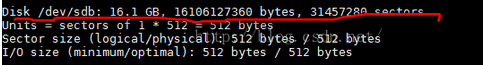
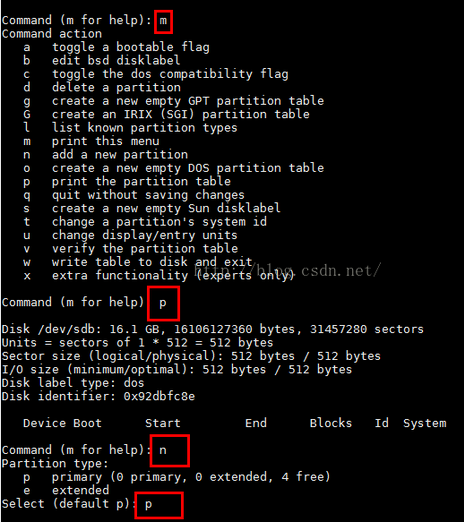
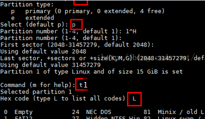
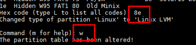

[TOC]

# VMware添加新磁盘
## 不重启识别磁盘

```shell
# 哪个输出mptspi，那个就是识别磁盘的host
grep mpt /sys/class/scsi_host/host0/proc_name
grep mpt /sys/class/scsi_host/host1/proc_name
grep mpt /sys/class/scsi_host/host2/proc_name
```

或者执行：

```shell
# 查看是哪台host
ll /sys/class/scsi_disk/
```

假设是host2，最后执行：

```shell
echo "- - -" > /sys/class/scsi_host/host2/scan
```

## 查看磁盘信息
```shell
fdisk -l
```


- 如果想直接使用磁盘，参见下方的**2. 直接使用磁盘**
- 如果想对现有磁盘进行扩容，参见下方的**3. 磁盘扩容**。

# 直接使用磁盘

## 格式化磁盘

```shell
mkfs.xfs /dev/sdb
```

## 挂载磁盘

```shell
# 创建挂载目录
mkdir -p /disk/sdb
# 临时挂载，重启之后无效
mount /dev/sdb /disk/sdb/
# 在/etc/fstab中添加一行，永久有效
/dev/sdb /disk/sdb xfs defaults 0 0
```

然后就可以在挂载点进行文件操作了。

# 磁盘扩容

## 对新盘进行分区

这里最好使用`gdisk`来进行分区操作。

```shell
fdisk /dev/sdb
```






## 创建物理卷pv
```shell
pvcreate /dev/sdb1
```
查看创建的物理卷
```shell
pvdisplay
```


至此，有以下*扩容逻辑卷*和*新建逻辑卷*两种操作。

## 扩容逻辑卷

### 扩展卷组vg

```shell
# 列出存在的卷组，找到卷组名
vgdisplay
# 将pv添加到要扩展逻辑卷所在的卷组
# cl:要扩展的卷组名
vgextend cl /dev/sdb1
```

`vgextend`可能会报出`Couldn't create temporary archive name`的错误，这是因为原来的逻辑卷实在太小了，此时需要删除一些东西即可继续扩容。

如果发现扩展卷组时错误地将物理卷pv扩展到了其他卷组vg上，此时可执行`vgreduce <VolumeGroupName> /dev/sbd1`将其移除，然后再从新扩展。

> vgreduce - Remove physical volume(s) from a volume group
>
> vgremove - Remove volume group(s)

### 扩容逻辑卷lv

```shell
# /dev/mapper/cl-root是要扩展逻辑卷
lvextend –L +15G /dev/mapper/cl-root
```

如果出现了`couldn't create temporary archive name.`的错误，那么是磁盘空间被填满了，此时删除一些文件即可。

### 在线调整xfs格式文件系统大小

此时通过`df -h`还不能看到扩充的容量，执行下面的命令即可：

```shell
xfs_growfs /dev/mapper/cl-root
df -h
```

## 新建逻辑卷

### 新建卷组vg

```shell
vgcreate bc /dev/sdb1
```

### 新建逻辑卷lv

直接新建逻辑卷，不创建逻辑卷池。

```shell
lvcreate 8G bc -n bc_lv1
```

### 创建逻辑卷池

参考：[创建精简分配的逻辑卷及扩容](https://www.linuxtechi.com/thin-provisioned-logical-volumes-centos-7-rhel-7/)