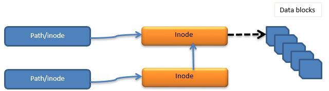
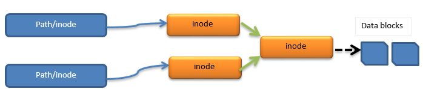

[TOC]

## 区别

| 说明       | 硬链接，Link（ln）                                           | 软/符号链接，Soft/Symbolic link（symlink）                   |
| ---------- | ------------------------------------------------------------ | ------------------------------------------------------------ |
| 创建       | 不能对目录使用，不能跨filesystem。不会新建一个文件，不占用磁盘容量（非常小），不占用inode号、block号 | 可以创建文件夹或文件的软链接。会新建一个文件，会占用磁盘容量，会占用inode号、block号 |
| inode[^1]  | 新旧文件的`inode`号码相同                                    | 新旧文件的`inode`号码不同                                    |
| 权限       | 有相同的权限                                                 | 新文件权限是`lrwxrwxrwx`                                     |
| 链接数[^2] | 每个文件（包括以前创建的硬连接文件）的链接数都会加`1`        | 旧文件的连接数不会发生变化，新文件的连接数是1                |
| chmod      | `chmod`命令会对两者造成相同的影响                            | 即使你修改了新文件的权限，它也不会被改变                     |
| 大小       | 两者有相同的大小                                             | 新文件只包含**路径**和**inode**号码，其大小与链接的字符数量相同 |
| rm         | `rm`命令不会互相影响对方                                     | 删除旧文件将使新文件不可用                                   |
| 修改       | 改变一者将会改变另一个                                       | 与硬链接相同                                                 |

## 示意图

### Soft-link

新文件的`inode`号码指向旧文件的。



### Hard-link

新旧文件都指向同一个`inode`号码。


### Symbolic-link

在一些Unix/Linux中符号链接和软链接被同等对待。但不同在于：新旧文件会指向同一个新的`inode`号码。这完全取决于实现。



!!! note
	在许多情况下，符号和软链接术语可互换使用。但是必须知道什么时候使用什么。

[^1]: inode编号是 Linux/unix 操作系统中创建的任何文件时生成的唯一索引编号。但是在链接的情况下，这些inode编号是由文件共享的，并且只在文件表中更新路径。可以通过`ls -i`查看，第一列即是inode编号。
[^2]:链接数指的是有多少文件名链接到这个inode。

## 创建

使用`ln`命令，默认是硬链接。

### 创建硬链接

```shell
$ ln hard_src.txt hard_dst.txt
$ ll -i
10923 -rw-r--r-- 2 root root 9 Jun  4 14:50 hard_dst.txt
10923 -rw-r--r-- 2 root root 9 Jun  4 14:50 hard_src.txt
```

### 创建软/符号链接

`ln -s`，也可以为**文件夹**创建软链接。

```shell
$ ln -s src/ dst
$ ll -i
    10924 lrwxrwxrwx 1 root root 4 Jun  4 14:53 dst -> src/
107576244 drwxr-xr-x 2 root root 6 Jun  4 14:52 src

# 与上述写法的效果是一样的，区别在于链接的指向显示不带“/”
$ ln -s src dst
$ ll -i
    10924 lrwxrwxrwx 1 root root 3 Jun  4 15:05 dst -> src
107576244 drwxr-xr-x 2 root root 6 Jun  4 15:03 src
```

在文件夹中的文件会在两者之间同步。


!!! warning  "文件夹的软链接的删除"
	与普通的文件夹删除不一样，如果使用带有斜杠`/`的命令:`rm -rf dst/`，不会删除该链接，而是删除文件夹下的所有文件。
	此时应使用不带有斜杠`/`的命令：`rm -rf dst`

## 目录的链接数

新建一个目录，会发现其链接数是`2`：

```bash
[user1@dev work-together]$ ll -d ../work-together/
drwxrws--- 3 root projects 81 Sep 26 14:50 ../work-together/
[user1@dev work-together]$ mkdir d1
[user1@dev work-together]$ ll -id d1
110662374 drwxrwsr-x 2 user1 projects 6 Sep 26 14:47 d1
[user1@dev work-together]$ ll -d ../work-together/
drwxrws--- 4 root projects 91 Sep 26 14:50 ../work-together/
```

这是因为`d1`与`d1/.`指向的都是该目录，所以链接数是2。同理，`d1/..`指向的`d1`的父目录也会增加一个链接数。

