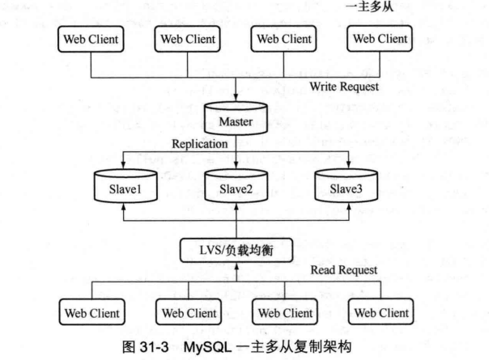
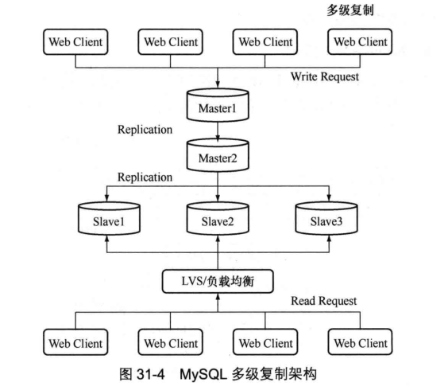
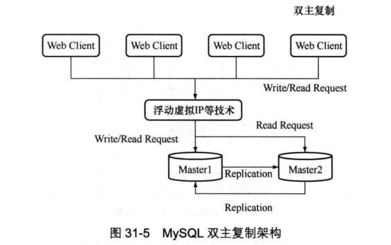
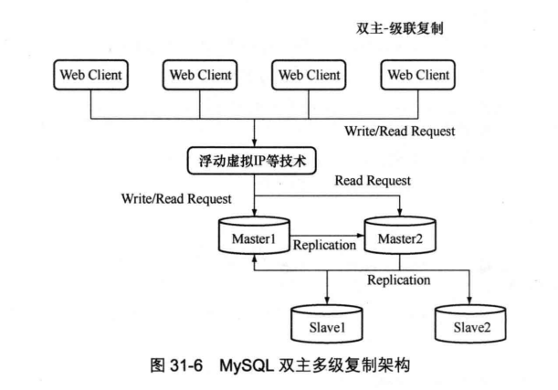
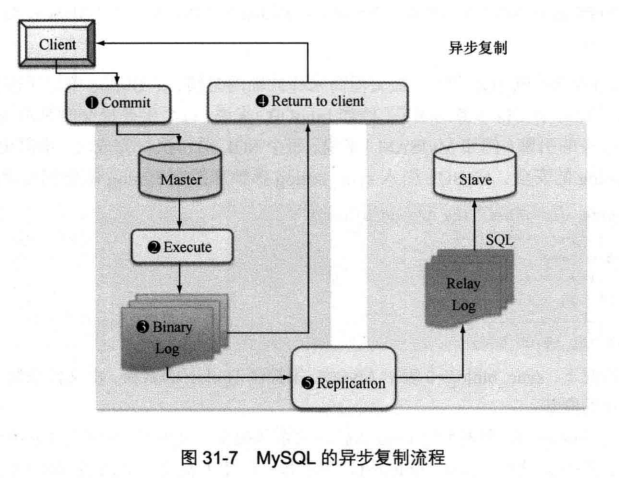
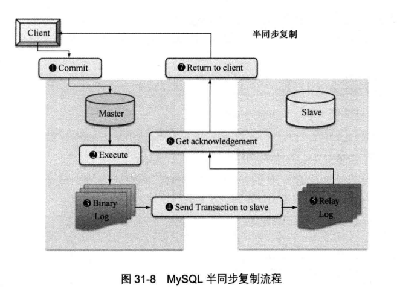

复制是指将主数据库的 DDL 和 DML 操作通过二进制日志传到复制服务器（也叫从服务器）上重新执行。

MySQL 支持一台主服务器同时向多台从服务器进行复制，从服务器同时也可以作为其他服务器的主服务器，实现链状的复制。 

优点 ：

- 如果主服务器出现问题，可以快速切换到从服务器提供服务。
- 可以在从服务器上执行查询操作，降低主服务器的访问压力。更新不频繁和对实时性要求不高数据才可。
- 可以在从服务器上执行备份，以避免备份期间影响主服务器的服务 。

## 原理

MySQL通过三个线程完成主从复制：主库上的`Binlog Dump`线程，从库上的`I/O`线程和`SQL`线程。当在从库上启动复制时（START SLAVE），首先创建I/O线程连接主库，主库再创建Binlog Dump线程读取数据库事件并**发送**给I/O线程，I/O线程获取到事件数据之后更新到从库的中继日志`Relay Log`中去，之后从库上的SQL线程读取中继日志中更新的数据库事件并应用。


查看[binglog](31. MySQL 日志.md#二进制日志 )的格式：

```MySQL
mysql> SHOW VARIABLES LIKE 'binlog_format';
+---------------+-------+
| Variable_name | Value |
+---------------+-------+
| binlog_format | ROW   |
+---------------+-------+
```

RAW格式的日志会经过编码存储，查看时可解码查看：

```bash
$ mysqlbinlog /var/lib/mysql/binlog.000033
...
BINLOG '
bhpLXQ8BAAAAeAAAAHwAAAAAAAQAOC4wLjE2AAAAAAAAAAAAAAAAAAAAAAAAAAAAAAAAAAAAAAAA
AAAAAAAAAAAAAAAAAABuGktdEwANAAgAAAAABAAEAAAAYAAEGggAAAAICAgCAAAACgoKKioAEjQA
CgGju2nB
...

$ mysqlbinlog -vv bin.000033 --base64-output=DECODE-ROWS
```

更改改值：

```MySQL
-- 三种可选值：STATMENT, ROW, MIXED
mysql> SET GLOBAL BINLOG_FORMAT='MIXED';
```

## 三种常见架构

### 一主多从架构

适用于主库读取压力非常大且读请求对实时性要求不高的场景。



### 多级复制架构

在一主多从的架构下，主库的I/O压力和网络压力会随着从库的增加而增长（每个从库都会在主库上有一个独立的Binlog Dump线程来推送日志到从库），多级复制解决了这个问题。



Master1只给Master2（需要打开`--log-slave-updates` 选项）推送日志，减轻其推送压力；但是推送延时会比一主多从大。

降低延时的方法：

​		将Master2的表引擎选为`BLACKHOLE`来降低多级复制延时。写入该引擎的数据不会回写到磁盘上，表永远都是一个空表，插入、更新和删除操作只在Binlog中记录事件。

### 双主复制/Dual Master架构

该架构适合DBA做维护等需要主从切换的场景，避免了重复搭建从库的麻烦。



两者互为主从，写请求访问Master1，读请求可访问两者。

避免影响服务的维护操作步骤：

1. 停止Master1的slave线程，避免对Master2维护时影响Master1；
2. 停止Master2的slave线程，暂停接收Master1的更新，开始维护操作；
3. 在Master2的操作完成之后，打开Master2的slave线程，同步Master1的数据到Master2，同步完成之后，将应用的**读写**操作切换到Master2上面；
4. 确认Master1无应用访问之后，打开Master1的slave线程，同步数据，同步完成之后就可以继续响应读请求了。


该架构还可以与主从架构结合使用：



MySQL的Binlog记录的是事件初始发生的server id，在复制时只应用和自己server id不同的Binlog日志，所以不会发生循环复制的情况

## 异步复制实践

[官网异步复制过程](https://dev.mysql.com/doc/refman/8.0/en/replication-howto.html)

下面是MySQL8.0的异步复制实践过程：

1. master：添加用于复制的用户（[这一步参考博客](https://blog.csdn.net/wawa8899/article/details/86689618)不使用插件创建用户，否则会报错）

```MySQL
mysql> CREATE USER copy_user IDENTIFIED WITH 'mysql_native_password' BY 'xxx';
mysql> GRANT REPLICATION SLAVE ON *.* TO 'copy_user';
```

2. master：设置`--server-id=1`环境变量，重启服务

```bash
$ systemctl set-environment MYSQLD_OPTS="--server-id=1"
$ systemctl restart mysqld
```

3. master：设置读锁定有效，获取二进制文件位置

```MySQL
mysql> FLUSH TABLES WITH READ LOCK;
mysql> SHOW MASTER STATUS;
+---------------+----------+--------------+------------------+-------------------+
| File          | Position | Binlog_Do_DB | Binlog_Ignore_DB | Executed_Gtid_Set |
+---------------+----------+--------------+------------------+-------------------+
| binlog.000044 |      155 |              |                  |                   |
+---------------+----------+--------------+------------------+-------------------+
```

4. master：使用`mysqldump`复制数据，可以使用其它多种方式复制数据。注意：如果主从数据库版本不一致，最好不要复制全部的数据库，因为这会把权限表也复制过去，导致从数据库无法启动。

```bash
$ mysqldump -u root -p --databases blog > blog-dump.log
```

5. master：解除锁定

```MySQL
mysql> UNLOCK TABLES;
```

6. slave：读取数据

```bash
$ /home/mysql2/mysql/bin/mysql --defaults-file=/home/mysql2/mysql/my.cnf -uroot -p < blog-dump.log
```

7. slave：MySQL服务添加`--server-id`选项，该值必须唯一（相对于其他从数据库来说）且和master的不同；添加`--skip-slave-start`选项，暂停服务器的复制进程：

```bash
$ /home/mysql2/mysql/bin/mysqld_safe  --defaults-file=/home/mysql2/mysql/my.cnf --server-id=2 --skip-slave-start --user=mysql2 &
```

8. slave：指定master的配置：

```MySQL
mysql> CHANGE MASTER TO MASTER_HOST='192.168.17.10', MASTER_PORT=3306, MASTER_USER='copy_user', MASTER_PASSWORD='MyPass3#', MASTER_LOG_FILE='binlog.000044', MASTER_LOG_POS=155;

mysql> START SLAVE;

-- 列出进程状态
mysql> SHOW PROCESSLIST ;
-- Connecting to master是异常状态
+----+-----------------+-----------+------+---------+------+--------------------------------------------------------+------------------+
| Id | User            | Host      | db   | Command | Time | State                                                  | Info             |
+----+-----------------+-----------+------+---------+------+--------------------------------------------------------+------------------+
|  6 | event_scheduler | localhost | NULL | Daemon  | 1073 | Waiting on empty queue                                 | NULL             |
| 16 | root            | localhost | blog | Query   |    0 | starting                                               | SHOW PROCESSLIST |
| 17 | system user     |           | NULL | Connect |    7 | Connecting to master                                   | NULL             |
| 18 | system user     |           | NULL | Query   |    7 | Slave has read all relay log; waiting for more updates | NULL             |
+----+-----------------+-----------+------+---------+------+--------------------------------------------------------+------------------+
```

9. 可通过执行以下语句查看slave连接master失败的原因：

```MySQL
mysql> SHOW SLAVE STATUS \G;
                Last_IO_Errno: 2061
-- 密码插件导致的无法验证，好像是个bug
                Last_IO_Error: error connecting to master 'copy_user@192.168.17.10:3306' - retry-time: 60 retries: 2 message: Authentication plugin 'caching_sha2_password' reported error: Authentication requires secure connection.
               Last_SQL_Errno: 0
               Last_SQL_Error
```

10. 出现下面的错误时，可以查找是否是网络、防火墙等问题

```
Last_IO_Error: error connecting to master 'copy_user@192.168.17.10:3306' - retry-time: 60 retries: 2 message: Can't connect to MySQL server on '192.168.17.10' (113)
```

11. slave：正常状态

```MySQL
mysql> SHOW PROCESSLIST ;
+----+-----------------+-----------+------+---------+------+--------------------------------------------------------+------------------+
| Id | User            | Host      | db   | Command | Time | State                                                  | Info             |
+----+-----------------+-----------+------+---------+------+--------------------------------------------------------+------------------+
|  6 | event_scheduler | localhost | NULL | Daemon  | 1480 | Waiting on empty queue                                 | NULL             |
| 16 | root            | localhost | blog | Query   |    0 | starting                                               | SHOW PROCESSLIST |
| 17 | system user     |           | NULL | Connect |  414 | Waiting for master to send event                       | NULL             |
| 18 | system user     |           | NULL | Query   |  234 | Slave has read all relay log; waiting for more updates | NULL             |
+----+-----------------+-----------+------+---------+------+--------------------------------------------------------+------------------+
```

12. master：正常状态

```MySQL
mysql> SHOW PROCESSLIST ;
+----+-----------------+---------------------+------+-------------+------+---------------------------------------------------------------+------------------+
| Id | User            | Host                | db   | Command     | Time | State                                                         | Info             |
+----+-----------------+---------------------+------+-------------+------+---------------------------------------------------------------+------------------+
|  4 | event_scheduler | localhost           | NULL | Daemon      | 4714 | Waiting on empty queue                                        | NULL             |
|  8 | root            | localhost           | blog | Query       |    0 | starting                                                      | SHOW PROCESSLIST |
| 14 | copy_user       | 192.168.17.11:46538 | NULL | Binlog Dump |  309 | Master has sent all binlog to slave; waiting for more updates | NULL             |
+----+-----------------+---------------------+------+-------------+------+---------------------------------------------------------------+------------------+
```

此时已经异步复制配置完成，可以在master上面执行更新操作来验证是否会同步到slave（会有延迟）。

## 半同步复制实践

MySQL5.5之前是异步复制，是没有此机制的。

异步复制存在的隐患：主库上写一个事务并提交成功，但是从库尚未获取，此时主库宕机造成了该事务的Binlog丢失，从库就会损失该事务，造成主从不一致。

异步复制流程：



半同步复制流程：



半同步复制：主库在每次事务提交成功时，先等待其中一个从库接收到Binlog并成功写入到中继日志后，主库才返回Commit操作给客户端。

如果在步骤4连接不上从库，主库会等待一会儿（[rpl_semi_sync_master_timeout](https://dev.mysql.com/doc/refman/8.0/en/replication-options-master.html#sysvar_rpl_semi_sync_master_timeout)变量，单位：毫秒），若超时，自动调整为异步复制模式；从库后来正常连接时，又会自动切换为半同步模式。

[实践步骤](https://dev.mysql.com/doc/refman/8.0/en/replication-semisync-installation.html)：

1. 判断MySQL是否支持动态增加插件

```MySQL
mysql> SELECT @@have_dynamic_loading;
+------------------------+
| @@have_dynamic_loading |
+------------------------+
| YES                    |
+------------------------+
```

2. 检查安装目录是否存在半同步复制插件

```bash
# 包管理器安装路径
/usr/lib64/mysql/plugin/semisync_master.so
/usr/lib64/mysql/plugin/semisync_slave.so

# 二进制包安装路径
/home/mysql2/mysql-8.0.17-el7-x86_64/lib/plugin/semisync_master.so
/home/mysql2/mysql-8.0.17-el7-x86_64/lib/plugin/semisync_slave.so
```

3. 安装插件

```MySQL
# 主库
mysql> INSTALL PLUGIN rpl_semi_sync_master SONAME 'semisync_master.so';
mysql>  SELECT * FROM mysql.plugin;
+----------------------+--------------------+
| name                 | dl                 |
+----------------------+--------------------+
| rpl_semi_sync_master | semisync_master.so |
+----------------------+--------------------+

#从库
mysql> INSTALL PLUGIN rpl_semi_sync_slave SONAME 'semisync_slave.so';
mysql> SELECT * FROM mysql.plugin;
+---------------------+-------------------+
| name                | dl                |
+---------------------+-------------------+
| rpl_semi_sync_slave | semisync_slave.so |
+---------------------+-------------------+
```

4. 打开半同步配置

```MySQL
# 主库
mysql> SET GLOBAL rpl_semi_sync_master_enabled=ON;
mysql> SET GLOBAL rpl_semi_sync_master_timeout=30000;

# 从库
mysql> SET GLOBAL rpl_semi_sync_slave_enabled=ON;
```

4. 也可以在`my.cnf`中配置，这样在每次数据库重启时就不必手动开启了：

```mysql
# master
[mysqld]
rpl_semi_sync_master_enabled=1
rpl_semi_sync_master_timeout=1000 # 1 second

# slave
[mysqld]
rpl_semi_sync_slave_enabled=1
```

5. 若之前是异步复制，则需要重启从库的I/O线程

```MySQL
mysql> STOP SLAVE IO_THREAD; START SLAVE IO_THREAD;
```

6. 在主库上检查状态

```MySQL
mysql> SHOW VARIABLES LIKE '%SEMI%';
mysql> SHOW STATUS LIKE '%SEMI%';
```

需要观察的是这些值的变化，而不是初始值。

着重关注以下三个值：

- `Rpl_semi_sync_master_status`：半同步模式的状态
- `Rpl_semi_sync_master_yes_tx`：表示有几个事务是通过此机制同步的
- `Rpl_semi_sync_master_no_tx`：表示有几个事务不是在该模式下同步的

## 主要复制启动选项 

和复制有关的常用启动选项。

### --log-slave-updates 

master的选项。用来配置从服务器上的更新操作是否写二进制日志，MySQL>= 8.0.3的默认值是`ON`，MySQL<= 8.0.2的默认值是`OFF`。

但是，如果这个从服务器同时也要作为其他服务器的主服务器，搭建一个链式的复制，那么就需要打开这个选项。

```
A -> B -> C
```

可以使用[`--skip-log-bin`](https://dev.mysql.com/doc/refman/8.0/en/replication-options-binary-log.html#option_mysqld_log-bin)关闭master二进制日志，此时默认也会关闭slave的二进制日志。如果想要禁用slave更新binlog日志而启用master二进制日志，可以使用[`--skip-log-slave-updates`](https://dev.mysql.com/doc/refman/8.0/en/replication-options-slave.html#option_mysqld_log-slave-updates)选项。

### --master-connect-retry 

设置在和主服务器的连接丢失的时候，重试的时间间隔，默认是 60 秒，即每 60 秒重试一次。

在MySQL 5.5中废弃了，使用[“CHANGE MASTER TO Syntax”](https://dev.mysql.com/doc/refman/5.5/en/change-master-to.html)： 

```MySQL
CHANGE MASTER TO MASTER_CONNECT_RETRY=10;
```

[`--master-retry-count`](https://dev.mysql.com/doc/refman/5.5/en/replication-options-slave.html#option_mysqld_master-retry-count)限制重试次数。

### --read-only 

使所有非临时表都为只读，但复制（slave）线程和具有 SUPER 特权的用户除外。

```bash
$ ./bin/mysqld_safe --read-only &
```

使用 read-only 启动的从数据库会拒绝普通用户的更新操作，以确保从数据库的安全性。 

### 指定复制的数据库或者表 

[`--replicate-do-db=db_name`](https://dev.mysql.com/doc/refman/8.0/en/replication-options-slave.html#option_mysqld_replicate-do-db)、[`--replicate-ignore-db=*db_name*`](https://dev.mysql.com/doc/refman/8.0/en/replication-options-slave.html#option_mysqld_replicate-ignore-db)、[`--replicate-do-table=db_name.tbl_name`](https://dev.mysql.com/doc/refman/8.0/en/replication-options-slave.html#option_mysqld_replicate-do-table)、[`--replicate-ignore-table=db_name.tbl_name`](https://dev.mysql.com/doc/refman/8.0/en/replication-options-slave.html#option_mysqld_replicate-ignore-table)、[`--replicate-wild-do-table=db_name.tbl_name`](https://dev.mysql.com/doc/refman/8.0/en/replication-options-slave.html#option_mysqld_replicate-wild-do-table)、[`--replicate-wild-ignore-table=db_name.tbl_name`](https://dev.mysql.com/doc/refman/8.0/en/replication-options-slave.html#option_mysqld_replicate-wild-ignore-table)。

以上这些语句可以指定从主数据库复制到从数据库的数据库或者表。 

从库启动时使用：

```bash
$ ./bin/mysqld_safe --replicate-do-table=blog.test &
```

#### --replicate-wild-do-table

与指定的数据库和表名模式匹配的语句来创建复制过滤器，模式可以包含`％`和`_`通配符。

```
$ ./bin/mysqld_safe --replicate-wild-do-table=foo%.bar% &
```

此选项适用于`tables, views, and triggers`。

表名或数据库名中有特殊字符时需要转移符。例如，要复制名为*my_own%db*的数据库的所有表，而不复制my5ownAABCdb数据库中的复制表，则应该转义`_`和`％`字符，如下所示： `--replicate-wild-do-table=my\_own\%db`；如果在shell中指定则需要双转义字符：`--replicate-wild-do-table=my\\_own\\%db`。

### --slave-skip-errors 

slave可能会遇到执行 BINLOG 中的 SQL 出错的情况（比如主键冲突），默认情况下，从服务器将会停止复制进程，不再进行同步，等待用户介入处理。

此参数的作用就是用来定义复制过程中从服务器可以自动跳过的错误号，这样当复制过程中遇到定义中的错误号时，便可以自动跳过，直接执行后面的 SQL 语句，以此来最大限度地减少人工干预。 

```MySQL
--slave-skip-errors=[err_code1,err_code2,...|all|ddl_exist_errors]
```

速记值*ddl_exist_errors*等同于错误代码列表*1007,1008,1050,1051,1054,1060,1061,1068,1094,1146*。

最好只在从数据库仅仅是为了分担主数据库的查询压力，且对数据的完整性要求不是很严格的情况下使用。如果从数据库主要是作为主数据库的备份，那么就不应该使用这个启动参数，设置不当，很可能造成主从数据库的数据不同步。 

## 日常管理维护 

### 查看从库状态

为了防止复制过程中出现故障从而导致复制进程停止，我们需要经常检查slave的复制状态。 

```MySQL
mysql> SHOW SLAVE STATUS \G;
```

主要关注两个选项：

- Slave_IO_Running：此进程负责Slave从Master上读取 BINLOG 日志，并写入从服务器上的中继日志中。 
- Slave_SQL_Running：此进程负责读取并且执行中继日志中的 BINLOG 日志。 

### 主从库同步维护 

在某些繁忙的 OLTP(在线事务处理)系统上，由于主服务器更新频繁，而从服务器由于各种原因（比如硬件性能较差）导致更新速度较慢，从而使得主从服务器之间的数据差距越来越大，最终对某些应用产生影响。 

在这种情况下，我们就需要定期地进行主从服务器的数据同步，使得主从数据差距能够减到最小。常用的方法是：**在负载较低的时候暂时阻塞主数据库的更新，强制主从数据库更新同步**。 

步骤如下：

1. master：锁定表

```MySQL
mysql> FLUSH TABLES WITH READ LOCK;

# 记录日志位置
mysql> SHOW MASTER STATUS;
+---------------+----------+--------------+------------------+-------------------+
| File          | Position | Binlog_Do_DB | Binlog_Ignore_DB | Executed_Gtid_Set |
+---------------+----------+--------------+------------------+-------------------+
| binlog.000048 |      155 |              |                  |                   |
+---------------+----------+--------------+------------------+-------------------+
```

2. slave：同步数据

```MySQL
mysql> SELECT MASTER_POS_WAIT('binlog.000048', 155);
+---------------------------------------+
| MASTER_POS_WAIT('binlog.000048', 155) |
+---------------------------------------+
|                                     0 |
+---------------------------------------+
```

这个 SELECT 语句会阻塞直到从服务器达到指定的日志文件和偏移量后，返回 0；如果返回-1，则表示超时退出。 

3. master：解除锁定

```MySQL
mysql> UNLOCK TABLES;
```

### 从服务器复制出错的处理 

如果是表结构不同导致的，则修改从服务器的表与主服务器的相同，然后重新运行 START SLAVE 语句。 

如果不是表结构不同导致的更新失败，则需要确认手动更新是否安全，然后忽视来自主服务器的更新失败的语 句。跳过来自主服务器的语句的命令为 ：

```MySQL
mysql> SET GLOBAL sql_slave_skip_counter = N;
```

*N*的取值：如果来自主服务器的更新语句不使用 `AUTO_INCREMENT` 或 `LAST_INSERT_ID()`，N 值应为 1（跳过一条sql语句的执行），否则，值应为 2。 因为这两个语句需要从二进制日志中取两个事件。 


实践步骤：

1. 关闭slave的复制线程，设置跳过语句数量

```MySQL
mysql> STOP SLAVE;
mysql> SET GLOBAL sql_slave_skip_counter = 2;
```

2. 在master更新数据

```MySQL
# 更新一条带有自增属性的数据
mysql> DESC t1;
+-------+-------------+------+-----+---------+----------------+
| Field | Type        | Null | Key | Default | Extra          |
+-------+-------------+------+-----+---------+----------------+
| id    | int(11)     | NO   | PRI | NULL    | auto_increment |
| name  | varchar(10) | YES  |     | NULL    |                |
+-------+-------------+------+-----+---------+----------------+
mysql> INSERT INTO t1 (name) VALUES ("abcd");

# 更新一条不带有自增属性的数据
mysql> DESC test;
+-------+---------+------+-----+---------+-------+
| Field | Type    | Null | Key | Default | Extra |
+-------+---------+------+-----+---------+-------+
| id    | int(11) | YES  |     | NULL    |       |
+-------+---------+------+-----+---------+-------+
mysql> INSERT INTO test VALUES (78);
```

3. 打开slave的复制线程，查看更新结果

```MySQL
mysql> START SLAVE;

# 前两天数据未更新，自增属性的数据未复制到slave
mysql> SELECT * FROM t1 WHERE name="abcd";
Empty set (0.00 sec)

# 更新了第三条数据
mysql> SELECT * FROM test WHERE id=78;
+------+
| id   |
+------+
|   78 |
+------+
```

### log event entry exceeded max_allowed_packet 

如果应用中使用大的 BLOG 列或者长字符串，那么在从服务器上恢复的时候，可能会出现`log event entry exceeded max_allowed_packet`错误，并且会导致slave的IO线程停止，这是因为含有大文本的记录无法通过网络进行传输导致。 

解决的办法就是在主从服务器上增加 `max_allowed_packet`（限制表的每一列的大小，此参数也会限制服务器与客户端之间的传输）参数的大小，这个参数的默认值为 ：MySQL>= 8.0.3，64 MB ；MySQL<= 8.0.2，1MB。

```MySQL
mysql> SHOW VARIABLES LIKE '%max_allowed%';
+---------------------------+------------+
| Variable_name             | Value      |
+---------------------------+------------+
| max_allowed_packet        | 67108864   |
| mysqlx_max_allowed_packet | 67108864   |
| slave_max_allowed_packet  | 1073741824 |
+---------------------------+------------+
-- 不会影响到已经打开的session，只有新开的session才会生效
-- 对global作用域的变量建议是：在my.cnf中指定，重启服务后生效
mysql> SET GLOBAL max_allowed_packet=1073741824;
```

主从服务器同时在`my.cnf`中设置：

```MySQL
-- 最大值
[mysqld]
max_allowed_packet = 1GB
```

复制从站实际上接受的数据包达到其`slave_max_allowed_packet`设置所设置的限制，默认设置为1GB的最大值，以防止由于大数据包而导致复制失败。

### 多主复制时的自增长变量冲突问题 

多主复制：多台主服务器对一台从服务器。

此时需要定制`auto_increment_increment`和`auto_increment_offset `，保证多主之间复制到从数据库不会有重复冲突。 

比如，两个 master 的情况可以按照以下设置：

- Master1 上：auto_increment_increment = 2，auto_increment_offset = 1；（1,3,5,7…序
    列）。
- Master2 上：auto_increment_increment = 2，auto_increment_offset = 2；（2,4,6…序
    列）。 

```MySQL
mysql> SHOW VARIABLES LIKE 'auto_inc%';
+--------------------------+-------+
| Variable_name            | Value |
+--------------------------+-------+
| auto_increment_increment | 1     |
| auto_increment_offset    | 1     |
+--------------------------+-------+
-- 已打开的session设置无效
mysql> SET GLOBAL auto_increment_increment = 1;
-- SET SESSION auto_increment_increment 的简易写法，立即生效
mysql> SET @@auto_increment_increment = 3;
mysql> SHOW SESSION VARIABLES LIKE 'auto_inc%';
+--------------------------+-------+
| Variable_name            | Value |
+--------------------------+-------+
| auto_increment_increment | 3     |
| auto_increment_offset    | 1     |
+--------------------------+-------+
```

### 查看从服务器的复制进度 

- **Binlog dump thread**：master创建一个线程，以便在slave连接时将二进制日志内容发送到slave。
- **Slave I/O thread**：在从服务器上发出`START SLAVE`语句时，从服务器会创建一个I/O线程，该线程连接到主服务器并要求它发送在其二进制日志中的更新记录。
- **Slave SQL thread**：slave创建一个SQL线程来读取由从服务器I/O线程写入的中继日志，并执行其中包含的事件。

对于从服务器的SQL线程，`SHOW [FULL] PROCESSLIST`的*Time*是最后一个复制事件的时间戳与从属机器的实时之间的秒数。由于 MySQL 复制的机制是执行主服务器传输过来的二进制日志，二进制日志中的每个语句通过设置时间戳来保证执行时间和顺序的正确性，所以每个语句执行之前都会首先设置时间戳，而通过查询这个进程的Time 就可以知道最后设置的时间戳和当前时间的差距。 

### 提高复制性能

`SHOW SLAVE STATUS \G`中的`Seconds_Behind_Master`字段表示预估的slave落后master的时间。

#### 方案一

通过拆分减少一个slave上需要同步的表来解决。通过上文的`指定复制的数据库或表`章节的选项来指定slave复制的表并分配给其他slave，减少slave需要写入的数据。

此时master的IO和网络压力可能会增大，可通过上文的`双主复制架构`来继续优化。

- 优点：自由拆分从库。
- 缺点：维护麻烦，master宕机时处理麻烦。

#### 方案二

在从库复制时[启动多个SQL线程](https://dev.mysql.com/doc/refman/8.0/en/replication-options-slave.html#sysvar_slave_parallel_workers)

在从库上启用多线程，并设置从库应用线程的数量，以便并行执行复制事务。

```MySQL
mysql> SHOW VARIABLES LIKE "%WORKERS";
+------------------------+-------+
| Variable_name          | Value |
+------------------------+-------+
| slave_parallel_workers | 0     |
+------------------------+-------+
mysql> SHOW PROCESSLIST ;
+----+-----------------+-----------+------+---------+------+--------------------------------------------------------+------------------+
| Id | User            | Host      | db   | Command | Time | State                                                  | Info             |
+----+-----------------+-----------+------+---------+------+--------------------------------------------------------+------------------+
|  4 | system user     |           | NULL | Connect | 2482 | Waiting for master to send event                       | NULL             |
|  5 | system user     |           | NULL | Query   | 2421 | Slave has read all relay log; waiting for more updates | NULL             |
|  6 | event_scheduler | localhost | NULL | Daemon  | 2482 | Waiting on empty queue                                 | NULL             |
| 10 | root            | localhost | blog | Query   |    0 | starting                                               | SHOW PROCESSLIST |
+----+-----------------+-----------+------+---------+------+--------------------------------------------------------+------------------+

-- 可以在 my.cnf 中配置
mysql> SET GLOBAL slave_parallel_workers = 2;
-- 修改不会立即生效，重启复制线程之后生效
mysql> stop slave;
mysql> start slave;

mysql> SHOW PROCESSLIST ;
+----+-----------------+-----------+------+---------+------+--------------------------------------------------------+------------------+
| Id | User            | Host      | db   | Command | Time | State                                                  | Info             |
+----+-----------------+-----------+------+---------+------+--------------------------------------------------------+------------------+
|  6 | event_scheduler | localhost | NULL | Daemon  | 2678 | Waiting on empty queue                                 | NULL             |
| 10 | root            | localhost | blog | Query   |    0 | starting                                               | SHOW PROCESSLIST |
| 12 | system user     |           | NULL | Connect |   38 | Waiting for master to send event                       | NULL             |
| 13 | system user     |           | NULL | Query   |   38 | Slave has read all relay log; waiting for more updates | NULL             |
| 14 | system user     |           | NULL | Connect |   38 | Waiting for an event from Coordinator                  | NULL             |
| 15 | system user     |           | NULL | Connect |   38 | Waiting for an event from Coordinator                  | NULL             |
+----+-----------------+-----------+------+---------+------+--------------------------------------------------------+------------------+
```

## 切换主从服务器 

看过《深入浅出MySQL》之后自己的思路，不保证正确性！！！

首先保证所有slave的中继日志读取完毕，然后在所有slave上停止复制线程，并将完整的数据同步到该slave上面，在要切换为master的slave上执行`RESET MASTER`重置master（重置binlog，会清空binlog并开启新的binlog），执行`RESET SLAVE`重置slave（重置relaylog，会清空relaylog并开启新的relaylog），其他的slave则通过`CHANGE MASTER TO`重新设置master为该slave。通知所有的客户端将应用指向新的master。

