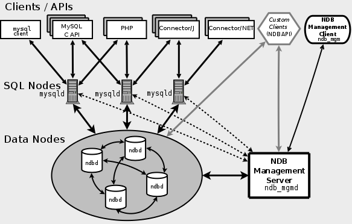

MySQL NDB Cluster是适用于分布式计算环境的高可用性，高冗余版本的MySQL。

MySQL 使用 NDB 存储引擎（NDBCLUSTER（也称为NDB）是一种内存存储引擎，提供高可用性和数据持久性功能）来对数据节点的数据进行存储。

MySQL Cluster 通过数据的分布式存储和可扩展的系统架构，可以满足更大规模的应用；而且通过冗余策略，可以大大地提高系统的可靠性和数据的有效性。 



MySQL Cluster 按照节点类型可以分为 3 部分 ：

- 管理节点。管理节点只能有一个，配置要求不高。
- SQL节点。应用不能直接访问数据节点，只能先访问SQL节点，然后SQL节点再去访问数据节点来返回数据。
- 数据节点。


## 安装

[官网快速安装文档](https://dev.mysql.com/doc/mysql-yum-repo-quick-guide/en/#repo-qg-yum-fresh-cluster-install)

MySQL Server不包含CLuster版本，需要下载额外的包。

没有必要在管理节点主机和数据节点主机上安装MySQL Server二进制文件。SQL节点不能安装MySQL Server，会相互冲突。建议在管理服务器主机上安装管理客户端（ndb_mgm）。

```bash
 yum update mysql80-community-release
 
 yum-config-manager --disable mysql80-community
 # 可以访问网看下有哪些仓库：https://repo.mysql.com/yum/
 # 也可以手动编辑 mysql-community.repo 文件打开仓库
 yum-config-manager --enable mysql-cluster-8.0-community
 
 # 安装管理节点
 yum install mysql-cluster-community-management-server
 # 安装SQL节点，完毕之后的初始化过程和 MySQL Server 一样：https://dev.mysql.com/doc/mysql-yum-repo-quick-guide/en/#repo-qg-starting-server
 # mysql初始化时不能有文件在文件夹里面
 # 注意，一定不能和 MySQL Server 一起安装
 yum install mysql-cluster-community-server
 # 安装数据节点
 yum install mysql-cluster-community-data-node
 
 # 安装管理客户端（与MySQL Server的客户端冲突）
 # 安装SQL节点时会作为依赖安装
 yum install mysql-cluster-community-client
```

## 配置 

[官网最简配置文档](https://dev.mysql.com/doc/refman/8.0/en/mysql-cluster-install-configuration.html)

| 节点     | IP                               |
| -------- | -------------------------------- |
| 管理节点 | 192.168.17.10                    |
| SQL节点  | 192.168.17.12<br />192.168.17.13 |
| 数据节点 | 192.168.17.12<br />192.168.17.13 |

未连接到NDB集群的MySQL服务器无法使用NDB存储引擎，也无法访问任何NDB集群数据。

### SQL节点和数据节点

SQL节点和数据节点的`my.cnf`文件必须包含以下条目：

```mysql
[mysqld]
# Options for mysqld process:
# 虽然这里设置了NDB存储引擎，但是只有是用NDB存储引擎存储的表才会被同步
ndbcluster                      # run NDB storage engine

[mysql_cluster]
# Options for NDB Cluster processes:
ndb-connectstring=198.168.17.10  # location of management server
```

!!! note
	当你使用了以上配置文件中的参数开启了mysqld进程之后，如果cluster没有启动，那么就不能再执行创建表和修改表的语句了。

### 管理节点

```bash
$  mkdir /var/lib/mysql-cluster
$  cd /var/lib/mysql-cluster
$  vi config.ini
[ndb_mgmd]
# Management process options:
HostName=192.168.17.10          # Hostname or IP address of MGM node
DataDir=/var/lib/mysql-cluster  # Directory for MGM node log files

[ndbd default]
# Options affecting ndbd processes on all data nodes:
NoOfReplicas=2    # Number of replicas
DataMemory=100M    # How much memory to allocate for data storage

[ndbd]
# Options for data node "A":
                                # (one [ndbd] section per data node)
HostName=192.168.17.12          # Hostname or IP address
NodeId=2                        # Node ID for this data node
# 需要在数据节点上自行创建
DataDir=/var/lib/mysql/data    # Directory for this data node's data files

[ndbd]
# Options for data node "B":
HostName=192.168.17.13          # Hostname or IP address
NodeId=3                        # Node ID for this data node
DataDir=/var/lib/mysql/data    # Directory for this data node's data files

[mysqld]
# SQL node options:
HostName=192.168.17.12          # Hostname or IP address
                                # (additional mysqld connections can be
                                # specified for this node for various
                                # purposes such as running ndb_restore)
[mysqld]
HostName=192.168.17.13
# 留一个置空，这样可以为SQL节点继续分配NodeId
[mysqld]
HostName=
```

## 启动与关闭

### 启动

**服务的启动顺序很重要**，首先启动管理节点，看到日志启动完毕之后再启动数据节点。看到日志中数据节点准备和SQL节点通信之后再启动SQL节点（或者重启mysqld，任意顺序启动都可）。

安装并配置完三个节点之后，SQL节点要初始化，然后在管理节点（关闭防火墙，fixme）启动cluster：

```bash
# 第一次初始化时需要指定配置文件及初始化选项，以后再启动时无需指定了
$ ndb_mgmd --initial -f /var/lib/mysql-cluster/config.ini
```

在每个数据节点运行：

```bash
# 需要关闭防火墙，否则节点会一直尝试互相连接对方
$ ndbd
```

在每个SQL节点运行：

```bash
# 需要关闭防火墙
$ systemctl start mysqld
```

在管理客户端上查看是否启动成功

```bash
$ ndb_mgm
Connected to Management Server at: 192.168.17.10:1186
Cluster Configuration
---------------------
[ndbd(NDB)]     2 node(s)
id=2    @192.168.17.12  (mysql-8.0.17 ndb-8.0.17, Nodegroup: 0, *)
id=3    @192.168.17.13  (mysql-8.0.17 ndb-8.0.17, Nodegroup: 0)

[ndb_mgmd(MGM)] 1 node(s)
id=1    @192.168.17.10  (mysql-8.0.17 ndb-8.0.17)

[mysqld(API)]   1 node(s)
id=4    @192.168.17.12  (mysql-8.0.17 ndb-8.0.17)
id=5    @192.168.17.13  (mysql-8.0.17 ndb-8.0.17)
```

很有可能看到SQL节点未连接的错误：`id=4 (not connected, accepting connect from xxx)`，解决方法是关闭SQL节点的selinux：`setenforce 0`（临时生效），或者编辑`/etc/selinux/config`文件（重启生效）。关闭之后就可以看的日志中的node 4连接上了。

### 关闭

```bash
ndb_mgm> SHUTDOWN
或
$ ndb_mgm -e SHUTDOWN
```

## 维护

### 数据备份 

#### 逻辑备份

使用`mysqldump`进行逻辑备份同样适用于cluster。参考[32. MySQL备份与恢复](32. MySQL备份与恢复.md)

#### 物理备份

启动管理控制台，执行备份命令：

```mysql
# 第一次备份
ndb_mgm> START BACKUP WAIT COMPLETED
Waiting for completed, this may take several minutes
Node 2: Backup 1 started from node 1
Node 2: Backup 1 started from node 1 completed
 StartGCP: 1761 StopGCP: 1764
 #Records: 2060 #LogRecords: 0
 Data: 51672 bytes Log: 0 bytes
 # 第二次备份
 ndb_mgm> START BACKUP WAIT COMPLETED
Waiting for completed, this may take several minutes
Node 2: Backup 2 started from node 1
Node 2: Backup 2 started from node 1 completed
 StartGCP: 1826 StopGCP: 1829
 #Records: 2060 #LogRecords: 0
 Data: 51672 bytes Log: 0 bytes
```

Backup会随着备份次数而发生变化。备份数据保存在每个数据节点上面，路径是在管理节点的配置文件`config.ini`中指定的：

```mysql
[ndbd]
# Options for data node "A":
......
DataDir=/var/lib/mysql/data/    # Directory for this data node's data files
```

```bash
[root@centos7 data]# pwd
/var/lib/mysql/data
[root@centos7 data]# tree BACKUP/
BACKUP/
├── BACKUP-1
│   ├── BACKUP-1-0.2.Data
│   ├── BACKUP-1.2.ctl
│   └── BACKUP-1.2.log
└── BACKUP-2
    ├── BACKUP-2-0.2.Data
    ├── BACKUP-2.2.ctl
    └── BACKUP-2.2.log

2 directories, 6 files
```

对于大数据量的备份，MySQL Cluster 还提供了几个备份的参数可供调整（在`[ndbd]`或`[ndbd default]`中配置）：

- BackupDataBufferSize：将数据写入磁盘之前用于对数据进行缓冲处理的内存量。
- BackupLogBufferSize： 将日志记录写入磁盘之前用于对其进行缓冲处理的内存量。
- BackupMemory：在数据节点中为备份分配的总内存。它应是分配给备份数据缓冲的内存和分配给备份日志缓冲的内存之和。
- BackupWriteSize：每次写入磁盘的块大小，适用于备份数据缓冲和备份日志缓冲。 
- [`BackupMaxWriteSize`](https://dev.mysql.com/doc/refman/8.0/en/mysql-cluster-ndbd-definition.html#ndbparam-ndbd-backupmaxwritesize)：每次最大写入磁盘的块大小，适用范围同上。

详细的说明参考：https://dev.mysql.com/doc/refman/8.0/en/mysql-cluster-ndbd-definition.html#mysql-cluster-backup-parameters

#### 数据恢复 

使用`START BACKUP`备份的数据必须使用`ndb_restore`工具恢复。

首先，在管理节点的`config.ini`中必须存在以下置空节点，否则备份管理节点无法为SQL节点分配NodeId，导致恢复失败：

```MySQL
[mysqld]
HostName=
```

开始实践步骤：

1.删除表，模拟数据破坏：

```MySQL
mysql> DROP TABLE t1;
```

2.在一个SQL节点上运行`ndb_restore`，这里选择【node 3, 192.168.17.13】：

```bash
[root@centos7 data]# ndb_restore -n 3 -b 3 -r -m --backup_path=BACKUP/BACKUP-3
```

- -n：指定节点id，必须是本节点id
- -b：备份文件的id，即BACKUP-ID
- -r：恢复 table data/logs into NDB Cluster using NDBAPI
- -m：恢复表的定义。表的定义恢复之后再多次运行该工具时不可再次添加该选项，否则会报错
- --backup_path：备份文件的路径

3.查看是否恢复：

```MySQL
# 开始时不会查询到表的，也就是说"SHOW TABLES"还是查询不到的，但直接执行查询语句后就可查到了
mysql> select * from t1;
+----+
| id |
+----+
|  1 |
+----+
```

### 日志管理 

善用`ndb_mgm`，查看使用说明，其中有日志相关选项。

```bash
ndb_mgm> ?
---------------------------------------------------------------------------
 NDB Cluster -- Management Client -- Help
---------------------------------------------------------------------------
HELP                                   Print help text
HELP COMMAND                           Print detailed help for COMMAND(e.g. SHOW)
SHOW                                   Print information about cluster
CREATE NODEGROUP <id>,<id>...          Add a Nodegroup containing nodes
DROP NODEGROUP <NG>                    Drop nodegroup with id NG
START BACKUP [NOWAIT | WAIT STARTED | WAIT COMPLETED]
START BACKUP [<backup id>] [NOWAIT | WAIT STARTED | WAIT COMPLETED]
START BACKUP [<backup id>] [SNAPSHOTSTART | SNAPSHOTEND] [NOWAIT | WAIT STARTED | WAIT COMPLETED]
                                       Start backup (default WAIT COMPLETED,SNAPSHOTEND)
ABORT BACKUP <backup id>               Abort backup
SHUTDOWN                               Shutdown all processes in cluster
PROMPT [<prompt-string>]               Toggle the prompt between string specified
                                       or default prompt if no string specified
# 打开日志
CLUSTERLOG ON [<severity>] ...         Enable Cluster logging
CLUSTERLOG OFF [<severity>] ...        Disable Cluster logging
# 切换日志严重性过滤的开关
CLUSTERLOG TOGGLE [<severity>] ...     Toggle severity filter on/off
# 查看哪些日志会被记录
CLUSTERLOG INFO                        Print cluster log information
<id> START                             Start data node (started with -n)
<id> RESTART [-n] [-i] [-a] [-f]       Restart data or management server node
<id> STOP [-a] [-f]                    Stop data or management server node
<id> NODELOG DEBUG ON                  Enable Debug logging in node log
<id> NODELOG DEBUG OFF                 Disable Debug logging in node log
ENTER SINGLE USER MODE <id>            Enter single user mode
EXIT SINGLE USER MODE                  Exit single user mode
<id> STATUS                            Print status
# 记录小于等于level优先级的category的日志
<id> CLUSTERLOG {<category>=<level>}+  Set log level for cluster log
PURGE STALE SESSIONS                   Reset reserved nodeid's in the mgmt server
CONNECT [<connectstring>]              Connect to management server (reconnect if already connected)
<id> REPORT <report-type>              Display report for <report-type>
QUIT                                   Quit management client

<severity> = ALERT | CRITICAL | ERROR | WARNING | INFO | DEBUG
<category> = STARTUP | SHUTDOWN | STATISTICS | CHECKPOINT | NODERESTART | CONNECTION | INFO | ERROR | CONGESTION | DEBUG | BACKUP | SCHEMA
<report-type> = BACKUPSTATUS | MEMORYUSAGE | EVENTLOG
#  最重要 - 最不重要
<level>    = 0 - 15
<id>       = ALL | Any database node id

For detailed help on COMMAND, use HELP COMMAND.
```

