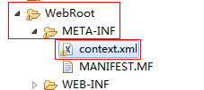

监听器用于监听web中的对象的创建、变化（属性变化）、销毁等动作，然后做出响应。

[参考博客](https://www.cnblogs.com/xdp-gacl/p/3969249.html)

## 分类

 **按监听的对象划分，可以分为**

- **ServletContext对象监听器**
- **HttpSession对象监听器**
- **ServletRequest对象监听器**


 **按监听的事件划分**

- **对象自身的创建和销毁的监听器**
- **对象中属性的创建和消除的监听器**
- **session中的某个对象的状态变化的监听器**

实现接口并配置之后即可注册监听器。

## 对象变更监听器

- HttpSessionListener
- ServletContextListener
- ServletRequestListener

三种都有且仅有初始化和销毁的监听方法，只是传参是各自的event事件。

```java
//HttpSessionListener
public void sessionCreated(HttpSessionEvent se);
public void sessionDestroyed(HttpSessionEvent se);

//ServletContextListener
public void contextInitialized(ServletContextEvent sce);
public void contextDestroyed(ServletContextEvent sce);

//ServletRequestListener
public void requestInitialized(ServletRequestEvent sre);
public void requestDestroyed(ServletRequestEvent sre);
```


## 属性变更监听器

- ServletContextAttributeListener
- HttpSessionAttributeListener
- ServletRequestAttributeListener

监听属性改变时的事件。

三个接口都有同样的三个方法（参数不同）：

```java
//HttpSessionAttributeListener
public void attributeAdded(HttpSessionBindingEvent event);
public void attributeRemoved(HttpSessionBindingEvent event);
public void attributeReplaced(HttpSessionBindingEvent event);

//ServletContextAttributeListener
public void attributeAdded(ServletContextAttributeEvent event);
public void attributeRemoved(ServletContextAttributeEvent event);
public void attributeReplaced(ServletContextAttributeEvent event);

//ServletRequestAttributeListener
public void attributeAdded(ServletRequestAttributeEvent srae);
public void attributeRemoved(ServletRequestAttributeEvent srae);
public void attributeReplaced(ServletRequestAttributeEvent srae);
```


## 感知Session绑定的事件监听器

保存在Session域中的对象可以有多种状态：绑定(session.setAttribute("bean",Object))到Session中；从 Session域中解除(session.removeAttribute("bean"))绑定；随Session对象持久化到一个存储设备中（钝化/序列化）；随Session对象从一个存储设备中恢复（活化/反序列化）。

Servlet 规范中定义了**两个特殊的监听器接口"HttpSessionBindingListener和HttpSessionActivationListener"**来帮助JavaBean 对象了解自己在Session域中的这些状态。实现这两个接口的类**不需要 web.xml 文件中进行注册**。

### HttpSessionBindingListener接口

```java
public void valueBound(HttpSessionBindingEvent event);
public void valueUnbound(HttpSessionBindingEvent event);
```

###  HttpSessionActivationListener接口

```java
package me.gacl.domain;

import java.io.Serializable;

import javax.servlet.http.HttpSessionActivationListener;
import javax.servlet.http.HttpSessionEvent;

/**
    实现了HttpSessionActivationListener接口的 JavaBean 对象可以感知自己被活化和钝化的事件
    活化:javabean对象和Session一起被反序列化(活化)到内存中。
    钝化:javabean对象存在Session中，当服务器把session序列化到硬盘上时，如果Session中的javabean对象实现了Serializable接口
    那么服务器会把session中的javabean对象一起序列化到硬盘上，javabean对象和Session一起被序列化到硬盘中的这个操作称之为钝化
    如果Session中的javabean对象没有实现Serializable接口，那么服务器会先把Session中没有实现Serializable接口的javabean对象移除，然后再把Session序列化(钝化)到硬盘中
    当绑定到 HttpSession对象中的javabean对象将要随 HttpSession对象被钝化之前，
    web服务器调用该javabean对象的 void sessionWillPassivate(HttpSessionEvent event)方法
    这样javabean对象就可以知道自己将要和 HttpSession对象一起被序列化(钝化)到硬盘中
    当绑定到HttpSession对象中的javabean对象将要随 HttpSession对象被活化之后，
    web服务器调用该javabean对象的 void sessionDidActive(HttpSessionEvent event)方法
    这样javabean对象就可以知道自己将要和 HttpSession对象一起被反序列化(活化)回到内存中
*
*/ 
public class JavaBeanDemo2 implements HttpSessionActivationListener,
        Serializable {

     
    private static final long serialVersionUID = 7589841135210272124L;
    private String name;
    
    @Override
    public void sessionWillPassivate(HttpSessionEvent se) {
        
        System.out.println(name+"和session一起被序列化(钝化)到硬盘了，session的id是："+se.getSession().getId());
    }

    @Override
    public void sessionDidActivate(HttpSessionEvent se) {
        System.out.println(name+"和session一起从硬盘反序列化(活化)回到内存了，session的id是："+se.getSession().getId());
    }

    public String getName() {
        return name;
    }

    public void setName(String name) {
        this.name = name;
    }

    public JavaBeanDemo2(String name) {
        this.name = name;
    }
}
```

　	为了观察绑定到HttpSession对象中的javabean对象随HttpSession对象一起被钝化到硬盘上和从硬盘上重新活化回到内存中的的过程，我们需要借助tomcat服务器帮助我们完成HttpSession对象的钝化和活化过程，具体做法如下：

　　在WebRoot\META-INF文件夹下创建一个context.xml文件，如下所示：



```xml
<Context>
    <Manager className="org.apache.catalina.session.PersistentManager" maxIdleSwap="1">
    <Store className="org.apache.catalina.session.FileStore" directory="gacl"/>
    </Manager>
</Context>
```

在context.xml文件文件中配置了1分钟之后就将HttpSession对象钝化到本地硬盘的一个gacl文件夹中

## 配置监听器

```xml
<!--注册针对HttpSession对象进行监听的监听器-->
   <listener>
      <description>HttpSessionListener监听器</description>
      <listener-class>me.gacl.web.listener.MyHttpSessionListener</listener-class>
  </listener>
  <!-- 配置HttpSession对象的销毁时机 -->
  <session-config>
      <!--配置HttpSession对象的1分钟之后销毁 -->
      <session-timeout>1</session-timeout>
  </session-config>
```

