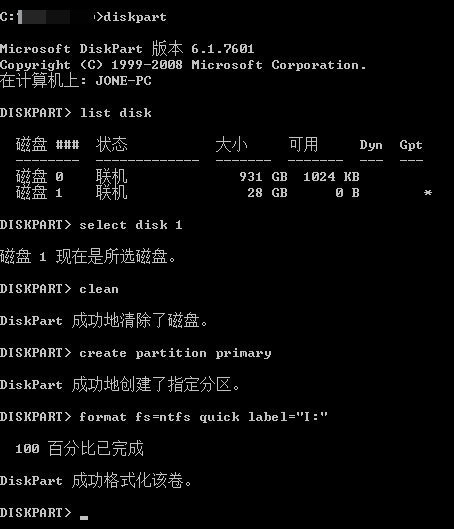

参考：https://jingyan.baidu.com/article/e9fb46e140a04a7521f766d4.html

此法适用于不能在图形界面格式磁盘或格式化出错（比如格式化安装有linux操作系统的磁盘）的情况。

在`cmd`中执行：

命令说明：

- `diskpart`：磁盘分区命令
- `list disk`：列出磁盘
- `select disk 1`：选择一个磁盘
- `clean`：清除磁盘内容
- `create partition primary`：创建主分区
- `format fs=ntfs quick label="I:"`：使用NTFS格式快速格式化磁盘，分配 *I:* 标签（卷标）

