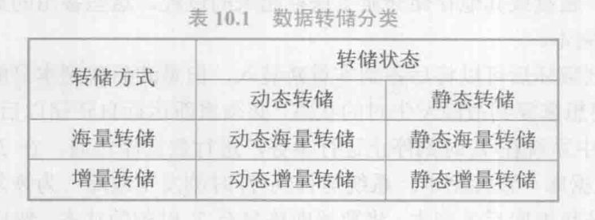
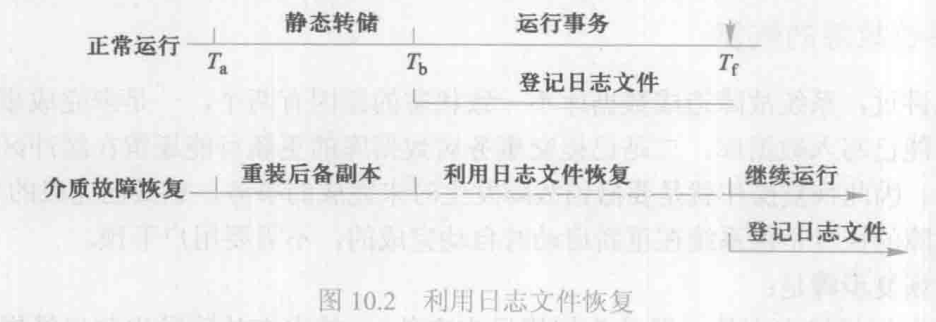
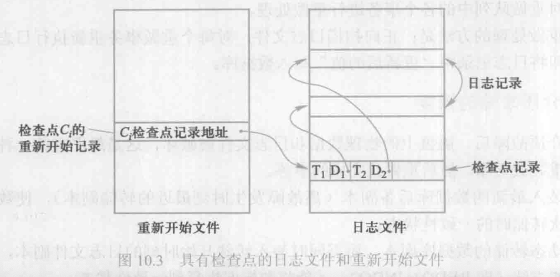
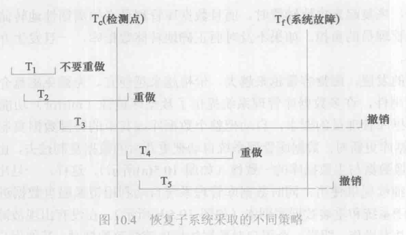
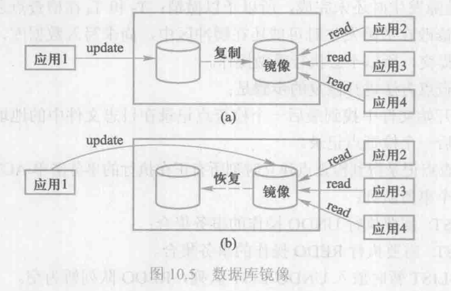

[TOC]

事务是一系列的数据库操作，是数据库应用程序的基本逻辑单元。**事务处理（transaction processing）技术**主要包括数据库恢复技术和并发控制技术。数据库恢复机制和并发控制机制是数据库管理系统的重要组成部分。

## 10.1 事务的基本概念

### 事务

**事务**是用户定义的一个数据库操作序列，这些操作要么全做，要么不做，是一个不可分割的工作单位。

事务和程序是两个概念，一般地讲，一个程序中包含多个事务。

事务的开始与结束可以由用户显示控制。如果用户没有显示地定义事务，则由数据库管理系统按默认规定自动划分事务。在 sql 中，定义事务的语句一般有三条：

```sql
BEGIN TRANSCATION;
COMMIT;
ROLLBACK;
```

### 事务的 ACID 特性

- 原子性（Atomicity）
- 一致性（Consistency）
- 隔离性（Isolation）
- 持久性（Durability）

（1） 原子性

事务是数据库的逻辑工作单位，事务中包括的诸操作要么都做，要么都不做。

（2） 一致性

事务执行的结果必须是使数据库从一个一致性状态变到另一个一致性状态。因此当数据库只包含成功事务提交的结果时，就说数据库处于一致性状态。如果数据库系统运行中发生故障，有些事务尚未完成就被迫中断，这些未完成的事务对数据库所做的修改有一部分已写入物理数据库，这时数据库就处于一种不正确的状态，或者说是不一致的状态。一致性与原子性是密切相关的。

（3）隔离性

一个事务的执行不能被其他事务干扰。即一个事务的内部操作及使用的数据对其他并发事务是隔离的，并发执行的各个事务之间不能互相干扰。

（4）持续性

持续性也称**永久性**（Permanence），指一个事务一旦提交，它对数据库中数据的改变就应该是永久性的。接下来的其他操作或故障不应该对其执行结果有任何影响。

**事务是恢复和并发控制的基本单位**，所以下面的讨论均以事务为对象。

保证事务 ACID 特性是事务管理的重要任务。事务ACID特性可能遭到破坏的因素有：

1. 多个事务并行运行时，不同事务的操作交叉执行；
2. 事务在运行过程中被强行停止。

在第一种情况下，数据库管理系统必须保证多个事务的交叉运行不影响这些事务的原子性；在第二种情况下，数据库管理系统必须保证被强行终止的事务对数据库和其他事务没有任何影响。

这些就是数据库管理系统中恢复机制和并发控制机制的责任。

## 10.2 数据库恢复概述

尽管数据库系统中采取了各种保护措施来防止数据库的安全性和完整性被破坏，保证并发事务的正确执行，但是计算机系统中硬件的故障、软件的错误、操作员的失误以及恶意的破坏仍是不可避免的。因此数据库管理系统必须具有把数据库从错误状态恢复到某一已知的正确状态（亦称为一致状态或完整状态）的功能，这就是数据库的恢复。

## 10.3 故障的种类

### 事务内部的故障

事务内部的故障有的是可以通过事务程序本身发现的，有的是非预期的，不能由事务程序处理。

事务内部更多的故障是非预期的，是不能由应用程序处理的，如运算溢出、并发事务发生死锁而被选中撤销该事务、违法了某些完整性限制而被终止等。本书后续章节中，事务故障仅指这类非预期的故障。

**事务故障意味着事务没有达到预期的终点**（COMMIT 或者显式的 ROLLBACK），因此，数据库可能处于不正确状态。恢复程序要在不影响其他事务运行的情况下，强行回滚该事务，即撤销该事务已经作出的任何对数据库的修改，使得该事务好像根本没有启动一样。这类恢复操作称为**事务撤销（UNDO）**。

### 系统故障

系统故障是指系统停止运转的任何事件，使得系统要重新启动。例如，特定类型的硬件错误、操作系统故障、DBMS 代码错误、系统断电等。**这类故障影响正在运行的所有事务，但不破坏数据库**。此时主存内容，尤其是数据库缓冲区（在内存）中的内容都被丢失，所有运行事务都非正常终止。发生系统故障时，一些尚未完成的事务的结果可能已送入物理数据库，从而造成数据库可能处于不正确的状态。为保证数据一致性，需要清除这些事务对数据库的所有修改。

- 恢复子系统必须在系统重新启动时让**所有非正常终止的事务回滚**，强行撤销所有未完成事务。
- 另一方面，发生系统故障时，有些已完成的事务可能有一部分甚至全部留在缓冲区，尚未写回到磁盘上的物理数据库中，系统故障使得这些事务对数据库的修改部分或全部丢失，这也会使数据库处于不一致状态，因此应**将这些事务已提交的结果重新写入数据库**。

所以系统重新启动后，恢复子系统除需要**撤销（UNDO）**所有未完成的事务外，还需要**重做（REDO）**所有已提交的事务，以将数据库真正恢复到一致状态。

### 介质故障

系统故障常称为`软故障`（soft crash），介质故障称为`硬故障`（hard crash）。硬故障指外存故障，如磁盘损坏、磁头碰撞，瞬时强磁场干扰等。这类故障将破坏数据库或部分数据库，并影响正在存取这部分数据的所有事务。这类故障比前两类故障发生的**可能性小得多，但破坏性最大**。

### 计算机病毒

计算机病毒是一种人为的故障或破坏。传播很快；潜伏期；有的感染系统所有的程序和数据；有的只对特定的程序和数据感兴趣。

计算机病毒已成为计算机系统的主要威胁，自然也是数据库系统的主要威胁。

---

总结各类故障对数据库的影响有两种可能性，一是数据库本身被破坏，二是数据库没有被破坏，但数据可能不正确，这是由于事务的运行被非正常终止造成的。

恢复的基本原理用一个词概括就是：冗余。

## 10.4 恢复的实现技术

恢复机制涉及的两个关键问题：

1. 如何建立冗余数据
2. 如何利用这些冗余数据实施数据库恢复

建立冗余数据最常用的技术是**数据转储**和**登记日志文件**。通常一起使用。

### 10.4.1 数据转储

数据转储是数据库恢复中采用的基本技术。所谓转储即数据库管理员定期地将整个数据库复制到磁带、磁盘或其他存储介质上保存起来的过程。这些备用的数据称为**后备副本**（backup）或后援副本。

当数据库遭到破坏后可以将后备副本重新装入，但重装后备副本只能将数据库恢复到转储时的状态，要想恢复到故障发生时的状态，必须重新运行自转储以后的所有更新事务。

**静态转储**是在系统中无运行事务时进行的转储操作。即转储操作开始的时刻数据库处于一致性状态，而转储期间不允许（或不存在）对数据库的任何存取、修改活动。显然，静态转储得到的一定是一个数据一致性的副本。

静态转储简单，但转储必须等待正运行的用户事务结束才能进行。同样，新的事务必须等待转储结束才能执行。显然，这会**降低数据库的可用性**。

**动态转储**是指转储期间允许对数据库进行存取或修改。即转储和用户事务可以并发执行。动态转储可以克服静态转储的缺点，它**不用等待正在运行的用户事务结束，也不会影响新事务的运行**。

但是，转储结束时后援副本上的数据并不能保证正确有效。
为此，必须把转储期间各事务对数据库的修改活动登记下来，建立**日志文件**（log file）。

这样，后援副本加上日志文件就能把数据库恢复到某一时刻的正确状态。

转储还可以分为海量转储和增量转储两种方式。海量转储是指每次转储全部数据库，增量转储则指每次只转储上一次转储后更新过的数据。从恢复角度看，使用海量转储得到的后备副本进行恢复一般说来会更方便些。但如果数据库很大，事务处理又十分频繁，则增量转储方式更实用更有效。

数据转储有两种方式，分别可以在两种状态下进行，因此数据转储方法可以分为4类：动态海量转储、动态增量转储、静态海量转储和静态增量转储，如表10.1所示。



### 10.4.2 登记日志文件

#### 日志文件的格式和内容

日志文件是用来记录**事务对数据库的更新操作**的文件。不同数据库系统采用的日志文件格式并不完全一样。概括起来日志文件主要有两种格式：以记录为单位的日志文件和以数据块为单位的日志文件。

对于以记录为单位的日志文件，日志文件中需要登记的内容包括：

- 各个事务的开始（BEGIN TRANSACTION）标记。
- 各个事务的结束（COMMIT 或ROLLBACK）标记。
- 各个事务的所有更新操作。

这里每个*事务的开始标记*、*每个事务的结束标记*和*每个更新操作*均作为日志文件中的一个日志记录（log record）。每个日志记录的内容主要包括：

- 事务标识（标明是哪个事务）。
- 操作的类型（插入、删除或修改）。
- 操作对象（记录内部标识）。
- 更新前数据的旧值（对插入操作而言，此项为空值）。
- 更新后数据的新值（对删除操作而言，此项为空值）。

对于以数据块为单位的日志文件，日志记录的内容包括*事务标识*和*被更新的数据块*。由于将更新前的整个块和更新后的整个块都放入日志文件中，操作类型和操作对象等信息就不必放入日志记录中了。

#### 日志文件的作用

日志文件在数据库恢复中起着非常重要的作用，可以用来进行事务故障恢复和系统故障恢复，并协助后备副本进行介质故障恢复。具体作用是：

1. 事务故障恢复和系统故障恢复必须用日志文件。
2. 在动态转储方式中必须建立日志文件，后备副本和日志文件结合起来才能有效地恢复数据库。
3. 在静态转储方式中也可以建立日志文件，当数据库毁坏后可重新装入后援副本把数据库恢复到转储结束时刻的正确状态，然后利用日志文件把已完成的事务进行重做处理，对故障发生时尚未完成的事务进行撤销处理。这样不必重新运行那些已完成的事务程序就可把数据库恢复到故障前某一时刻的正确状态，如图10.2所示。



#### 登记日志文件

为保证数据库是可恢复的，登记日志文件时必须遵循两条原则：

- **登记的次序严格按并发事务执行的时间次序**
- **必须先写日志文件，后写数据库**。先写日志原则

## 10.5 恢复策略

### 10.5.1 事务故障的恢复

事务故障是指事务在运行至正常终止点前被终止，这时恢复子系统应利用日志文件撤销（UNDO）此事务已对数据库进行的修改。事务故障的恢复是由系统自动完成的，对用户是透明的。系统的恢复步骤是：

1. 反向扫描日志文件（即从最后向前扫描日志文件），查找该事务的更新操作。
2. 对该事务的更新操作执行逆操作，即将日志记录中“更新前的值”写入数据库。
    这样，如果记录中是插入操作，则相当于做删除操作（因此时“更新前的值” 空）；若记录中是删除操作，则做插入操作；若是修改操作，则相当于用修改前值代替修改后值。
3. 继续反向扫描日志文件，查找该事务的其他更新操作，并做同样处理。
4. 如此处理下去，**直至读到此事务的开始标记**，事务故障恢复就完成了。

### 10.5.2 系统故障的恢复

前面已讲过，系统故障造成数据库不一致状态的原因有两个：

- 一是未完成事务对数据库的更新可能已写入数据库
- 二是已提交事务对数据库的更新可能还留在缓冲区没来得及写入数据库。

因此恢复操作就是要撤销故障发生时未完成的事务，重做已完成的事务。

系统故障的恢复是由系统在重新启动时自动完成的，不需要用户干预。系统的恢复步骤是：

1. 正向扫描日志文件（即从头扫描目志文件），找出在故障发生前已经提交的事务（这些事务既有 BEGIN TRANSACTION 记录，也有COMMIT 记录），将其事务标识记入**重做队列**（REDO-LIST）。同时找出故障发生时尚未完成的事务（这些事务只有 BEGINTRANSACTION 记录，无相应的 COMMIT 记录），将其事务标识记入**撤销队列** （UNDO-LIST）。
2. 对撤销队列中的各个事务进行撤销（UNDO）处理。
    进行撤销处理的方法是，反向扫描日志文件，对每个撤销事务的更新操作执行逆操作，即将日志记录中“更新前的值”写入数据库。
3. 对重做队列中的各个事务进行重做处理。
    进行重做处理的方法是：正向扫描日志文件，对每个重做事务重新执行日志文件登记的操作，即将日志记录中“更新后的值”写入数据库。

### 10.5.3 介质故障的恢复

发生介质故障后，磁盘上的物理数据和日志文件被破坏，这是最严重的一种故障，恢复方法是**重装数据库，然后重做已完成的事务。**

1. 装入最新的数据库后备副本（离故障发生时刻最近的转储副本），使数据库恢复到最近一次转储时的一致性状态。

    对于动态转储的数据库副本，还需同时装入转储开始时刻的日志文件副本，利用恢复系统故障的方法（即 REDO+UNDO），才能将数据库恢复到一致性状态。

2. 装入相应的日志文件副本（转储结束时刻的日志文件副本），重做已完成的事务。

    即首先扫描日志文件，找出故障发生时已提交的事务的标识，将其记入重做队列；然后正向扫描日志文件，对重做队列中的所有事务进行重做处理。即将日志记录中“更新后的值”写入数据库。

介质故障的恢复需要数据库管理员介入，但数据库管理员只需要重装最近转储的数据库副本和有关的各日志文件副本，然后执行系统提供的恢复命令即可，具体的恢复操作仍由数据库管理系统完成。

## 10.6 具有检查点的恢复技术

利用日志技术进行数据库恢复时，恢复子系统必须搜索日志，确定哪些事务需要重做，哪些事务需要撤销。一般来说，需要检查所有日志记录。这样做有两个问题，一是**搜索整个日志将耗费大量的时间**，二是很多需要重做处理的事务实际上已经将它们的更新操作结果写到了数据库中，然而恢复子系统又**重新执行了这些操作，浪费了大量时间**。

为了解决这些问题，又发展了具有检查点的恢复技术。这种技术在日志文件中增加一类新的记录——**检查点**（checkpoint） 记录，和增加一个重新开始文件，并让恢复子系统在登录日志文件期间动态地维护日志。

检查点记录的内容包括：

- 建立检查点时刻所有正在执行的事务清单
- 这些事务最近一个日志记录的地址。

重新开始文件用来记录各个检查点记录着日志文件中的地址。下图说明了建立检查点 $C_i$ 时对应的日志文件和重新开始文件。



动态维护日志文件的方法是，**周期性地执行建立检查点、保存数据库状态**的操作。具体步骤：

1. 将当前日志缓冲区中的所有日志记录写入磁盘的日志文件上。日志落盘
2. 在日志文件中写入一个检查点记录
3. 将当前数据缓冲区的所有数据记录写入磁盘的数据库中。数据落盘
4. 把检查点记录在日志文件中的地址写入一个重新开始文件

使用检查点方法可以改善恢复效率。对于检查点之前或在检查点建立之时已提交的事务，在恢复处理时没有必要对已提交的事务执行重新操作。

系统出现故障时，恢复子系统根据事务的不同状态采取不同的恢复策略：



恢复策略总结：检查点之前提交的事务不重做；系统故障之前提交的事务要重做；系统故障时还没完成的事务予以撤销。

使用检查点恢复的步骤：

1. 从重新开始文件中找到最后一个检查点记录在日志文件中的地址，由该地址在日志文件中找到最后一个检查点记录
2. 由该检查点记录得到检查点建立时刻所有正在执行的事务清单 ACTIVE-LIST。 建立两个事务队列：
    - REDO-LIST：需要执行 REDO 操作的事务集合；
    - UNDO-LIST：需要执行 UNDO 操作的事务集合。
    把 ACTIVE-LIST 暂时放入 UNDO-LIST，REDO-LIST 暂时为空。
3. 从检查点开始正向扫描日志文件
   1. 如有新开始的事务 Ti，把 Ti 暂时放入 UNDO-LIST；
   2. 如有提交的事务 Tj，把 Tj 从 UNDO-LIST 移到 REDO-LIST；
   3. 重复上面两个步骤直到文件结束
4. 对 UNDO-LIST 中的每个事务执行 UNDO 操作，对 REDO-LIST 中的每个事务执行 REDO 操作

## 10.7 数据库镜像

为避免磁盘介质出现故障影响数据库的可用性，许多数据库管理系统提供了**数据库镜像**（mirror〉功能用于数据库恢复。即根据数据库管理员的要求，自动把整个数据库或其中的关键数据复制到另一个磁盘上，每当主数据库更新时，数据库管理系统自动把更新后的数据复制过去，由数据库管理系统自动保证镜像数据与主数据库的一致性（如图10.5（a）所示）。

这样，一旦出现介质故障，可由镜像磁盘继续提供使用，同时数据库管理系统自动利用镜像磁盘数据进行数据库的恢复，不需要关闭系统和重装数据库副本（如图10.5（b）所示）。在没有出现故障时，数据库镜像还可以用于并发操作，即当一个用户对数据加排他锁修改数据时，其他用户可以读镜像数据库上的数据，而不必等待该用户释放锁。



由于数据库镜像是通过复制数据实现的，频繁地复制数据自然会降低系统运行效率，因此在实际应用中用户往往只选择对关键数据和日志文件进行镜像，而不是对整个数据库进行镜像。