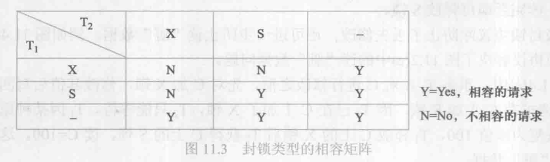
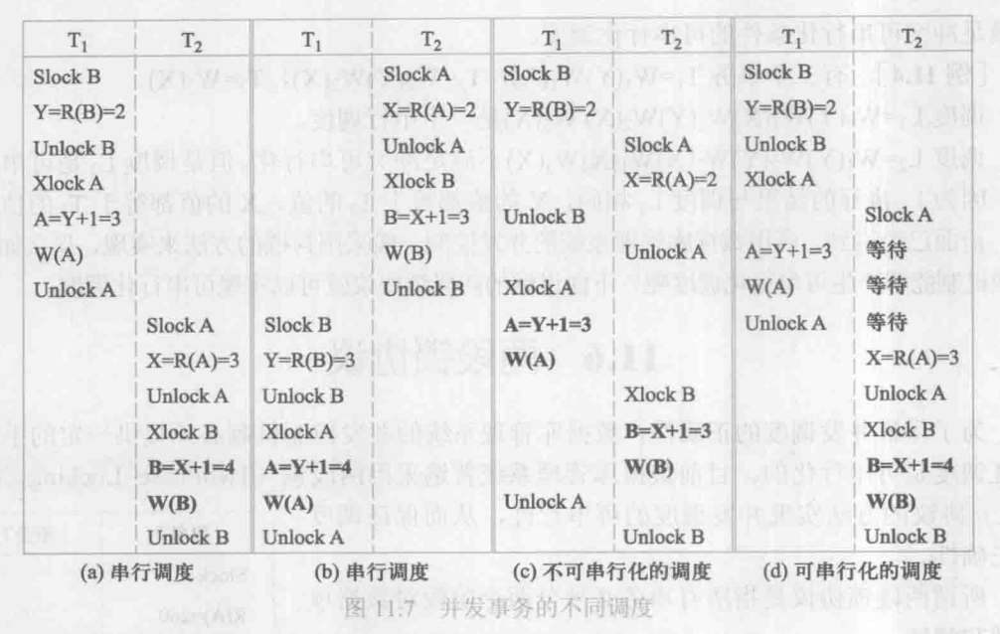
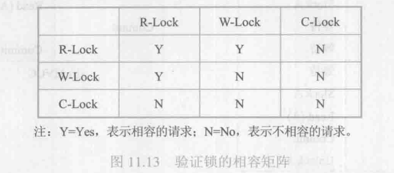

[TOC]

事务可以串行，但是为了充分利用系统资源，发挥数据库共享资源的特点，应该允许多个事务并发地执行。

在单处理机系统中，事务的并行执行实际上是这些并行事务的并行操作轮流交叉运行。

在多处理机系统中，每个处理机可以运行一个事务，多个处理机可以同时运行多个事务，实现多个事务真正的并行运行。这种并行执行方式称为**同时并发方式**。本章讨论的数据库系统并发控制技术是以单处理机系统为基础的，可以推广到多处理机的情况。

## 11.1 并发控制概述

**事务是并发控制的基本单位**。为了保证事务的**隔离性和一致性**，数据库管理系统需要对并发操作进行正确调度。这些就是数据库管理系统中并发控制机制的责任。

并发操作带来的数据不一致性包括 *丢失修改、不可重复读和读“脏”数据*。

### 丢失修改（lost update）

两个事务T1和T2读入同一数据并修改，T2提交的结果破坏了T1提交的结果，导致T1的修改被丢失，如图11.2（a）所示。

### 不可重复读（non-repeatable read）

不可重复读是指事务T1 读取数据后，事务 T2执行更新操作，使T1无法再现前一次读取结果。具体地讲，不可重复读包括三种情况：

1. 事务T1读取某一数据后，事务T2对其进行了**修改**，当事务T1再次读该数据时，得到与前一次不同的值。如图11.2（b）所示。
2. 事务T1按一定条件从数据库中读取了某些数据记录后，事务T2**删除**了其中部分记录，当T1再次按相同条件读取数据时，发现某些记录神秘地消失了。
3. 事务T1按一定条件从数据库中读取某些数据记录后，事务T2**插入**了一些记录，当T1再次按相同条件读取数据时，发现多了一些记录。

后两种不可重复读有时也称为**幻影**（phantom row）现象。

### 读“脏”数据 （dirty read）

读“脏” 数据是指事务 T1 修改某一数据并将其写回磁盘，事务 T2 读取同一数据后，T1 由于某种原因被撤销，这时被 T1修改过的数据恢复原值，T2读到的数据就与数据库中的数据不一致，则T2读到的数据就是“脏”数据，即不正确的数据。如图 11.2（c）所示。


---

产生上述三类数据不一致性的主要原因是**并发破坏了事务的隔离性**。并发控制机制就是要用正确的方式调度并发操作，使一个用户事务的执行不受其他事务的干扰，从而避免造成数据的不一致性。

并发控制的主要技术有 **封锁、时间戳、乐观控制法和多版本并发控制**（MVCC）等。

## 11.2 封锁

封锁是实现并发控制的一个非常重要的技术。所谓封锁就是事务 T 在对某个数据对象例如表、记录等操作之前，先向系统发出请求，对其加锁。加锁后事务T就对该数据对象有了一定的控制，在事务 T 释放它的锁之前，其他事务不能更新此数据对象。

确切的控制由封锁的类型决定。基本的封锁类型有两种：排他锁（exclusive locks，简称X锁）和共享锁（share locks，简称S锁）。

**排他锁又称为写锁**。若事务 T对数据对象 A加上X锁，则只允许T 读取和修改A，其他任何事务都不能再对A 加任何类型的锁，直到T释放A上的锁为止。这就保证了其他事务在T释放A上的锁之前不能再读取和修改A。

**共享锁又称为读锁**。若事务T对数据对象 A加上S锁，则事务T可以读A 但不能修改A，其他事务只能再对A加S锁，而不能加X锁，直到T释放A上的S锁 为止。这就保证了其他事务可以读 A，但在T释放A上的S锁之前不能对A 做任何修改。


## 11.3 封锁协议

在运用X 锁和 S 锁这两种基本封锁对数据对象加锁时，还需要约定一些规则。例如，***何时申请X锁或S锁、持锁时间、何时释放***等。这些规则称为封锁协议 （locking protocol）。

对封锁方式制定不同的规则，就形成了各种不同的封锁协议。对并发操作的不正确调度可能会带来丢失修改、不可重复读和读“脏”数据等不一致性问题，三级封锁协议分别在不同程度上解决了这些问题，为并发操作的正确调度提供一定的保证。不同级别的封锁协议达到的系统一致性级别是不同的。

### 一级封锁协议

一级封锁协议是指，事务T在修改数据R之前必须先对其加X锁，直到事务结束才释放。事务结束包括正常结束（COMMIT）和非正常结束（ROLLBACK）。一级封锁协议**可防止丢失修改，并保证事务T是可恢复的**。

如果仅仅是读数据而不对其进行修改，是不需要加锁的，所以**不能保证可重复读和不读“脏”数据**。

### 二级封锁协议

二级封锁协议是指，在一级封锁协议基础上增加事务T在读取数据R之前必须先对其加S锁，读完后即可释放S锁。

二级封锁协议除**防止了丢失修改，还可进一步防止读“脏”数据**。

由于读完数据之后即可释放 S 锁，所以**不能保证可重复读**。

### 三级封锁协议

三级封锁协议是指，在一级封锁协议的基础上增加事务T在读取数据R之前必须先对其加S锁，直到事务结束才释放。

三级封锁协议除了防止丢失修改和读“脏”数据外，还进一步防止了不可重复读。例如图 11.4（b）使用三级封锁协议解决了图 11.2（b）不可重复读问题。


---

上述三级协议的主要区别在于**什么操作需要申请封锁，以及何时释放锁（即持锁时间）**。

## 11.4 活锁和死锁
### 11.4.1 活锁

如果事务 T1封锁了数据R，事务 T2又请求封锁R，于是T2等待；T3也请求封锁 R，当T1释放了R上的封锁之后系统首先批准了T3的请求，T2仍然等待；然后T4又请求封锁R，当T3释放了 R 上的封锁之后系统又批准了T4的请求⋯⋯**T2有可能永远等待**，这就是活锁的情形。

避免活锁的简单方法是采用先来先服务的策略。

### 11.4.2 死锁

死锁的问题在操作系统和一般并行处理中己做了深入研究，目前在数据库中解决死锁问题主要有两类方法，一类方法是采取一定措施来预防死锁的发生，另一类方法是允许发死锁，采用一定手段定期诊断系统中有无死锁，若有则解除之。

#### 死锁的预防

在数据库中，产生死锁的原因是两个或多个事务都已封锁了一些数据对象，然后又都请求对已被其他事务封锁的数据对象加锁，从而出现死等待。预防死锁通常有以下两种方法。

##### 一次封锁法

一次封锁法要求每个事务必须一次将所有要使用的数据全部加锁，否则就不能继续执行。

一次封锁法虽然可以有效地防止死锁的发生，但也存在问题：

- 第一，一次就将以后要用到的全部数据加锁，势必**扩大了封锁的范围，从而降低了系统的并发度**；
- 第二，数据库中数据是不断变化的，原来不要求封锁的数据在执行过程中可能会变成封锁对象，所以**很难事先精确地确定每个事务所要封锁的数据对象**，为此只能扩大封锁范围，将事务在执行过程中可能要封锁的数据对象全部加锁，这就**进一步降低了并发度**。

##### 顺序封锁法

顺序封锁法是预先对数据对象规定一个封锁顺序，所有事务都按这个顺序实施封锁。例如在B树结构的索引中，可规定封锁的顺序必须是从根结点开始，然后是下一级的子结点，逐级封锁。

顺序封锁法可以有效地防止死锁，但也同样存在问题：

1. 第一，数据库系统中封锁的数据对象极多，并且随数据的插入、删除等操作而不断地变化，要**维护这样的资源的封锁顺序非常困难，成本很高**；
2. 第二，事务的封锁请求可以随着事务的执行而动态地决定，**很难事先确定每一个事务要封锁哪些对象，因此也就很难按规定的顺序去施加封锁**。

可见，在操作系统中广为采用的预防死锁的策略并不太适合数据库的特点，因此**数据库管理系统在解决死锁的问题上普遍采用的是诊断并解除死锁的方法**。

#### 死锁的诊断与解除

数据库系统中诊断死锁的方法与操作系统类似，一般使用超时法或事务等待图法。

##### 超时法

如果一个事务的等待时间超过了规定的时限，就认为发生了死锁。超时法实现简单，但其不足也很明显：

- 一是**有可能误判死锁**，如事务因为其他原因而使等待时间超过时限，系统会误认为发生了死锁：
- 二是时限若设置得太长，**死锁发生后不能及时发现**。

##### 等待图法

事务等待图是一个有向图G=(T,U)，T为结点的集合，每个结点表示正运行的事务；U为边的集合，每条边表示事务等待的情况。若T1等待T2，则在T1、T2之间画一条有向边，从T1指向T2。如图11.6所示。


事务等待图动态地反映了所有事务的等待情况。并发控制子系统周期性地生成事务等待图，并进行检测。如果发现图中存在回路，则表示系统中出现了死锁。通常解除死锁的方法是选择一个处理死锁代价最小的事务，将其撤销，释放此事务持有的所有锁，使其他事务得以继续运行下去。

## 11.5 并发调度的可串行性
### 11.5.1 可串行化调度

**定义**	多个事务的并发执行是正确的，当且仅当其结果与按某一次序串行地执行这些事务时的结果相同，称这种调度策略为**可串行化（serializable）调度**。

**可串行性**是并发事务正确调度的准则。按这个准则规定，一个给定的并发调度，当且仅当它是可串行化的，才认为是**正确调度**。



### 11.5.2 冲突可串行化调度

**冲突操作**是指不同的事务对同一个数据的读写操作和写写操作。不同事务的冲突操作和同一事务的两个操作是不能交换的。

姑调度 Sc 在保证冲突操作的次序不变的情况下，通过交换两个事务不冲突操作的次序得到另一个调度 Sc'，如果 Sc' 是串行的，称调度 Sc 为**冲突可串行化**的调度。**若一个调度是冲突可串行化，则一定是可串行化调度。**


冲突可串行化调度是可串行化调度的**充分不必要条件**。还有不满足冲突可串行化条件的可串行化调度。


## 11.6 两段锁协议

目前数据库管理系统普遍采用**两段锁（2PL）协议**的方法来实现并发调度的可串行性，从而保证调度的正确性。

两段锁协议就是指所有事务必须分成两个阶段对数据项加锁和解锁：

- 在对任何数据进行读、写操作之前，首先要申请并获得对该数据的封锁；
- 在释放一个封锁之后，事务不再申请和获得任何其他封锁。

所谓“两段”锁的含义是，事务分成两个阶段：

1. 第一阶段是获得封锁，也称为扩展阶段。在这个阶段，事务可以申请获得任何数据项上的任何类型的锁，但是不能释放任何锁；
2. 第二阶段是释放封锁，也称为收缩阶段。在这个阶段，事务可以释放任何数据项上的任何类型的锁，但是不能再申请任何锁。

例如，事务Ti遵守两段锁协议，其封锁序列是
```
Slock A Slock B Xlock C  Unlock B Unlock A Unlock C;

|←       扩展阶段      →| |←        收缩阶段        →|
```
又如，事务Tj不遵守两段锁协议，其封锁序列是
```
Slock A Unlock A Slock B Xlock C Unlock C Unlock B;
```

**若并发执行的所有事务均遵守两段锁协议，则对这些事务的任何并发调度策略都是可串行化的**。事务遵守两段锁协议是可串行化调度的**充分不必要条件**。

注意两段锁协议和防止死锁的一次封锁法的异同之处。一次封锁法要求每个事务必须一次将所有要使用的数据全部加锁，否则就不能继续执行。因此**一次封锁法遵守两段锁协议**；但是两段锁协议并不要求事务必须一次将所有要使用的数据全部加锁，因此**遵守两段锁协议的事务可能发生死锁**。

## 11.7 封锁的粒度

封锁对象的大小称为**封锁粒度（granularity）**。封锁的对象可以是**逻辑单元**：例如属性值、属性值集合、元组、关系、索引项、整个索引直至整个数据库；也可以是**物理单元**：页（数据页、索引页）、物理记录等。

封锁粒度与**系统的并发度**和**并发控制的开销**密切相关。直观地看，封锁的粒度越大，数据库所能够封锁的数据单元就越少，并发度就越小，系统开销也越小；反之，封锁的粒度越小，并发度较高，但系统开销也就越大。

在一个系统中同时支持多种封锁粒度提高不同的事务选择是比较理想的，这种封锁方法称为**多粒度封锁**。选择封锁粒度时应该同时考虑封锁开销和并发度。

一般说来，需要处理某个关系的大量元组的事务可以以关系封锁粒度；需要处理多个关系的大量元组的事务可以以数据库为封锁粒度：而对于一个处理少量元组的用户事务，以元组为封锁粒度就比
较合适了。

### 11.7.1 多粒度封锁

**多粒度树**的根节点是整个数据库，表示最大粒度，叶结点表示最小的数据粒度。


**多粒度封锁协议**允许多粒度树中的每个节点被独立地加锁。对一个结点加锁意味着这个结点的所有后裔结点也被加以同样类型的锁。因此，在多粒度封锁中一个数据对象可能以两种方式封锁，显示封锁和隐式封锁。

**显式封锁**是应事务的要求直接加到数据对象上的锁；**隐式封锁**是该数据对象没有被独立加锁，是由于其上级结点加锁而使该数据对象加上了锁。

多粒度封锁方法中，**显式封锁和隐式封锁的效果是一样的**，因此系统检查封锁冲突时不仅要检查显式封锁还要检查隐式封锁。例如事务T要对关系 R1加 X 锁，系统必须搜索其上级结点数据库、关系R1以及 R1的下级结点，即R1中的每一个元组，上下搜索。如果其中某一个数据对象已经加了不相容锁，则T必须等待。

一般地，对某个数据对象加锁，系统要检查**该数据对象上有无显式封锁与之冲突**；**再检查其所有上级结点**，看本事务的显式封锁是否与该数据对象上的隐式封锁（即由于上级结点已加的封锁造成的）冲突；**还要检查其所有下级结点**，看它们的显式封锁是否与本事务的隐式封锁（将加到下级结点的封锁）冲突。显然，这样的检查方法效率很低。为此人们引进了一种新型锁，称为**意向锁** （intention lock）。有了意向锁，数据库管理系统就**无须逐个检查*下一级结点*的显式封锁**。

### 11.7.2 意向锁

**意向锁**的含义是如果对一个结点加意向锁，则说明**该结点的下层结点正在被加锁**；对任一结点加锁时，必须**先对它的上层结点加意向锁**。

例如，对任一元组加锁时，必须先对它所在的数据库和关系加意向锁。

1. 意向共享锁（IS）
    如果对一个数据对象加 IS 锁，表示它的后裔结点拟（意向）加 S 锁。例如，事务T1要对R1中某个元组加 S 锁，则要首先对关系 R1 和数据库加 IS 锁。
2. 意向排他锁（IX）
    如果对一个数据对象加 IX 锁，表示它的后裔结点拟（意向）加 X 锁。
3. 共享意向排他锁（SIX）
    如果对一个数据对象加 SIX 锁，表示对它加 S 锁，再加 IX 锁，即 SIX=S+IX。例如某个表加SIX 锁，则表示该事务要读整个表（所以要对该表加 S 锁），同时会更新个别元组（所以要对该表加 IX 锁）。

图 11.11（a）给出了这些锁的相容矩阵，从中可以发现这5种锁的强度有如图11.11（b）所示的偏序关系。所谓锁的强度是指它对其他锁的排斥程度。一个事务在申请封锁时以强锁代替弱锁是安全的，反之则不然。


在具有意向锁的多粒度封锁方法中，任意事务T要对一个数据对象加锁，必须先对它的上层结点加意向锁。**申请封锁时应该按自上而下的次序进行，释放封锁时则应该按自下而上的次序进行**。

例如，事务 T1 要对关系 R1 加S锁，则要首先对数据库加 IS 锁。检查数据库和R1是否已加了不相容的锁（X或IX）。不再需要搜索和检查 R1 中的元组是否加了不相容的锁（X锁）。

具有意向锁的多粒度封锁方法**提高了系统的并发度，减少了加锁和解锁的开销**，已经得到广泛应用。

## 11.8 其他并发控制机制

时间戳方法给每一个事务盖上一个时标，即事务开始执行的时间。每个事务具有唯一的时间戳，并按照这个时间戳来解决事务的冲突操作。如果发生冲突操作，就回滚具有较早时间戳的事务，以保证其他事务的正常执行，被回滚的事务被赋予新的时间戳并从头开始执行。

乐观控制法认为事务执行时很少发生冲突，因此不对事务进行特殊的管制，而是让它自由执行，事务提交前再进行正确性检查。如果检查后发现该事务执行中出现过冲突并影响了可串行性，则拒绝提交并回滚该事务。乐观控制法又被称为验证方法 （certifier）。

多版本并发控制（Multi Version Concurrency Control, MVCC）是指在数据库中通过维护数据对象的多个版本信息来实现高效并发控制的一种策略。

### 11.8.1 多版本并发控制

版本是指数据库中数据对象的一个快照，记录了数据对象某个时刻的状态。可以考虑为数据库系统的数据对象保留多个版本，以提高系统的并发操作程度。既能保持事务执行的可串行性，又提高了事务执行的并行度。

在多版本机制中，每个 write(Q)操作都创建Q的一个新版本，这样一个数据对象就有一个版本序列`  Q1,Q2，⋯，Qm`与之相关联。每一个版本Q拥有版本的值、创建Qk的事务的时间戳 `W-timestamp(Qk)` 和成功读取 Qk的事务的最大时间戳 `R-timestamp(Qk)`。

其中，`W-timestamp(Q)`表示在数据项Q上成功执行 write(Q)操作的所有事务中的最大时间戳，`R-timestamp(Q)`表示在数据项Q上成功执行 read(Q)操作的所有事务中的最大时间戳。

用TS(T)表示事务T的时间戳，TS(Ti) ＜ TS(Tj)表示事务Ti在事务Tj之前开始执行。
多版本协议描述如下：
```
假设版本 Qk 具有小于或等于 TS(T)的最大时间戳。
若事务T发出 read(Q)，则返回版本 Qk 的内容。
若事务T发出 write(Q)，则：
	当 TS(T) < R-timestamp(Qk)时，表示此时已经有其它更新的事务在读 Qk 版本了，回滚 T；
    当 TS(T) = W-timestamp(Qk)时, 表示自己就是那个最新的写事务，覆盖 Qk 的内容。
否则，创建Q的新版本。
若一个数据对象的两个版本 Qk 和 Qm，其 W-timestamp 都小于系统中最老的事务的时间戳，那么这两个版本中较旧的那个版本将不再被用到，因而可以从系统中删除。
```

多版本并发控制**利用物理存储上的多版本来维护数据的一致性**。这就意味着当检索数据库时，每个事务都看到一个数据的一段时间前的快照，而不管正在处理的数据当前的状态。多版本并发控制和封锁机制相比，主要的好处是**消除了数据库中数据对象读和写操作的冲突，有效地提高了系统的性能**。

多版本并发控制方法有利于提高事务的并发度，但也会产生大量的无效版本，而且在事务结束时刻，其所影响的元组的有效性不能马上确定，这就为保存事务执行过程中的状态提出了难题。这些都是实现多版本并发控制的一些关键技术。

### 11.8.2 改进的多版本并发控制

多版本协议可以进一步改进。区分事务的类型为只读事务和更新事务。对于只读事务，发生冲突的可能性很小，可以采用**多版本时间戳**。对于更新事务，采用较保守的**两阶段封锁（2PL）协议**。这样的混合协议称为 MV2PL。具体做法如下。

除了传统的读锁（共享锁）和写锁（排他锁）外，引进一个新的封锁类型，称为验证锁（certify-lock，或C锁）。封锁的相容矩阵如图11.13所示。



!!! note
	在这个相容矩阵中，读锁和写锁变得是相容的了。这样当某个事务写数据对象的时候，允许其他事务读数据（当然，写操作将生成一个新的版本，而读操作就是在旧的版本上读）。一旦写事务要提交的时候，必须首先获得在那些加了写锁的数据对象上的验证锁。由于验证锁和读锁是不相容的，所以为了得到验证锁，写事务不得不延迟它的提交，直到所有被它加上写锁的数据对象都被所有那些正在读它们的事务释放。一旦写事务获得验证锁，系统就可以丢弃数据对象的旧值，代之于新版本，然后释放验证锁，提交事务。

在这里，系统最多只要维护数据对象的两个版本。多个读操作可以和一个写操作并发地执行。这种情况是传统的2PL 所不允许的，提高了读写事务之间的并发度。
