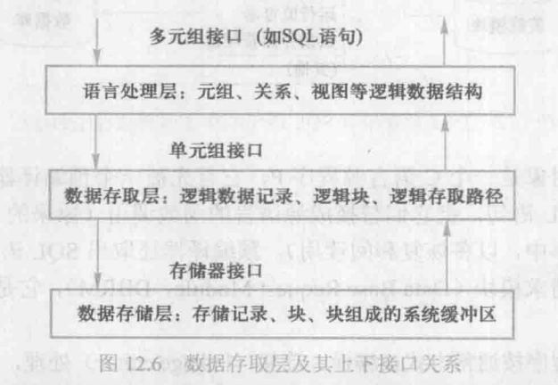

## 12.1 数据库管理系统的基本功能

数据库管理系统已经发展成为继操作系统之后最复杂的系统软件。前面已讲过，数据库管理系统主要是实现对共享数据有效的组织、存储、管理和存取。围绕数据，数据库管理系统应具有如下基本功能。

1. 数据库定义和创建

	创建数据库主要是用**数据定义语言**定义和创建数据库模式、外模式、内模式等数据库对象。在关系数据库中就是建立数据库（或模式）、表、视图、索引等，还有创建用户、安全保密定义（如用户口令、级别、角色、存取权限）、数据库的完整性定义。这些定义存储在数据字典（亦称系统目录）中，是**数据库管理系统运行的基本依据**。

2. 数据组织，存储和管理

	数据库管理系统要**分类组织、存储和管理**各种数据，包括数据字典、用户数据、存取路径等。要确定以何种文件结构和存取方式在存储器上组织这些数据，以及如何实现数据之间的联系。数据组织和存储的基本目标是提高存储空间利用率和方便存取，提供多种存取方法（如索引查找、hash 查找、顺序查找等）以提高存取效率。

3. 数据存取

	数据库管理系统**提供用户对数据的操作功能**，实现对数据库数据的*检索、插入、修改和删除*。一个好的关系数据库管理系统应该提供功能强且易学易用的数据操纵语言、方便的操作方式和较高的数据存取效率。数据操纵语言有两类：宿主型语言和自立（独立）型语言。

4. 数据库事务管理和运行管理

	这是指数据库管理系统的**运行控制和管理功能**，包括多用户环境下的事务管理功能和安全性、完整性控制功能；数据库恢复、并发控制和死锁检测（或死锁防止）、安全性检查和存取控制、完整性检查和执行、运行日志的组织管理等。这些功能保证了数据库系统的正常运行，保证了事务的ACID特性。

5. 数据库的建立和维护

	此项功能包括数据库的初始建立、数据的转换、数据库的转储和恢复、数据库的重组织和重构造以及性能监测分析等。

6. 其他功能

	此外，数据库管理系统还包括与网络中其他软件系统的通信功能；一个数据库管理系统与另一个数据库管理系统或文件系统的数据转换功能；异构数据库之间的互访和互操作功能等。随着技术的发展，许多新的应用对数据库管理系统提出了新的需求。数据库管理系统要不断发展新的数据管理技术，例如 XML 数据、流数据、空间数据、多媒体数据等管理技术。

和操作系统、编译系统等系统软件相比，数据库管理系统具有**跨度大，功能多**的特点。从最底层的存储管理、缓冲区管理、数据存取操作、语言处理到最外层的用户接口、数据表示、开发环境的支持都是它要实现的功能。

## 12.2 数据库管理系统的系统结构

### 12.2.1 数据库管理系统的层次结构

一个关系数据库管理系统的层次结构示例:


在图12.1中，最上层是**应用层**，位于关系数据库管理系统的核心之外。应用层处理的对象是各种各样的数据库应用。该层是关系数据库管理系统与用户/应用程序的界面层。

第二层是**语言处理层**。该层处理的对象是**数据库语言，如SQL**：向上提供的数据接口是关系、视图，即元组的集合。该层的功能是对数据库语言的各类语句进行语法分析、视图转换、安全性检查、完整性检查、查询优化等；通过对下层基本模块的调用，生成可执行代码，这些代码的运行即可完成数据库语句的功能要求。

第三层是**数据存取层**。该层处理的对象是**单个元组，把上层的集合操作转换为单记录操作**。该层执行扫描（如表扫描），排序，元组的查找、插入、修改、删除，封锁等基本操作；完成数据记录的存取、存取路径维护、事务管理、并发控制和恢复等工作。

第四层是**数据存储层**。该层处理的对象是**数据页和系统缓冲区**，执行文件的逻辑打开、关闭、读页、写页、缓冲区读和写、页面淘汰等操作，完成缓冲区管理、内外存交换、外存的数据管理等功能。

**操作系统是数据库管理系统的基础**，它处理的对象是**数据文件的物理块**，执行物理文件的读写操作，保证数据库管理系统对数据逻辑上的读写真实地映射到物理文件上。操作系统提供的**存取原语**和**基本的存取方法**通常作为数据库管理系统数据存储层的接口。

以上所述的关系数据库管理系统层次结构划分的思想具有**普遍性**。当然，具体系统在划分细节上会是多种多样的，可以根据关系数据库管理系统实现的环境以及系统的规模灵活处理。

### 12.2.2 关系数据库管理系统的运行过程示例


（1） 用户 A 通过应用程序A 向关系数据库管理系统发出调用数据库数据的命令，如SELECT 命令，命令中给出了一个关系名和查找条件。

（2） 关系数据库管理系统首先对命令进行语法检查，检查通过后进行语义检查和用户存取权限检查。具体做法是，关系数据库管理系统读取数据字典，检查是否存在该关系及相应的字段、该用户能否读取它们等，确认语义正确、存取权限合法后便决定执行该命令，否则拒绝执行，返回错误信息。

（3）关系数据库管理系统执行查询优化。优化器要依据数据字典中的信息进行优化，并把该命令转换成一串单记录的存取操作序列。

（4） 关系数据库管理系统执行存取操作序列（反复执行以下各步，直至结束）。

（5） 关系数据库管理系统首先在系统缓冲区中查找记录，若找到满足条件的记录则转到（10），否则转到（6）。

（6）关系数据库管理系统查看存储模式，决定从哪个文件、用什么方式读取哪个物理记录。

（7）关系数据库管理系统根据（6）的结果，向操作系统发出读取记录的命令。

（8）操作系统执行读数据的有关操作。

（9）操作系统将数据从数据库的存储区送至系统缓冲区。

（10） 关系数据库管理系统根据查询命令和数据字典的内容导出用户所要读取的记录格式。

（11）关系数据库管理系统将数据记录从系统缓冲区传送到应用程序A 的用户工作区。

（12）关系数据库管理系统将执行状态信息，如成功读取或不成功的错误指示、例外状态信息等返回给应用程序A。

对照在 12.2.1 小节中给出的关系数据库管理系统层次结构，可以大致作如下的对应：

- 动作（1）属于第一层—应用层。
- 动作（2）、（3）由第二层——语言处理层来完成。
- 动作（4）、（10）、（11）、（12）由第三层—数据存取层来完成。
- 动作（5）、（6）、（7）由第四层——数据存储层来进行。
- 动作（8）、（9）由操作系统执行。

整个关系数据库管理系统的各层模块互相配合、互相依赖，共同完成对数据库的操纵。

## 12.3 语言处理层

关系数据库管理系统一般向用户提供多种形式的语言，如交互式命令语言（如SQL）、嵌入主语言的嵌入式语言（如 ESQL）、过程化语言（如过程化SQL 和存储过程）等。这些语言都是由关系数据库管理系统的语言处理层来支持的。

### 12.3.1 语言处理层的任务和工作步骤

语言处理层的任务就是把用户在各种方式下提交给关系数据库管理系统的**数据库语句**转换成对关系数据库管理系统内层**可执行的基本存取模块的调用序列**。

数据库语言通常包括**数据定义语言、数据操纵语言和数据控制语言**三部分。

#### 数据定义语句

对于 数据定义语句 ，语言处理层完成语法分析后，首先翻译成内部表示，然后存储到系统的数据字典中。对数据控制语句的定义部分，如安全保密定义、存取权限定义、完整性约束定义等的处理与数据定义语句相同。

数据字典是**数据操纵语句的处理、执行**以及**关系数据库管理系统运行管理**的基本依据。

在关系数据库管理系统中数据字典通常采用和普通数据同样的表示方式，即也用**关系表（table）**来表示。数据字典包括关系定义表、属性表、视图表、视图属性表、视图表达式表、用户表、用户存取权限表等。

#### 数据操纵语句


如图 12.4 所示，数据操纵语句的处理过程如下。

1. 对数据操纵语句进行词法分析和语法分析，并把外部关系名、属性名转换为内部名。词法和语法分析通过后便生成语法分析树。
    在符号转换过程中需存取数据字典。

2. 根据数据字段中的内容进行查询检查，包括审核用户的存取权限和完整性检查。

    对那些具有存取谓词的存取权限，它们可能与数据的具体取值有关，则此时不能确定该语句能否执行，于是还要生成相应的动作，以便运行时检查。

	完整性检查是查询检查的重要内容。关系数据库管理系统参照数据字典中的完整性约束规则，这时只是进行部分静态约束检查，如检查数据的类型、范围是否符合数据定义。

	很多完整性约束条件是在执行时检查的，如实体完整性约束是在执行数据插入时检查的，即检查插入的元组其主码是否已经存在，以保证主码的唯一性。同样，这时也要检查参照完整性约束（若有的话）。此外，对某些动态完整性规则，它们与数据值和执行过程有关，则也要在操作执行时进行检查。

	查询检查还包括视图消解，也称为视图转换。视图转换是指，若数据操纵语言语句涉及对视图的操纵，则首先要从数据字典中取出视图的定义，根据该定义把对视图的操作转换力对基本表的操作。

3. 对查询进行优化。代数优化、存取路径优化（物理优化）。

综上，将数据库操纵语句转换成一串可执行的存取动作这一过程称为一个逐步**束缚的**过程。它将数据操纵语言**高级的描述型语句**（集合操作）转换为系统内部**低级的单元组操作**，将具体的**数据结构、存取路径、存储结构**等结合起来，构成了**一串确定的存取动作**。

在各种具体的关系数据库管理系统中，这一束缚过程基本一致，但进行这一过程的时间则有所不同，有的在运行中进行，有的在运行前进行，于是形成了两种基本的翻译方法：解释方法和预编译方法。

### 12.3.2 解释方法

解释方法的具体做法是指直到执行前，数据操纵语句都以原始字符串的形式保存，当**执行到该语句时**，才利用解释程序去完成图12.4中所示的全部过程，同时予以执行。这种方法通过尽量推迟束缚过程来赢得数据独立性。

解释方法具有**灵活、应变性强**的优点，甚至能适应在解释过程中发生的数据结构、存储结构等的变化，因此能保持**较高的数据独立性**。但由于每次执行一个数据操纵语句时都要执行图12.4所示的所有步骤，尤其当这样的语句位于一个循环体内时，就要多次重复解释一个数据操纵语句，开销会很大，因此**效率比较低**。

随着数据库技术的发展，解释方法已逐步被预编译方式所取代，目前这种方法主要用交互式 SQL。

### 12.3.3 预编译方法（TODO，没懂）

预编译方法的基本思想是指在用户**提交数据操纵语句之后**，**在运行之前对它进行翻译处理**，保存产生好的可执行代码。当需要运行时，取出保存的可执行代码加以执行。下面以DB2 为例说明这种方法。图12.5 描述了 DB2处理嵌入 SQL 语句的应用程序的过程。


假定被处理的对象是一个C语言源程序P，它首先被一个预编译器处理。这个预编译器的功能是识别 SQL 语句，把它们替换成源语言的函数调用（原来的SQL 语句作注解放在修改后的源程序中，以备恢复和阅读用）。预编译器还取出 SQL 语句，将每个SQL 语向生成一个数据库请求模块（Data Base Request Module, DBRM），它是下一步束缚过程的输入。

修改后的C源程序按通常方式被编译、连接 （linkage editor）处理，生成装载模块。

束缚过程类似图 12.4执行的功能，它实际上是一个 SQL 语句的优化编译器，编译一个至多个数据库请求模块，生成应用规划。应用规划包含了对基本存取模块的调用，完成数据库请求模块对应的源 SQL 语句的功能。

这样，一个C源程序现在分成了两部分：装载模块和应用规划。

在运行时，当装载模块执行过程中遇到访问数据库的函数调用时，就把控制权交给运行监督器。运行监督器找到相应的应用规划后将其调入内存并转让控制权，然后由应用规划去启用数据存储管理器执行实际的数据存取，并将结果返回给C程序。

使用这种方法会遇到这样的问题：在束缚过程中进行优化所依据的条件可能在运行前已不存在，或者数据库结构已被修改，因而导致已作出的应用规划在执行时不再有效。例如，在束缚过程中决定使用某一索引来加快存取速度，而在该程序编译完成之后、运行之前，该索引被删除了，那么运行时就会出现不可预测的现象。

为了解决这类问题，采用了重编译方法，即当数据库中因某些成分的改变而使一些程序（语）的编译结果无效时，再对它们执行一次编译。重编译可在不同时刻进行。为了提高整个系统的效率，不应在数据库某一成分改变后就立即对受影响的那些源程序重编译，较好的方法是将受影响的编译结果置“无效”标志，在其被执行时才进行自动重编译。

自动重编译技术使得预编译方法既拥有了编译时进行束缚所带来的高效率，又具备了执行时束缚带来的数据独立性。实践证明，预编译方法的效率比其他方法高两倍以上。

## 12.4 数据存取层

数据存取层介于语言处理层和数据存储层之间。它向上提供单元组接口，即导航式的一次一个元组的存取操作；向下则以系统缓冲区的存储器接口作为实现基础，其接口关系如图12.6所示。



存取层的任务主要包括：

1. 提供一次一个元组的查找、插入、删除、修改等基本操作
2. 提供元组查找所循的存取路径以及对存取路径的维护操作，如索引记录的增删改查。若索引是采用 B+ 树，则应提供 B+ 树的建立、查找、插入、删除、修改等功能。
3. 对记录和存取路径的封锁、解锁操作
4. 日志文件的登记和读取操作
5. 其他辅助操作，如扫描、合并/排序，其操作对象有关系、有序表、索引等。

### 12.4.1 数据存取层的系统结构

数据存取层包括许多功能，在实际的关系数据库管理系统中由多个功能子系统来完成。图12.7是数据存取层的系统结构，它包括下列子系统和模块。


- 记录存取、事务管理子系统；
- 控制信息管理模块；
- 排序/合并子系统；
- 存取路径维护子系统；
- 封锁子系统，执行并发控制；
- 日志登记子系统，用以执行恢复任务。

### 12.4.2 数据存取层的功能子系统

数据存取层中有些子系统如封锁子系统、日志登记子系统等的功能已在前面的章节中做了介绍，下面只做扼要介绍。

#### 1. 记录存取、事务管理子系统

数据存取层不涉及存储分配、存储结构及有关参数，只在数据的逻辑结构上操作，因而可以把各种物理实现形态隐蔽起来。

记录存取子系统提供**按某个属性值直接取一个元组和顺序取一个元组的存取原语**。这种存取运算是按已选定的某个逻辑存取路径进行的，如某个数据文件或某个索引。这类存取操作的例子有；

* 在某个存取路径上按属性值找元组（FIND）；
* 按相对位置找元组（NEXT, PRIOR, FIRST, LAST）；
* 给某关系增加一个元组（INSERT）；
* 从找到的元组中取某个属性值（GET）；
* 从某关系中删去一个元组（DELETE）；
* 把某修改完的元组写回关系中（REPLACE）。

事务管理子系统提供**定义和控制事务的操作**。数据库中事务是并发控制和恢复的单位。事务管理的基本操作有：

* 定义事务开始（BEGIN TRANSACTION）；
* 事务提交（COMMIT）；
* 事务回滚（ROLLBACK）。

**事务管理子系统提供的这些操作将登记进日志文件中**。

#### 2. 日志登记子系统

日志登记子系统和事务管理子系统紧密配合，**完成关系数据库管理系统对事务和数据库的恢复任务**，它把事务的开始、回滚、提交，对元组的插入、删除、修改，以及对索引记录的插入、删除、修改等每一个操作作为一个日志记录存入日志文件中。当事务或系统软、硬件发生故障时利用日志文件执行恢复。与日志文件有关的主要操作有：

* 写日志记录（WRITELOG）；
* 读日志记录（READLOG）；
* 扫描日志文件（SCANLOG）；
* 撤销尚未结束的事务（UNDO）；
* 重做已经结束的事务（REDO）。

#### 3. 控制信息管理模块

该模块利用专门的数据区（内存中）登记不同记录类型以及不同存取路径的说明信息（取自数据字典）和控制信息，这些信息是存取元组和管理事务的依据。控制信息管理模块和事务管理、记录存取子系统一起保证事务的正常运行。

该模块提供**对数据字典中说明信息的读取、增加、删除和修改操作**。

#### 4. 排序/合并子系统

在语言处理层中，描述性语言表达的集合级操作被转换成一系列对数据存取层所提供的存取原语的调用。为了得到用户所要求的有序输出，为了加速关系运算（如自然连接）的中间步骤，常常需要对关系元组重新排序，这一工作由排序/合并子系统来完成。下面列举排序操作的若干主要用途。

（1） 输出有序结果

例如，用户提出如下查询要求：

```sql
    SELECT Eno, Salary
    FROM EMP
    ORDER BY Salary DESC;
```

若 `EMP` 表上的 Salary 属性已建有索引（如B+树），则可以顺序扫描索引获得要求的输出。若 Salary 上没有索引，则必须对 EMP 表按 Salary 的属性值降序排序，以得到所要的结果。

（2） 数据预处理

对于并、交、差、分组聚集、连接、取消重复值、属于、不属于等关系运算，当参与运算的关系无法全部放入内存时，先对其进行排序预处理，再在有序表上执行相应操作的作法是降低处理代价的常用手段，它可以将操作代价由 $O(n^2)$数量级降至 $O(nlog_2n)$数量级。

（3）支持动态建立索引结构

B+树是数据库中常用的索引结构。B+树的叶页索引记录形式为（码值，TID），其中TID为元组标识符。TID 可用元组逻辑记录号、主码值或数据块号加位移等来表示。索引记录在B+树的叶页上是顺序存储的，因此在初建B+树索引时首先要对（码值，TID）排序。

（4）减少数据块的存取次数

通过 B+树索引存取元组时，首先得到（码值，TID）集合，然后根据 TID 存取相应的元组。当 TID 是用数据块号加位移来表示时，可以首先对 TID 排序，使相同或临近块号的 TID 聚集在一起，然后按数据块号顺序存取物理数据块，避免无序状态下重复读块的情况，减少数据块的存取次数。

排序操作还有很多其他用途。

由此可见，排序操作是数据存取子系统和存取路径维护子系统都要经常调用的操作。它对提高系统效率具有关键的作用。因此，排序子系统的设计十分重要，应采用**高效的外排序算法**（因排序的数据量很大，所以要使用外排序算法）。

#### 5. 存取路径维护子系统

对数据执行插入、删除、修改操作的同时，要对相应的存取路径进行维护。例如，若用B+树索引作为存取路径，则对元组进行插入、删除、修改操作时要对该表上已建立的所有B+树索引进行动态维护，插入、删除相应的索引项；否则，就会造成 B+树索引与数据库表的不一致，当再通过 B+树索引结构存取元组时便会造成操作失败或错误结果。

#### 6. 封锁子系统

封锁子系统完成并发控制功能。有关封锁的概念和技术，包括封锁的类型、封锁相容矩阵、死锁处理、可串行性准则、两段锁协议等已在前面章节详细讨论，这里只说明以下两点：

（1）在操作系统中也有并发控制问题，其实现并发控制的方法通常也采用封锁技术。数据库管理系统的封锁技术与操作系统的封锁技术相比（见表12.1所示），内容更加丰富，技术更加复杂。

（2） 数据库管理系统中封锁子系统设计的难点不仅在于技术复杂，而且在于其实现手段依赖于操作系统提供的环境。如封锁表的设计，由于封锁表必须能为多个进程共享，能动态建立和释放，因此封锁表的设计就随操作系统环境而异。它是封锁子系统设计的关键。


## 12.5 缓冲区管理

数据存储层的主要功能是存储管理，包括缓冲区（buffer）管理、内外存交换、外存管理等，其中缓冲区管理是十分重要的。数据存储层向数据存取层提供的接口是由**定长页面组成的系统缓冲区**。

系统缓冲区的设立出于两方面的原因：一是它把数据存储层以上各系统成分和实际的外存设备隔离，外存设备的变更不会影响其他系统成分，使关系数据库管理系统具有**设备独立性**；二是**提高存取效率**。

关系数据库管理系统利用系统缓冲区缓存数据，当数据存取层需要读取数据时，数据存储子系统首先到系统缓冲区中查找。只有当缓冲区中不存在该数据时才真正从外存读入该数据所在的页面。当数据存取层写回一元组到数据库中时，存储子系统并不把它立即写回外存，仅把该元组所在的缓冲区页面作一标志，表示可以释放。只有当该用户事务结束或缓冲区已满需要调入新页时，才按一定的淘汰策略把缓冲区中已有释放标志的页面写回外存。这样可以减少内外存交换的次数，提高存取效率。

系统缓冲区可由内存或虚存组成。由于内存空间紧张，缓冲区的大小、缓冲区内存和虚存部分的比例要精心设计，针对不同应用和环境按一定的模型进行调整。既不能让缓冲区占据太大的内存空间，也不能因其空间太小而*频频缺页、调页，造成“抖动”*，影响效率。

图 12.8给出了缓冲区及上下接口示意图。

缓冲区由控制信息和若干定长页面组成。缓冲区管理模块向上层提供的操作是缓冲区的读（READBUF）、写（WRITEBUF）。缓冲区内部的管理操作有查找页、申请页、淘汰页。缓冲区管理调用操作系统的操作有读（READ）、写（WRITE）。以读操作为例，缓冲区管理的大致过程如图 12.9所示。可以看到缓冲区管理中主要算法是**淘汰算法**和**查找算法**。操作系统中有许多淘汰算法可以借鉴，如 FIFO（先进先出算法）、LRU（最近最少使用的先淘汰算法）以及它们的各种改进算法。查找算法用来确定所请求的页是否在内存，可采用顺序扫描、折半查找、hash 查找算法等。


## 12.6 数据库的物理组织

数据库是大量数据的有结构的综合性集合。如何将这样一个庞大的数据集合以最优的形式组织起来存放在外存上是一个非常重要的问题。所谓“优”应包括两方面：

- 一是存储效率高，节省存储空间；
- 二是存取效率高，速度快，代价小。

**数据库实现的基础是文件**，对数据库的任何操作最终要转化为对文件的操作。所以在数据库的物理组织中，基本问题是**如何设计文件组织**或者**利用操作系统提供的基本的文件组织方法**。

文件组织的基本方法和常用的文件组织形式参考数据结构课程。本节主要讨论如何利用基本的文件组织方法来实现数据库组织。

数据库系统是文件系统的发展。文件系统中每个文件存储同质实体的数据，各文件是孤立的，没有体现实体之间的联系。**数据库系统中数据的物理组织必须体现实体之间的联系，支持数据库的逻辑结构**——各种数据模型。因此数据库中要存储4方面的数据：

- 数据描述，即数据外模式、模式、内模式。
- 数据本身。
- 数据之间的联系。
- 存取路径。

这4个方面的数据内容都要采用一定的文件组织方式组织、存储起来。

### 数据字典组织

数据字典的特点是数据量比较小、使用频繁，因为任何数据库操作都要参照数据字典的内容。关系数据库中数据字典的组织通常与数据本身的组织相同。数据字典按不同的内容在逻辑上组织为若干张表，在物理上可以将一个字段表对应一个物理文件，由操作系统负责存储管理；也可以将若干字典表对应一个物理文件，由关系数据库管理系统负责存储组织和管理。

### 数据及数据联系的组织

关于数据自身的组织，数据库管理系统可以根据数据和处理的要求自己设计文件结构，也可以从操作系统提供的文件结构中选择合适的加以实现。目前，操作系统提供的常用文件结构有 顺序文件、索引文件、索引顺序文件、hash 文件（杂凑文件）和B树类文件等。

**数据库中数据组织与数据之间的联系是紧密结合的**。在**数据的组织和存储中**必须直接或间接、显示或隐含地**体现数据之间的联系**，这是数据库**物理组织中主要考虑和设计的内容**。

在网状和层次数据库中常用**邻接法**和**链接法**实现数据之间的联系。对应到物理组织方式中，就要在操作系统已有的文件结构上实现数据库的存储组织和存取方法。

网状数据库中最常用的组织策略是各记录型分别用某种文件结构组织，记录型之间的联系——SET 用指引元方式实现。即在每个记录型中增加数据库管理系统控制和维护的系统数据项——指引元，它和用户数据项并存于同一个记录中。

关系数据库实现了数据表示的单一性。实体及实体之间的联系都用一种数据结构—“表”来表示，因此数据和数据之间的联系两者组织方式相同。在数据库的物理组织中，与数据字典类似，可以一个表对应一个物理文件，由操作系统负责存储管理，也可以多个表对应一个物理文件，由关系数据库管理系统负责存储组织和管理。

### 存取路径的组织
在网状和层次数据库中，存取路径是用数据之间的联系来表示的，因此已与数据结合并固定下来。

**在关系数据库中存取路径和数据是分离的，对用户是隐蔽的。存取路径可以动态建立与删除**。存取路径的物理组织通常采用B树类文件结构和 hash 文件结构。在一个关系上可建立若干个索引。在执行查询时数据库管理系统查询优化模块也会根据优化策略自动建立索引（？？？），提高查询效率。由此可见，关系数据库中存取路径的建立是十分**灵活**的。