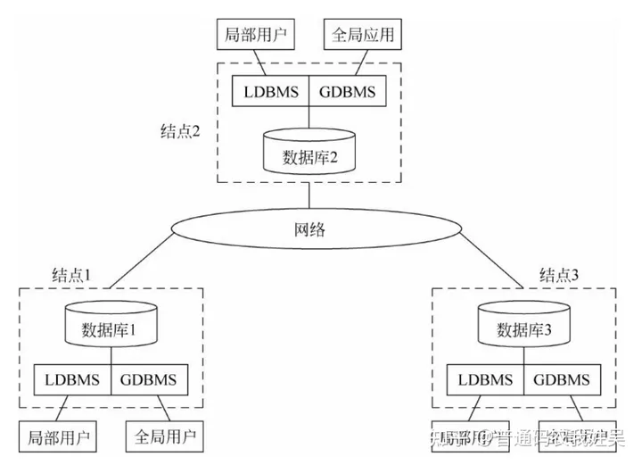
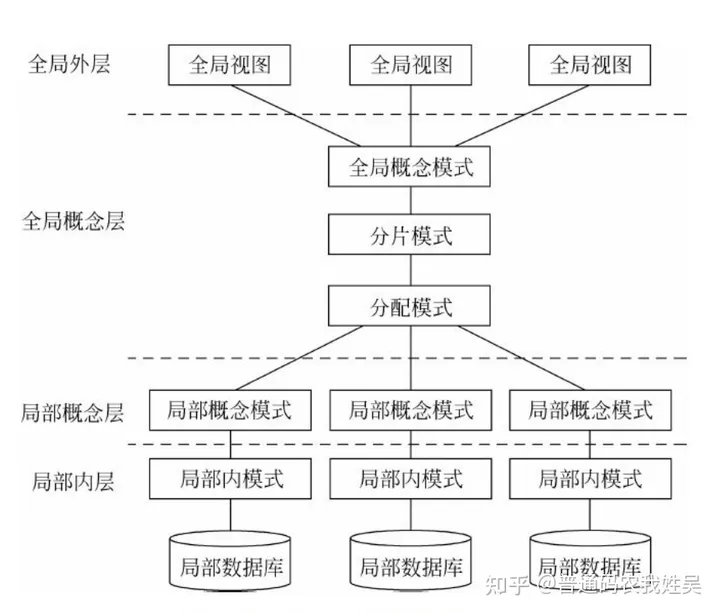

## 13.1 数据库技术发展历史回顾

数据库技术的核心是**数据管理**。

## 13.2 数据库发展的三个阶段

**数据模型是数据库系统的核心和基础**。依据**数据模型的进展**，数据库技术可以相应地分为三个发展阶段，即第一代的网状、层次数据库系统，第二代的关系数据库系统，以及新一代的数据库大家族。

### 13.2.1 第一代数据库系统

层次模型和网状模型都是格式化模型。它们从体系结构、数据库语言到数据存储管理均具有共同特征，是第一代数据库系统。共同特点：

1. 支持三级模式（外模式、模式、内模式）的体系结构。模式之间具有转换（或称映射）功能。
2. 用存取路径来表示数据之间的联系。这是数据库系统和文件系统的主要区别之一。
    数据库不仅存储数据，而且存储数据之间的联系。数据之间的联系在层次和网状数据库系统中都是用存取路径来表示和实现的。
3. 独立的数据定义语言。层次数据库系统和网状数据库系统有独立的数据定义语言，用以描述数据库的三级模式以及相互映像。诸模式一经定义，就很难修改。
4. 导航的数据操纵语言。层次和网状数据库的数据查询和数据操纵语言是一次一个记录的导航式的过程化语言。这类语言通常嵌入某一种高级语言，如COBOL、FORTRAN、PL/1、C语言中。

导航式数据操纵语言的优点是按照预设的路径存取数据，效率高：缺点是编程繁琐，应用程序的可移植性较差，数据的逻辑独立性也较差。

### 13.2.2 第二代数据库系统

支持关系模型的关系数据库系统是第二代数据库系统。

第二代关系数据库系统具有模型简单清晰、理论基础好、数据独立性强、数据库语言非过程化和标准化等特色。

### 13.2.3 新一代数据库系统

第一、二代数据库系统的数据模型虽然描述了现实世界数据的结构和一些重要的相互联系，但是仍不能捕捉和表达数据对象所具有的丰富而重要的语义。

新一代数据库系统以**更丰富多样的数据模型**和**数据管理功能**为特征，满足广泛复杂的新应用的要求。新一代数据库技术的研究和发展导致了众多不同于第一、二代数据库的系

第三代 DBMS 应具有的三个基本特征（称为三条基本原则），从三个基本特征导出了13个具体的特征和功能（称为13个命题）。

这三个基本特征是：

（1）第三代数据库系统应支持**数据管理、对象管理和知识管理**。除提供传统的数据管理服务外，第三代数据库系统将支持更加丰富的对象结构和规则，应集数据管理、对象管理和知识管理为一体。第三代数据库系统不像第二代关系数据库那样有一个统一的关系模型，《宣言》认为无论该数据库系统支持何种复杂的、非传统的数据模型，它都应该具有**面向对象模型**的基本特征。

（2） 第三代数据库系统必须**保持或继承第二代数据库系统**的技术。第三代数据库系统应继承第二代数据库系统已有的技术；保持第二代数据库系统的非过程化数据存取方式和数据独立性，这不仅能很好的支持对象管理和规则管理，而且能更好地支持原有的数据管理，支持多数用户需要的即席查询等。

（3） 第三代数据库系统必须**对其他系统开放**。数据库系统的开放性表现在支持数据库语言标准；在网络上支持标准网络协议；系统具有良好的可移植性、可连接性、可扩展性和可互操作性等。

## 13.3 数据库系统发展的特点

### 13.3.1 数据模型的发展

#### 面向对象数据模型

将语义数据模型和面向对象程序设计方法结合起来，用面向对象观点来描述现实世界实体（对象）的逻辑组织、对象间限制、联系等的模型。一系列面向对象核心概念构成了面向对象数据模型（Object Oriented Data Model, 00模型）的基础，主要包括以下一些概念：

（1）现实世界中的任何事物都被建模为对象。每个对象具有一个唯一的对象标识（OID）。

（2） 对象是其状态和行为的封装，其中状态是对象属性值的集合，行为是变更对象状态的方法集合。

（3）具有相同属性和方法的对象的全体构成了类，类中的对象称为类的实例。

（4）类的属性的定义域也可以是类，从而构成了类的复合。类具有继承性，一个类可以继承另一个类的属性与方法，被继承类和继承类也称为超类和子类。类与类之间的复合与继承关系形成了一个有向无环图，称为类层次。

（5）对象是被封装起来的，它的状态和行为在对象外部不可见，从外部只能通过对象显式定义的消息传递对对象进行操作。

**面向对象数据库**（OODB）的研究始于 20世纪80年代，有许多面向对象数据库产品相继问世，较著名的有 Object Store、02、ONTOS 等。与传统数据库一样，面向对象数据库系统对数据的操纵包括数据查询、增加、删除、修改等，也具有并发控制、故障恢复、存储管理等完整的功能。不仅能支持传统数据库应用，也能支持非传统领域的应用，包括CAD/CAM、OA、CIMS、GIS 以及图形、图像等多媒体领域、工程领域和数据集成等领域。

对象关系数据库系统（Object Relational DataBase System, ORDBS）是关系数据库与面向对象数据库的结合。它保持了关系数据库系统的非过程化数据存取方式和数据独立性，继承了关系数据库系统已有的技术，支持原有的数据管理，又能支持OO模型和对象管理。

### 13.3.2 数据库技术与相关技术相结合

数据库技术与其他计算机技术相结合，是数据库技术的一个显著特征，随之也涌现出各种数据库系统，例如：

- 数据库技术与分布处理技术相结合，出现了分布式数据库系统；
- 数据库技术与并行处理技术相结合，出现了并行数据库系统；
- 数据库技术与人工智能技术相结合，出现了演绎数据库、知识库和主动数据库系统；
- 数据库技术与多媒体技术相结合，出现了多媒体数据库系统；
- 数据库技术与模糊技术相结合，出现了模糊数据库系统等；
- 数据库技术与移动通信技术相结合，出现了移动数据库系统等；
- 数据库技术与 Web 技术相结合，出现了 Web 数据库等。

#### 分布式数据库

分布式数据库由一组数据组成，这组数据分布在计算机网络的不同计算机上，网络中的每个结点具有独立处理的能力，可以执行局部应用，称为**场地自治**。同时，每个结点也能通过网络通信系统执行全局应用。

分布式数据库系统的**本地自治性** （local autonomy）是指局部场地的数据库系统可以自己决定本地数据库的设计、使用以及与其他节点的数据库系统的通信。分布式数据库系统的**分布透明性**（distributed transparency）是指分布式数据库管理系统将数据的分布封装起来，用户访问分布式数据库就像与集中式数据库打交道一样，不必知道也不必关心数据的存放和操作位置等细节。

分布式数据库系统在集中式数据库系统的组成基础上增加了三个部分：**DDBMS**、**全局字典和分布目录**、**网络访问进程**。全局字典和分布目录为 DDBMS提供了数据定位的元信息，网络访问进程使用高级协议来执行局部站点和分布式数据库之间的通信。

### 13.3.3 面向应用领域的数据库新技术

面向特定应用领域的数据库系统，也称为特种数据库系统。

#### 工程数据库

工程数据库（Engineering Data Base, EDB）是一种能存储和管理各种工程设计图形和工程设计文档，并能为工程设计提供各种服务的数据库。当数据库应用于工程领域时，发现传统的数据库对具有复杂结构和工程设计内涵的工程对象以及工程领域中的大量“非经典”应用难以胜任。工程数据库正是针对工程应用领域的需求而提出来的。

由于工程数据的数据结构复杂、相互联系紧密、数据存储量大，因此工程数据库管理系统的功能与传统 DBMS 有很大不同，主要应具有以下功能：

（1） 支持复杂对象（如图形数据、工程设计文档）的表示和处理；

（2） 可扩展的数据类型：

（3） 支持复杂多样的工程数据的存储和集成管理；

（4）支持变长结构数据实体的处理；

（5）支持工程长事务和嵌套事务的并发控制和恢复；

（6） 支持设计过程中多个不同数据版本的存储和管理；

（7） 支持模式的动态修改和扩展；

（8） 支持多种工程应用程序等。

工程数据库系统主要有两种实现方式，一种是在关系数据库系统的基础上加以扩充或改进；另一种是开发支持新数据模型的数据库管理系统，其数据模型主要有语义数据模型、面向对象数据模型等。

工程数据库又称为 CAD 数据库、设计数据库、技术数据库、设计自动化数据库等。适合 CAD/CAM/CIM、地理信息处理、军事指挥、控制、通信等工程应用领域。

#### 空间数据库

空间数据是用于表示空间物体的位置、形状、大小和分布特征等诸方面信息的数据，适用于描述所有二维、三维和多维分布的关于区域的现象。

空间数据的特点是不仅包括物体本身的空间位置及状态信息，还包括表示物体的空间关系（即拓扑关系）的信息。属性数据为非空间数据，用于描述空间物体的性质，对空间物体进行语义定义。空间数据库系统（Spatial Data Base System, SDBS）是描述、存储和处理空间数据及其属性数据的数据库系统。

空间数据库的研究始于地图制图与遥感图像处理领域。

空间数据库研究的主要内容包括以下几个方面：

（1） 空间数据模型，描述空间实体和空间实体关系的数据模型，一般用传统的数据模型加以扩充和修改来实现，有的用面向对象的数据模型来实现。

（2）空间数据查询，包括位置查询、空间关系查询和属性查询。前两种查询是空间数据库特有的查询方式。

（3）空间数据库系统，大多数空间数据库系统是以现有的数据库管理系统为基础建立的。上层是各种空间应用，如GIS 应用、CAD应用等；中间层是空间数据库系统，它结合传统的数据库技术实现对空间对象的存储与查询，并提供对空间应用开发的支持：下层是成熟的数据库管理系统，一般采用对象关系数据库管理系统和面向对象数据库管理系统，实现对常规数据的存储和查询。

（4）查询语言，大多是以SQL 语言为基础，增加相应的函数实现对空间对象和空间关系的查询。为了提高访问效率，研究了针对空间数据的索引结构，如面向空间点的索引结构（网格文件、K维树、自适应K维树等》和面向矩形的索引结构（R树、四叉树和单元树等）。

## 13.4 数据管理技术的发展趋势

**数据**、**应用需求**和**计算机硬件技术**是推动数据库发展的三个主要动力或三个重要因素。

### 13.4.1 数据管理技术面临的挑战

随着数据获取手段的自动化、多样化与智能化，数据量越来越巨大，对于海量数据的存储和管理，要求系统具有高度的可扩展性和可伸缩性，以满足数据量不断增长的需要。传统的分布式数据库和并行数据库在可扩展性和可伸缩性方面明显不足。

数据类型越来越多样和异构，传统的数据库对半结构化/非结构化数据的存储、管理和处理能力十分有限。

许多应用中数据快速流入并要立即处理，数据的快变性、实时性要求系统必须迅速决定什么样的数据需要保留，什么样的数据可以丢弃，如何在保留数据的同时存储其正确的元数据等，现有技术还远远不能应对。

以上是数据的变化，再来看看应用和需求的发展。

数据处理和应用的领域已经从 OLTP 为代表的事务处理扩展到 OLAP 分析处理，从对数据仓库中结构化的海量历史数据的多维分析发展到对海量非结构化数据的复杂分析和深度挖掘；并且希望把数据仓库的结构化数据与互联网上的非结构数据结合起来进行分析挖掘，把历史数据与实时流数据结合起来进行处理。人们已经认识到基于数据进行决策分析具有广阔的前景和巨大价值。但是，数据的海量异构、形式繁杂、高速增长、价值密度低等问题阻碍了数据价值的创造。大数据分析已经成为大数据应用中的瓶颈。现有的分析挖掘算法缺乏可扩展性，缺乏对复杂异构数据的高效分析算法，缺乏大规模知识库的支持和应用，缺乏能被非技术领域专家理解的分析结果表达方法。对数据的组织、检索和分析都是基础性的挑战。

计算机硬件技术是数据库系统的基础。

### 13.4.2 数据管理技术的发展与展望

**大数据**给**数据管理**、**数据处理**和**数据分析**提出了全面挑战。支持海量数据管理的系统应具有**高可扩展性**（满足数据量增长的需要）、**高性能**（满足数据读写的实时性和查询处理的高性能）、**容错性**（保证分布系统的可用性）、**可伸缩性**（按需分配资源）等。传统的关系数据库在系统的伸缩性、容错性和可扩展性等方面难以满足海量数据的柔性管理需求，NoSOL技术顺应大数据发展的需要，蓬勃发展。

NoSQL 是指非关系型的、分布式的、不保证满足 ACID 特性的一类数据管理系统。
NoSQL技术有如下特点：

（1） 对数据进行划分（partitioning），通过大量节点的并行处理获得高性能，采用的是横向扩展的方式（scale out）。

（2）放松对数据的 ACID 一致性约束，允许数据暂时出现不一致情况，接受最终一致性 （eventual consistency）。即 NOSQL 遵循 BASE （Basically Available, Soft state，Eventual consistency）原则，这是一种弱一致性（weak consistency）约束框架。

其中，Basically Available（基本可用）是指可以容忍数据短期不可用，并不强调全天候服务；Soft state（柔性状态）是指状态可以有一段时间不同步，存在异步的情况；Eventually consistent（最终一致）是指最终数据一致，而不是严格的一致。

（3）对各个数据分区进行备份（一般是三份），应对节点可能的失败，提高系统可用性等。

NOSQL 技术依据存储模型可分为基于 Key-Value 存储模型、基于 Column Family（列分组）存储模型、基于文档模型和基于图模型的NOSQL 数据库技术4类。

分析型 NoSQL 技术的主要代表是 MapReduce 技术。MapReduce 技术框架包含三方面的内容：高度容错的分布式文件系统，并行编程模型和并行执行引擎。MapReduce 并行编程模型的计算过程分解为两个主要阶段，即 Map 阶段和 Reduce 阶段。Map 函数处理 Key/Value 对，产生一系列的中间 Key/Value 对；Reduce 函数合并所有具有相同 Key 值的中间 Key/Value 对，计算最终结果。用户只需编写 Map 函数和 Reduce 函数，MapReduce框架在大规模集群上自动调度执行编写好的程序，扩展性、容错性等问题由系统解决，用户不必关心。

各类技术的**互相借鉴、融合和发展**是未来数据管理领域的发展趋势。

## 面向对象的数据库系统

[【数据库原理】（35）面向对象的数据库系统介绍](https://zhuanlan.zhihu.com/p/678874519)

面向对象的数据库系统（OODBS）结合了传统数据库技术和面向对象程序设计方法的优势，特别适用于处理复杂数据结构和关系，以及支持高级数据查询和操作。

面向对象数据库系统的应用优势:

- 支持复杂数据类型：如图像、大文本、科学数据等。
- 更好的数据抽象：更直观地映射现实世界的实体和关系。
- 灵活的数据模型：支持复杂对象和继承，减少数据冗余。
- 高效的数据操作：通过面向对象的方法，提高数据处理的效率和灵活性。

OODBS 应满足的两个准则：

- 首先。OODBS 是一个 DBS，应具备 DBS 的基本功能。譬如查询语言、事务管理、一致性控制、和恢复等。
- 其次，OODBS 是一个面向对象系统，具有持久对象、自定义数据类型、自定义函数、对象封装等必不可少的特点。

适用场景:

科学实验数据库、电信数据库、地理信息系统（GIS）、多媒体数据库等领域，特别是那些需要处理复杂数据结构和关系的应用。

### 面向对象数据库系统的基本特征

以下是OODBS的一些基本特征和能力：

1. 具有表达和管理对象的能力：
    - OODBS通过对象及其相互关系来描述现实世界，每个对象具有独立的标识。
    - 支持类的层次结构和继承机制，允许新类从现有类继承属性和方法。
    - 实现对象间的关系，保持引用完整性，如ODMG标准提出的反向引用。
2. 具有任意复杂度的对象结构：
    - 允许定义具有复杂结构的对象，这使得对象能包含描述自身的所有必要信息。
    - 相对于传统数据库，OODBS保持了现实世界对象与数据库表示之间的直接对应关系。
    - 支持逐步细化复杂实体，并将复杂对象或其子集作为独立单位进行操作。
3. 具有与面向对象编程语言交互的接口：
    - 提供与面向对象编程语言（如Java、C++）的交互接口。
    - 支持对象的持久化存储，即使程序结束后对象也继续存在，可被检索或其他程序使用。
    - 允许多个程序和应用共享持久化对象。
4. 具有表达和管理数据库变化的能力：
    - 管理对象的多版本，支持设计和工程应用中的版本控制。
    - 允许模式演变，即类的声明发生变化时，也能够适应和更新。

### 二.面向对象数据模型

面向对象数据模型（OODM）是一种在现代数据库系统中越来越受欢迎的模型，它融合了对象导向程序设计的概念和数据库管理技术。下面是OODM的核心概念和特性的详细解释：

1. 对象
    在 OODM 中，**对象是最基本的单位**，包含了数据结构（属性）和在这些数据结构上的操作（方法）。在 OODB 中对象可以定义为一组信息（数据）和一组操作（方法）。包含其他对象的对象称为复合对象或复杂对象。
    对象的描述包括静态（如属性）和动态（如方法）两方面的内容：
    - 1.1 属性
        属性用于描述对象的状态、组成和特征。
        在OODM中，**属性也可以是对象**，支持复杂的、层次化的数据结构。
    - 1.2 方法
        方法描述对象的行为特征，可以改变对象的状态。
2. 对象标识
    - 每个对象都有一个在**系统内唯一的标识 OID**（Object Identifier），独立于对象的内容，且在对象生存期内不能改变。
    - 对象标识用于唯一地标识每个对象，对外部用户是不可见的。
3. 封装和消息
    - 封装隐藏了对象的内部实现细节，提高了**数据的独立性和程序的可靠性**。封装性是一种**信息隐蔽技术**。
    - 对象之间的交互通过消息传递进行，确保了**对象的封装性和数据的完整性**。
4. 类
    - 类是具有相同属性和方法的**对象的集合**。类相当于 E-R 模型中的实体集。
    - 类的概念类似于关系数据库中的关系模式，但它还包括方法的定义。
    - 类可以有类属性和类方法，这些属性和方法适用于类本身而不是类的实例。
    - **类本身也是一个对象**。类的每个对象也称为类的实例。
5. 继承
    - 继承允许新类从现有类继承属性和方法。
    - 支持单继承和多重继承。
    - 通过继承，子类可以添加新的属性和方法，也可以重写父类的方法。
    - 不同类的对象共享公共部分的结构和特性称为继承性。

面向对象数据模型的优势在于其能够更自然地表示现实世界的对象和它们之间的关系，同时提供了更强大的数据抽象和封装能力。这种模型特别适合于需要处理复杂数据结构的应用，如CAD/CAM系统、知识库和人工智能应用等。由于其强大的表达能力和灵活性，OODM在处理复杂的数据和关系时通常比传统的关系数据库更为有效。

### 四. 对象关系数据库

对象关系数据库是一种数据库系统，它结合了关系数据库的特点和面向对象数据库的优势。这种数据库系统旨在处理更复杂的应用场景，如音频、视频、大文本、图像处理以及空间和地理数据等。以下是对象关系数据库的一些关键概念和特性：

1. **嵌套关系**  
    在对象关系数据库中，域不仅可以是原子的，还可以是关系，允许关系中嵌套关系，从而更好地表达复杂对象。

2. **复杂类型**  
    支持非原子数据类型，如嵌套记录，可以直接表达实体标识、多值属性、一般化和特殊化等概念，无需经过复杂的关系模型转换。

3. **继承、引用类型**  
    - 支持在类型级别和表级别上的继承，允许一个类型继承另一个类型的特性。  
    - 类型的一个属性可以是对指定类型对象的引用，增强了数据模型的表现力。

4. **与复杂类型有关的查询**  
    支持路径表达式、集合体为值的属性、嵌套与解除嵌套等查询类型，以适应复杂数据类型。

5. **函数与过程**  
    允许定义和使用用户定义的函数和存储过程，可以用SQL或外部编程语言（如Java、C或C++）来实现。

6. **面向对象与对象关系**  
    - 在市场上，持久化程序设计语言的面向对象数据库和基于关系模型的对象关系数据库都有自己的应用领域。  
    - 对象关系系统的目标是通过使用复杂数据类型来简化数据建模和查询，适用于复杂数据存储和查询等应用。  
    - 持久化程序设计语言的面向对象数据库更适合主要在内存中运行和对数据库进行大量访问的应用，满足高性能要求。

## 一. 数控系统体系结构

[【数据库原理】（36）分布式数据库系统介绍](https://zhuanlan.zhihu.com/p/678889253)

数据库系统的体系结构描述了系统的整体组织和各组成部分之间的关系。现代数据库系统体系结构通常考虑计算机系统的联网、并行和分布特性。以下是数据库系统的主要体系结构类型：

### 1. 集中式数据库系统
**定义**：由单个处理器和关联的存储设备组成，通常位于同一地点。

**特点**：

- 所有数据处理和管理集中在一个或中心站点。
- 用户可在相同站点或通过远程终端操作。
- 数据和数据管理是集中的。

### 2. 客户/服务器数据库体系结构
**定义**：由客户端（通常是个人电脑或工作站）和服务器端（可能是大型工作站、小型或大型计算机系统）组成。

客户机/服务器系统由服务器平台、客户平台和连接支持部分组成。

**特点**：

- 功能分为前端和后端。
- 前端包括用户界面和应用工具，后端负责数据库存取、查询优化等。
- 适用于联机事务处理和决策支持应用。

### 3. 分布式数据库系统
**定义**：数据库系统分布在计算机网络中，但对用户来说看起来像一个统一的数据库。

**特点**：

- 数据在物理上分布，逻辑上集中。
- 支持数据的更好共享，提供比客户/服务器架构更广泛的数据共享能力。
- 包括物理上分布、逻辑上集中的结构和物理上逻辑上都分布的结构。

### 4. 并行数据库系统
**定义**：多个处理器和并行的数据存储设备组成，提高处理能力和输入/输出速度。

**特点**：

- 适用于需要处理大规模数据库或高事务量的应用。
- 高吞吐量和快速响应时间。
- 可能存在初始化和共享资源竞争带来的性能下降问题。

### 总结

数据库系统体系结构的选择依赖于应用的需求，如数据量、处理速度、地理分布、用户访问模式等。集中式数据库系统适合小型和单一位置的应用，客户/服务器体系结构适合中等规模且需要高并发的应用，分布式数据库系统适用于需要数据共享和分散处理的大型应用，而并行数据库系统适合于大数据和高性能的要求。每种体系结构都有其优势和局限性，选择合适的体系结构对于满足业务需求和提高系统性能至关重要。

## 二. 分布式数据库系统的概念和特点

分布式数据库系统（DDBS）是一种特殊的数据库管理系统，它的数据分布在地理上分散的计算机网络中，同时这些数据在逻辑上又是相关联的。以下是分布式数据库系统的基本概念和特点：

### 基本概念

- 组成：由多个结点或场地组成，每个结点都有自己的局部数据库管理系统（LDBMS）和全局数据库管理系统（GDBMS）。
- 用户类型：包括局部用户（只关心单个结点上的数据）和全局用户（可能需要访问多个结点上的数据）。
- 数据处理能力：每个结点具有独立处理能力，可执行局部应用，也能通过网络执行全局应用。

分布式数据库系统中**分布透明性**，指用户不必关心数据的逻辑分布和数据物理位置分布的细节，可以归入物理独立性的范围。
包括**分片透明性、位置透明性、数据模型透明性**3种，透明性层次依次降低。

数据分片的方式主要有**水平分片、垂直分片、导出分片和混合分片**。

分布式数据库系统可分为**同构同质型、同构异质型和异构型**。

分布式系统中影响查询的主要因素是：

- 不同场地的通信速度较低
- 通信系统的较高存取延迟时间
- cpu处理通信的代价高
- 不同通信系统间的数据转换速度差别大

查询处理和优化的主要目标是**减少数据在网络上的传输代价**。

### 特点

- 分布性：数据存储在多个不同的结点上。
- 逻辑相关性：数据库系统内的数据在逻辑上具有相互关联的特性。
- 场地透明性：使用数据时无需指明数据所在的位置。
- 场地自治性：每个单独的结点能执行局部的应用请求。

分布式数据库的特点是 数据独立性、集中于自制相结合的控制结构、适当增加数据冗余度、全局的一致性、可串行性和可恢复性。

分布式数据库系统的特点之一是**集中与自治相结合，支持全局应用**。

### 分布式数据库系统与传统数据库系统的对比

- 集中控制性：分布式数据库也具有集中控制的特性，但由于数据的分散性，这些特点具有新的含义。
- 数据独立性：数据独立性在分布式数据库系统中同样重要，包括传统意义上的数据独立性和分布式透明。
- 数据冗余可控性：分布式数据库中的数据冗余是可控的，有助于提高查询效率和数据的可用性。
- 场地自治性：分布式数据库系统中的每个结点都能执行局部应用，同时也参与全局数据库。
- 存取效率：分布式数据库系统中的查询优化有两个级别：全局优化和局部优化。

分布式数据库和集中式数据库的最大区别是数据分布存储在多个场地。

与集中式DBS相比，分布式DBS的优点有6个：

- 灵活的体系结构
- 分布式的管理和控制机构
- 经济性能优越
- 系统可靠性高、可用性好
- 全部应用的响应速度快
- 可扩展性好。

缺点有3个：

- 在通信部分开销较大，访问数据的开销不在于读写数据，而在于通信开销
- 存取结构复杂
- 数据的安全性、保密性较难处理

### 重要性

分布式数据库系统的重要性在于其能够有效地管理分散在不同地理位置的数据，并提供对这些数据的高效访问。这种系统结构特别适用于那些需要在多个地点访问和处理数据的大型组织和应用。

总的来说，分布式数据库系统通过其独特的体系结构和功能，提供了数据共享、高可用性和地理分布式数据管理的优势，同时保持了数据的一致性和独立性。

### DDBMS 功能与组成

功能有5点：

- 接收并处理用户请求
- 访问网络数据字典
- 分布式处理
- 通信接口功能
- 异构型处理

组成包括：

- 查询子系统
- 完整性子系统
- 调度子系统
- 可靠性子系统

### 分布式数据库的体系结构

分布式数据库的四层模式结构是对分布式数据库系统架构的一个重要划分，它有助于理解和管理分布式数据库的复杂性。这个结构将数据库系统分为以下四个层次，每个层次都有其特定的功能和角色：

1. **全局外层（Global External Layer）**:

    - 这一层提供给最终用户的是全局视图。
    - 用户在这一层看到的是整个分布式系统的统一视图，而不是各个局部数据库的分散视图。
    - 这有助于实现数据的透明性，即用户不需要知道数据实际存储在网络的哪个位置。

2. **全局概念层（Global Conceptual Layer）**:

    - 这层定义了全局概念模式，它是整个分布式数据库系统的逻辑结构和组织方式的表现。
    - 这个层次抽象了各个结点的局部数据，形成一个统一的全局视图。

3. **局部概念层（Local Conceptual Layer）**:

    - 这层涉及到各个结点的局部数据库系统，每个结点都有自己的局部概念模式。
    - 这些局部概念模式描述了每个结点上的数据库结构和约束。

4. **局部内层（Local Internal Layer）**:

    - 这层是关于每个结点的局部数据库的物理存储和内部表示。
    - 它涉及到数据的物理存储方式，如数据在硬盘上的存储结构和访问方法等。

在这些层之间存在层间映射，确保数据从一个层次到另一个层次的正确转换。这种四层模式的划分适用于各种类型的分布式数据库系统，无论是同构型还是异构型。这种分层方法有助于系统地管理分布式数据库的复杂性，同时保证了数据的完整性、一致性和透明性。

分片模式是指每一个全局关系可以分为若干个不相交的部分。每个部分称为片段。分片模式定义片段以及全局关系与片段之间的映像，这种映像是一对多的，一个全局关系可以对应多个片段，而一个片段只来自一个全局关系。

分布模式是指片段作为全局关系的逻辑部分，一个片段在物理上可以分配到网络的不同节点上。分布模式定义片段的存放节点，即根据数据分布策略选择定义片段的存放场地。
