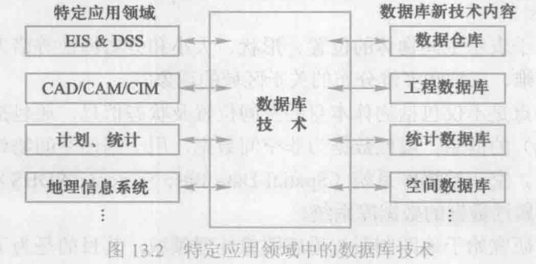

## 13.1 数据库技术发展历史回顾

数据库技术的核心是**数据管理**。

## 13.2 数据库发展的三个阶段

**数据模型是数据库系统的核心和基础**。依据**数据模型的进展**，数据库技术可以相应地分为三个发展阶段，即第一代的网状、层次数据库系统，第二代的关系数据库系统，以及新一代的数据库大家族。

### 13.2.1 第一代数据库系统

层次模型和网状模型都是格式化模型。它们从体系结构、数据库语言到数据存储管理均具有共同特征，是第一代数据库系统。共同特点：

1. 支持三级模式（外模式、模式、内模式）的体系结构。模式之间具有转换（或称映射）功能。
2. 用存取路径来表示数据之间的联系。这是数据库系统和文件系统的主要区别之一。
    数据库不仅存储数据，而且存储数据之间的联系。数据之间的联系在层次和网状数据库系统中都是用存取路径来表示和实现的。
3. 独立的数据定义语言。层次数据库系统和网状数据库系统有独立的数据定义语言，用以描述数据库的三级模式以及相互映像。诸模式一经定义，就很难修改。
4. 导航的数据操纵语言。层次和网状数据库的数据查询和数据操纵语言是一次一个记录的导航式的过程化语言。这类语言通常嵌入某一种高级语言，如COBOL、FORTRAN、PL/1、C语言中。

导航式数据操纵语言的优点是按照预设的路径存取数据，效率高：缺点是编程繁琐，应用程序的可移植性较差，数据的逻辑独立性也较差。

### 13.2.2 第二代数据库系统

支持关系模型的关系数据库系统是第二代数据库系统。

第二代关系数据库系统具有模型简单清晰、理论基础好、数据独立性强、数据库语言非过程化和标准化等特色。

### 13.2.3 新一代数据库系统

第一、二代数据库系统的数据模型虽然描述了现实世界数据的结构和一些重要的相互联系，但是仍不能捕捉和表达数据对象所具有的丰富而重要的语义。

新一代数据库系统以**更丰富多样的数据模型**和**数据管理功能**为特征，满足广泛复杂的新应用的要求。新一代数据库技术的研究和发展导致了众多不同于第一、二代数据库的系

第三代 DBMS 应具有的三个基本特征（称为三条基本原则），从三个基本特征导出了13个具体的特征和功能（称为13个命题）。

这三个基本特征是：

（1）第三代数据库系统应支持**数据管理、对象管理和知识管理**。除提供传统的数据管理服务外，第三代数据库系统将支持更加丰富的对象结构和规则，应集数据管理、对象管理和知识管理为一体。第三代数据库系统不像第二代关系数据库那样有一个统一的关系模型，《宣言》认为无论该数据库系统支持何种复杂的、非传统的数据模型，它都应该具有**面向对象模型**的基本特征。

（2） 第三代数据库系统必须**保持或继承第二代数据库系统**的技术。第三代数据库系统应继承第二代数据库系统已有的技术；保持第二代数据库系统的非过程化数据存取方式和数据独立性，这不仅能很好的支持对象管理和规则管理，而且能更好地支持原有的数据管理，支持多数用户需要的即席查询等。

（3） 第三代数据库系统必须**对其他系统开放**。数据库系统的开放性表现在支持数据库语言标准；在网络上支持标准网络协议；系统具有良好的可移植性、可连接性、可扩展性和可互操作性等。

## 13.3 数据库系统发展的特点

### 13.3.1 数据模型的发展

#### 面向对象数据模型

将语义数据模型和面向对象程序设计方法结合起来，用面向对象观点来描述现实世界实体（对象）的逻辑组织、对象间限制、联系等的模型。一系列面向对象核心概念构成了面向对象数据模型（Object Oriented Data Model, 00模型）的基础，主要包括以下一些概念：

（1）现实世界中的任何事物都被建模为对象。每个对象具有一个唯一的对象标识（OID）。

（2） 对象是其状态和行为的封装，其中状态是对象属性值的集合，行为是变更对象状态的方法集合。

（3）具有相同属性和方法的对象的全体构成了类，类中的对象称为类的实例。

（4）类的属性的定义域也可以是类，从而构成了类的复合。类具有继承性，一个类可以继承另一个类的属性与方法，被继承类和继承类也称为超类和子类。类与类之间的复合与继承关系形成了一个有向无环图，称为类层次。

（5）对象是被封装起来的，它的状态和行为在对象外部不可见，从外部只能通过对象显式定义的消息传递对对象进行操作。

面向对象数据库（OODB）的研究始于 20世纪80年代，有许多面向对象数据库产品相继问世，较著名的有 Object Store、02、ONTOS 等。与传统数据库一样，面向对象数据库系统对数据的操纵包括数据查询、增加、删除、修改等，也具有并发控制、故障恢复、存储管理等完整的功能。不仅能支持传统数据库应用，也能支持非传统领域的应用，包括CAD/CAM、OA、CIMS、GIS 以及图形、图像等多媒体领域、工程领域和数据集成等领域。

对象关系数据库系统（Object Relational DataBase System, ORDBS）是关系数据库与面向对象数据库的结合。它保持了关系数据库系统的非过程化数据存取方式和数据独立性，继承了关系数据库系统已有的技术，支持原有的数据管理，又能支持OO模型和对象管理。

### 13.3.2 数据库技术与相关技术相结合

数据库技术与其他计算机技术相结合，是数据库技术的一个显著特征，随之也涌现出各种数据库系统，例如：

- 数据库技术与分布处理技术相结合，出现了分布式数据库系统；
- 数据库技术与并行处理技术相结合，出现了并行数据库系统；
- 数据库技术与人工智能技术相结合，出现了演绎数据库、知识库和主动数据库系统；
- 数据库技术与多媒体技术相结合，出现了多媒体数据库系统；
- 数据库技术与模糊技术相结合，出现了模糊数据库系统等；
- 数据库技术与移动通信技术相结合，出现了移动数据库系统等；
- 数据库技术与 Web 技术相结合，出现了 Web 数据库等。

#### 分布式数据库

分布式数据库由一组数据组成，这组数据分布在计算机网络的不同计算机上，网络中的每个结点具有独立处理的能力（称为场地自治），可以执行局部应用。同时，每个结点也能通过网络通信系统执行全局应用。

分布式数据库系统的本地自治性 （local autonomy）是指局部场地的数据库系统可以自己决定本地数据库的设计、使用以及与其他节点的数据库系统的通信。分布式数据库系统的分布透明性（distributed transparency）是指分布式数据库管理系统将数据的分布封装起来，用户访问分布式数据库就像与集中式数据库打交道一样，不必知道也不必关心数据的存放和操作位置等细节。

分布式数据库系统在集中式数据库系统的组成基础上增加了三个部分：**DDBMS**、**全局字典和分布目录**、**网络访问进程**。全局字典和分布目录为 DDBMS提供了数据定位的元信息，网络访问进程使用高级协议来执行局部站点和分布式数据库之间的通信。

### 13.3.3 面向应用领域的数据库新技术

面向特定应用领域的数据库系统，也称为特种数据库系统。

#### 工程数据库

工程数据库（Engineering Data Base, EDB）是一种能存储和管理各种工程设计图形和工程设计文档，并能为工程设计提供各种服务的数据库。当数据库应用于工程领域时，发现传统的数据库对具有复杂结构和工程设计内涵的工程对象以及工程领域中的大量“非经典”应用难以胜任。工程数据库正是针对工程应用领域的需求而提出来的。

由于工程数据的数据结构复杂、相互联系紧密、数据存储量大，因此工程数据库管理系统的功能与传统 DBMS 有很大不同，主要应具有以下功能：

（1） 支持复杂对象（如图形数据、工程设计文档）的表示和处理；

（2） 可扩展的数据类型：

（3） 支持复杂多样的工程数据的存储和集成管理；

（4）支持变长结构数据实体的处理；

（5）支持工程长事务和嵌套事务的并发控制和恢复；

（6） 支持设计过程中多个不同数据版本的存储和管理；

（7） 支持模式的动态修改和扩展；

（8） 支持多种工程应用程序等。

工程数据库系统主要有两种实现方式，一种是在关系数据库系统的基础上加以扩充或改进；另一种是开发支持新数据模型的数据库管理系统，其数据模型主要有语义数据模型、面向对象数据模型等。

工程数据库又称为 CAD 数据库、设计数据库、技术数据库、设计自动化数据库等。适合 CAD/CAM/CIM、地理信息处理、军事指挥、控制、通信等工程应用领域。

#### 空间数据库

空间数据是用于表示空间物体的位置、形状、大小和分布特征等诸方面信息的数据，适用于描述所有二维、三维和多维分布的关于区域的现象。

空间数据的特点是不仅包括物体本身的空间位置及状态信息，还包括表示物体的空间关系（即拓扑关系）的信息。属性数据为非空间数据，用于描述空间物体的性质，对空间物体进行语义定义。空间数据库系统（Spatial Data Base System, SDBS）是描述、存储和处理空间数据及其属性数据的数据库系统。

空间数据库的研究始于地图制图与遥感图像处理领域。

空间数据库研究的主要内容包括以下几个方面：

（1） 空间数据模型，描述空间实体和空间实体关系的数据模型，一般用传统的数据模型加以扩充和修改来实现，有的用面向对象的数据模型来实现。

（2）空间数据查询，包括位置查询、空间关系查询和属性查询。前两种查询是空间数据库特有的查询方式。

（3）空间数据库系统，大多数空间数据库系统是以现有的数据库管理系统为基础建立的。上层是各种空间应用，如GIS 应用、CAD应用等；中间层是空间数据库系统，它结合传统的数据库技术实现对空间对象的存储与查询，并提供对空间应用开发的支持：下层是成熟的数据库管理系统，一般采用对象关系数据库管理系统和面向对象数据库管理系统，实现对常规数据的存储和查询。

（4）查询语言，大多是以SQL 语言为基础，增加相应的函数实现对空间对象和空间关系的查询。为了提高访问效率，研究了针对空间数据的索引结构，如面向空间点的索引结构（网格文件、K维树、自适应K维树等》和面向矩形的索引结构（R树、四叉树和单元树等）。

## 13.4 数据管理技术的发展趋势

**数据**、**应用需求**和**计算机硬件技术**是推动数据库发展的三个主要动力或三个重要因素。

### 13.4.1 数据管理技术面临的挑战

随着数据获取手段的自动化、多样化与智能化，数据量越来越巨大，对于海量数据的存储和管理，要求系统具有高度的可扩展性和可伸缩性，以满足数据量不断增长的需要。传统的分布式数据库和并行数据库在可扩展性和可伸缩性方面明显不足。

数据类型越来越多样和异构，传统的数据库对半结构化/非结构化数据的存储、管理和处理能力十分有限。

许多应用中数据快速流入并要立即处理，数据的快变性、实时性要求系统必须迅速决定什么样的数据需要保留，什么样的数据可以丢弃，如何在保留数据的同时存储其正确的元数据等，现有技术还远远不能应对。

以上是数据的变化，再来看看应用和需求的发展。

数据处理和应用的领域已经从 OLTP 为代表的事务处理扩展到 OLAP 分析处理，从对数据仓库中结构化的海量历史数据的多维分析发展到对海量非结构化数据的复杂分析和深度挖掘；并且希望把数据仓库的结构化数据与互联网上的非结构数据结合起来进行分析挖掘，把历史数据与实时流数据结合起来进行处理。人们已经认识到基于数据进行决策分析具有广阔的前景和巨大价值。但是，数据的海量异构、形式繁杂、高速增长、价值密度低等问题阻碍了数据价值的创造。大数据分析已经成为大数据应用中的瓶颈。现有的分析挖掘算法缺乏可扩展性，缺乏对复杂异构数据的高效分析算法，缺乏大规模知识库的支持和应用，缺乏能被非技术领域专家理解的分析结果表达方法。对数据的组织、检索和分析都是基础性的挑战。

计算机硬件技术是数据库系统的基础。

### 13.4.2 数据管理技术的发展与展望

**大数据**给**数据管理**、**数据处理**和**数据分析**提出了全面挑战。支持海量数据管理的系统应具有**高可扩展性**（满足数据量增长的需要）、**高性能**（满足数据读写的实时性和查询处理的高性能）、**容错性**（保证分布系统的可用性）、**可伸缩性**（按需分配资源）等。传统的关系数据库在系统的伸缩性、容错性和可扩展性等方面难以满足海量数据的柔性管理需求，NoSOL技术顺应大数据发展的需要，蓬勃发展。

NoSQL 是指非关系型的、分布式的、不保证满足 ACID 特性的一类数据管理系统。
NoSQL技术有如下特点：

（1） 对数据进行划分（partitioning），通过大量节点的并行处理获得高性能，采用的是横向扩展的方式（scale out）。

（2）放松对数据的 ACID 一致性约束，允许数据暂时出现不一致情况，接受最终一致性 （eventual consistency）。即 NOSQL 遵循 BASE （Basically Available, Soft state，Eventual consistency）原则，这是一种弱一致性（weak consistency）约束框架。

其中，Basically Available（基本可用）是指可以容忍数据短期不可用，并不强调全天候服务；Soft state（柔性状态）是指状态可以有一段时间不同步，存在异步的情况；Eventually consistent（最终一致）是指最终数据一致，而不是严格的一致。

（3）对各个数据分区进行备份（一般是三份），应对节点可能的失败，提高系统可用性等。

NOSQL 技术依据存储模型可分为基于 Key-Value 存储模型、基于 Column Family（列分组）存储模型、基于文档模型和基于图模型的NOSQL 数据库技术4类。

分析型 NoSQL 技术的主要代表是 MapReduce 技术。MapReduce 技术框架包含三方面的内容：高度容错的分布式文件系统，并行编程模型和并行执行引擎。MapReduce 并行编程模型的计算过程分解为两个主要阶段，即 Map 阶段和 Reduce 阶段。Map 函数处理 Key/Value 对，产生一系列的中间 Key/Value 对；Reduce 函数合并所有具有相同 Key 值的中间 Key/Value 对，计算最终结果。用户只需编写 Map 函数和 Reduce 函数，MapReduce框架在大规模集群上自动调度执行编写好的程序，扩展性、容错性等问题由系统解决，用户不必关心。

各类技术的互相借鉴、融合和发展是未来数据管理领域的发展趋势。