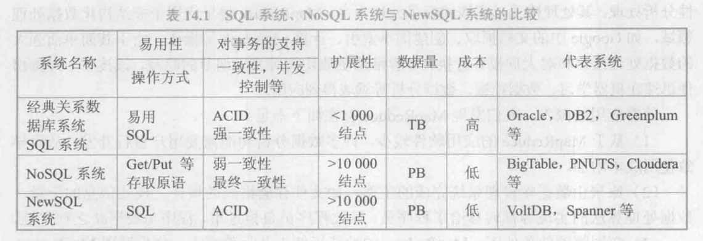
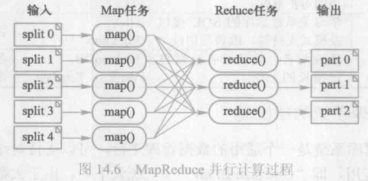
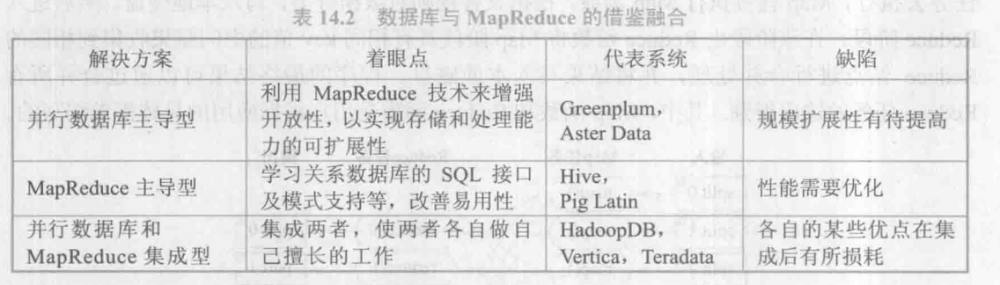

## 14.1 大数据概述

### 14.1.1 什么是大数据

当前，人们从不同的角度在诠释大数据的内涵。关于大数据的一个定义是，一般意义上，大数据是指无法在可容忍的时间内用现有 IT 技术和软硬件工具对其进行感知、获取、管理、处理和服务的数据集合。

有专家按大数据的应用类型将大数据分为海量交易数据（企业 OLTP 应用）、海量交互数据（社交网、传感器、全球定位系统、Web 信息）和海量处理数据（企业 OLAP应用）。

海量交易数据的应用特点是数据海量、读写操作比较简单、访问和更新频繁、一次交易的数据量不大，但要求支持事务ACID 特性。对数据的完整性及安全性要求高，必须保证强一致性。

海量交互数据的应用特点是实时交互性强，但不要求支持事务特性。其数据的典型特点是类型多样异构、不完备、噪音大、数据增长快，不要求具有强一致性。

海量处理数据的应用特点是面向海量数据分析，计算复杂，往往涉及多次迭代完成，追求数据分析的高效率，但不要求支持事务特性。典型的应用是采用并行与分布处理框架实现。其数据的特点是同构性（如关系数据或文本数据或列模式数据）和较好的稳定性（不存在频繁的更新操作）。

当然，可以从不同的角度对大数据进行分类，目的是有针对性地进行研究与利用。例如，有些专家将网络空间（cyberspace）中各类应用引发的大数据称为网络大数据，并按数据类型分为自媒体数据、日志数据和富媒体数据三类。

### 14.1.2 大数据的特征
大数据不仅仅是量“大”，它具有许多重要的特征。专家们归纳为若干个V，即：巨量（Volume）、多样（Variety）、快变（Velocity）、价值（Value）。大数据的这些特征给我们带来了巨大的挑战。

#### 1. 巨量

大数据的首要特征是数据量巨大，而且在持续、急剧地膨胀。

大规模数据的几个主要来源如下：

1. 科学研究（天文学、生物学、高能物理等）、计算机仿真领域。
1. 互联网应用、电子商务领域。
1. 传感器数据（sensor data）。
1. 网站点击流数据（click stream data）。
1. 移动设备数据（mobile device data）。
1. 无线射频识别数据（RFID Data）。
1. 传统的数据库和数据仓库所管理的结构化数据也在急速增大。

#### 2. 多样

数据的多样性通常是指异构的数据类型、不同的数据表示和语义解释。现在，越来越多的应用所产生的数据类型不再是纯粹的关系数据，更多的是非结构化、半结构化的数据，如文本、图像、音频等。

对异构海量数据的组织、分析、检索、管理和建模是基础性的挑战。

针对半结构化、非结构化数据的高效表达、存取和分析技术，需要大量的基础研究。

#### 3. 快变

大数据的快变性也称为实时性，一方面指数据到达的速度很快，另一方面指能够进行处理的时间很短，或者要求响应速度很快，即实时响应。

许多大数据往往以数据流的形式动态、快速地产生和演变，具有很强的时效性。流数据来得快，对流数据的采集、过滤、存储和利用需要充分考虑和掌控它们的快变性。加上要处理的数据集大，数据分析和处理的时间将很长。而在实际应用需求中常常要求立即得到分析结果。

#### 4. 价值

大数据的价值是潜在的、巨大的。大数据不仅具有经济价值和产业价值，还具有科学价值。这是大数据**最重要的特点**，也是大数据的魅力所在。

大数据价值的潜在性，是指数据蕴含的巨大价值只有通过对大数据以及数据之间蕴含的联系进行复杂的分析、反复深入的挖掘才能获得。

此外，IBM还提出了另一个 V，即真实性（Veracity），旨在针对大数据噪音、数据缺失、数据不确定等问题强调数据质量的重要性，以及保证数据质量所面临的巨大挑战。

## 14.2 大数据的应用
### 14.2.1 感知现在 预测未来——互联网文本大数据管理与挖掘

互联网媒体又称网络媒体，是以互联网为传输平台，以计算机、移动电话、便携设备等为终端，以文字、声音、图像等形式来传播新闻信息的一种数字化、多媒体的传播媒介。互联网媒体相对于传统的报纸、广播、电视等媒体而言，也称为“第四媒体”。

综上所述，互联网文本大数据管理的特点如下：

（1）互联网文本大数据蕴含着丰富的社会信息，可以看作是对真实社会的网络映射。

（2）实时、深入分析互联网文本大数据，帮助人们在海量数据中获取有价值的信息，发现蕴含的规律，可以更好地感知现在、预测未来，体现了第四范式数据密集型科学发现的研究方式和思维方式。

（3）互联网文本大数据管理对大数据系统和技术的挑战是全面的、跨学科跨领域的，需要创新，也要继承传统数据管理技术和数据仓库分析技术的精华。

### 14.2.2 数据服务 实时推荐——基于大数据分析的用户建模
综上所述，这一类大数据应用的特点如下：

（1） 模型的建立（本例中是用户兴趣模型）来自对大数据的分析结果，通俗地讲是“用数据说话”。建模的过程是动态的，随着实际对象的变化，模型也在变化。

（2）数据处理既有对历史数据的离线分析和挖掘，又有对实时流数据的在线采集和分析，体现了大数据上不同层次的分析：流分析、SQL 分析、深度分析的需求。

（3）用户模型本身也是大数据，维度高，信息稀疏，用户模型的存储、管理是数据服务的重要任务，要满足大规模应用需要的高并发数据更新与读取。

## 14.3 大数据管理系统

### 14.3.1 NoSQL数据管理系统

NoSQL 是以互联网大数据应用背景发展起来的分布式数据管理系统。NOSQL 有两种解释：一种是 Non-Relational，即非关系数据库：另一种是 Not Only SQL，即数据管理技术不仅仅是SQL。目前第二种解释更沩流行。

NoSQL 系统支持的数据模型通常分为 Key-Value 模型、BigTable 模型、文档（document）模型和图（graph）模型等4种类型。

（1） Key-Value 模型，记为KV（Key, Value），是非常简单而容易使用的数据模型。每个Key 值对应一个 Value。Value 可以是任意类型的数据值。它支持按照 Key 值来存储和提取 Value 值。Value 值是无结构的二进制码或纯字符串，通常需要在应用层去解析相应的结构。

（2）BigTable 模型，又称 Columns Oriented 模型，能够支持结构化的数据，包括列、列簇、时间戳以及版本控制等元数据的存储。该数据模型的特点是列簇式，即按列存储，每一行数据的各项被存储在不同的列中，这些列的集合称作列簇。每一列的每一个数据项都包含一个时间戳属性，以便保存同一个数据项的多个版本。

（3）文档模型，该模型在存储方面有以下改进：Value 值支持复杂的结构定义，通常是被转换成JSON 或者类似于JSON 格式的结构化文档；支持数据库索引的定义，其索引主要是按照字段名来组织的。

（4）图模型，记G（Y,E）， 为结点（node）集合，每个结点具有若干属性，E边（edge）集合，也可以具有若干属性。该模型支持图结构的各种基本算法。可以直观地表达和展示数据之间的联系。

NoSQL 系统为了提高存储能力和并发读写能力采用了极其简单的数据模型，支持简单的查询操作，而将复杂操作留给应用层实现。该系统对数据进行划分，对各个数据分区进行备份，以应对结点可能的失败，提高系统可用性；通过大量结点的并行处理获得高性能，采用的是横向扩展的方式（scale out）。

### 14.3.2 NewSQL数据库系统

NewSQL 系统是融合了NoSQL 系统和传统数据库事务管理功能的新型数据库系统。

SQL 关系数据库系统长期以来一直是企业业务系统的核心和基础，但是它扩展性差、成本高，难以应对海量数据的挑战。NoSQL 数据管理系统以其灵活性和良好的扩展性在大数据时代迅速崛起。但是，NOSQL 不支持SQL，导致应用程序开发困难，特别是不支持关键应用所需要的事务 ACID 特性。NewSQL 将 SQL 和 NoSQL 的优势结合起来，充分利用计算机硬件的新技术、新结构，研究与开发了若干创新的实现技术。例如，关系数据库在分布式环境下为实现事务一致性使用了两阶段提交协议。

### 14.3.3 MapReduce技术

MapReduce 技术是Google 公司于2004年提出的大规模并行计算解决方案，主要应用于大规模廉价集群上的大数据并行处理。MapReduce 以 key/value 的分布式存储系统为基础，通过元数据集中存储、数据以 chunk为单位分布存储和数据 chunk 冗余复制来保证其高可用性。

MapReduce 是一种并行编程模型。它把计算过程分解为两个阶段，即Map 阶段和Reduce 阶段。具体执行过程如图14.6所示。首先对输入的数据源进行分块，交给多个 Map任务去执行，Map 任务执行 Map 函数，根据某种规则对数据分类，写入本地硬盘。然后进入Reduce 阶段，在该阶段由 Reduce 函数将 Map 阶段具有相同 key 值的中间结果收集到相同的Reduce 结点进行合并处理，并将结果写入本地磁盘。程序的最终结果可以通过合并所有Reduce 任务的输出得到。其中，Map 函数和 Reduce 函数是用户根据应用的具体需求编写的。

MapReduce 是一种简单易用的软件框架。基于它可以开发出运行在成千上万个结点上，并以容错的方式并行处理海量数据的算法和软件。通常，计算结点和存储结点是同一个结点，即 MapReduce 框架和 Hadoop 分布式文件系统（Hadoop Distributed File System, HDFS）运行于相同的结点集。

随着应用的深入，人们发现 MapReduce 存在如下不足：

（1）基于 MapReduce 的应用软件较少，许多数据分析功能需要用户自行开发，从而导致使用成本增加。

（2）原来由数据库管理系统完成的工作，如文件存储格式的设计、模式信息的记录、数据处理算法的实现等都转移给了程序员，导致程序员负担过重，程序与数据缺乏独立性。

（3）在同等硬件条件下，MapReduce 的性能远低于并行数据库。分析发现 MapReduce采取基于扫描的处理模式和对中间结果步步物化的执行策略，从而导致较高的iO代价。

（4）在数据分析领域，连接是关键操作（如传统的星形查询和雪片查询均是依赖于连接来处理查询），但 MapReduce 处理连接的性能尤其不尽如人意。

### 14.3.4 大数据管理系统的新格局
1. 面向操作型应用的关系数据库技术

	基于行存储的关系数据库系统、并行数据库系统、面向实时计算的内存数据库系统等，它们具有高度的数据一致性、高精确度、系统的可恢复性等关键特性，同时扩展性和性能也在不断提高，仍然是众多事务处理系统的核心引擎。此外，以 VoltDB 为代表的NewSQL系统继承了传统数据库的 ACID 特性，同时具有 NoSQL 的扩展性，是新型的面向 OLTP应用的数据管理系统。

2. 面向分析型应用的关系数据库技术

	在数据仓库领域，面向 OLAP 分析的关系数据库系统采用了 Shared Nothing 的并行体系架构，支持较高的扩展性，如 TeraData。同时，数据库工作者研究了面向分析型应用的列存储数据库和内存数据库。列存储数据库以其高效的压缩、更高的I/O 效率等特点，在分析型应用领域获得了比行存储数据库高得多的性能。内存数据库则利用大内存、多核CPU 等新硬件技术和基于内存的新的系统架构成为大数据分析应用的有效解决方案。

	MonetDB 是一个典型的列存储数据库系统，此外还有 InforBright、InfiniDB、LucidDB、Vertica、SybaseIQ、[ClickHouse](https://clickhouse.com/docs/zh) 等。MonetDB、VectorWise 和 HANA 是基于列存储技术的内存数据库系统，主要面向分析型应用。

3. 面向操作型应用的NoSQL 技术

	在大数据时代，操作型应用不仅包括传统的事务处理应用，还有比事务处理更广泛的概念。某些操作型应用主要的数据操作是读和插入，处理的数据量极大，性能要求极高，必须依赖大规模集群的并行处理能力来实现数据处理，但是并不需要ACID 这样的强一致性约束，弱一致性或者最终一致性就足够了。在这些应用场合，就需要使用操作型 NoSQL。

	NoSQL 数据库系统相对于关系数据库系统具有两个明显的优势：

	（1） 数据模型灵活，支持多样的数据类型（包括图数据）。

	（2）高度的扩展性，从来没有一个关系数据库系统部署到超过1000个结点的集群上，而 NOSQL 在大规模集群上获得了极高的性能，如 HBase 一天的吞吐量超过200亿个写操作。Facebook 从使用 MySQL 数据库系统到转向 HBase，最后持续改进 HBase，成为其操作型应用的基础架构。

4. 面向分析型应用的 MapReduce 技术

	系统的高扩展性是大数据分析最重要的需求。MapReduce 并行计算模型框架简单，具有高度的扩展性和容错性，适合于海量数据的聚集计算，获得了学术界和工业界的青睐，成为面向分析型应用的 NoSQL技术的代表。但是 MapReduce 支持的分析功能有限，具有一定的局限性（见14.3.3小节），为了改进其对数据处理的支持能力，许多公司全面投入对MapReduce 的研发。这些公司包括提供 Hadoop 开源版本和支持服务的Cloudera 公司、提供高性能分布式文件系统的 MapR 公司、为 Hadoop 提供完整工具套件的 Karmashpere 公司、致力于 Postgres 和 Hadoop 集成的Hadapt 公司，等等。

	与此同时，传统数据库厂商和数据分析套件厂商也纷纷发布基于 Hadoop 技术的产品发展战略，这些公司包括 Microsoft、Oracle、SAS、IBM 等。例如，IBM 发布了 Big Insights计划，基于 Hadoop、Netezza 和 SPSS（统计分析、数据挖掘软件）等技术和产品，构建大数据分析处理的技术框架。

