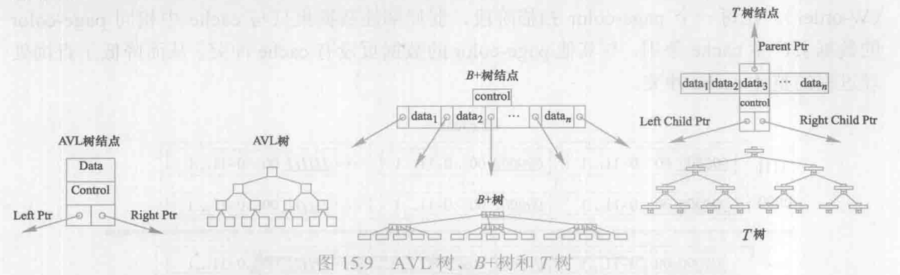

## 15.1 概述

内存数据库是**将内存作为主存储设备**的数据库系统。内存数据库有时也称主存数据库，In-Memory DataBase 等。

与内存数据库相对的磁盘数据库（Disk Resident DataBase, DRDB）是使用磁盘作力常规数据存储设备，使用内存作为工作数据缓冲区的数据库系统。

在磁盘数据库中，磁盘是常规的数据存储设备，磁盘阵列或磁带机是数据的后备存储设备，内存作为磁盘数据库的缓存使用。磁盘数据库的数据组织、存储访问模型及处理模型都是面向磁盘访问特性而设计的，磁盘数据通过缓冲区被处理器间接访问，查询优化的核心是减少磁盘的输入/输出。

在内存数据库中，内存作为常规的数据存储设备，磁盘是数据的永久存储及后备存储设备。内存数据库的数据组织、存储访问模型和查询处理模型都针对内存特性进行了优化设计，内存数据被处理器直接访问。

## 15.2 内存数据库的发展历程
略。
## 15.3 内存数据库的特性

内存是计算机存储体系结构中能够**被程序可控访问**（相对于硬件控制的 cache）的最高层次，是能够提供大量数据存储的最快的存储层。内存数据库具有优异的数据存储访问性能、较高的数据访问带宽和数据并行访问能力等特性。

（1）高吞吐率和低访问延迟

数据库的查询处理性能主要取决于数据的存储访问性能。内存数据库不需要磁盘数据库的缓冲区机制，数据能够被处理器直接访问。内存的**高带宽**和**低访问延迟**保证了内存数据库具有较高的事务吞吐率和较低的查询处理延迟，能够支持高实时响应的应用需求，在金融、电信、电子商务平台等查询负载重，且查询响应时间要求高的应用环境中得到了广泛的应用。

（2） 并行处理能力

内存具有良好的**并行数据访问能力**（当前为四通道内存访问机制）和**随机访问性能**，因此内存数据库的查询处理技术带有天然的并行性，并且可以充分利用随机访间能力提高查询的数据访问效率和CPU 指令效率。多核处理器（multicore cpu）技术和多路服务器平台已成为当前数据库标准的硬件平合。以磁盘为中心的磁盘数据库难以充分利用当前新硬件带来的高度并行计算能力，而内存数据库在查询处理模型中可以充分考虑并行计算能力。

因此在内存数据库的查询处理设计上，既要研究与开发面向内存特性的查询处理优化技术，又要研究并行处理优化技术。

（3）硬件相关性

**内存数据库的性能受硬件特性的直接影响**。计算机硬件技术的发展主要体现在高端计算设备和存储设备上，如多核处理器、众核协处理器（Many Integrated Core，MIC）、通用GPU、 PCM 存储（Phase Change Memory，相变存储）、固态硬盘（Solid State Disk, SSD）存储等。这些计算能力和存储性能的提升有助于内存吞吐率需求的提升（众核技术）、提高内存持久存储能力（PCM技术）或为内存提供二级存储（SSD 技术）。硬件技术在多核及众核处理器、高性能存储和高速网络等方面的发展为内存数据库提供了高并行处理、高性能存储访问以及高速连通的硬件平台。内存数据库的设计应该充分考虑并有效利用由新硬件技术带来的功能扩展和性能提高。

## 15.4 内存数据库的关键技术

### 15.4.1 数据存储

数据库的数据存储一般有行存储模型、列存储模型和混合模型等。

在行存储模型中元组是连续存放的，适合事务处理中一次更新多个属性的操作，能够保证对多个属性的操作产生最小的内存访问；但对于只涉及表中相对较少属性的分析处理时，即使该查询仅涉及元组的某个或某些属性，其他属性也会被同时从内存读入到缓存，降低了缓存利用率。

列存储模型将关系按列进行垂直划分，相同属性的数据连续存储。当访问特定属性时只读入所需要的属性所在的分片，所以节省内存带宽，并且具有较高的数据访问局部性，可减少缓存失效，提高数据访问效率；同时列存储将相同类型的数据集中存储，能够更好地对数据进行压缩以减少内存带宽消耗，利用 SIMD（单指令多数据流）技术提高并行处理效率，通过列存储的数据定长化处理支持对数据按偏移位置的访问。但是，如果查询所需要的属性较多，列存储需要连接多个划分来满足查询要求，则会导致性能下降。特别是元组重构时需要进行较多的连接操作，代价较高。

针对行存储模型和列存储模型各自的不足，A.Ailamaki 等提出了一种混合存储模型PAX （Partition Attributes Across）。该模型把同一元组的所有属性值存储在一页内，在页内对元组进行垂直划分。根据关系的属性个数 m，将每一页划分为m个 MiniPage，每个MiniPage 对应一个属性，连续存放每一页中所有元组的该属性的值。由于元组在页内进行垂直划分，所以该模型具有较好的数据空间局部性，可优化缓存性能；同时，同一元组的值存储在同一页内，所以元组的重构代价比较少。

Data Morphing 也是一种混合存储技术，它在页内按属性访问特征划分为属性组，将属性访问关联度高的属性组合存储，在一次 cache line 访问时获得尽可能多的属性值，提高这些属性访问时的缓存效率。图15.2展示了行存储（a）、PAX 存储（b）、属性组存储（c）的页内物理数据分布。

内存数据库系统既有**联机事务处理（On-Line Transaction Processing,OLTP）更新密集型应用**，也有**联机分析处理（On-Line Analytical Processing,OLAP）复杂分析型应用**，因此行存储和列存储这两种存储模型被不同的内存数据库系统所采用。

与磁盘数据库相比，内存在访问模式和访问速度上的优势为内存数据库的数据组织和存储方式提供了更大的灵活性和多样性。

### 15.4.2 查询处理及优化

内存数据库的查询处理性能主要由两个因素决定：**内存数据访问性能**和**内存数据处理性能**。

内存数据**访问性能**由**内存带宽**和**内存访问延迟**决定。相对于 CPU，内存数据访问性能的增长速度与CPU 性能增长速度之间的差距越来越大。内存访问的巨大延迟 （memory wall）是内存数据库的性能瓶颈。内存数据库查询优化的关键技术是通过**现代 CPU的多级缓存结构** （L1、L2、L3 cache）减少内存数据访问延迟，提高数据访问性能。

内存数据库的**查询处理性能**主要受**处理器性能**影响。CPU 的发展已经进入多核时代，不再单一依靠 CPU主频的提高，更多的处理核心提高了多核CPU 的并行计算能力，因此内存数据库的查询优化技术也进入多核并行时代。

内存数据库，尤其是分析型内存数据库既有**数据密集型处理**的特点，又因其复杂的查询而具有**计算密集型处理**的特点，内存数据库查询优化的重点既包括面向 cache 特性的查询处理与优化技术，又包括面向多核及协处理器的并行查询处理技术。

#### 1. 面向 cache 特性的查询处理与优化技术

内存数据库的基础假设是数据库的工作数据集常驻于内存中（memory resident），从而消除了传统磁盘数据库的1/O 代价，内存数据库的性能较磁盘数据库有数十倍甚至数百倍的提升。但相对于CPU 速度的提升，内存访问需要上百个 CPU 时钟周期的访问延迟，因而成为内存数据库新的瓶颈。

磁盘数据库使用内存缓冲区（buffer）来优化I/O 代价，现代CPU 使用硬件级的多级 cache 机制优化内存访问，内存数据库的内存访问优化由硬件级的 cache 机制来完成，采用类LRU（最近最少访问）替换算法实现 cache 中的数据管理。

多核 CPU 的发展趋势是最后一级 cache（Last Level Cache,LLC）容量随核数增加而增大，LLC 大小是 cache 性能的一个重要指标。

CPU处理的是 cache 中的数据，若CPU 需要的数据不在 cache 中，会导致 cache 失效。cache 失效可以分为强制（compulsory）失效、容量（capacity）失效和冲突（conflict）失效等类型。**强制失效**是数据首次访问时在 cache 中所产生的失效，是内存数据访问不可避免的；**容量失效**是由于工作数据集超过cache 容量大小而导致的数据访问时在 cache 中的失效；**冲突失效**则是在 cache 容量充足时由于大量弱局部性数据（一次性访问数据或复用周期很长的数据）将强局部性数据（频繁使用的数据集）驱逐出 cache而在对强局部性数据重复访问时产生的 cache 失效，冲突失效是现代内存数据库查询优化研究的重要课题。

另一个与内存访问延迟密切相关的硬件是 **TLB**（Translation Lookaside Buffer，旁路转换缓冲，或称为页表缓冲）。TLB 是硬件级缓存，与 CPU 的cache 类似，主要用来存放内存页表。在内存的页表区里，记录虚拟页面和物理页框对应关系的记录称为一个页表条目（entry）。在TLB 里缓存了一些页表条目。当CPU执行机构收到应用程序发来的虚拟地址后，首先到TLB 中查找相应的页表数据，如果 TLB 中正好存放着所需的页表，则称为 TLB命中（TLB hit）。接下来 CPU 依次查看 TLB 中页表所对应的物理内存地址中的数据是不是已经在一级、二级缓存里了，如果不存在则为 TLB miss，需要到页表区进行寻址，把这个映射关系更新到 TLB 中备用。

cache 性能优化算法是一类通过提高 cache 数据的**空间局部性和时间局部性**，从而減少cache 失效、优化 cache 性能的算法。人们从不同角度研究 cache 性能的优化算法，在数据访问方面的 cache 优化技术主要包括以下几类。

1. cache-conscious 优化技术
2. cache-oblivious 优化技术
3. page-coloring 优化技术

cache 优化技术是内存数据库重要但难以触及的研究领域。主要因 cache 管理是硬件级的技术。因此，数据库领域内 cache 优化技术主要通过**对数据在内存中的存储布局、访问模式、数据结构等方面**的优化来提高查询处理过程中数据的cache 命中率。

#### 2. 索引技术

索引是数据库中提高查询性能的有效方法，在磁盘数据库中广泛使用的 hash 索引、B+树索引等不适合内存数据库的需求。

#### 3. 面向多核的查询处理技术

在多核平台上，查询算法需要改写为多核并行算法，将串行操作符并行化。在多核并行优化时需要解决的关键技术包括并行处理时的共享 cache 优化，数据分区优化等技术。

当前内存数据库主要采用三种多核并行 hash 连接技术：

1. 无分区 hash 连接算法。
2. 基于分区的 hash 连接算法
3. radix hash 连接算法

#### 4. 面向众核的查询处理技术

内存数据库面临越来越多的计算核心，查询算法需要进化为高可扩展并行算法，以充分利用先进众核处理器提供的强大并行计算性能。

### 15.4.3 并发与恢复

#### 1. 并发控制

内存数据库与磁盘数据库的并发控制机制类似，细节上存在一定差异。由于数据存储在内存中，内存数据库中的事务执行时间一般较短，因此持锁时间也较短，系统中冲突较少，所以可以采用以下方法减少锁的开销：**采用较大的封锁粒度（如表级锁）：采用乐观加锁方式；减少锁的类型：将锁信息存储在数据本身**。

#### 2. 恢复机制

由于内存的**脆弱性和易失性**，内存数据库中数据容易被破坏和丢失，所以内存数据库数据需要在磁盘等非易失性存储介质中进行备份，并且在对数据更新时将日志写到非易失性存储介质中。

磁盘数据库中的日志都需要在事务提交时写入磁盘。但在内存数据库中，如果在事务提交时将日志写入磁盘，则由于写日志所产生的磁盘 I/O 会延长事务的处理时间，降低内存数据库的性能。

一些研究者提出了预提交、组提交等方法来降低日志I/O 的代价，并提出使用 PCM、flash 等非易失性内存存储日志的方法。首先将日志存储在非易失性内存中，然后提交事务，再异步地把日志写入磁盘。

日志的增加是非常迅速的，为了减少日志量以及恢复的时间，数据库都使用检查点技术来截断日志。内存数据库也是如此，例如，MySQL Cluster 使用了全局检查点（GCP）和局部检查点（LCP），当出现单点失败时，可以使用该失败结点的局部检查点进行数据恢复，当出现全局失败时，则需要使用全局检查点进行统一恢复。TimesTen 申也使用了两种检查点技术：阻塞检查点和非阻塞检查点。

在发生系统崩溃时，如何从备份和日志中恢复数据也是一个值得研究的问题。为了能够尽快地恢复系统的使用，一般可通过两步来恢复数据：第一步，首先恢复热点数据，即执行事务所必须的数据；第二步，在后台恢复其他非热点数据。另外，也可根据数据在磁盘上的存储顺序、优先级（是否为热点数据）以及访问频率等参数来确定数据的装载顺序。
