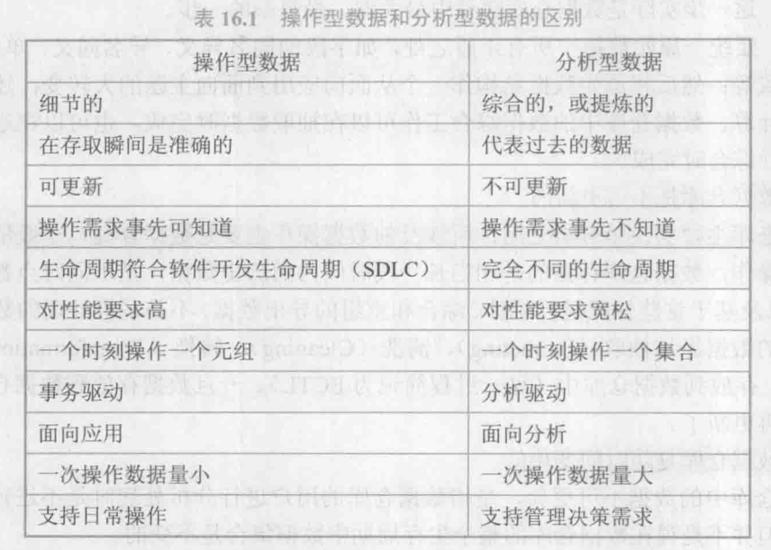

第15 章已经提到，计算机系统中存在着两类不同的数据处理工作：操作型处理和分析型处理，也称作联机事务处理（OLTP）和联机分析处理（OLAP）。

操作型处理也叫事务处理，是指**对数据库联机的日常操作**，通常是对一个或一组记录的查询和修改，如火车售票系统、银行通存通兑系统、税务征收管理系统等。这些系统要求快速响应用户请求，对数据的安全性、完整性以及事务吞吐量要求很高。

分析型处理是指**对数据的查询和分析操作**，通常是对海量的历史数据查询和分析，如金融风险预测预警系统、证券股市违规分析系统等。这些系统要访问的数据量非常大，查询和分析的操作十分复杂。

OLTP 和 OLAP 两者之间的差异使得传统的数据库技术不能同时满足两类数据的处理要求，因此，20世纪80年代数据仓库（Data Warehouse,DW）技术就应运而生了。数据仓库的建立将操作型处理和分析型处理区分开来。**传统的数据库技术为操作型处理服务，数据仓库为分析型处理服务**。二者各司其职，泾渭分明。

## 16.1 数据仓库技术

基于上述操作型数据和分析型数据之间的区别，可以给出数据仓库的定义：数据仓库是一个用以更好地支持企业（或组织）决策分析处理的、**面向主题的、集成的、不可更新的、随时间不断变化**的数据集合。数据仓库本质上和数据库一样，是长期储存在计算机内的、有组织、可共享的数据集合。
加粗的部分是数仓的基本特征。

### 数据仓库中的数据组织

数据仓库中的数据分为多个级别：**早期细节级、当前细节级、轻度综合级和高度综合级**。数据仓库的数据组织结构如图16.1所示。源数据经过**抽取、清洗、转换、装载**进入数据仓库。首先进入当前细节级，根据具体的分析处理需求再进行综合，进而成为轻度综合级和高度综合级。随着时间的推移，早期的数据将转入早期细节级。

### 数据仓库中的体系结构

数据仓库系统的体系结构如图 16.2所示，由数据仓库的后台工具、数据仓库服务器、OLAP服务器和前台工具组成。

**数据仓库的后台工具**包括数据抽取、清洗、转换、装载和维护（maintain）工具，简记为 ECTL 工具或ETL 工具。

**数据仓库服务器**相当于数据库系统中的数据库管理系统，它负责管理数据仓库中数据的存储管理和数据存取，并给 OLAP服务器和前台工具提供存取接口（如SQL 查询接口）。数据仓库服务器目前一般是关系数据库管理系统或扩展的关系数据库管理系统，即由传统数据库厂商对数据库管理系统加以扩展修改，使它能更好地支持数据仓库的功能。

**OLAP 服务器**透明地为前台工具和用户提供多维数据视图。用户不必关心它的分析数据（即多维数据）到底存储在什么地方，是怎么存储的。

**前台工具**包括查询报表工具、多维分析工具、数据挖掘工具和分析结果可视化工具等。

## 16.2 联机分析处理技术
### 2. 多维分析操作

常用的联机分析处理多维分析操作有切片（slice）、切块（dice）、旋转（pivot）、向上综合（roll-up）、向下钻取（drill-down）等。通过这些操作，使用户能从多角度和多侧面观察数据、剖析数据，从而深入地了解包含在数据中的信息与内涵。

## 16.3 数据挖掘技术

## 16.4 大数据时代的新型数据仓库
