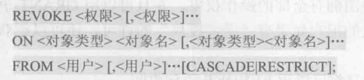

数据库的特点之一是由数据库管理系统提供统一的数据保护功能来保证数据的安全可靠和正确有效。

## 4.1 数据库安全性概述

数据库的安全性是指保护数据库以防止不合法使用所造成的数据泄露、更改或破坏。

系统安全保护措施是否有效是数据库系统的主要技术指标之一。

### 4.1.1 数据库的不安全因素

1. 非授权用户对数据库的恶意存取和破坏

   比如黑客窃取口令之后的非法操作。数据库管理系统提供的安全措施主要包括用户身份鉴别、存取控制和视图等技术。

2. 数据库中重要或敏感的数据被泄露

   数据库管理系统提供的主要技术有强制存取空值、数据加密存储和加密传输等。

3. 安全环境的脆弱性

   数据库的安全性和计算机系统的安全性，包括计算机硬件、操作系统、网络系统等的安全性是紧密联系的。


### 4.1.2 安全标准简介

略。

## 4.2 数据库安全性控制


图4.3 是数据库安全保护的一个存取控制流程。首先，数据库管理系统对提出 SQL 访问请求的数据库用户进行身份鉴别，防止不可信用户使用系统；然后，在 SQL 处理层进行自主存取控制和强制存取控制，进一步还可以进行推理控制。为监控恶意访问，可根据具体安全需求配置审计规则，对用户访问行为和系统关键操作进行审计。通过设置简单入侵检测规则，对异常用户行为进行检测和处理。在数据存储层，数据库管理系统不仅存放用户数据，还存储与安全有关的标记和信息（称为安全数据），提供存储加密功能等。

### 4.2.1 用户身份鉴别

用户身份鉴别是数据库管理系统提供的最外层安全保护措施。用户身份鉴别的方法有很多，而且应该系统中往往是多种方法结合，以获得更强的安全性。常用的方法有以下几种：

1. 静态口令鉴别

   方式简单，容易被攻击，安全性较低。

2. 动态口令鉴别

   每次鉴别均需使用动态产生的新口令登录数据库管理系统。常见的方式如短信密码和动态令牌方式。

3. 生物特征鉴别

   生物特征是指生物体唯一具有的，可测量、识别和验证的稳定生物特征，如指纹、虹膜和掌纹等。

4. 智能卡鉴别

   智能卡是一种不可复制的硬件，内置集成电路的芯片，具有硬件加密功能。每次从智能卡中读取的数据是静态的，通过内存扫描或网络监听等技术还是可能截取到用户的身份验证信息，存在安全隐患。因此，实际应用中一般采用个人身份识别码（PIN）和智能卡相结合的方式。


### 4.2.2 存取控制

数据库安全最重要的一点就是确保授权给有资格的用户访问数据库的权限，同时令所有未被授权的人员无法接近数据，这主要通过数据库系统的存取控制机制实现。

存取控制机制主要包括**定义用户权限**和**合法权限检查**两部分，两者一起组成了数据库管理系统的存取控制子系统。

1. 定义用户权限，并将用户权限登记到数据字典中。

   用户对某一数据对象的操作权力称为权限。数据库管理系统必须提供适当的语言来定义用户权限，这些定义经过编译后存储在数据字典中，被称做安全规则或授权规则。

2. 合法权限检查

   每当用户发出存取数据库的操作请求之后，数据库管理系统根据安全规则进行合法权限检查。


- **自主存取控制**（DAC）方法：用户对于不同的数据库对象有不同的存取权限，不同的用户对同一对象也有不同的权限，而且还可将其拥有的存取权限转授给其他用户。因此非常灵活。
- **强制存取控制**（MAC）方法：每一个数据库对象被标以一定的密级，每一个用户也被授予某一个级别的许可证。对于任意一个对象，只有具有合法许可证的用户才可以存取。相对比较严格。

### 4.2.3 自主存取控制方法

用户权限由两个要素组成：数据库对象和操作类型。定义存取权限称为**授权**。

在非关系系统中，用户只能对数据进行操作，存取控制的数据库对象也仅限于数据本身。

在关系数据库系统中，存取控制的对象不仅有数据本身（基本表中的数据、属性列上的数据），还有数据库模式（包括数据库、基本表、视图和索引的创建等）。

#### 4.2.4 授权：授予与收回

`GRANT`授权，`REVOKE`收权。

1. GRANT


`WITH GRANT OPTION`子句表示获得某种权限的用户还可以把这种权限再授予其他的用户。

SQL 标准允许具有 `WITH GRANT OPTION` 的用户把相应权限或其子集传递授予其他用户，但不允许循环授权，即被授权者不能把权限再授回给授权者或其祖先。

2. REVOKE



授予用户的权限可以由数据库管理员或其他授权者回收。

级联 CASCADE 表示回收包括继续授权给别人的权限。

可见，用户可以“自主”地觉得将数据的存取权限授予何人、决定是否也讲“授权”的权限授予别人。因此称这样的存取控制是自主存取控制。

3. 创建数据库模式的权限

对创建数据库模式一类的数据库对象的授权则由数据库管理员在创建用户时实现。

```sql
CREATE USER <username> [WITH] [DBA|RESOURCE|CONNECT];
```

对 CREATE USER 语句说明如下：

- 只有系统的超级用户才有权创建一个新的数据库用户。
- 新创建的数据库用户有三种权限：CONNECT、RESOURCE 和 DBA。
- CREATE USER 命令中如果没有指定创建的新用户的权限，默认该用户拥有CONNECT 权限。拥有 CONNECT 权限的用户不能创建新用户，不能创建模式，也不能创建基本表，只能登录数据库。由数据库管理员或其他用户授予他应有的权限，根据获得的授权情况他可以对数据库对象进行权限范围内的操作。
- 拥有 RESOURCE 权限的用户能创建基本表和视图，成为所创建对象的属主，但不能创建模式，不能创建新的用户。数据库对象的属主可以使用 GRANT 语句把该对象上的存取权限授予其他用户。
- 拥有 DBA 权限的用户是系统中的超级用户，可以创建新的用户、创建模式、创建基本表和视图等；DBA 拥有对所有数据库对象的存取权限，还可以把这些权限授予一般用户。


#### 4.2.5 数据库角色

数据库角色是被命名的一组与数据库操作相关的权限，角色是权限的集合。角色可以简化授权的过程。


```sql
MySQL root@(none):test> create role r1;
MySQL root@(none):test> grant select,update,insert,delete on table t1 to r1;
MySQL root@(none):test> revoke delete on table t1 from r1;
```

### 4.2.6 强制存取控制方法

强制存取控制不是由用户能直接感知或控制的，适用于那些对数据有严格而固定密级分类的部门，例如军事或政府部门。

在强制存取控制中，数据库管理系统所管理的全部实体分为主体和客体两大类。

**主体**是系统中的活动实体，包括所管理的实际用户，也包括用户的各进程。**客体**是系统中的被动实体，是受主体操纵的，包括文件、基本表、索引、视图等。对于主体和客体，数据库管理系统为它们每个实例（值）指派一个**敏感度标记**。

敏感度标记被分成若干级别，例如绝密（Top Secret, TS）、机密 （Secret, S）、可信（Confidential, C）、公开（Public, P）等。密级的次序是TS>=S>=C>=P。主体的敏感度标记称为许可证级别（clearance level），客体的敏感度标记称为密级（classification level）。

强制存取控制机制就是通过**对比主体的敏感度标记和客体的敏感度标记**，最终确定主体是否能够存取客体。

当某一主体以标记 label 注册入系统时，系统要求他对任何客体的存取必须遵守如下规则：

1. 仅当主体的许可证级别**大于或等于**客体的密级时，该主体才能**读取**相应的客体。
2. 仅当主体的许可证级别**小于或等于**客体的密级时，该主体才能**写**相应的客体。

按照规则（2），用户可以为写入的数据对象赋予高于自己的许可证级别的密级。这样一旦数据被写入，该用户自己也不能再读该数据对象了。如果违反了规则（2），就有可能把数据的密级从高流向低，造成数据的泄漏。

强制存取控制是对数据本身进行密级标记，无论数据如何复制，标记与数据是一个不可分的整体，只有符合密级标记要求的用户才可以操纵数据，从而提供了更高级别的安全性。

较高的安全性级别提供的安全保护要包含较低级别的所有保护，因此在实现强制存取控制时首先要实现自主存取控制。即两者共同构成数据库管理系统的安全机制。


## 4.3 视图机制

通过视图机制把要保密的数据对无权限存取的用户隐藏起来，从而自动对数据提供一定程度的安全保护。视图机制间接地实现支持存取谓词的用户权限定义。

## 4.4 审计

审计功能把用户对数据库的所有操作自动记录下来放入审计日志中。审计员可以利用审计日志监控数据库中的各种行为，重现导致数据库现有状况的一系列事件，找出非法存取数据的人、时间和内容等。还可以通过对审计日志分析，对潜在的威胁提前采取措施加以防范。

数据库安全审计系统提供了一种事后检查的安全机制。

### 4.4.1 审计事件

审计事件一般有多个类别，例如：

- 服务器事件：审计数据库服务器发生的事件，包括启动、配置文件的重新加载等等
- 系统权限：对系统拥有的结构或模式对象进行操作的审计，要求操作的权限是通过系统权限获得的
- 语句事件：对 DDL、DML、DQL、DCL 的审计
- 模式对象事件：对特定模式对象上进行的 select 或 dml 操作的审计。模式对象包括表、视图、存储过程、函数等；不包括依附于表的索引、约束、触发器、分区表等

### 4.4.2 审计功能

- 基本功能，提供多种审计查阅方式：基本的、可选的、有限的等等
- 提供多套审计规则，审计规则一般在数据库初始化时设定，以方便审计员管理
- 提供审计分析和报表功能
- 审计日志管理功能，包括为防止审计员误删审计记录，审计日志必须先转储后删除；对转储的审计记录文件提供完整性保护和保密性保护；只允许审计员查阅和转储审计记录，不允许任何用户新增和修改审计记录等等
- 系统提供查询审计设置及审计记录信息的专门视图。对于系统权限级别、语句级别及模式对象级别的审计记录也可提供相关的系统表直接查看

### 4.4.3 AUDIT 语句和 NOAUDIT 语句

用来设置/取消审计功能。

审计一般分为用户级审计和系统级审计。

用户级审计是任何用户可以设置的审计，主要是用户针对自己创建的数据库表或视图进行审计。

系统级审计只能由数据库管理员设置，用以检测成功或失败的登录要求、监测授权和收回操作以及其他数据库级权限下的操作。


## 4.5 数据加密

数据加密是防止数据库数据在存储和传输中失密的有效手段。加密的基本思想是根据一定的算法将原始数据—明文（plain text）变换为不可直接识别的格式——密文（cipher text），从而使得不知道解密算法的人无法获知数据的内容。

数据加密主要包括存储加密和传输加密。

### 4.5.1 存储加密

两种方式：

- 透明存储加密，内核级加密保护方式，对用户完全透明。
- 非透明存储加密，通过多个加密函数实现。

透明存储加密是数据写磁盘时对数据进行加密，授权用户读取数据时再对其解密。数据库的应用程序只需在创建表语句中说明需要加密的字段即可。这种方式加密、解密性能好，安全完备性较高。

### 4.5.2 传输加密

常用的传输加密方式如链路加密和端到端加密。

链路加密对传输数据在链路层进行加密，它的传输信息由报头和报文两部分组成，前者是路由选择信息，而后者是传送的数据信息。这种方式对报文和报头均加密。

端到端加密对传输数据在发送端加密，接收端解密。它只加密报文，不加密报头。与链路加密相比，它只在发送端和接收端需要密码设备，而中间节点不需要密码设备，因此它所需密码设备数量相对较少。但这种方式不加密报头，从而容易被非法监听者发现并从中获取敏感信息。

下图是一种端到端的基于安全套接层协议（SSL）的数据库管理系统可信传输方案：


此方案对应用程序透明，实现思路包含三点：

（1） 确认通信双方端点的可靠性

数据库管理系统采用基于数字证书的服务器和客户端认证方式实现通信双方的可靠性确认。用户和服务器各自持有由知名数字证书认证（Certificate Authority,CA）中心或企业内建CA颁发的数字证书，双方在进行通信时均首先向对方提供己方证书，然后使用本地的 CA信任列表和证书撤销列表（Certificate Revocation List, CRL）对接收到的对方证书进行验证，以确保证书的合法性和有效性，进而保证对方确系通信的目的端。

（2） 协商加密算法和密钥

确认双方端点的可靠性后，通信双方协商本次会话的加密算法与密钥。在这个过程中，通信双方利用公钥基础设施（Public Key Infrastructure, PKI） 方式保证了服务器和客户端的协商过程通信的安全可靠。

（3）可信数据传输

在加密算法和密钥协商完成后，通信双方开始进行业务数据交换。与普通通信路径不同的是，这些业务数据在被发送之前将被用某一组特定的密钥进行加密和消息摘要计算，以密文形式在网络上传输。当业务数据被接收的时候，需用相同一组特定的密钥进行解密和摘要计算。所谓特定的密钥，是由先前通信双方磋商决定的，为且仅为双方共享，通常称之为会话密钥。第三方即使窃取传输密文，因无会话密钥也无法识别密文信息。一旦第三方对密文进行任何篡改，均将会被真实的接收方通过摘要算法识破。另外，会话密钥的生命周期仅限于本次通信，理论上每次通信所采用的会话密钥将不同，因此避免了使用固定密钥而引起的密钥存储类问题。

## 4.6 其他安全性保护

### 4.6.1 推理控制

推理控制处理的是强制存取控制未解决的问题。例如，利用列的函数依赖关系，用户能从低安全等级信息推导出其无权访问的高安全等级信息，导致信息泄露。

数据库推理控制机制用来避免用户利用其能够访问的数据推知更高密级的数据。常用的方法如基于函数依赖的推理控制和基于敏感关联的推理控制等。

### 4.6.2 隐蔽信道

隐蔽信道处理内容也是强制存取控制未解决的问题。可通过未被强制存取控制的 SQL 执行后反馈的信息进行间接信息传递。

例如 insert 语句对 unique 属性列的写入重复值。当高等级用户（发送者）先插入或不插入，低等级用户（接收者）后执行插入操作。根据成功与否即可感知信息。这样也会导致高安全等级敏感信息泄露。

### 4.6.3 数据隐私保护

数据隐私是控制不愿被他人知道或他人不便知道的个人数据的能力。数据隐私范围很广，涉及数据管理中的数据收集、数据存储、数据处理和数据发布等各个阶段。如发布的关系数据表首先不能包含有原表的候选码，同时还要考虑准标识符的影响。

准标识符是能够唯一确定大部分记录的属性集合。在现有安全性标准中，k-匿名化标砖要求每个具有相同准标识符的记录组中至少包括 k 条记录，从而控制攻击者判别隐私数据所属个体的概率。

