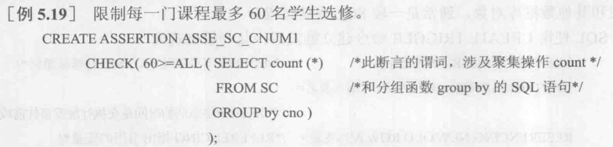

数据库的完整性是指数据的正确性和相容性。

数据的正确性是指数据是符合现实世界语义、反映当前实际状况的。

数据的相容性是指数据库同一对象在不同关系表中的数据是符合逻辑的。

数据的完整性和安全性是两个既有联系又不尽相同的概念。数据的完整性是为了防止数据库中存在不符合语义的数据，也就是防止数据库中存在不正确的数据。数据的安全性是保护数据库防止恶意破坏和非法存取。因此，**完整性检查和控制的防范对象是不合语义的、不正确的数据，防止它们进入数据库。安全性控制的防范对象是非法用户和非法操作，防止他们对数据库数据的非法存取**。

为了维护数据库的完整性，数据库管理系统必须能够实现如下功能。

1. 提供定义完整性约束条件的机制

   包括关系模型的实体完整性、参照完整性和用户定义完整性。一般由 SQL 的数据定义语言语句来实现，它们作为数据库模式的一部分存入数据字典中。

2. 提供完整性检查的方法

   数据库管理系统中检查数据是否满足完整性约束条件的机制称为完整性检查。一般在 insert、update、delete 语句执行后开始检查，也可在事务提交时检查。检查这些操作执行后数据库中的数据是否违背了完整性约束条件。

3. 进行违约处理

   若发现违背了将采取一定的动作，如拒绝（NO ACTION） 执行 或 级联（CASCADE）执行其他操作，进行违约处理来保证数据的完整性。


关系数据库管理系统使得完整性控制成为其核心支持的功能，从而能够为所有用户和应用提供一致的数据库完整性。第 2 章 2.3 节已经讲解了数据库三类完整性约束的基本概念，下面介绍实现完整性控制功能的方法。

在关系系统中，最重要的完整性约束是实体完整性和参照完整性，其他完整性约束条件则可以归入用户定义的完整性。实现数据库完整性的一个重要方法是触发器。

## 5.1 实体完整性

### 5.1.1 定义实体完整性

关系模型的实体完整性在 create table 中用 primary key 定义。对单属性构成的码有两种说明方法，一种是定义为列级约束条件，另一种是定义为表级约束条件。对于多个属性构成的码只能使用后者。

### 5.1.2 实体完整性检查和违约处理

定义了关系的主码后，每当用户程序对基本表插入一条记录或对主码进行更新操作时，关系数据库管理系统将按照第 2 章 2.3 节的实体完整性规则自动进行检查，包括：

1. 检查主码值是否唯一，不唯一责拒绝插入或修改。
2. 检查主码的各个属性是否为空，只要有一个为空就拒绝插入或修改。

检查记录中主码是否唯一的一种方法是进行全表扫描，但是非常耗时。关系数据库管理系统一般都在主码上自动建立一个索引。

## 5.2 参照完整性

### 5.2.1 定义参照完整性

关系模型的实体完整性在 create table 中用 foreign key 定义那些列为外码，用 references 短语指明这些外码参照哪些表的主码。

```sql
CREATE TABLE Authors (
    AuthorID INT PRIMARY KEY,
    Name VARCHAR(50) NOT NULL
);

CREATE TABLE Books (
    BookID INT PRIMARY KEY,
    Title VARCHAR(50) NOT NULL,
    AuthorID INT,
    FOREIGN KEY (AuthorID) REFERENCES Authors(AuthorID) ON DELETE NO ACTION ON UPDATE CASCADE
);
```

### 5.2.2 参照完整性检查和违约处理

对参照表和被参照表进行增删改都可能破坏参照完整性，因此必须检查以保证两个表的相容性。

当不一致发生时，系统可以采用以下策略加一处理：

1. 拒绝（NO ACTION） 执行，一般是默认策略。
2. 级联（CASCADE）操作
3. 设置为空值，有时空值会导致无意义的情况发生，所以需要考虑外码能否接受空值。

对于参照完整性，除了应该定义外码，还应该定义外码是否允许空值。

## 5.3 用户定义的完整性

用户定义的完整性就是针对某一具体应用的数据必须满足的语义要求。

### 5.3.1 属性上的约束条件

1. 属性上约束条件的定义

在 create table 中定义属性的同时，可以根据应用要求定义属性上的约束条件，即属性值限制，包括：

- 列值非空（NOT NULL）
- 列值唯一（UNIQUE）
- 检查列值是否满足一个条件表达式（CHECK 短语）

<br/>

2. 属性上约束条件的检查和违约处理

不满足则拒绝执行。

### 5.3.2 元组上的约束条件

1. 元组上约束条件的定义

在 create table 中可以使用 check 短语定义元组上的约束条件，即元组级别的限制。可以设置不同属性之间的取值的相互约束条件。


2. 元组上约束条件的检查和违约处理

拒绝执行。

## 5.4 完整性约束命名子句

以上约束条件都在 create table 语句中定义，但都没有名字。SQL 还在 create table 语句中提供了完整性约束命名子句 `CONSTRAINT` ，用来对完整性约束命名，从而可以灵活地增加、删除一个完整性约束条件。

1. 完整性约束命名子句

```sql
CONSTRAINT＜完整性约束条件名＞＜完整性约束条件＞
```

<完整性约束条件>包括 `NOT NULL`、`UNIQUE`、`PRIMARY KEY`、`FOREIGN KEY`、`CHECK` 短语等。


建立了一个主码约束和 4 个列级约束。

2. 修改表中的完整性限制

```sql
ALTER TABLE <表名> DROP/ADD CONSTRAINT ...;
```

## 5.5 域中的完整性限制

域是一组具有相同数据类型的值的集合。SQL 支持域的概念，并可以使用 create domain 创建域以及该域应该满足的完整性约束条件。

然后可以使用域来定义属性。数据库中不同的属性可以来自同一个域。


## 5.6 断言

MySQL、PostgreSQL 都不支持。

`create assertion`通过声明性断言来指定更具一般性的约束。可以定义涉及多个表或聚集操作的比较复杂的完整性约束。

1. 创建断言语句格式

```sql
CREATE ASSERTION <断言名> <CHECK 子句>;
```



2. 删除断言语句格式

```sql
DROP ASSERTION <断言名>;
```

## 5.7 触发器

触发器是用户定义在关系表上的一类由事件驱动的特殊过程。触发器类似于约束，但是比约束更加灵活，可是实施更为复杂的检查和操作，具有更精细和强大的数据控制能力。但是触发器会影响系统的性能。

### 5.7.1 定义触发器

触发器又叫做“事件-条件-动作”规则。规则中的动作可以很复杂，可以涉及其他表和其他数据库对象，通常是一段 SQL 存储过程。

建立触发器，其一般格式为

```sql
CREATE TRIGGER                    /* 每当触发事件发生时，该触发器被激活 */
{BEFORE|AFTER｝＜触发事件>ON<表名＞  /* 指明触发器激活的时间是在执行触发事件前或后*/
REFERENCING NEW|OLD ROW AS<变量>   /* REFERENCING指出引用的变量 */
FOR EACH {ROW|STATEMENT}          /* 定义触发器的类型，指明动作体执行的频率*/
[WHEN<触发条件>] ＜触发动作体>       /* 仅当触发条件为真时才执行触发动作体 */
```

语法说明：

1. 只有表的拥有者才能在表上创建触发器，并且不能无限创建
2. 触发器名和表名必须在同一模式下，触发器名必须唯一
3. 触发器只能定义在基本表上，不能定义在视图上
4. 触发事件可以是单独的 insert、delete、update；也可以是组合，如 `insert OR delete` ，还可以是 `update of <触发列, ...>`，即进一步指明修改哪些列时激活触发器
5. 按照所触发动作的间隔尺寸可以分为行级触发器（`FOR EACH ROW`）和语句级触发器（`FOR EACH STATEMENT`）。例如在有 1000 行数据的 `t`表上创建了一个 after update 的触发器，当执行完`update t set a=1;`之后，若是行级触发器，则触发动作体执行 1000 次；若是语句级触发器，则触发动作执行 1 次。
6. 如果省略 `when 触发条件`，则触发动作体在触发器激活后立即执行
7. 触发动作体既可以是一个匿名的 `PL/SQL`   过程块，也可以是对已创建存储过程的调用。**只有行级触发器**才能在过程体中使用 NEW/OLD 引用 update/insert 事件之后的新值和 update/delete 事件之前的旧值。
8. **如果触发动作体执行失败，则激活触发器的事件终止执行**，触发器的目标表或触发器可能影响的其他对象不发生任何变化。


### 5.7.2 激活触发器

触发器的执行是由触发事件激活，并由数据库服务器自动执行的。同一个表上的多个触发器激活时遵循如下的执行顺序：

1. 执行该表上的 BEFORE 触发器。
2. 激活触发器的 SQL 语句。
3. 执行该表上的 AFTER 触发器。

对于多个同时触发的触发器（比如多个 before 触发器），不同的关系数据库管理系统遵循的触发原则不同。

### 5.7.3 删除触发器

```sql
DROP TRIGGER <触发器> ON <表名>;
```