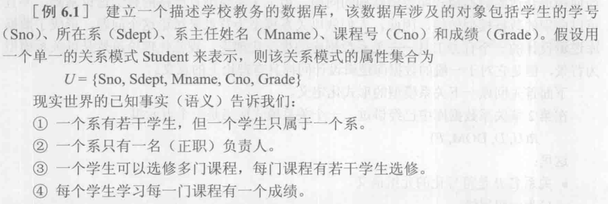
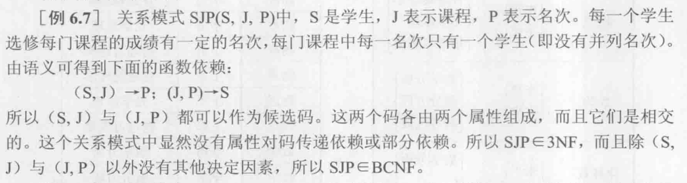
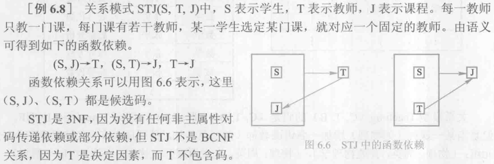
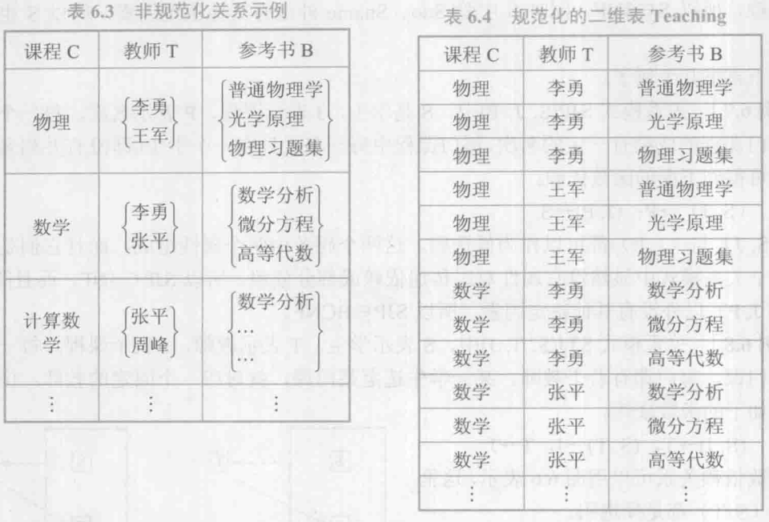
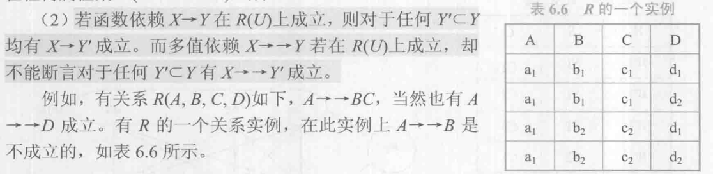
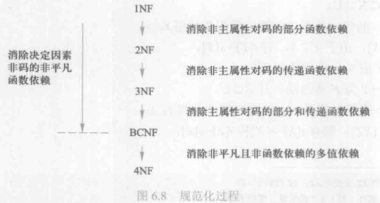
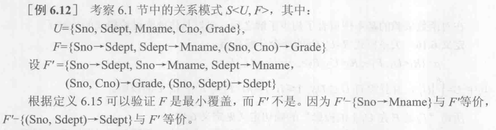
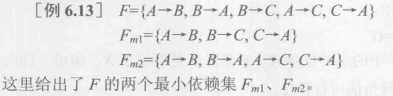

## 6.1 问题的提出

前文介绍了关系数据库的基本概念，关系模型的三个部分以及关系数据库的标准语言 SQL。但是还有一个很基本的问题尚未涉及：针对一个具体问题，应该如何构造一个适合于它的数据库模式，即应该构造几个关系模式，每个关系由哪些属性组成等。这是数据库设计的问题，确切地讲是关系数据库逻辑设计的问题。

实际上设计任何一种数据库应用系统，都会遇到这个问题。由于关系模型有严格的数学理论基础，并且可以向别的数据模型转换，形成了一个有力工具——关系数据库的规范化理论。他对于一般的数据库逻辑设计同样具有理论上的意义。

回顾下关系模型的形式化定义（第二章）：
关系的描述称为`关系模式`（relation schema）。一个关系模式可以形式化地表示为一个五元组： $R(U, D, DOM, F)$，其中

- R 为关系名，是符号化的元组语义
- U 为组成该关系的属性名集合
- D 为属性组 U 中属性所来自的域
- DOM 为属性向域的映像集合，属性到域的集合
- F 为属性间数据的依赖关系集合，属性组 U 上的一组数据依赖。

 > chatgpt 的解释:
 
 我们先来解析一下这五元组 $R(U, D, DOM, F)$ 中的各个元素所表示的含义：
 
1. $U$：它表示关系模式中的属性集。也就是说，在一个具体的关系模式中，$U$ 包含了所有你关心的数据项，比如在一个人员信息数据库中，$U$ 可能包括名字、性别、年龄等字段。
2. $D$：它表示的是属性的域，也就是属性的取值范围。可理解为每个属性可能的所有值组成的集合。例如，在性别这个属性下，$D$ 可能是 {男，女}。
3. $DOM$: 这个元素关联了$U$和$D$，并判断属性值是否在$D$的范围内，也就是说，它是一个函数，将 $U$ 中的每个元素映射到 $D$ 中的一个子集。比如在一个人员信息数据库中，属性 "年龄" 因该映射到一个非负整数集合。
4. $F$: 这是依赖函数，简单来讲就是在一个关系模式中，属性之间可能存在一些约束条件，例如在人员信息数据库中，每个人的身份证号必须是唯一的，这就是一个函数依赖——身份证号决定一个人的所有信息。包括在属性之间的约束，例：由身份证号码可以决定性别。

由于$D$、$DOM$ 与模式设计关系不大，本章中把关系模式看作一个三元组：$R(U, F)$。
当且仅当 U 上的一个关系 r 满足 F 时，r 称为关系模式 $R(U, F)$ 的一个关系。

作为一个二维表，关系要符合一个最基本的条件：每一个分量必须是不可分的数据项，此乃关系模式的**第一范式**（1NF）。

数据依赖是一个关系内部属性之间的一种约束关系。这种约束关系是通过属性间值的相等与否体现出来的数据间相关联系。它是现实世界属性间相互联系的抽象，是数据内在的性质，是语义的体现。数据依赖有很多种，最重要的是**函数依赖（FD）**和**多值依赖（MVD）**。
函数依赖类似于数学中的函数 $y=f(x)$，例如：$Sname=f(Sno)$，即 Sno 函数决定 Sname，或者说 Sname 函数依赖于 Sno，记作 Sno -> Sname。

不好的关系模式可能存在的问题：

1. 数据冗余
2. 更新异常。由于数据冗余，当更新数据时，需要付出很大的代价来维护完整性。
3. 插入异常
4. 删除异常

## 6.2 规范化

### 6.2.1 函数依赖
**定义6.1**		 设 *R(U)* 是属性集 U 上的关系模式，X，Y是U的子集。若对于 *R(U)* 的任意一个可能的关系 r，r 中不可能存在两个元组在 X 上的属性值相等，而在 Y 上的属性值不等，则称 **X 函数确定 Y 或 Y 函数依赖于 X，记作 $X \rightarrow Y$**。

函数依赖和别的数据依赖一样是语义范畴的概念，只能根据语义来确定一个函数依赖。例如，$姓名 \rightarrow 年龄$ 这个函数依赖只有在该部门没有同名人的条件下成立。如果允许有同名人，则年龄就不再函数依赖于姓名了。

!!! warning
	函数依赖不是指关系模式 R 的某个关系满足的约束条件，而是指 R 的一切关系均要满足的约束条件。

函数依赖描述了一组属性（被称为确定集）如何唯一确定另一组属性。
 下面介绍一些术语和记号：
 
- $X \rightarrow Y$，但 $Y \nsubseteq X$[^1],则称 $X \rightarrow Y$ 是**非平凡的函数依赖**。非平凡函数依赖表明了关系中的某种重要规则。例如，在一个学生课程表的关系中，"学生 ID → 姓名" 就是一个非平凡函数依赖，因为给定学生的 ID，可以唯一确定学生的姓名。
- $X \rightarrow Y$，但 $Y \subseteq X$[^2],则称 $X \rightarrow Y$ 是**平凡的函数依赖**。换句话说，平凡函数依赖就是在确定一个或多个给定的属性后，自然能够确定的属性集。平凡函数依赖的主要特点是，它们**不提供关于关系的新信息**。
- 若$X \rightarrow Y$，则 X 称为这个函数依赖的**决定属性组**，也称为**决定因素**。
- 若$X \rightarrow Y, Y \rightarrow X$，则记为 $X \leftarrow \rightarrow Y$
- 若 Y 不函数依赖于 X，则记作$X \not\rightarrow Y$

对于任一关系模式，平凡函数依赖都是必然成立的，它不反映新的语义。若不特别声明，总是讨论非平凡的函数依赖。

**定义 6.2**	在 *R(U)* 中，如果$X \rightarrow Y$，并且对于 X 的任何一个真子集 X’，都有$X' \not\rightarrow Y$，则称 Y 对 X **完全函数依赖**，记作 $X \overset F \rightarrow Y$。
若$X \rightarrow Y$，但 Y 不完全函数依赖于 X，则称 Y 对 X **部分函数依赖**，记作 $X \overset P \rightarrow Y$。

例 6.1 中 $(Sno,Cno) \overset F \rightarrow Grade$ 是完全函数依赖，因为学号+课程号才能确定分数；但$(Sno,Cno) \overset P \rightarrow Sdept$ 是部分函数依赖，因为 $Sno \rightarrow Sdept$ 成立，而 $Sno$ 是 $(Sno,Cno)$ 的真子集。

**定义 6.3**	在*R(U)* 中，如果$X \rightarrow Y (Y \nsubseteq X), Y \not\rightarrow X, Y \rightarrow Z, Z \nsubseteq$ Y，则称 Z 对 X **传递函数依赖**，记为$X \overset{传递} \rightarrow Z$。这里加上条件 $Y \not\rightarrow X$，是因为如果$Y \rightarrow X$，则$X \leftarrow \rightarrow Y$，实际上是$X \overset{直接} \rightarrow Z$，则是直接函数依赖而不是传递函数依赖。

例 6.1 中有 $Sno \rightarrow Sdept, Sdept \rightarrow Mname$ 成立，即 由学号得出系名，由系名得出系主任，所以 $Sno \overset{传递} \rightarrow Mname$。

### 6.2.2 码
第二章中已经给出了有关码的若干定义，这里用函数依赖的概念来定义码。

**定义 6.4**	设 K 为$R<U, F>$中的属性或属性组合，若$K \overset F \rightarrow U$，则称 K 为 R 的**候选码**。注意 U 是完全函数依赖于 K。

如果 U 部分函数依赖于 K，即 $K \overset{P} \rightarrow U$ 则 K 称为**超码**。超键可能包含并非必要的信息。
**候选码是最小的超码**，即 K 的任意一个真子集都不是候选码。

若候选码多于一个，则选定其中一个为**主码**。

包含在任何一个候选码中的属性称为**主属性**；相反，不包含在任何候选码中的属性称为**非主属性**或**非码属性**。最简单的情况，单个属性是码；最极端的情况，整个属性组是码，称为**全码**。

**定义 6.5**	关系模式 R 中属性或属性组 X 并非 R 的码，但 X 是另一个关系模式的码，则称 X 是 R 的**外部码/外码**。

注意⚠️：后面的章节中主码/候选码都简称为码，需要根据上下文加以识别。

### 6.2.3 范式

关系数据库中的关系是要满足一定要求的，满足不同程度要求的为不同范式。满足最低要求的叫第一范式，简称 1NF；在 1NF 中满足进一步要求的是第二范式，以此类推。

现在把范式这个概念理解称符合某一种级别的关系模式的集合，即 R 为第几范式就可以写为 $R \in xNF$

对于各种范式之间的关系有 $5NF \subset 4NF \subset BCNF \subset 3NF \subset 2NF \subset 1NF$[^3]。

一个低一级范式的关系模式通过模式分解可以转换为若干个高一级范式的关系模式的集合，这种过程就叫**规范化**。

### 6.2.4 2NF

作为一个二维表，关系要符合一个最基本的条件：每一个分量必须是不可分的数据项，此乃关系模式的**第一范式**（1NF）。

**定义 6.6**	若 $R \in 1NF$，且每一个非主属性完全函数依赖于任何一个候选码，则$R \in 2NF$。

一个关系模式 R 不属于 2NF，就会产生以下几个问题：

1. 插入异常。缺少部分函数依赖的主码信息时，会导致无法插入。
2. 删除异常。删除部分函数依赖的主码信息时，会导致不应删除的信息被删除。
3. 修改异常。会造成修改的复杂化。

问题在于有两类非主属性，一类如 Grade，他对码是完全依赖的；另一类如 Sdept，他对码是部分函数依赖。解决的方法是用*投影分解*把一个关系模式分解为多个关系模式，使得所有的非主属性都完全函数依赖于候选码。

### 6.2.5 3NF

**定义 6.7**	若 $R<U,F> \in 1NF$，若 R 中不存在这样的码 X，属性组 Y 及其非主属性 Z（$Z \nsupseteq Y$）使得 $X \rightarrow Y, Y \rightarrow Z$ 成立，$Y \not\rightarrow X$，则称 $R<U,F> \in 3NF$。

此定义可以证明，若$R \in 3NF$，则**每一个非主属性既不传递依赖于码**，**也不部分依赖于码**。即，如果 R 属于 3NF，则必有 R 属于 2NF。

若 R 不是 3NF，就会产生和 2NF 相类似的问题。解决方法是继续分解关系模式。

### 6.2.6 BCNF

BCNF 是修正/扩充的第三范式。

**定义 6.8**	关系模式 $R<U,F> \in 1NF$，若 $X \rightarrow Y$ 且 $Y \nsubseteq X$ 时 X 必含有码，则$R<U,F> \in BCNF$。

即，关系模式$R<U,F>$中，若**每一个依赖关系的决定因素都包含码**，则 $R<U,F> \in BCNF$。
一个满足 BCNF 的关系模式有：

- 所有非主属性对每一个码都是完全函数依赖
- 所有主属性对每一个不包含它的码也是完全函数依赖
- 没有任何属性完全函数依赖于非码的任何一组属性

［例6.6］ 关系模式 S(Sno, Sname, Sdept, Sage)，假定 Sno、Sname 都具有唯一性，那么S就有两个码，这两个码都由单个属性组成，彼此不相交。其他属性不存在对码的传递依赖与部分依赖，所以 $S \in 3NF$。同时S中除 Sno、Sname 外没有其他决定因素，所以S 也属于BCNF。

非 BCNF 的关系模式也可以通过分解成为 BCNF。

BCNF 在函数依赖范畴内已经实现了**彻底**的分离，已消除了插入和删除异常。**3NF 的不彻底性表现在可能存在主属性对码的部分依赖和传递依赖**。

### 6.2.7 多值依赖

满足 BCNF 的关系模式也并不完美。在了解 4NF 之前，现了解下多值依赖的概念。

［例6.9］学校中某一门课程由多个教师讲授，他们使用相同的一套参考书。每个教师可以讲授多门课程，每种参考书可以供多门课程使用。可以用一个非规范化的关系来表示教师T、课程C和参考书B之间的关系（如表6.3所示）。即教师和课程是多对多的关系，课程和书本也是多对多的关系。
把这张表变成一张规范化的二维表：

关系模型 $Teaching(C,T,B)$ 的码是全码，因此 $Teaching \in BCNF$。但是当某一课程增加一名讲课教师时，必须插入多个元组，例如：（物理，周英，普通物理学），（物理，周英，光学原理），（物理，周英，物理习题集）。

同样，某一门课（如数学）要去掉一本参考书（如微分方程），则必须删除多个元组：（数学，李勇，微分方程），（数学，张平，微分方程）。

因而对数据的增删改很不方便，数据的冗余也十分明显。这类关系模式具有一种多值依赖的数据依赖。

**定义 6.9**	设 $R(U)$ 是属性集 U 上的一个关系模式，X，Y，Z 是 U 的子集，并且 $Z=U-X-Y$ 。关系模式 $R(U)$ 中多值依赖 $X \rightarrow \rightarrow Y$ 成立，当且仅当对 $R(U)$ 的任一关系 r，给定的一对 $(x,z)$ 值，有一组 Y 的值，这组值仅仅决定于 x 值而与 z 值无关。

例如，在关系模式 Teaching 中，对于一个（物理，光学原理）有一组T值｛李勇，王军｝，这组值仅仅决定于课程C上的值（物理）。也就是说对于另一个（物理，普通物理学），它对应的一组T值仍是｛李勇，王军｝，尽管这时参考书B的值已经改变了。因此 T 多值依赖于 C，即$C \rightarrow \rightarrow T$。

若 $X \rightarrow \rightarrow Y$，而 $Z=\empty$，即 Z 为空，则称 $X \rightarrow \rightarrow Y$ 为平凡的多值依赖，即对于$R(X,Y)$，如果有$X \rightarrow \rightarrow Y$成立，则 $X \rightarrow \rightarrow Y$ 为平凡的多值依赖。

多值依赖的性质：

1. 对称性。使用上述定义的符号，若$X \rightarrow \rightarrow Y$，则 $X \rightarrow \rightarrow Z$，其中 $Z=U-X-Y$。
2. 传递性。若$X \rightarrow \rightarrow Y, Y \rightarrow \rightarrow Z$，则$X \rightarrow \rightarrow Z-Y$。其中`-`表示集合的差运算。这表示在确定了X能决定Y的所有值，Y能决定Z的所有值的情况下，就可以证明在去除Y的影响后，X能决定Z的所有值。
3. 函数依赖可以看成是多值依赖的特殊情况。若$X \rightarrow Y$，则$X \rightarrow \rightarrow Y$。
4. 若$X \rightarrow \rightarrow Y, X \rightarrow \rightarrow Z$，则$X \rightarrow \rightarrow YZ$。这表示如果通过X，可以找到Y和Z的所有可能值，那么就可以通过X找到由Y和Z组成的所有可能值（即YZ的所有可能值）。
5. 若$X \rightarrow \rightarrow Y, X \rightarrow \rightarrow Z$，则$X \rightarrow \rightarrow Y \cap Z$。这表示如果通过X，可以找到Y和Z的所有可能值，那么就可以通过X找到Y和Z共有的所有可能值（即Y∩Z的所有可能值）。
6. 若$X \rightarrow \rightarrow Y, X \rightarrow \rightarrow Z$，则$X \rightarrow \rightarrow Y-Z, X \rightarrow \rightarrow Z-Y$。这表示如果通过X，可以找到Y和Z的所有可能值，那么就可以通过X找到仅在Y或Z中出现的所有可能值（即Y-Z或Z-Y的所有可能值）。

多值依赖和函数依赖相比，具有下面两个基本的区别：

1. 多值依赖的有效性和属性集的范围有关。
若$X \rightarrow \rightarrow Y$在 *U* 上成立，则在 $W(XY \subseteq W \subseteq U)$ 上一定成立；反之则不然，即$X \rightarrow \rightarrow Y$在 $W(W \subset U)$ （即缩小属性集U的大小，让W成为U的真子集）上成立，在*U*上并不一定成立。这是因为多值依赖的定义中不仅涉及属性组X和Y，也涉及了U中其余属性Z的影响。
一般地，在 *R(U)* 上若有$X \rightarrow \rightarrow Y$在 $W(W \subset U)$ 上成立，则称$X \rightarrow \rightarrow Y$为 *R(U)* 的嵌入型多值依赖。
但是在关系模式 *R(U)* 中，函数依赖$X \rightarrow Y$的有效性仅决定于 X、Y 这两个属性集的值。只要在 *R(U)* 的任何一个关系 r 中，元组在X和Y上的值满足定义 6.1，则函数依赖$X \rightarrow Y$
在任何属性集 $W(XY \subseteq W \subseteq U)$ 上成立。

2. 若函数依赖 $X \rightarrow Y$在 *R(U)* 上成立，则对于任何 $Y' \subset Y$ 均有 $X \rightarrow Y'$ 成立。而多值依赖 $X \rightarrow \rightarrow Y$ 若在 *R(U)* 上成立，却不能断言对于任何 $Y' \subset Y$ 有 $X \rightarrow \rightarrow Y'$ 成立。

> chatGPT	例如，假设在一个关于学生课程的数据库中，学生的专业和年级决定了他适合学习的课程分类列表，即（专业，年级）→→课程分类。然而，如果我们将课程分类缩小考虑一个具体的方向，比如"计算机科学"，那么就不能肯定（专业，年级）→→"计算机科学"成立，因为即使是在同一专业和年级，不同的学生可能也有各自不同的课程方向兴趣。

### 6.2.8 4NF

**定义 6.10**	关系模式$R<U,F> \in 1NF$，如果对于*R*的每个非平凡多值依赖$X \rightarrow \rightarrow Y(Y \nsubseteq X)$，*X*都含有码，则称$R<U,F> \in 4NF$。

4NF 就是限制关系模式的属性之间不允许有**非平凡且非函数依赖**的多值依赖。因为根据定义，对于每一个非平凡的多值依赖$X \rightarrow \rightarrow Y$，*X*都含有候选码，于是就有$X \rightarrow Y$，所以 4NF 所允许的非平凡的多值依赖实际上是函数依赖。

显然，如果一个关系模式是 4NF，则必为 BCNF。

例 6.9 的关系模式 $Teaching(C,T,B)$ 中，$C \rightarrow \rightarrow T, C \rightarrow \rightarrow B$，它们都是非平凡的多值依赖，并且这个关系模式的码是全码，*C* 不是码，因此 $Teaching \notin 4NF$。

一个关系模式达到了 BCNF 但是没有达到 4NF 仍然具有不好的性质。以 Teaching 为例，对于 Teaching 的某个关系，若某个课程有 n 个老师，具有 m 个教材，则关系中分量为 $C_i$ 的元组数目一定有 $n * m$ 个，**数据的冗余度太大**。

可以用投影分解的方法消去非平凡且非函数依赖的多值依赖。例如可以把$Teaching(C,T,B)$分解为$CourseTeacher(C,T)$，$CourseBook(C,B)$，它们都符合 4NF。

### 6.2.9 规范化小结

如果只考虑函数依赖，则属于 BCNF 的关系模式规范化程度已经是最高的了；如果考虑多值依赖，4NF 是最高的。事实上，数据依赖中除函数依赖和多值依赖之外，还有其它的数据依赖，例如连接依赖，多值依赖实际上是连接依赖的一种特殊情况，存在连接依赖的关系模式仍可能遇到数据冗余及插入、修改、删除异常等问题。消除了连接依赖之后可达到 5NF 的关系模式。

在关系数据库中，对关系模式的基本要求是满足第一范式，这样的关系模式就是合法的、允许的。规范化的目的就是解决有些关系模式中存在的问题，例如数据冗余及插入、修改、删除异常等问题。

规范化的基本思想是逐步消除数据依赖中不合适的部分，使模式中的各关系模式达到某种程度的“分离”，即“一事一地”的模式设计原则。规范化实质上是概念的**单一化**。

关系模式的规范化过程是通过对关系模式的分解来实现的，即把低一级的关系模式分解为若干个高一级的关系模式。这种分解不是唯一的，下文会进一步讨论。

## 6.3 数据依赖的公理系统

数据依赖的公理系统是模式分解算法的理论基础。

**定义 6.11**	对于满足一组函数依赖*F*的关系模式$R<U,F>$，其中任何一个关系 r，若函数依赖$X \rightarrow Y$都成立（即 r 中任意两元组 t、s，若$t[X]=s[X]$，则$t[Y]=s[Y]$），则称**F 逻辑蕴涵[^4]$X \rightarrow Y$**。

**Armstrong 公理系统**	设*U*为属性集总体，*F*是 *U* 上的一组函数依赖，于是有关系模式$R<U,F>$，对 $R<U,F>$来说有以下推理规则：

- A1	**自反律**：若 $Y \subseteq X \subseteq U$，则 $X \rightarrow Y$ 为 F 所蕴涵。简单说，一个属性集合一定可以确定它自己的子集。
- A2	**增广律**：若 $X \rightarrow Y$ 为 F 所蕴涵，且 $Z \subseteq U$，则 $XZ \rightarrow YZ$ 为 F 所蕴涵。即如果X可以决定Y，那么在X和Z的组合中也能决定Y和Z的组合。
- A3	**传递律**：若 $X \rightarrow Y$ 及 $Y \rightarrow Z$ 为 F 所蕴涵，则  $X \rightarrow Z$ 为 F 所蕴涵。即如果X可以决定Y，Y又可以决定Z，那么X就可以决定Z。

!!! warning
	由自反律所得到的函数依赖均是平凡的函数依赖，自反律的使用并不依赖于 F。

根据 A1、A2、A3 这三条推理规则可以得到下面三条很有用的推理规则：

- **合并规则**：由$X \rightarrow Y$，$X \rightarrow Z$，有 $X \rightarrow YZ$。
- **伪传递规则**：由 $X \rightarrow Y$，$WY \rightarrow Z$，有$XW \rightarrow Z$。
- **分解规则**：由$X \rightarrow Y$ 及 $Z \subseteq Y$，有$X \rightarrow Z$。

根据合并规则和分解规则，容易得出一个重要事实：
**引理 6.1**	$X \rightarrow A_1A_2···A_k$ 成立的充分必要条件是$X \rightarrow A_i$成立（$i=1,2,···,k$）。

**定义 6.12**	在关系模式$R<U,F>$中为 F 所逻辑蕴涵的函数依赖的全体叫作 $F$ 的**闭包**，记作$F^+$。

Armstrong 公理系统是有效的、完备的。**有效性**是指：由$F$出发根据 Armstrong 公理推导出来的每一个函数依赖一定在$F^+$中。**完备性**指：$F^+$中的每一个函数依赖，必定可以由$F$出发根据 Armstrong 公理推导出来。

**定义 6.13**	 设$F$为属性集 U 上的一组函数依赖，$X、Y \subseteq U$，$X_F^+=\{A|X \rightarrow A  能由 F 根据 Armstrong 公理导出\}$，$X_F^+$称为**属性集 X 关于函数依赖 F 的闭包**。

**引理 6.2**	设$F$为属性集 U 上的一组函数依赖，$X、Y \subseteq U$，$X \rightarrow Y$能由 F 根据 Armstrong 公理导出的充分必要条件是 $Y \subseteq X_F^+$。

**定理 6.2**	Armstrong 公理系统是有效的、完备的。

Armstrong 公理的有效性和完备性说明了“导出”和“蕴涵”是两个完全等价的概念。于是$F^+$也可以说成是由$F$出发借助 Armstrong 公理导出的函数依赖的集合。

**定义 6.14**	如果$G^+=F^+$，就说函数依赖集$F$覆盖$G$（F 是 G 的覆盖，或 G 是 F 的覆盖），或 F 与 G 等价。

**引理 6.3**	$F^+=G^+$的充分必要条件是$F^+ \subseteq G^+$和$G \subseteq F^+$。

**定义 6.15**	如果函数依赖集 F 满足下列条件，则称 F 为一个**极小函数依赖集/最小依赖集/最小覆盖**：

1. F 中任一函数依赖的右部分仅含有一个属性。
2. F 中不存在这样的函数依赖 $X \rightarrow A$，使得 F 与 $F-\{X \rightarrow A\}$ 等价。就是说在 F 中不存在可以使 F 等价而可以删除的函数依赖。
3. F 中不存在这样的函数依赖 $X \rightarrow A$，X 有真子集 Z 使得 $F-\{X \rightarrow A\} \cup \{Z \rightarrow A\}$与 F 等价。即对于 F 中的每个函数依赖，它的左部要尽可能简单。即在 F 中不存在可以使 F 等价而可以删除的属性。

**定理 6.3**	每一个函数依赖集 F 均等价于一个极小函数依赖集$F_m$，此$F_m$称为 F 的最小依赖集。

F的最小依赖集并不一定是唯一的，它与对各依赖函数$FD_i$及$X \rightarrow A$中 X 各属性的处置顺序有关。

两个关系模式 R1<U,F>、R2<U,G>，如果F与G等价，那么R1的关系一定是R2的关系；反过来，R2的关系也一定是R1的关系。所以在 R<U,F>中用与F等价的依赖集G来取代F是允许的。

## 6.4 模式的分解
略。

[^1]: 非[子集](https://zh.wikipedia.org/wiki/%E5%AD%90%E9%9B%86) 符号。
[^2]: [子集](https://zh.wikipedia.org/wiki/%E5%AD%90%E9%9B%86) 符号。
[^3]: 真子集符号。
[^4]: chatgpt：蕴涵（Entailment）在命题逻辑和谓词逻辑中用来描述在两个句子或句子的集合之间的联系，一般使用⇒符号表示。
1. **语义蕴涵（Logical Implication）**：也可以读作 B 是 A 的语义后承。它是一种陈述，当结论（即，如果 A 则 B 中的 B）在所有假设（即，如果 A 则 B 中的 A）为真的解释中也为真时，我们说前提蕴涵结论。比如，"如果天气是晴朗的，则太阳会升起"，在所有"天气是晴朗的"的状况下，"太阳会升起"总是真的，所以我们可以说"天气是晴朗的"蕴涵"太阳会升起"。
2. **语法蕴涵**：也可以读作 "B 可以证明自 A" 或 "B 是 A 的语法后承"。定义为：A 语法蕴涵 B，如果通过假定所有 A 中所有的句子并通过对它们应用一个有限序列的推理规则（比如来自命题演算的），你可以推导出 B 中的所有句子。 需要注意的是，逻辑蕴涵和我们在日常生活中的直觉可能会有冲突。比如在主张 P → Q 的情况下，当 P 为真而 Q 为假时，这是违反逻辑蕴涵的情况。但如果 P 为假，无论 Q 的真假如何，都不能认为违反了逻辑蕴涵。也就是说，"如果 P 则 Q"的形式只有在 P 为真而 Q 为假的情况下不成立，其他情况下都被视为成立。 更多信息可以参考 [蕴涵 - 维基百科](https://zh.wikipedia.org/wiki/%E8%95%B4%E6%B6%B5)。
