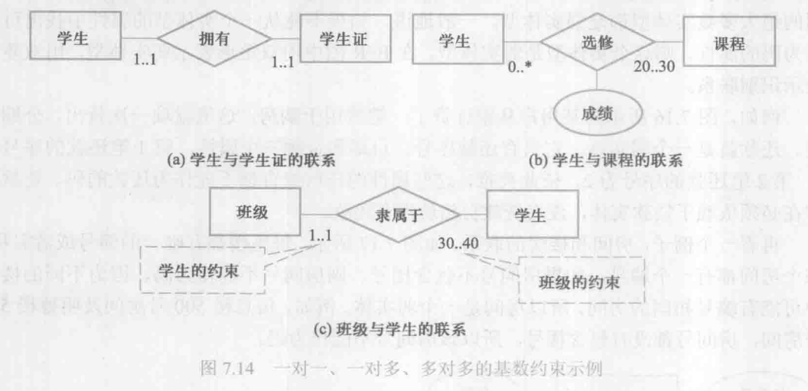
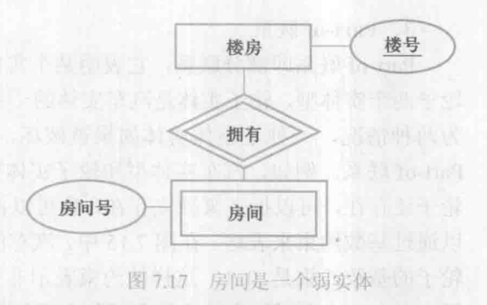

[TOC]

## 7.1 数据库设计概述

**数据库设计**的一般定义：数据库设计是指对于一个给定的应用环境，构造（设计）优化的数据库逻辑模式和物理结构，并据此建立数据库及其应用系统，使之能够有效地存储和管理数据，满足各种用户的应用需求，包括信息管理要求和数据操作要求。
信息管理要求是指在数据库中应该存储和管理哪些数据对象；数据操作要求是指对数据对象需要进行哪些操作，如增删改查等。
数据库设计的目标是为用户和各种应用系统提供一个信息基础设施和高效的运行环境。

### 7.1.1 数据库设计的特点

1. 数据库建设的基本规律

    “**三分技术，七分管理，十二分基础数据**”是数据库设计的特点之一。
    这里的管理不仅仅包括数据库建设作为一个大型的工程项目本身的项目管理，还包括该企业（即应用部门）的业务管理。
    企业的业务管理更加复杂，也更重要，对数据库结构的设计有直接影响。
    “十二分基础数据”则强调了数据的收集、整理、组织和不断更新是数据库建设中的重要环节。

2. 结构（数据）设计和行为（处理）设计相结合

数据库设计应该和应用系统设计相结合。

### 7.1.2 数据库设计方法

大型数据库设计是涉及多学科的综合性技术，又是一项庞大的工程项目。它要求从事数据库设计的专业人员具备多方面的知识和技术。主要包括：

- 计算机的基础知识；
- 软件工程的原理和方法；
- 程序设计的方法和技巧；
- 数据库的基本知识；
- 数据库设计技术；
- 应用领域的知识。

人们努力探索，提出了各种数据库设计方法。例如，新奥尔良（New Orleans）方法、基于 E-R 模型的设计方法、3NF（第三范式）的设计方法、面向对象的数据库设计方法、统一建模语言（Unified Model Language, UML）方法等。

### 7.1.3 数据库设计的基本步骤

按照结构化系统设计的方法，考虑数据库及其应用系统开发全过程，将数据库设计分为以下 6 个阶段：

- 需求分析；
- 概念结构设计；
- 逻辑结构设计；
- 物理结构设计；
- 数据库实施；
- 数据库运行和维护。


在数据库设计过程中，需求分析和概念结构设计可以独立于任何数据库管理系统进行，逻辑结构设计和物理结构设计与选用的数据库管理系统密切相关。

1. 需求分析阶段

	进行数据库设计首先必须准确了解与分析用户需求（包括数据与处理）。需求分析是整个设计过程的基础是最困难和最耗费时间的一步。

2. 概念结构设计阶段

	概念结构设计是整个数据库设计的 关键，它通过对用户需求进行综合】归纳和抽象，形成一个独立于具体数据库管理系统的概念模型。

3. 逻辑结构设计阶段

	逻辑结构设计是将概念结构转换为某个数据库管理系统所支持的数据模型，并对其进行优化

4. 物理结构设计阶段

	是为逻辑数据模型选取一个最适合应用环境的物理结构（包括存储结构和存取方法）。

5. 数据库实施阶段

	设计人员运用数据库管理系统提供的数据库语言及其宿主语言，根据逻辑设计和物理设计的结果建立数据库，编写和调试应用程序，组织数据入库，并进行试运行。

6. 数据库运行和维护阶段

	数据库应用系统经过试运行后即可投入正式运行。在数据库系统运行过程中必须不断地对其进行评估、调整与修改。

设计的过程往往是上述 6 个阶段不断反复。

这个设计步骤既是数据库设计的过程，也包括了数据库应用系统的设计过程。在设计过程中把数据库的设计和对数据库中数据处理的设计紧密结合起来，将这两方面的需求分析、抽象、设计、实现在各个阶段同时进行，相互参照，相互补充，以完善两方面的设计。


### 7.1.4 数据库设计过程中的各级模式

按照 7.1.3 小节的设计过程，数据库设计的不同阶段形成数据库的各级模式，

如图 7.4 所示。

- 在需求分析阶段综合各个用户的应用需求：
- 在概念结构设计阶段形成独立于机器特点、独立于各个关系数据库管理系统产品的概念模式，在本篇中就是 E-R 图；
- 在逻辑结构设计阶段将 E-R 图转换成具体的数据库产品支持的数据模型，如关系模型，形成数据库逻辑模式，然后根据用户处理的要求、安全性的考虑，在基本表的基础上再建立必要的视图，形成数据的外模式；
- 在物理结构设计阶段，根据关系数据库管理系统的特点和处理的需要进行物理存储安排，建立索引，形成数据库内模式。


下面就以图7.2 的设计过程为主线，讨论数据库设计各阶段的设计内容、设计方法和工具。

## 7.2 需求分析

需求分析是设计数据库的起点。

### 7.2.1 需求分析的任务

需求分析的任务是通过详细调查现实世界要处理的对象，在充分了解原系统的工作概况，明确用户的各种需求，然后在此基础上确定新系统的功能。新系统必须充分考虑今后可能的扩充和改变，不能仅仅按当前应用需求来设计数据库。

调查的重点是“数据”和“处理”，通过调查、收集和分析，获得用户对数据库的如下要求：

1. 信息要求。指用户需要从数据库中获得信息的内容和性质。由信息要求可导出数据要求，即在数据库中需要存储哪些数据。
2. 处理要求。指用户要完成的数据处理概念，对处理性能的要求。
3. 安全性和完整性要求

### 7.2.2 需求分析的方法

进行需求分析首先是调查清楚用户的实际要求，与用户达成共识，然后分析和表达这些需求。
调查用户需求的具体步骤是：

1. 调查组织机构的情况。
2. 调查各部门的业务活动情况。
3. 在熟悉业务活动的基础上，协助用户明确对新系统的各种要求，包括信息要求、处理要求、安全性与完整性要求，这是调查的又一重点
4. 确定新系统的边界。确定哪些功能由计算机完成或准备将来让计算机完成。

常用的调查方法有：

1. 跟班作业
2. 开调查会
3. 请专人介绍
4. 询问
5. 设计调查表情用户填写
6. 查阅记录。查阅与原系统有关的数据记录。

无论使用何种方法，都必须有用户的积极参与和配合。

调查了解用户需求以后，还需要进一步分析和表达用户的需求。结构化分析（SA）方法是一种简单实用的方法。SA 方法从最上层的系统组织机构入手，采用自顶向下、逐层分析的方式分析系统。


### 7.2.3 数据字典

数据字典是进行详细的数据收集和数据分析所获得的主要成果。它是关系数据库中数据的描述，即**元数据**，而不是数据本身。数据字典是在需求分析阶段建立，在数据库设计过程中不断修改、充实、完善的。它在数据库设计中占有很重要的地位。

数据字典通常包括 **数据项、数据结构、数据流、数据存储和处理过程** 几部分。其中数据项是数据的最小组成单位，若干个数据项可以组成一个数据结构。数据字典通过对 数据项 和 数据结构的定义 来描述 数据流、数据存储的逻辑内容。

1. 数据项

    数据项是不可再分的数据单位。
    ```
    数据项描述 = {数据项名，数据项含义说明，别名，数据类型，长度，取值范围，
                  取值含义，与其他数据项的逻辑关系，数据项之间的联系}
    ```
    其中，“取值范围”、“与其他数据项的逻辑关系”定义了数据的完整性约束条件，是设计数据检验功能的依据。
    
    可以用关系规范化理论为指导，用数据依赖的概念分析和表示数据项之间的联系。

2. 数据结构

    数据结构反映了数据之间的组合关系，一个数据结构可以由若干个数据项组成，也可以由若干个数据结构组成，或混合组成。
    ```
    数据结构描述 = {数据结构名，含义说明，组成：{数据项或数据结构}}
    ```

3. 数据流

    数据流是数据结构在系统内传输的路径。
    ```
    数据流描述 = {数据流名，说明，数据流来源，数据流去向，
    			  组成：{数据结构}，平均流量，高峰期流量}
    ```
    其中“平均流量”是指单位时间里的传输次数。

4. 数据存储

    数据存储是数据结构停留或保存的地方，也是数据流的来源和去向之一。可以是手工文档/手工凭单/计算机文档。
    ```
    数据存储描述 = {数据存储名，说明，编号，输入的数据流，输出的数据流，
    				组成：{数据结构}，数据量，存取频度，存取方式}
    ```
    其中，“存取频度”是指单位时间内存取次数及每次存取的数据量等信息；“存取方式”是指是批处理还是联机处理、是检索还是更新、是顺序检索还是随机检索等。

5. 处理过程

    处理过程的具体处理逻辑一般用判定表或判定树来描述。
    ```
    处理过程描述 = {处理过程名，说明，输入：{数据流}，输出：{数据流}，处理：{简要说明}}
    ```
    其中，“简要说明”主要说明该处理过程的功能及处理要求。功能是指该处理过程用来做什么（而不是怎么做），处理要求是指处理频度要求。这些处理要求是后面物理设计的输入及性能评价的标准。

---

需求收集和分析阶段收集到的基础数据（用数据字典来表达）是下一步进行概念设计的基础。

强调两点：

1. 需求分析阶段的一个重要而困难的任务是收集将来应用所涉及的数据，设计人员应充分考虑到可能的扩充和改变，使设计易于更改、系统易于扩充。
2. 必须强调用户的参与，这是数据库应用系统设计的特点。

## 7.3 概念结构设计

将需求分析得到的用户需求抽象为信息结构（即概念模型）的过程就是概念结构设计。是整个数据库设计的关键。

### 7.3.1 概念模型

主要特点是：

1. 能真实、充分地反映现实世界，包括事物和事物之间的联系，能满足用户对数据的处理要求，是现实世界的一个真实模型。
2. 易于理解，可以用它和不熟悉计算机的用户交换意见。用户的积极参与是数据库设计成功的关键。
3. 易于更改，当应用环境和应用要求改变时容易对概念模型修改和扩充。
4. 易于向关系、网状、层次等各种数据模型转换。

概念模型是各种数据模型的共同基础，它比数据模型更独立于机器、更抽象，从而更加稳定。描述概念模型的有力工具是 E-R 模型。

### 7.3.2 E-R模型

E-R 模型是用 E-R 图来描述现实世界的概念模型。

#### 实体之间的联系

在现实世界中，事物内部以及事物之间是有联系的。实体内部的联系通常是指组成实体的各属性之间的联系，实体之间的联系通常是指不同实体型的实体集之间的联系。

##### 两个实体型之间的联系

两个实体型之间的联系可以分为以下三种：

1. 一对一联系（1:1）

	如果对于实体集 A 中的每一个实体，实体集 B 中至多有一个实体与之联系，反之亦然，则成实体集 A 与实体集 B 具有一对一联系，记为 1:1。

2. 一对多联系（1:n）

	如果对于实体集 A 中的每一个实体，实体集 B 中有n个实体（n≥0）与之联系，反之，对于实体集B中的每一个实体，实体集 A 中至多只有一个实体与之联系，则称实体集A与实体集B有一对多联系，记为 1:n。

3. 多对多联系（m:n）

	如果对于实体集A 中的每一个实体，实体集B中有n个实体（n≥0）与之联系，反之，对于实体集 B 中的每一个实体，实体集A 中也有m个实体（m≥0）与之联系，则称实体集A与实体集B具有多对多联系，记为 m:n。

	

##### 两个以上实体之间的联系

两个以上的实体型之间也存在着上述的三种联系。

例如，有三个实体型：供应商、项目、零件，一个供应商可以供给多个项目多种零件，而每个项目可以使用多个供应商供应的零件，每种零件可由不同供应商供给，由此看出供应商、项目、零件三者之间是多对多的联系。

##### 单个实体型内的联系

同一个实体集内的各实体之间也可以存在上述的三种联系。

例如，职工实体型内部具有领导和被领导的联系。干部可以领导多名员工，员工仅被一个干部直接领导，达成了一对多的联系。

一般地，把参与联系的实体型的数目称为联系的度。两个实体型之间的联系度为 2，也称为**二元联系**；三个实体型之间的联系度为 3，称为**三元联系**；N 个实体型之间的联系度为 N，也称为**N元联系**。

#### E-R 图

E-R 图提供了表示实体型、属性和联系的方法。

- 实体型用矩形表示，矩形框内写明实体名。
- 属性用椭圆形表示，并用无向边将其与相应的实体型连接起来
- 联系用菱形表示，联系用菱形表示，菱形框内写明联系名，并用无向边分别与有关实体型连接起来，同时在无向边旁标上联系的类型（1:1、1:n 或 m:n）。

需要注意的是，如果一个联系具有属性，则这些属性也要用无向边与该联系连接起来。


#### 一个实例

物资管理涉及以下几个实体。

* 仓库：属性有仓库号、面积、电话号码；
* 零件：属性有零件号、名称、规格、单价、描述；
* 供应商：属性有供应商号、姓名、地址、电话号码、账号；
* 项目：属性有项目号、预算、开工日期；
* 职工：属性有职工号、姓名、年龄、职称。

这些实体之间的联系如下：

（1）一个仓库可以存放多种零件，一种零件可以存放在多个仓库中，因此仓库和零件具有多对多的联系。用库存量来表示某种零件在某个仓库中的数量。
（2）一个仓库有多个职工当仓库保管员，一个职工只能在一个仓库工作，因此仓库和职工之间是一对多的联系。
（3）职工之间具有领导与被领导关系，即仓库主任领导若干保管员，因此职工实体型中具有一对多的联系。
（4）供应商、项目和零件三者之间具有多对多的联系，即一个供应商可以供给若干项目多种零件，每个项目可以使用不同供应商供应的零件，每种零件可由不同供应商供给。

下面给出此工厂的物资管理 E-R 图，如图7.11所示。其中，图7.11（a）为实体属性图，图7.11（b）为实体联系图，图7.11（c）为完整的E-R 图。这里把实体的属性单独画出仅仅是为了更清晰地表示实体及实体之间的联系。


### 7.3.3 扩展的E-R模型

#### ISA 联系

用E-R 方法构建一个项目的模型时，经常会遇到某些实体型是某个实体型的子类型。例如，研究生和本科生是学生的子类型，学生是父类型。这种父类-子类联系称为 ISA 联系，表示 “isa” 的语义。例如，图7.12中研究生isa 学生，本科生 isa 学生。ISA 联系用三角形来表示。

ISA 联系一个重要的性质是**子类继承了父类的所有属性**，当然子类也可以有自己的数学。

ISA 联系描述了对一个实体型中实体的一种分类方法，下面进一步说明。

（1）分类属性
根据分类属性的值把父实体型中的实体分派到子实体型中。例如图7.12中，在ISA联系符号三角形的右边加了一个分类属性“学生类别”，它说明一个学生是研究生还是本科生由“学生类别”这个分类属性的值决定。


（2）不相交约束与可重叠约束
不相交约束描述父类中的一个实体不能同时属于多个子类中的实体集，即一个父类中的实体最多属于一个子类实体集，用ISA 联系三角形符号内加一个叉号`X`来表示。例如，图7.13表明一个学生不能既是本科生又是研究生。如果父类中的一个实体能同时属于多个子类中的实体集，则称为可重叠约束，子类符号中没有叉号表示是可重叠的。


（3）完备性约束
完备性约束描述父类中的一个实体是否必须是某一个子类中的实体，如果是，则叫做完全特化 （total specialization），否则叫做部分特化（partial specialization）。完全特化用父类到子类的双线连接来表示，单线连接则表示部分特化。假设学生只有两类，要么是本科生，要么是研究生，二者必居其一，这就是完全特化的例子，如图 7.13所示。

#### 基数约束

基数约束是对实体之间一对一、一对多和多对多联系的细化。参与联系的每个实体型用基数约束来说明实体型中的任何一个实体可以在联系中出现的最少次数和最多次数。

约束用一个数对 `min..max` 表示，`0≤min≤max`。例如，0..1、1.3、1..\*（\*代表无穷大）。min=1 的约束叫做强制参与约束，即被施加基数约束的实体型中的每个实体都要参与联系；min=0 的约束叫做非强制参与约束，被施加基数约束的实体型中的实体可以出现在联系中，也可以不出现在联系中。本书中，二元联系的基数约束标注在远离施加约束的实体型，靠近参与联系的另外一个实体型的位置。例如，图7.14（a）学生和学生证的联系中，一个学生必须拥有一本学生证，一本学生证只能属于一个学生，因此都是1.1。

在图 7.14（b）中学生和课程是多对多的联系。假设学生实体型的基数约束是 20.30，表示每个学生必须选修20~30门课程；课程的一个合理的基数约束是0..\*，即一门课程一般会被很多同学选修，但是有的课程可能还没有任何一位同学选修，如新开课。

在图7.14（c）班级和学生的联系中，一个学生必须参加一个班级，并只能参加一个班级，因此是1..1，标在参与联系的班级实体一边。一个班级最少30个学生，最多40个学生，因此是 30.40，标在参与联系的学生实体一边。采用这种方式，一是可以方便地读出约束的类型（一对一、一对多、多对多），如班级和学生是一对多的联系；二是一些 E-R 辅助绘图工具也是采用这样的表现形式。



#### Part-of 联系

Part-of 联系即部分联系，它表明某个实体型是另外一个实体型的一部分。例如汽车和轮子两个实体型，轮子实体是汽车实体的一部分，即 Part-of汽车实体。Part-of联系可以分为两种情况，一种是整体实体如果被破坏，部分实体仍然可以独立存在，称为非独占的Part-of联系。例如，汽车实体型和轮子实体型之间的联系，一辆汽车车体被损毁了，但是轮子还存在，可以拆下来独立存在，也可以再安装到其他汽车上。非独占的Part-of 联系可以通过基数约束来表达。在图7.15中，汽车的基数约束是4.4，即一辆汽车要有4个轮子。

轮子的基数约束是 0..1，这样的约束表示非强制参与联系。例如，一个轮子可以安装到一辆汽车上，也可以没有被安装到任何车辆和独立存在，即一个轮子可以参与一个联系，也可以不参与。在 E-R 图中用非强制参与联系表示非独占 Part-of 联系。


与非独占联系相反，还有一种 Part-of联系是**独占联系**。即整体实体如果被破坏，部分实体不能存在，在E-R 图中用弱实体类型和识别联系来表示独占联系。如果一个实体型的存在依赖于其他实体型的存在，则这个实体型叫做**弱实体型**，否则叫做**强实体型**。前面介绍的绝大多数实体型都是强实体型。一般地讲，如果不能从一个实体型的属性中找出可以作为码的属性，则这个实体型是弱实体型。在E-R 图中用双矩形表示弱实体型，用双菱形表示识别联系。

例子，房间和楼房的联系。如图7.17所示，每座楼都有唯一的编号或者名称，每个房间都有一个编号，如果房间号不包含楼号，则房间号不能作为码，因为不同的楼房中可能有编号相同的房间，所以房间是一个弱实体。



### 7.3.4 UML

统一建模语言 UML 是表示 E-R 图的一种方法。

UML 是对象管理组织的一个标准，它不是专门针对数据建模的，而是为软件开发的所有阶段提供模型化和可视化支持的规范语言，从需求规格描述到系统完成的测试和维护都可以用到 UML。

UML 中的类（class）大致对应E-R 图中的实体。由于 UML中的类具有面向对象的特征，它不仅描述对象的属性，还包含对象的方法（method）。方法是面向对象技术中的重要概念，在对象关系数据库中支持方法，但E-R 模型和关系模型都不提供方法，因此本书在用 UNL 表示 E-R 图时省略了对象方法的说明。

- 实体型：用类表示，矩形框中实体名放在上部，下面列出属性名。
- 实体的码：在类图中在属性后面加 “PK”（primary key）来表示码属性。
- 联系：用类图之间的“关联”来表示。早期的 UML只能表示二元关联，关联的两个类用无向边相连，在连线上面写关联的名称。例如，学生、课程、它们之间的联系以及基数约束的 E-R 图用 UML 表示如图7.18所示。现在UML 也扩展了非二元关联，并用菱形框表示关联，框内写联系名，用无向边分别与关联的类连接起来。


- 基数约束：UML 中关联类之间基数约束的概念、表示和E-R 图中的基数约束类似。用一个数对 min..max 表示类中的任何一个对象可以在关联中出现的最少次数和最多次数。

- UML 中的子类：面向对象技术支持超类-子类概念，子类可以继承超类的属性，也可以有自己的属性。这些概念和E-R 图的父类-子类联系，或ISA 联系是一致的。因此很容易用 UML 表示E-R 图的父类-子类联系。

### 7.3.5 概念结构设计

概念结构设计的第一步就是对需求分析阶段收集到的数据进行分类、组织，确定实体、实体的属性、实体之间的联系类型，形成E-R 图。首先，如何确定实体和属性这个看似简单的问题常常会困扰设计人员，因为实体与属性之间并没有形式上可以截然划分的界限。

#### 实体与属性的划分原则

事实上，在现实世界中具体的应用环境常常对实体和属性已经作了自然的大体划分。在数据字典中，数据结构、数据流和数据存储都是若干属性有意义的聚合，这就已经体现了这种划分。可以先从这些内容出发定义E-R 图，然后再进行必要的调整。在调整中遵循的一条原则是：**为了简化E-R 图的处置，现实世界的事物能作为属性对待的尽量作为属性对待**。

那么，符合什么条件的事物可以作为属性对待呢？可以给出两条准则：

1. 作为属性，不能再具有需要描述的性质，即属性必须是不可分的数据项，不能包含其他属性。
2. 属性不能与其他实体具有联系，即 E-R 图中所表示的联系是实体之间的联系。

凡是满足这两条准则的事物，一般都可作为属性对待。

#### E-R 图的集成

在开发一个大型信息系统时，最经常采用的策略是自顶向下地进行需求分析，然后再自底向上地设计概念结构。即首先设计各子系统的分 E-R 图，然后将它们集成起来，得到全局E-R 图。E-R 图的集成一般需要分两步走，如图7.24所示。


- 合并。解决各分E-R 图之间的冲突，将分 E-R 图合并起来生成初步E-R 图。
- 修改和重构。消除不必要的冗余，生成基本E-R 图。

##### （1） 合并 E-R 图，生成初步E-R 图

各个局部应用所面向的问题不同，且通常是由不同设计人员进行局部视图设计，这就导致各个子系统的 E-R 图之间必定会存在许多不一致的地方，称之为冲突。因此，合并这些E-R 图时并不能简单地将各个E-R 图画到一起，而是必须着力消除各个 E-R 图中的不一致，以形成一个能为全系统中所有用户共同理解和接受的统一的概念模型。合理消除各E-R 图的冲突是合并E-R图的主要工作与关键所在。

各子系统的E-R 图之间的冲突主要有三类：属性冲突、命名冲突和结构冲突。

① 属性冲突
属性冲突主要包含以下两类冲突：

- 属性域冲突，即属性值的类型、取值范围或取值集合不同。例如零件号，有的部门把它定义为整数，有的部门把它定义为字符型，不同部门对零件号的编码也不同。又如年龄，某些部门以出生日期形式表示职工的年龄，而另一些部门用整数表示职工的年龄。
- 属性取值单位冲突。例如，零件的重量有的以公斤为单位，有的以斤为单位，有的以克为单位。

属性冲突理论上好解决，但实际上需要各部门讨论协商，解决起来并非易事。

② 命名冲突
命名冲突主要包含以下两类冲突：

- 同名异义，即不同意义的对象在不同的局部应用中具有相同的名字。
- 异名同义（一义多名），即同一意义的对象在不同的局部应用中具有不同的名字。

命名冲突可能发生在实体、联系一级上，也可能发生在属性一级上。其中属性的命名冲突更为常见。处理命名冲突通常也像处理属性冲突一样，通过讨论、协商等行政手段加以解决。

③ 结构冲突
结构冲突主要包含以下三类冲突：

- 同一对象在不同应用中具有不同的抽象。例如，职工在某一局部应用中被当作实体，而在另一局部应用中则被当作属性。解决方法通常是把属性变换为实体或把实体变换为属性，使同一对象具有相同的抽象。但变换时仍要遵循7.3.5小节中讲述的两个准则。
- 同一实体在不同子系统的E-R 图中所包含的属性个数和属性排列次序不完全相同。这是很常见的一类冲突，原因是不同的局部应用关心的是该实体的不同侧面。解决方法是使该实体的属性取各子系统的E-R 图中属性的并集，再适当调整属性的次序。
- 实体间的联系在不同的E-R 图中不同的类型。如实体E1与E2 在一个E-R 图中是多对多联系，在另一个E-R 图中是一对多联系；又如在一个E-R 图中 E1 与E2发生联系，而在另一个E-R 图中 E1、E2、E3 三者之间有联系。解决方法是根据应用的语义对实体联系的类型进行综合或调整。


##### （2） 消除不必要的冗余，设计基本E-R 图

在初步 E-R 图中可能存在一些冗余的数据和实体间冗余的联系。所谓冗余的数据是指可由基本数据导出的数据，冗余的联系是指可由其他联系导出的联系。冗余数据和冗余联系容易破坏数据库的完整性，给数据库维护增加困难，应当予以消除。消除了冗余后的初步E-R 图称为基本E-R图。

消除冗余主要采用分析方法，即以数据字典和数据流图为依据，根据数据字典中关于数据项之间逻辑关系的说明来消除冗余。如图 7.16 中 $Q3=Q_1×Q_2$，$Q_4= \sum Q5$，所以Q3和Q4是冗余数据，可以消去；并且由于Q3消去，产品与材料间 m:n 的冗余联系也应消去。

但并不是所有的冗余数据与冗余联系都必须加以消除，有时为了提高效率，不得不以冗余信息作为代价。因此在设计数据库概念结构时，哪些冗余信息必须消除，哪些冗余信息允许存在，需要根据用户的整体需求来确定。如果人为地保留了一些冗余数据，则应把数据字典中数据关联的说明作为完整性约束条件。所以应保留 Q4，同时把$Q_4= \sum Q5$ 定义为 Q4的完整性约束条件。每当 Q5 修改后，就触发该完整性检查，对Q4作相应的修改。


除分析方法外，还可以用规范化理论来消除冗余。在规范化理论中，函数依赖的概念提供了消除冗余联系的形式化工具。具体方法如下；

① 确定分 E-R 图实体之间的数据依赖。实体之间一对一、一对多、多对多的联系可以用实体码之间的函数依赖来表示。如图7.27中：


部门和职工之间一对多的联系可表示职工号 → 部门号。
职工和产品之间多对多的联系可表示（职工号，产品号） → 工作天数等。
于是有函数依赖集 $F_L$。

② 求$F_L$的最小覆盖$G_L$，差集为 $D=F_L-G_L$。
逐一考察D中的函数依赖，确定是否是冗余的联系，若是就把它去掉。由于规范化理论受到泛关系假设的限制，应注意下面两个问题：

- 冗余的联系一定在D中，而D中的联系不一定是冗余的。
- 当实体之间存在多种联系时，要将实体之间的联系在形式上加以区分。如图7.28中部门和职工之间另一个一对一的联系就要表示为：负责人.职工号→部门号，部门号→负责人.职工号。


图7.28

## 7.4 逻辑结构设计

概念结构是独立于任何一种数据模型的信息结构，逻辑结构设计的任务就是把概念结构设计阶段设计好的基本 E-R 图转换为与选用数据库管理系统产品所支持的数据模型相符合的逻辑结构。

这里只介绍 E-R 图向关系数据模型的转换原则与方法。

### 7.4.1 E-R图向关系模型的转换

E-R 图向关系模型的转换要解决的问题是，如何将实体型和实体间的联系转换为关系模式，如何确定这些关系模式的属性和码。

关系模型的逻辑结构是一组关系模式的集合。E-R 图则是由实体型、实体的属性和实体型之间的联系三个要素组成的，所以将E-R 图转换为关系模型实际上就是要将实体型、实体的属性和实体型之间的联系转换关系模式。

转换的一般原则：对于实体型来说，**一个实体型转换为一个关系模式，关系的属性就是实体的属性，关系的码就是实体的码**。

对于实体型之间的联系有以下不同的情况：

1. 一个 1:1 联系可以转换为一个独立的关系模式，也可以与任意一端对应的关系模式合并。

    - 如果转换为一个独立的关系模式，则与该联系相连的各实体的码以及联系本身的属性均转换为关系的属性，每个实体的码均是该关系的码。通俗的话就是说为联系建立一个第三方表，将两个表关联起来。
    - 如果与某一端实体对应的关系模式合并，则需要在该关系模式的属性中加入另一个关系模式的码和联系本身的属性。通俗的话就是说一个表中有外键指向另一个表。

2. 一个 1:n 联系可以转换为一个独立的关系模式，也可以与 n 端对应的关系模式合并。 如果转换为一个独立的关系模式，则与该联系相连的各实体的码以及联系本身的属性均转换为关系的属性，而关系的码为 n 端实体的码。
3. 一个 m:n 联系转换为一个关系模式，与该联系相连的各实体的码以及联系本身的属性均转换为关系的属性，各实体的码组成关系的码或关系码的一部分。
4. 三个或三个以上实体间的一个多元联系可以转换一个关系模式。与该多元联系相连的各实体的码以及联系本身的属性均转换为关系的属性，各实体的码组成关系的码或关系码的一部分。
5. 具有相同码的关系模式可合并。

下面把图7.28中虚线上部的E-R 图转换为关系模型。关系的码用下划线标出。

$部门（\underline{部门号}，部门名，经理的职工号，…）$
    
此为部门实体对应的关系模式。该关系模式已包含了联系“领导”所对应的关系模式。经理的职工号是关系的候选码。

$职工（\underline{职工号}、部门号，职工名，职务，…）$
        
此为职工实体对应的关系模式。该关系模式已包含了联系“属于”所对应的关系模式。

$产品（\underline{产品号}，产品名，产品组长的职工号，…）$

此为产品实体对应的关系模式。

$供应商（\underline{供应商号}，姓名，…）$

此为供应商实体对应的关系模式。

$零件（\underline{零件号}，零件名，…）$

此为零件实体对应的关系模式。

$参加（\underline{职工号，产品号}，工作天数，…）$

此为联系“参加”所对应的关系模式。

$供应（\underline{产品号，供应商号，零件号}，供应量）$

此为联系“供应”所对应的关系模式。

### 7.4.2 数据模型的优化

数据库逻辑设计的结果不是唯一的。为了进一步提高数据库应用系统的性能，还应该根据应用需要适当地修改、调整数据模型的结构，这就是数据模型的优化。关系数据模型的优化通常以**规范化理论**为指导，方法为：

1. 确定数据依赖。在 7.2.3 [数据字典](#723)一节中已经讲到用数据依赖的概念分析和表示数据项之间的联系，写出每个数据项之间的数据依赖。按需求分析阶段所得到的语义，分别写出每个关系模式内部各属性之间的数据依赖以及不同关系模式属性之间的数据依赖。
2. 对于各个关系模式之间的数据依赖进行极小化处理，消除冗余的联系，具体方法在 7.3.5 [概念结构设计](#735)。
3. 按照数据依赖的理论对关系模式逐一进行分析，考察是否存在部分函数依赖、传递依赖、多值依赖等，确定各关系模式分别属于第几范式。
4. 根据需求分析阶段得到的处理要求分析对于这样的应用环境这些模式是否合适，确定是否要对某些模式进行合并或分解。
必须注意的是，**并非规范化程度越高的关系就越优**。
5. 对关系模式进行必要的分解，提供数据操作效率和存储空间利用率。常用的方法是水平分解和垂直分解：
    - 水平分解是把（基本）关系的元组分为若干个子集，定义每个子集合为一个子关系，以提高系统的效率。根据“80/20 原则”，一个大关系中，经常被使用的数据只是关系的一部分，约 20%。
    - 垂直分解是把关系模式 R 的属性分解为若干子集合，形成若干子关系模式。垂直分解的原则是，将经常在一起使用的属性从 R 中分解出来形成一个子关系模式。垂直分解需要确保无损连接性和保持函数依赖。
   
### 7.4.3 设计用户子模式

将概念模型转换为全局逻辑模型后，还应该根据局部应用需求，结合具体关系数据库管理系统的特点设计用户的外模式。

目前关系数据库管理系统一般都提供了视图概念，可以利用这一功能设计更符合局部用户需要的用户外模式。

定义数据库全局模式主要是从系统的时间效率、空间效率、易维护等角度出发。由于用户外模式与模式是相对独立的，因此在定义用户外模式时可以注重考虑用户的习惯与方便。具体包括以下几方面：

（1） 使用更符合用户习惯的别名。在合并各分 E-R 图时曾做过消除命名冲突的工作，以使数据库系统中同一关系和属性具有唯一的名字。这在设计数据库整体结构时是非常必要的。用视图机制可以在设计用户视图时重新定义某些属性名，使其与用户习惯一致，以方便使用。

（2）可以对不同级别的用户定义不同的视图，以保证系统的安全性。假设有关系模式$产品（产品号，产品名，规格，单价，生产车间，生产负责人，产品成本，产品合格率，质量等级）$，可以在产品关系上建立以下两个视图：

为一般顾客建立视图$产品1（产品号，产品名，规格，单价）$；为产品销售部门建立视图$产品2（产品号，产品名，规格，单价，车间，生产负责人）$。
顾客视图中只包含允许顾客查询的属性；销售部门视图中只包含允许销售部门查询的属性；生产领导部门则可以查询全部产品数据。这样就可以防止用户非法访问本来不允许其查询的数据，保证了系统的安全性。

（3）简化用户对系统的使用。如果某些局部应用中经常要使用某些很复杂的查询，为了方便用户，可以将这些复杂查询定义为视图，用户每次只对定义好的视图进行查询，大大简化了用户的使用。

## 7.5 物理结构设计

**数据库在物理设备上的存储结构与存取方法称为数据库的物理结构**，它依赖于选定的数据库管理系统。为一个给定的逻辑数据模型选取一个最适合应用要求的物理结构的过程，就是数据库的物理设计。

数据库的物理设计通常分为两步：

1. 确定数据库的物理结构，在关系数据库中主要指存取方法和存储结构。
2. 对物理结构进行评价，评价的重点是时间和空间效率。

如果评价结果满足原设计要求，则可进入到物理实施阶段，否则，就需要重新设计或修改物理结构，有时甚至要返回逻辑设计阶段修改数据模型。

### 7.5.1 数据库物理设计的内容和方法

没有通用的物理设计方法可遵循，只能给出一般的设计内容和原则。希望设计优化的物理数据库结构，使得在数据库上运行的各种事务响应时间小、存储空间利用率高、事务吞吐率大。
为此，首先对要运行的事务进行详细分析，获得选择物理数据库设计所需要的参数；其次，要充分了解所用关系数据库管理系统的内部特征，特别是系统提供的存取方法和存储结构。

对于数据库 查询 事务，需要得到如下信息：

- 查询的关系
- 查询条件所涉及的属性
- 连接条件所涉及到属性
- 查询的投影属性

对于数据库 更新 事务，需要得到如下信息：

- 被更新的关系
- 每个关系上的更新操作条件所涉及的属性
- 修改操作要改变的属性值

除此之外，还需要指导每个事务在各个关系上运行的频率和性能要求。
上述这些信息是确定关系的存取方法的依据。

关系数据库物理设计的内容它包括为**关系模式选择合适的存取方法，以及设计关系、索引等数据库文件的物理存储结构**。

### 7.5.2 关系模式存取方法选择

存取方法是快速存取数据库中数据的技术。数据库管理系统一般提供多种存取方法。常用的存取方法为索引方法和聚簇（clustering）方法。
B+树索引和 hash 索引是数据库中经典的存取方法，使用最普遍。

#### B+树索引存取方法的选择

所谓选择索引存取方法，实际上就是根据应用要求确定对关系的哪些属性列建立索引、哪些属性列建立组合索引、哪些索引要设计为唯一索引等。一般来说：

1. 如果一个（或一组）属性经常在**查询条件**中出现，则考虑在这个（或这组）属性上建立索引（或组合索引）。
2. 如果一个属性经常作为最大值和最小值等**聚集函数的参数**，则考虑在这个属性上建立索引。
3. 如果一个（或一组）属性经常在连接操作的**连接条件**中出现，则考虑在这个（或这组）属性上建立索引。

关系上定义的索引数并不是越多越好，系统为维护索引要付出代价，查找索引也要付出代价。更新一个关系时，必须对这个关系上有关的索引做相应的修改。

#### hash 索引存取方法的选择

选择hash 存取方法的规则如下：如果一个关系的属性主要出现在等值连接条件中或主要出现在等值比较选择条件中，而且满足下列两个条件之一，则此关系可以选择hash 存取方法。

1. 一个关系的大小可预知，而且不变。
2. 关系的大小动态改变，但数据库管理系统提供了动态 hash 存取方法。

#### 聚簇存取方法的选择

为了提高某个属性（或属性组）的查询速度，把这个或这些属性上具有相同值的元组集中存放在连续的物理块中称为聚簇。该属性（或属性组）称为**聚簇码** （cluster key）。

比如，在 MySQL 的 InnoDB 引擎中，表数据根据主键顺序存储，这就是一个典型的聚簇索引。即每个 InnoDB 表都有一个聚簇索引，这个索引按主键排序，并且索引的叶子节点就是真实的数据页。而对于非聚簇索引（也叫二级索引），数据和索引是分离的，索引的叶子节点只包含主键。

聚簇功能可以大大提高按聚簇码进行查询的效率。例如，要查询信息系的所有学生名单，设信息系有 500名学生，在极端情况下，这500名学生所对应的数据元组分布在500个不同的物理块上。尽管对学生关系已按所在系建有索引，由索引很快找到信息系学生的元组标识，避免了全表扫描，然而在由元组标识去访问数据块时就要存取500 个物理块，执行500次1/O 操作。如果将同一系的学生元组集中存放，则每读一个物理块可得到多个满足查询条件的元组，从而显著地减少了访问磁盘的次数。

聚簇功能不但适用于单个关系，也适用于经常进行连接操作的多个关系。即把多个连接关系的元组按连接属性值聚集存放。这就相当于把多个关系按“预连接”的形式存放，从而大大提高连接操作的效率。

例如，应用聚簇功能按`CustomerID`来组织`Orders`表，而且把`Orders`表中有相同`CustomerID`的行物理地存储在一起，这样就相当于预先基于`CustomerID`对`Orders`表进行了排序。同时，我们同样可以把`Customers`表中的行按`CustomerID`排序。这样一来，当执行连接操作时：（1）数据库可以快速定位到`Customers`表中的客户记录；（2）接着，因为订单已经预先按照客户ID排序和聚集存储，数据库可以更快地将客户信息和他们的订单信息进行连接。

一个数据库可以建立多个聚簇，一个关系只能加入一个聚簇。选择聚簇存取方法，即确定需要建立多少个聚簇，每个聚簇中包括哪些关系。

首先设计候选聚簇，一般来说：

1. 对经常在一起进行连接操作的关系可以建立聚簇。
2. 如果一个关系的一组属性经常出现在相等比较条件中，则该单个关系可建立聚簇。
3. 如果一个关系的一个（或一组）属性上的值重复率很高，则此单个关系可建立聚簇。即对应每个聚簇码值的平均元组数不能太少，太少则聚簇的效果不明显。

然后检查候选聚簇中的关系，取消其中不必要的关系。

1. 从聚簇中删除经常进行全表扫描的关系。
2. 从聚簇中删除更新操作远多于连接操作的关系。
3. 不同的聚簇中可能包含相同的关系，一个关系可以在某一个聚簇中，但不能同时加入多个聚簇。要从这多个聚簇方案（包括不建立聚簇）中选择一个较优的，即在这个聚簇上运行各种事务的总代价最小。

必须强调的是，聚簇只能提高某些应用的性能，而且建立与维护聚簇的开销是相当大的。对已有关系建立聚簇将导致关系中元组移动其物理存储位置，并使此关系上原来建立的所有索引无效，必须重建。当一个元组的聚簇码值改变时，该元组的存储位置也要做相应移动，聚簇码值要相对稳定，以減少修改聚簇码值所引起的维护开销。

因此，当通过聚簇码进行访问或连接是该关系的主要应用，与聚簇码无关的其他访间很少或者是次要的，这时可以使用聚簇。尤其当 SQL 语旬中包含有与聚簇码有关的 ORDERBY、GROUP BY、UNION、 DISTINCT 等子句或短语时，使用聚簇特别有利，可以省去对结果集的排序操作；否则很可能会适得其反。

### 7.5.3 确定数据库的存储结构

确定数据库物理结构主要指**确定数据的存放位置和存储结构**，包括确定关系、索引、聚簇、日志、备份等的存储安排和存储结构，确定系统配置等。

确定数据的存放位置和存储结构要综合考虑*存取时间，存储空间利用率和维护代价*三方面的因素。这三个方面常常是相互矛盾的，因此需要进行权衡，选择一个折中方案。

#### 确定数据的存放位置

为了提高系统性能，应该根据应用情况将数据的异变部分和稳定部分、经常存取部分和存取频率较低的部分分开存放。

例如，目前很多计算机有多个磁盘或磁盘阵列，因此可以将表和索引放在不同的磁盘上，在查询时，由于磁盘驱动器并行工作，可以提高物理 I/O 读写的效率；也可以将比较大的表分放在两个磁盘上，以加快存取速度，这在多用户环境下特别有效。

#### 确定系统配置

关系数据库管理系统产品一般都提供了一些系统配置变量和存储分配参数，供设计人员和数据库管理员对数据库进行物理优化。初始情况下，系统都为这些变量赋予了合理的默认值。但是这些值不一定适合每一种应用环境，在进行物理设计时需要重新对这些变量赋值，以改善系统的性能。

在物理设计时对系统配置变量的调整只是初步的，在系统运行时还要根据系统实际运行情况做进一步的调整，以期切实改进系统性能。

### 7.5.4 评价物理结构

数据库物理设计过程中需要对*时间效率、空间效率、维护代价和各种用户要求*进行权衡，其结果可以产生多种方案。数据库设计人员必须对这些方案进行细致的评价，从中选择一个较优的方案作为数据库的物理结构。

评价物理数据库的方法完全依赖于所选用的关系数据库管理系统，主要是从定量估算各种方案的*存储空间、存取时间和维护代价入手*，对估算结果进行权衡、比较，选择出一个较优的、合理的物理结构。如果该结构不符合用户需求，则需要修改设计。

## 7.6 数据库的实施和维护

完成数据库的物理设计之后，设计人员就要用关系数据库管理系统提供的数据定义语言和其他实用程序将数据库逻辑设计和物理设计结果严格描述出来，成为关系数据库管理系统可以接受的源代码，再经过调试产生目标模式，然后就可以组织数据入库了，这就是数据库实施阶段。

### 7.6.1 数据的载入和应用程序的调试

数据库的实施阶段包括两项重要的工作，一是数据的载入，二是应用程序的编码和调试。

组织方式、结构和格式都与新设计的数据库系统有相当的差距。组织数据载入就要将各类源数据从各个局部应用中抽取出来，输入计算机，再分类转换，最后综合成符合新设计的数据库结构的形式，输入数据库。因此这样的数据转换、组织入库的工作是相当费力、费时的。

为提高数据输入工作的效率和质量，应该针对具体的应用环境设计一个数据录入子系统，由计算机来完成数据入库的任务。在源数据入库之前要采用多种方法对其进行检验，以防止不正确的数据入库，这部分的工作在整个数据输入子系统中是非常重要的。

现有的关系数据库管理系统一般都提供不同关系数据库管理系统之间数据转换的工具，若原来是数据库系统，就要充分利用新系统的数据转换工具。

数据库应用程序的设计应该与数据库设计同时进行，因此在组织数据入库的同时还要调试应用程序。

### 7.6.2 数据库的试运行

在原有系统的数据有一小部分已输入数据库后，就可以开始对数据库系统进行联合调试了，这又称为数据库的试运行。

这一阶段要实际运行数据库应用程序，执行对数据库的各种操作，测试应用程序的功能是否满足设计要求。如果不满足，对应用程序部分则要修改、调整，直到达到设计要求为止。

在数据库试运行时，还要测试系统的性能指标，分析其是否达到设计目标。如果测试的结果与设计目标不符，则要返回物理设计阶段重新调整物理结构，修改系统参数，某些情况下甚至要返回逻辑设计阶段修改逻辑结构。

这里特别要强调两点。
第一，上面已经讲到组织数据入库是十分费时、费力的事，如果试运行后还要修改数据库的设计，还要重新组织数据入库。因此**应分期分批地组织数据入库**，先输入小批量数据做调试用，待试运行基本合格后再大批量输入数据，逐步增加数据量，逐步完成运行评价。
第二，在数据库试运行阶段，由于系统还不稳定，硬、软件故障随时都可能发生；而系统的操作人员对新系统还不熟悉，误操作也不可避免，因此要做好**数据库的转储和恢复工作**。一旦故障发生，能使数据库尽快恢复，尽量减少对数据库的破坏。

### 7.6.3 数据库的运行和维护

数据库的维护工作主要包括以下几个方面：

1. 数据库的转储和恢复
2. 数据库的安全性、完整性控制
3. 数据库性能的监督、分析和改造
4. 数据库的重组织与重构造

由于数据库应用环境发生变化，增加了新的应用或新的实体，取消了某些应用，有的实体与实体间的联系也发生了变化等，使原有的数据库设计不能满足新的需求，需要调整数据库的模式和内模式。例如，在表中增加或删除某些数据项，改变数据项的类型，增加或删除某个表，改变数据库的容量，增加或删除某些索引等。