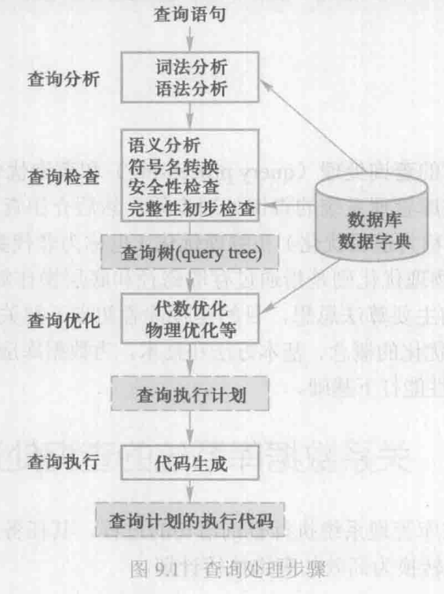
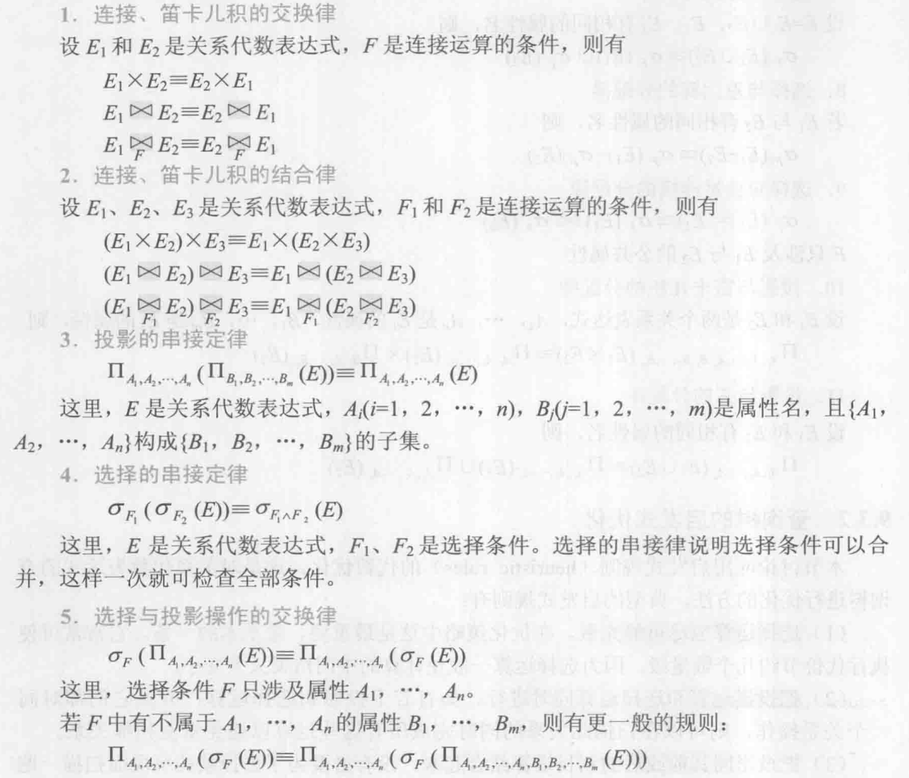
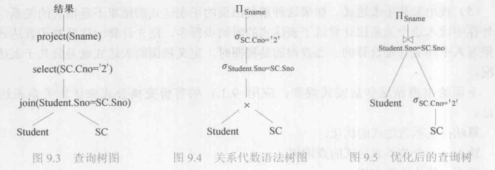

## 9.1 关系数据库系统的查询处理

查询处理是 DBMS 执行查询语句的过程，其任务是把用户提交给关系数据库管理系统的查询语句转换为高效的**查询执行计划**。

**查询处理是关系数据库管理系统的核心，而查询优化技术又是查询处理的关键技术**。本章仅关注查询语句，它是关系数据库管理系统语言处理中最重要、最复杂的部分。

### 9.1.1 查询处理步骤

关系数据库管理系统查询处理可分为四个阶段：查询分析、查询检查、查询优化、查询执行。



#### 查询分析

首先对查询语句进行*扫描、词法分析和语法分析*。从查询语句中识别出语言符号，如SQL 关键字、属性名和关系名等，进行语法检查和语法分析，即判断查询语句是否符合SQL语法规则。如果没有语法错误就转入下步处理，否则便报告语句中出现的语法错误。

#### 查询检查

对合法的查询语向进行*语义检查*，即根据数据字典中有关的模式定义检查语句中的数据库对象，如关系名、属性名是否存在和有效。如果是对视图的操作，则要用视图消解方法把对视图的操作转换成对基本表的操作。还要根据数据字典中的用户权限和完整性约束定义对用户的*存取权限*进行检查。如果该用户没有相应的访问权限或违反了*完整性约束*，就拒绝执行该查询。

当然，这时的完整性检查是**初步的、静态的**检查。检查通过后便把SQL查询语句转换成内部表示，即等价的**关系代数表达式**。这个过程中要把数据库对象的外部名称转换为内部表示。

关系数据库管理系统一般都用**查询树**（query tree），也称为**语法分析树**（syntax tree）来表示扩展的关系代数表达式。

#### 查询优化

每个查询都会有许多可供选择的执行策略和操作算法，查询优化就是选择一个高效执行的*查询处理策略*。查询优化有多种方法。按照优化的层次一般可将查询优化分为代数优化和物理优化。

代数优化是指关系代数表达式的优化，即按照一定的规则，通过对关系代数表达式进行等价变换，改变代数表达式中操作的次序和组合，使查询执行更高效。

物理优化则是指存取路径和底层操作算法的选择。选择的依据可以是基于规则 （rule based）的，也可以是基于代价 （cost based）的，还可以是基于语义（semantic based）的。

实际关系数据库管理系统中的查询优化器都综合运用了这些优化技术，以获得最好的查询优化效果。

#### 查询执行

依据优化器得到的执行策略生成查询执行计划，由**代码生成器**（code generator）生成执行这个查询计划的代码，然后加以执行，回送查询结果。

### 9.1.2 实现查询操作的算法示例

本节简单介绍选择操作和连接操作的实现算法，确切地说是算法思想。每一种操作有多种执行的算法，这里仅仅介绍最主要的几个算法。

#### 选择操作的实现

第3章中己经介绍了 SBLECT 语句的强大功能，SELECT 语句有许多选项，因此实现的算法和优化策略也很复杂。不失一般性，下面以简单的选择操作为例介绍典型的实现方法。


选择操作只涉及一个关系，一般采用全表扫描或者基于索引的算法。

（1） 简单的全表扫描算法（table scan）
假设可以使用的内存为M块，全表扫描的算法思想如下:

- ① 按照物理次序读 Student 的M块到内存。
- ② 检查内存的每个元组t，如果t满足选择条件，则输出t。
- ③ 如果 Student 还有其他块未被处理，重复①和②。

全表扫描算法只需要很少的内存（最少为1块）就可以运行，而且控制简单。对于规模小的表，这种算法简单有效。对于规模大的表进行顺序扫描，当选择率（即满足条件的元组数占全表的比例）较低时，这个算法效率很低。

（2） 索引扫描算法（index scan）
如果选择条件中的属性上有索引（例如B+树索引或 hash 索引），可以用索引扫描方法，通过索引先找到满足条件的元组指针，再通过元组指针在查询的基本表中找到元组。

［例9.1-C2］以C2为例：Sno='201215121'，并且 Sno 上有索引，则可以使用索引得到Sno 为'201215121'元组的指针，然后通过元组指针在 Student 表中检索到该学生。

［例9.1-C3］以C3为例：Sage>20，并且 Sage上有B+树索引，则可以使用B+树索引找到 Sage=20的索引项，以此为入口点在B+树的顺序集上得到 Sage>20的所有元组指针，然后通过这些元组指针到 Student 表中检索到所有年龄大于20的学生。

［例9.1-C4］以C4为例：Sdept='CS' AND Sage>20，如果 Sdept 和 Sage上都有索引，一种算法是，分别用上面两种方法找到 Sdept='CS'的一组元组指针和 Sage>20 的另一组元组指针，求这两组指针的交集，再到 Student 表中检索，就得到计算机系年龄大于20岁的学生。

另一种算法是，找到 Sdept='CS'的一组元组指针，通过这些元组指针到 Student 表中检索，并对得到的元组检查另一些选择条件（如 Sage＞20）是否满足，把满足条件的元组作为结果输出。

一般情况下，**当选择率较低时，基于索引的选择算法要优于全表扫描算法**。但在某些情况下，例如选择率较高，或者要查找的元组均匀地分布在查找的表中，这时基于索引的选择算法的性能不如全表扫描算法。因为除了对表的扫描操作，还要加上对 B+树索引的扫描操作，对每一个检索码，从B+树根结点到叶子结点路径上的每个结点都要执行一次 I/O 操作。

#### 连接操作的实现

连接操作是查询处理中最常用也是最耗时的操作之一。人们对它进行了深入的研究，提出了一系列的算法。不失一般性，这里通过例子简单介绍等值连接（或自然连接）最常用的几种算法思想。

```sql
[例 9.2] SELECT * FROM Student, SC WHERE Student.Sno = SC.Sno;
```

##### （1） 嵌套循环算法 （nested loop join）

这是最简单可行的算法。对外层循环（Student表）的每一个元组，检索内层循环（SC表）中的每一个元组，并检查这两个元组在连接属性（Sno）上是否相等。如果满足连接条件，则串接后作为结果输出，直到外层循环表中的元组处理完为止。这里讲的是算法思想，在实际实现中数据存取是按照数据块读入内存，而不是按照元组进行 I/O 的。嵌套循环算法是**最简单最通用的连接算法**，可以处理包括非等值连接在内的各种连接操作。

##### （2） 排序-合并算法 （sort-merge join 或 mergejoin）

这是等值连接常用的算法，尤其适合参与连接的诸表已经排好序的情况。
用排序-合并连接算法的步骤是：

- ① 如果参与连接的表没有排好序，首先对 Student 表和 SC 表按连接属性 Sno 排序。
- ② 取 Student 表中第一个Sno，依次扫描SC 表中具有相同 Sno 的元组，把它们连接起来（如图9.2所示）。
- ③ 当扫描到 Sno 不相同的第一个SC元组时，返回 Student 表扫描它的下一个元组，再扫描SC表中具有相同Sno的元组，把它们连接起来。重复上述步骤直到Student 表扫描完。

这样 Student 表和SC 表都只要扫描一遍即可。当然，如果两个表原来无序，执行时间要加上对两个表的排序时间。一般来说，对于大表，先排序后使用排序-合并连接算法执行连接，总的时间一般仍会减少。

##### （3） 索引连接 （index join）算法

用索引连接算法的步骤是：

- ① 在SC 表上已经建立了属性 Sno 的索引。
- ② 对 Student 中每一个元组，由 Sno 值通过SC 的索引查找相应的SC元组。
- ③ 把这些 SC 元组和 Student元组连接起来。
循环执行②③，直到 Student 表中的元组处理完为止。

##### （4）hash join 算法

hash join 算法也是处理等值连接的算法。它把连接属性作为 hash码，用同一个hash函数把 Student 表和SC 表中的元组散列到 hash 表中。

- 第一步，划分阶段 （building phase），也称为创建阶段，即创建hash 表。对包含较少元组的表（如Student表）进行一遍处理，把它的元组按 hash 函数（hash 码是连接属性）分散到 hash 表的桶中；
- 第二步，试探阶段（probingphase），也称为连接阶段（join phase），对另一个表（SC表）进行一遍处理，把SC表的元组也按同一个 hash 函数（hash 码是连接属性）进行散列，找到适当的hash 桶，并把SC 元组与桶中来自 Student 表并与之相匹配的元组连接起来。

上面的 hash join 算法假设两个表中较小的表在第一阶段后可以完全放入内存的hash桶中。还有其他不需要这个前提条件的hash join 算法以及许多改进的算法。以上的算法思想可以推广到更加一般的多个表的连接算法上。

## 9.2 关系数据库系统的查询优化

对于比较复杂的查询，尤其是涉及连接和嵌套的查询，不要把优化的任务全部放在关系数据库管理系统上，应该找出关系数据库管理系统的优化规律，以写出适合关系数据库管理系统自动优化的 SQL语句。对于关系数据库管理系统不能优化的查询需要重写查询语句，进行手工调整以优化性能。

### 9.2.1 查询优化概述

关系系统的查询优化既是关系数据库管理系统实现的关键技术，又是关系系统的优点所在。它减轻了用户选择存取路径的负担。

查询优化的优点不仅在于用户不必考了如何最好地表达查询以获取较高的效率，而且在于系统可以比用户程序的“优化”做得更好。这是因为：

1. 优化器可以从数据字典中获取许多统计信息，例如每个关系表中的元组数、建立的索引等。优化器可以根据这些信息做出正确的估算，选择高效的执行计划，而用户程序难以获得这些信息。
2. 如果数据库的物理统计信息改变了，系统可以自动对查询进行重新优化以选择相适应的执行计划。在非关系系统中则必须重写程序，而重写程序在实际应用中不太可能。
3. 优化器可以考虑数百种不同的执行计划，而程序员一般只能考虑有限的几种可能性。
4. 优化器中包含了很多复杂的优化技术，这些技术程序员很难掌握。系统的自动优化相当于使得所有人都拥有这些优化技术。

目前关系数据库管理系统通过某种代价模型计算出各种查询执行策略的执行代价，然后选取代价最小的执行方案。在集中式数据库中，查询执行开销主要包括*磁盘存取块数（I/O代价）、处理机时间（CPU代价）以及查询的内存开销*。在分布式数据库中还要加上*通信代价*，即
```
总代价=I/O 代价+CPU 代价+内存代价+通信代价
```
由于磁盘 I/O 操作涉及机械动作，需要的时间与内存操作相比要高几个数量级，因此，在计算查询代价时一般用查询处理读写的块数作为衡量单位。

查询优化的总目标是选择有效的策略，求得给定关系表达式的值，使得查询代价较小。因为查询优化的搜索空间有时非常大，**实际系统选择的策略不一定是最优的，而是较优的**。
### 9.2.2 一个实例


1、 第一种情况

（1）计算广义笛卡儿积

把 Student 和SC 的每个元组连接起来。一般连接的做法是：在内存中尽可能多地装入某个表（如Student 表）的若干块，留出一块存放另一个表（如SC表）的元组；然后把SC 中的每个元组和 Student 中每个元组连接，连接后的元组装满一块后就写到中间文件上，再从SC 中读入一块和内存中的 Student元组连接，直到SC表处理完；这时再一次读入若干块 Student元组，读入一块SC元组，重复上述处理过程，直到把Student 表处理完。

设一个块能装10个 Student元组或100个SC元组，在内存中存放5块 Student元组和1 块SC元组，则读取总块数为

$1000/10+1000/(10×5)×10000/(100)=100+20×100=2100块$

其中，读 Student表100块，读SC表20遍，每遍100块，则总计要读取2100 数据块。连接后的元组数为$10^3×10^4=10^7$。设每块能装10个元组，则写出$10^6$块。（设连接表R与S分别占用的块数为Br 与Bs，连接操作使用的内存缓冲区块数为K，分配 K-1 块给外表。如果R 外表，则嵌套循环法存取的块数为 $Br+ BrBs/(K-1)$）

（2） 作选择操作

依次读入连接后的元组，按照选择条件选取满足要求的记录。假定内存处理时间忽略。这一步读取中间文件花费的时间（同写中间文件一样）需读入$10^6$块。若满足条件的元组假设仅50个，均可放在内存。

（3）作投影操作

把第（2）步的结果在 Sname 上作投影输出，得到最终结果。因此第一种情况下执行查询的总读写数据块=$2100+10^6+10^6$。

2、 第二种情况

（1） 计算自然连接

为了执行自然连接，读取 Student 和 SC表的策略不变，总的读取块数仍为2100块。但自然连接的结果比第一种情况大大减少，连接后的元组数为$10^4$个元组，写出数据块=$10^3$块。

（2）读取中间文件块，执行选择操作，读取的数据块=$10^3$块。

（3） 把第（2）步结果投影输出。

第二种情况下执行查询的总读写数据块=$2100+10^3+10^3$。其执行代价大约是第一种情况的488分之一。

3、 第三种情况

（1）先对SC 表作选择操作，只需读一遍SC表，存取块数为100块，因为满足条件的元组仅50个，不必使用中间文件。

（2）读取 Student表，把读入的 Student 无组和内存中的SC元组作连接。也只需读遍 Student表，共100块。

（3）把连接结果投影输出。

第三种情况总的读写数据块=100+100。其执行代价大约是第一种情况的万分之一，是第二种情况是20分之一。

假如SC表的Cno 字段上有索引，第一步就不必读取所有的SC元组而只需读取 Cno=2的那些元组（50个）。存取的索引块和SC中满足条件的数据块大约共3～4块。若 Student表在 Sno 上也有索引，则第二步也不必读取所有的 Student 元组，因为满足条件的SC记录仅50个，涉及最多50个Student 记录，因此读取 Student表的块数也可大大減少。

这个简单的例子充分说明了查询优化的必要性，同时也给出一些查询优化方法的初步概念。例如，读者可能已经发现，在第一种情况下，连接后的元组可以先不立即写出，而是和下面第（2）步的选择操作结合，这样可以省去写出和读入的开销。**有选择和连接操作时，应当先做选择操作**，例如，把上面的代数表达式QI、02变换为Q3，这样参加连接的元组就可以大大减少，这是**代数优化**。在Q3中，SC表的选择操作算法可以采用全表扫描或索引扫描，经过初步估算，索引扫描方法较优。同样对于 Student 和SC 表的连接，利用Student 表上的索引，**采用索引连接代价也较小，这就是物理优化**。

## 9.3 代数优化

基于**关系代数等价变换规则**的优化方法，即代数优化。

### 9.3.1 关系代数表达式等价变换规则

代数优化策略是通过对**关系代数表达式的等价变换**来提高查询效率。所谓关系代数表达式的等价是指用相同的关系代替两个表达式中相应的关系所得到的结果是相同的。两个关系表达式E1、和E2是等价的，可记为$E_1 \equiv E_2$。下面是常用的等价变换规则。



ChatGPT 说明：

- 投影的串接定律（也称为投影的叠加定律）
    简单来说，这个定律告诉我们，如果你先对一个关系进行投影，然后再从结果中进行第二次投影，第二次投影选取的属性仅仅是第一次投影属性的一个子集，那么两次投影的结果将等同于仅仅进行一次第二次投影的操作。
- 并操作的含义是构造一个新的关系，这个新关系包含属于  E1 或属于 E2 的所有元组，没有重复。为了使并操作有效，两个关系 E1  和 E2 必须是**并兼容**的，也就是说，它们拥有相同的模式，具有相同数目和类型的属性，并且属性的顺序也相同。例如 SQL 中的 UNION 关键字。

### 9.3.2 查询树的启发式优化

本节讨论应用启发式规则的代数优化。这是对关系代数表达式的查询树进行优化的方法。典型的启发式规则有：

1. 选择运算尽可能先做。在优化策略中这是**最重要、最基本**的一条。它常常可使执行代价节约几个数量级，因为选择运算一般使计算的中间结果大大变小。
2. 把投影运算和选择运算同时进行。如有若干投影和选择运算，并且它们都对同一个关系操作，则可以在扫描此关系的同时完成所有这些运算以避免重复扫描关系。
3. 把投影同其前或后的双目运算结合起来，没有必要为了去掉某些字段而扫描一遍关系。
4. 把某些选择同在它前面要执行的笛卡儿积结合起来成为一个连接运算，连接（特别是等值连接）运算要比同样关系上的笛卡儿积省很多时间。
5. 找出公共子表达式。如果这种重复出现的子表达式的结果不是很大的关系，并且从外存中读入这个关系比计算该子表达式的时间少得多，则先计算一次公共子表达式并把结果写入中间文件是合算的。当查询的是视图时，定义视图的表达式就是公共子表达式的情况。

规则 3 ChatGPT说明：
最好是先在各个小表上执行投影，去掉那些最终不在最终结果中的列，然后再执行连接。这将显著减少要处理的数据量，因为连接操作仅在那些真正需要的列上执行。

```
// 低效的：
result = join(R, S) result = project(result, [needed_columns])

// 更高效的：
R = project(R, [needed_columns_related_to_R])
S = project(S, [needed_columns_related_to_S])
result = join(R, S)
```

规则 4 举例：

```sql

-- 低效的方式： 
SELECT * FROM Table1, Table2 WHERE Table1.id = Table2.id;

-- 更高效的方式： 
SELECT * FROM Table1 JOIN Table2 ON Table1.id = Table2.id;
```

#### 优化关系表达式的算法

下面给出遵循这些启发式规则，应用 9.3.1 的等价变换公式来优化关系表达式的算法。

算法：关系表达式的优化。

输入：一个关系表达式的查询树。

输出：优化的查询树。

方法：

（1）利用等价变换规则 4，把形如$\sigma_{F_1,F_2,...,F_n}(E)$的表达式变换为$\sigma_{F_1}(\sigma_{F_2}(...(\sigma_{F_n}(E))...))$。

（2）对每一个选择，利用等价变换规则 4～9 尽可能把它移到树的叶端。

（3）对每一个投影，利用等价变换规则 3、5、10、11 中的一般形式尽可能把它移向树的叶端。

注意：等价变换规则3使一些投影消失，而规则5把一个投影分裂为两个，其中一个有可能被移向树的叶端。

（4）利用等价变换规则3～5，把选择和投影的串接合并成单个选择、单个投影或一个选择后跟一个投影，使多个选择或投影能同时执行，或在一次扫描中全部完成，尽管这种变换似乎违背“投影尽可能早做”的原则，但这样做效率更高。

（5）把上述得到的语法树的内结点分组。每一双目运算（$\times, \bowtie, \cup, -$）和它所有的直接祖先为一组（这些直接祖先是（$\sigma, \Pi$运算））。如果其后代直到叶子全是单目运算，则也将它们并入该组，但当双目运算是笛卡儿积（$\times$），而且后面不是与它组成等值连接的选择时，则不能把选择与这个双目运算组成同一组。把这些单目运算单独分为一组。

```sql
[例 9.4] SELECT Student.Sname FROM Student, SC WHERE Student.Sno=SC.Sno AND SC.Cno='2';
```
（1） 把SQL 语句转换成查询树，如图9.3所示。
为了使用关系代数表达式的优化法，不妨假设内部表示是关系代数语法树，则上面的查询树如图9.4所示。

（2） 对查询树进行优化。
利用规则 4、6把选择$\sigma_{SC.Cno='2'}$移到叶端，图9.4 查询树便转换成图9.5优化的查询树。这就是9.2.2 节中 Q3的查询树表示。前面已经分析了 Q3 比 Q1、Q2查询效率要高得多。



## 9.4 物理优化

代数优化改变查询语句中操作的次序和组合，但不涉及底层的存取路径。对每一种操作有许多种执行这个操作的算法，有多条存取路径，因此仅仅进行代数优化是不够的。物理优化就是要选择合理高效的操作算法或存取路径，求得优化的查询计划，达到查询优化的目的。选择的方法可以是：

1. 基于规则的启发式优化。启发式规则是指那些在大多数情况下都适用，但不是在每种情况下都是最好的规则。
2. 基于代价估算的优化。使用优化器估算不同执行策略的代价，并选出具有最小代价的执行计划。
3. 两者结合的优化方法。查询优化器通常会把这两种技术结合在一起使用。因为可能的执行策略很多，要穷尽所有的策略进行代价估算往往是不可行的，会造成查询优化本身付出的代价大于获得的益处。为此，常常*先使用启发式规则，选取若干较优的候选方案，减少代价估算的工作量*；然后*分别计算这些候选方案的执行代价，较快地选出最终的优化方案*。

### 9.4.1 基于启发式规则的存取路径选择优化

#### 1. 选择操作的启发式规则

对于小关系，使用全表顺序扫描，即使选择列上有索引。

对于大关系，启发式规则有：

1. 对于选择条件是“主码=值”的查询，查询结果最多是一个元组，可以选择主码索引。一般的关系数据库管理系统会自动建立主码索引。
2. 对于选择条件是“非主属性=值”的查询，并且选择列上有索引，则要估算查询结果的元组数目，如果比例较小（<10%）可以使用索引扫描方法，否则还是使用全表顺序扫描。
3. 对于选择条件是属性上的非等值查询或者范围查询，并且选择列上有索引，同样要估算查询结果的元组数目，如果选择率<10%可以使用索引扫描方法，否则还是使用全表顺序扫描。
4. 对于用 AND 连接的合取选择条件，如果有涉及这些属性的组合索引，则优先采用组合索引扫描方法；如果某些属性上有一般索引，则可以用［例 9.1-C4］中介绍的索引扫描方法，否则使用全表顺序扫描。
5. 对于用 OR连接的析取选择条件，一般使用全表顺序扫描。

#### 2. 连接操作的启发式规则

1. 如果2个表都已经按照连接属性排序，则选用排序-合并算法。
2. 如果一个表在连接属性上有索引，则可以选用索引连接算法。
3. 如果上面2个规则都不适用，其中一个表较小，则可以选用 hash join 算法。
4. 最后可以选用嵌套循环算法，并选择其中较小的表，确切地讲是占用的块数（B）较少的表，作为外表（外循环的表）。理由如下：
    设连接表R与S分别占用的块数为Br 与Bs，连接操作使用的内存缓冲区块数为K，分配 K-1 块给外表。如果R 外表，则嵌套循环法存取的块数为 $Br+ BrBs/(K-1)$，显然应该选块数小的表作为外表。

上面列出了一些主要的启发式规则，在实际的关系数据库管理系统中启发式规则要多得多。

### 9.4.2 基于代价估算的优化

启发式规则优化是定性的选择，比较粗糙，但是实现简单而且优化本身的代价较小，所以启发式规则优化适合解释执行的系统。因为解释执行的系统，其优化开销包含在查询总开销之中。

在编译执行的系统中，一次编译优化，多次执行，查询优化和查询执行是分开的。因此，可以采用精细复杂一些的基于代价的优化方法。

1、统计信息

基于代价的优化方法要计算各种操作算法的执行代价，它与数据库的状态密切相关。为此在数据字典中存储了优化器需要的统计信息（database statistics），主要包括如下几个方面：

1. 对每个基本表，该表的元组总数（N）、元组长度（$l$）、占用的块数（B）、占用的溢出块数（BO）；
2. 对基本表的每个列，该列不同值的个数（m）、该列最大值、最小值，该列上是否已经建立了索引，是哪种索引（B+树索引、hash 索引、聚集索引）。根据这些统计信息，可以计算出谓词条件的选择率（f），如果不同值的分布是均匀的，$f=1/m$；如果不同值的分布不均匀，则要计算每个值的选择率，$f=具有该值的元组数/N$；
3. 对索引，例如B+树索引，该索引的层数（L）、不同索引值的个数、索引的选择基数S（有S个元组具有某个索引值）、索引的叶结点数（Y）；

等等。

2、 代价估算示例

下面给出若干操作算法的执行代价估算。

（1）全表扫描算法的代价估算公式

如果基本表大小为B块，全表扫描算法的代价 costB；

如果选择条件是“码=值”，那么平均搜索代价 cost=B/2。

（2） 索引扫描算法的代价估算公式

如果选择条件是“码=值”，如例9.1-C2，则采用该表的主索引，若为B+树，层数为L，需要存取 B+树中从根结点到叶结点 L块，再加上基本表中该元组所在的那一块，所以 cost=L+1。

如果选择条件涉及非码属性，如例9.1-C3，若B+树索引，选择条件是相等比较，S是索引的选择基数（有S个元组满足条件）。因为满足条件的元组可能会保存在不同的块上，所以（最坏的情況）cost=L+S。

如果比较条件是>，＞=，<，＜=操作，假设有一半的元组满足条件，那么就要存取一半的叶结点，并通过索引访问一半的表存储块。所以 cost=L+Y/2+B/2。如果可以获得更准确的选择基数，可以进一步修正 Y/2与B/2。

（3） 嵌套循环连接算法的代价估算公式

9.4.1 中已经讨论过了嵌套循环连接算法的代价 cost=Br+BrBs/(K-1)。如果需要把连接结果写回磁盘，则 cost=Br+BrBs/(K-1)+(Frs\*Nr\*Ns)/Mrs。其中 Frs 为连接选择率 （joinselectivity），表示连接结果元组数的比例，Mrs 是存放连接结果的块因子，表示每块中可以存放的结果元组数目。

（4） 排序-合并连接算法的代价估算公式

如果连接表已经按照连接属性排好序，则 cost=Br+Bs+(Frs\*Nt\*Ns)/Mrs。

如果必须对文件排序，那么还需要在代价函数中加上排序的代价。对于包含B个块的文件排序的代价大约是$(2*B)＋(2*B*log_2B)$。

上面仅仅列出了少数操作算法的代价估算示例。在实际的关系数据库管理系统中代价估算公式要多得多，也复杂得多。

前面还提到一种优化的方法，称为语义优化。这种技术根据数据库的语义约束，把原先的查询转换成另一个执行效率更高的查询。本章不对这种方法进行详细讨论，只用一个简单的例子来说明它。考虑例9.1的SQL查询：
```sql
SELECT * FROM Student WHERE Sdept=ICS" AND Sage>200；
```
显然，用户在写年龄值 Sage 时，误把20写成200了。假设数据库模式上定义了一个约束，要求学生年龄在15—55岁之间。一旦查询优化器检查到了这条约束，它就知道上面查询的结果为空，所以根本不用执行这个查询。

## 9.5 查询计划的执行

查询优化完成后，关系数据库管理系统为用户查询生成了一个查询计划。该查询计划的执行可以分为自顶向下和自底向上两种执行方法。

在*自项向下的执行方式*中，系统反复向查询计划顶端的操作符发出需要查询结果元组的请求，操作符收到请求后，就试图计算下一个（几个）元组并返回这些元组。在计算时，如果操作符的输入缓冲区力空，它就会向其孩子操作符发送需求元组的请求⋯⋯这种需求元组的请求会一直传到叶子结点，启动叶子操作符运行，并返回其父操作符一个（几个）元组，父操作符再计算自己的输出返回给上层操作符，直至顶端操作符。重复这一过程，直到处理完整个关系。

在*自底向上的执行方式*中，查询计划从叶结点开始执行，叶结点操作符不断地产生元组并将它们放入其输出缓冲区中，直到缓冲区填满为止，这时它必须等待其父操作符将元组从该缓冲区中取走才能继续执行。然后其父结点操作符开始执行，利用下层的输入元组来产生它自己的输出元组，直到其输出缓冲区满为止。这个过程不断重复，直到产生所有的输出元组。

显然，**自顶向下的执行方式是一种被动的、需求驱动的执行方式。而自底向上的执行方式是一种主动的执行方式。**
