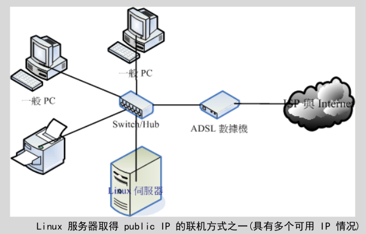
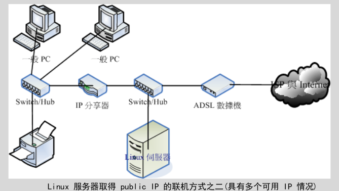
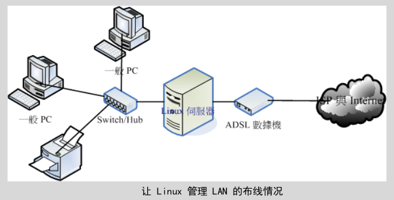
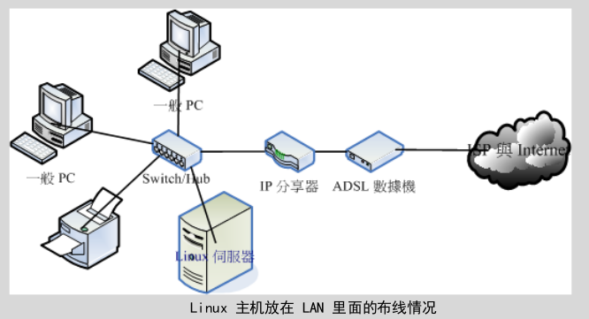

## 局域网的联机

这里主要介绍的是**小型局域网**的架构，如果是比较大型的企业内部，那么将“配线盘、线路设计、墙上网络孔“分别拆开施工的*结构化布线*会比较妥当，最好寻求专业人士的帮助。

### 局域网的布线规划

#### Linux 直接联网-与 PC 同地位

如果你使用的 ADSL 是多 IP 的条件 (例如拨接可以给予 2-8 个 IP 的情况)，那么最简单的方式就是如下图的联机模式：

当需要连上 Internet 时，每部计算机 (包括 PC 与 Linux 主机) 都可以自己直接通过拨接联网。

这样的情况对于一般家庭使用者来说，可以算是最佳的解决方案啦！因为如果你的 Linux 主机挂点时，其他个人的 PC 是不会被影响的！

对于小型企业主来说，却不好管理。原因：

- 无法掌握每个员工实际上网的情况
- 没有防火墙
- 内部与外部网络环境没有分开管理

#### Linux 直接联网-与一般 PC 分开网域

如果你有多个可用的 public IP ，并且你的 Linux 服务器主要是提供 Internet 的 WWW 或 mail 服务， 而不是作为内部的文件服务器之用，那么将 Linux 服务器与内部的网域分开也是个可行的方法：

所有的 LAN 内的计算机与相关设备都会在同一个网域内，所以在 LAN 内的传输速度是没有问题的， 此外，这些计算机要连出至 Internet 时，必须要透过 IP 分享器，所以你也可以在 IP 分享器上面设定简单的防火墙规则， 如果 IP 分享器可以换更高阶的设备时，那么你就可以在该设备上面架设规则较为完整的防火墙， 对于内部主机有相当程度的管理，并且好维护。

#### Linux 直接联网-让 Linux 直接管理 LAN

如果你不想要购买 IP 分享器的话，那么可以直接利用 Linux 服务器来管理：

这种情况下，不论你有多少个 IP 都可以适用的，尤其是当你只有一个 public IP 时，就只能使用这种方式了。

让 Linux 作为 IP 分享器的功能相当的简单，同时Linux 具备两张网络卡，分别是对外与对内就好了。

网络管理人员也较能进行较完善的掌控，并且，Linux 服务器也要比高阶的硬件防火墙便宜多了。

缺点：由于内部的 LAN 是需要通过 Linux 才能联机出去，所以 Linux 挂点时，整个对外联机就挂了，此外，
Linux 的服务可能就太复杂了点，可能会造成维护上的困难度。

#### Linux 放在防火墙后-让 Linux 使用 Private IP

比较大型的企业通常会将他们的服务器主机放置在机房内，主要是在 LAN 的环境下， 再透过防火墙的封包重新导向的功能，将来自 Internet 的封包先经过防火墙后才进入到服务器：

当你要对 Internet 提供网络服务时， 防火墙的规则将变的相当复杂，因为需要进行封包转递的任务，在某些比较麻烦的协议当中， 可能会造成设定方面的困扰。

### 网络媒体选购建议

首先需要了解跳线、并行线、RJ-45 网络线、Hub/Switch的优劣。

不在我们局域网络内的设备，例如调制解调器，那就得向 ISP 询问了。同批次安装的调制解调器模块不同， 所以会有不一样的连接与线材处理方式。

#### 主机硬件系统

考虑使用年限、省电、虚拟技术等。

不过，选购什么主机配备与该主机即将运作的服务其实是有关系的，例如防火墙系统与 DHCP 等服务并不需要很强的主机， 但是 Proxy 及 SQL 等服务器就得要强而有力的主机系统，甚至得要磁盘阵列的辅助会比较好。

#### Linux 操作系统

考虑稳定、可网络升级、能够快速取得协助支持。

一般来说，我们会建议你如果想要搭建服务器时，尽量选择**稳定性较高的企业版**较佳。

#### 网卡

考虑服务器用途、内置与否、驱动程序的取得等

使用内建的网络卡时，你得要注意到该网络卡是否为特殊的网络芯片，根据以往的经验，内建的网络卡通常是芯片较特殊的， 所以可能导致 Linux 预设的网卡驱动程序无法顺利的驱动该网络卡。

如果强调高速的话， 甚至可以选用 PCI-Express 的网络卡，而不使用传统的 PCI 接口。

#### Switch/Hub

考虑主机数量、传输带宽、网管功能与否等。

Hub（集线器） 是共享媒体而 Switch 是具有独立带宽的非共享媒体。

如果你常常在局域网内传送大量的数据，网络卡最好使用 gigabit ， 当然中间的联机设备最好买支持到 gigabit 速度的 switch。如果你的设备还需要更快时，则购买的 switch 甚至需要支持 Jumbo frame 这种支持大帧的硬件架构才行。

#### 网线

考虑与速度相配的等级、线材形状、施工配线等。

除了网络线的等级会影响到连接速度外，网络线所在处是否容易被压折?是否容易有讯号衰减?自己压制的 RJ-45 接头是否通过测试?网络线是否缠绕情况严重?都会影响到网络的传输优劣。

Cat 5 等级的线材还可以自行压制， 比他还高等级的，最好还是买现成的吧。

#### 无线网络相关设备

考虑速度、标准、安全性等。

无线网络最大的问题常常在于**无线的安全性**方面，基地台如果没有做好防备措施的话，常常会导致 LAN 内的主机数据被窃取。所以尽量购买拥有**限制 MAC**功能的无线基地台（WLAN AP (Wireless LAN Access Point)）。

#### 关于其他配件

整个网络环境可不止上头提到的这些咚咚而已，还包括硬件防火墙、路由器、网桥等等。

在网络线的转角处必须特别注意线材的保护, 在平面地上则需要特别使用压条给予固定,在牵线施工的时候尽量让线材沿着墙角或者是墙面上的既有物品。

计算机上网的速度并非完全取决于网络带宽，而是取决于最慢的那个设备或限制。