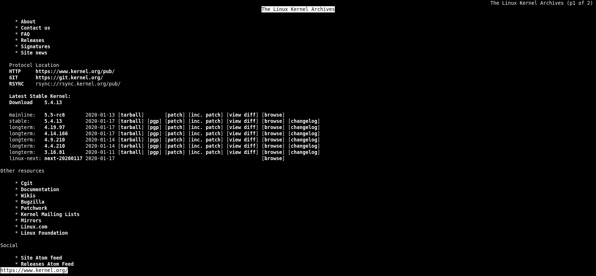

## 网络参数设置指令

### 查看网络信息

```
[root@centos-server-1 ~]# ifconfig eth1
eth1: flags=4163<UP,BROADCAST,RUNNING,MULTICAST>  mtu 1500
        inet 172.16.2.182  netmask 255.255.255.0  broadcast 172.16.2.255
        inet6 fe80::8568:7ee7:84b7:9c15  prefixlen 64  scopeid 0x20<link>
        ether 00:1a:4a:16:01:53  txqueuelen 1000  (Ethernet)
        RX packets 172272  bytes 30899015 (29.4 MiB)
        RX errors 0  dropped 17  overruns 0  frame 0
        TX packets 4177  bytes 293101 (286.2 KiB)
        TX errors 0  dropped 0 overruns 0  carrier 0  collisions 0
        
[root@centos-server-1 ~]# ip -s link show eth0
2: eth0: <BROADCAST,MULTICAST,UP,LOWER_UP> mtu 1500 qdisc pfifo_fast state UP mode DEFAULT qlen 1000
    link/ether 00:1a:4a:16:01:52 brd ff:ff:ff:ff:ff:ff
    RX: bytes  packets  errors  dropped overrun mcast   
    1307897    17095    0       0       0       0       
    TX: bytes  packets  errors  dropped carrier collsns 
    224643     973      0       0       0       0
```

信息说明：

- txqueuelen：代表用来传输数据的缓冲区的长度
- RX：代表的是网络由启动到目前为止的报文接收情况
    - bytes：接收总量
    - packets：报文数
    - errors：报文发生错误的数量
    - dropped：丢弃的报文数量
- TX：代表的是网络由启动到目前为止的报文发送情况
- collisions：报文碰撞次数

### 修改网络设置

**以下修改都是临时修改，并没有写入配置文件。**

#### 针对设备进行设置

```
ip link <动作> <参数>

动作
	add
	delete
	set
	show
```

```bash
[root@centos-server-1 ~]# ip link show eth0
3: eth1: <BROADCAST,MULTICAST> mtu 1500 qdisc pfifo_fast state DOWN mode DEFAULT qlen 1000
    link/ether 00:1a:4a:16:01:53 brd ff:ff:ff:ff:ff:ff
# 修改 mtu
[root@centos-server-1 ~]# ip link set eth1 mtu 1000
# 停止设备
[root@centos-server-1 ~]# ip link set eth1 down
# 修改名称
[root@centos-server-1 ~]# ip link set eth1 name eth-test
[root@centos-server-1 ~]# ip link show
……
3: eth-test: <BROADCAST,MULTICAST> mtu 1000 qdisc pfifo_fast state DOWN mode DEFAULT qlen 1000
    link/ether 00:1a:4a:16:01:53 brd ff:ff:ff:ff:ff:ff
# 测试完把它修改过来
[root@centos-server-1 ~]# ip link set eth-test name eth1
[root@centos-server-1 ~]# ip link set eth1 up
```

#### 针对IP协议进行设置

```
ip addr <动作> <参数>

动作
	add|change|	replace
	del
	show
```

作用域 scope 的值有以下几种：

- global - the address is globally valid.
- site - (IPv6 only, deprecated) the address is site local, i.e. it is valid inside this site.
- link - the address is link local, i.e. it is valid only on this device.
- host - the address is valid only inside this host.

```bash
# 添加网络接口。并让系统自动计算 broadcast 的值；label 是别名
[root@centos-server-1 ~]# ip a add 192.168.216.10/23 br + dev eth1 label eth1:sink
[root@centos-server-1 ~]# ip a show eth1
3: eth1: <BROADCAST,MULTICAST,UP,LOWER_UP> mtu 1500 qdisc pfifo_fast state UP qlen 1000
    link/ether 00:1a:4a:16:01:53 brd ff:ff:ff:ff:ff:ff
    inet 172.16.2.182/24 brd 172.16.2.255 scope global eth1
       valid_lft forever preferred_lft forever
    inet 192.168.216.10/23 brd 192.168.217.255 scope global eth1:sink
       valid_lft forever preferred_lft forever
    inet6 fe80::8568:7ee7:84b7:9c15/64 scope link 
       valid_lft forever preferred_lft forever
[root@centos-server-1 ~]# ifconfig eth1:sink
eth1:sink: flags=4163<UP,BROADCAST,RUNNING,MULTICAST>  mtu 1500
        inet 192.168.216.10  netmask 255.255.254.0  broadcast 192.168.217.255
        ether 00:1a:4a:16:01:53  txqueuelen 1000  (Ethernet)
[root@centos-server-1 ~]# ip a del 192.168.216.10/23 dev eth1
```

#### 针对路由进行设置

```
ip route <动作> <参数>

动作
	add
	change
	replace			change or add new one
		dev NAME	从哪个 设备 出去
		via GW		从哪个 GATEWAY 出去
		mtu MTU
		protocol RTPROTO	
			redirect - the route was installed due to an ICMP redirect.
            kernel - the route was installed by the kernel during autoconfiguration.
            boot - the route was installed during the bootup sequence.  If a routing daemon starts, it will purge all of them.
            static - the route was installed by the administrator to override dynamic routing. Routing daemon will respect them and, probably, even advertise them to its peers.
            ra - the route was installed by Router Discovery protocol.
	del
	show
```

```bash
[root@centos-server-1 ~]# ip r
default via 172.16.2.254 dev eth1  proto static  metric 100 
172.16.2.0/24 dev eth1  proto kernel  scope link  src 172.16.2.182  metric 100 
192.168.75.0/24 dev eth0  proto kernel  scope link  src 192.168.75.128  metric 100
# 增加路由，主要是本机可直接连通的网域，不需要通过外部的路由器
[root@centos-server-1 ~]# ip r add 172.16.7.0/24 dev eth1 
[root@centos-server-1 ~]# ip r
……
172.16.7.0/24 dev eth1  scope link 
# 增加可以通往外部的路由，需要通过外部 router 喔，添加的路由规则必须是可以连通的
[root@centos-server-1 ~]# ip r add 172.16.6.0/24 via 172.16.2.254 dev eth1
[root@centos-server-1 ~]# ip r
……
172.16.6.0/24 via 172.16.2.254 dev eth1
# 删除默认路由
[root@centos-server-1 ~]# ip r del default
# 添加默认路由
[root@centos-server-1 ~]# ip r add default via 172.16.2.254 dev eth1
```

### 手动使用 DHCP 自动取得 IP 参数

不一定要直接编辑 ifcfg-xxx ，也可以使用 `dhclient` ：

```
[root@centos-server-1 ~]# dhclient -v eth1
```

可以立刻叫我们的网卡以 dhcp 协议去尝试取得 IP。若不能接收到DHCP的信息，则不会改动现有配置。

## 网络检测指令

### ping

ping 主要透过 `ICMP` 报文来进行整个网络的状况报告。

```
ping options destination

OPTIONS
	-4     Use IPv4 only.
    -6     Use IPv6 only.
    -c	   执行次数
    -s	   数据大小，默认是56，这个数据还需要加上
    -W	   等待响应的秒数
    -t	   TTL 的数值,预设是 255,每经过一个节点就会减一;
    -M pmtudisc_opt	主要用于侦测网络的 MTU 数值大小
    	do 	:代表传送一个 DF (Don't Fragment) 旗标,让报文不能重新拆包与打包;
		dont:代表不要传送 DF 旗标,表示报文可以在其他主机上拆包与打包
```

!!! note
	ping 还是需要透过 IP 报文来传送 ICMP 报文的。如果你的主机与待侦测主机并不在同一个网段内， 那么 TTL 预设使用255，如果是同一个网域内，那么 TTL 预设则使用 64。

```bash
# 不知道为什么 TTL 不对 //TODO
[root@centos-server-1 ~]# ping -c 2 -W 2 -t 90 baidu.com
PING baidu.com (39.156.69.79) 56(84) bytes of data.
64 bytes from 39.156.69.79 (39.156.69.79): icmp_seq=1 ttl=47 time=33.3 ms
64 bytes from 39.156.69.79 (39.156.69.79): icmp_seq=2 ttl=47 time=28.5 ms

--- baidu.com ping statistics ---
2 packets transmitted, 2 received, 0% packet loss, time 1003ms
rtt min/avg/max/mdev = 28.510/30.921/33.333/2.417 ms
```

#### 检测路径中最大的 MTU 数值

我们知道网络卡的 MTU （代表 frame 的大小）修改可以透过 ifconfig 或者是 ip 等指令来达成，那么追踪整个网络传输的最大 MTU 时，又该如何查询？最简单的方法当然是透过 ping 传送一个大报文， 并且不许中继的路由器或 switch 将该报文重组，那就能够处理啦！

```bash
[root@centos-server-1 ~]# ping -c 2 -W 2 -s 1000 -M do baidu.com
PING baidu.com (220.181.38.148) 1000(1028) bytes of data.
# 有响应代表可以通过；无响应代表太大了
1008 bytes from 220.181.38.148 (220.181.38.148): icmp_seq=1 ttl=50 time=34.0 ms
1008 bytes from 220.181.38.148 (220.181.38.148): icmp_seq=2 ttl=50 time=34.5 ms
……

# 禁止拆包与打包
[root@centos-server-1 ~]# ping -c 2 -W 2 -s 9000 -M do baidu.com
PING baidu.com (220.181.38.148) 9000(9028) bytes of data.
# 报错啦，本地才 1500，传送的却是 9000，修改一下网卡的设置吧
ping: local error: Message too long, mtu=1500
……
[root@centos-server-1 ~]# ip l set eth1 mtu 10000
[root@centos-server-1 ~]# ping -c 2 -W 2 -s 9000 -M do baidu.com
PING baidu.com (220.181.38.148) 9000(9028) bytes of data.

--- baidu.com ping statistics ---
2 packets transmitted, 0 received, 100% packet loss, time 1000ms
```

IP 报文表头 (不含 options) 就已经占用了 20 bytes ，再加上 ICMP 的表头有 8 bytes ，所以当然你在使用 *-s size* 的时候，那个报文的大小就得要先扣除 (20+8=28) 的大小了。

!!! warning
	除非真的需要调整，否则不要随便改动 MTU。

### 两主机之间各节点分析：traceroute

```
traceroute options IP/DOMAIN

OPTIONS
	-n	不要进行IP与域名的转换
	-U  --udp                 default port is 53
	-I  --icmp
	-T  --tcp				  default port is 80
	-p port  --port=port      
	-w waittime				  每次检测的等待时间，默认为 5.0 秒
    -i device
	-g gate,...		Route packets through the specified gateway
```

```
[root@centos-server-1 ~]# traceroute -n -T www.baidu.com
traceroute to www.baidu.com (14.215.177.39), 30 hops max, 60 byte packets
 1  * * *
 2  * * *
 3  * * *
 4  117.40.142.1  6.621 ms  6.634 ms  6.665 ms
 5  117.21.2.113  6.430 ms * 117.21.2.89  6.610 ms
 6  * * 1.1.10.5  4.437 ms
 7  220.177.251.161  16.120 ms 220.177.251.173  13.882 ms 220.177.251.137  9.486 ms
 8  * 202.97.82.73  14.170 ms *
 9  113.96.5.54  25.018 ms 113.96.4.74  27.305 ms 113.96.5.58  18.974 ms
10  * 113.96.11.74  20.085 ms  20.181 ms
11  * * *
12  * * *
13  14.215.177.39  14.360 ms *  22.862 ms
```

回传星号的，代表该 node 可能设有某些防护措施，让我们发送的报文信息被丢弃。

### 查看本机的网络联机与后门：netstat

```
netstat option

路由选项
	-r, --route	路由表
	-n			同 route 的 选项

网络选项
	-a, --all                display all sockets (default: connected)
	-l, --listening          display listening server sockets
	-n, --numeric            don't resolve names
	-t, --tcp
	-u, --udp
	-p, --program
```

```
[root@centos-server-1 ~]# netstat -l
Active Internet connections (only servers)
Proto Recv-Q Send-Q Local Address           Foreign Address         State      
tcp        0      0 0.0.0.0:sunrpc          0.0.0.0:*               LISTEN     
tcp        0      0 0.0.0.0:ssh             0.0.0.0:*               LISTEN     
tcp        0      0 localhost:smtp          0.0.0.0:*               LISTEN     
tcp6       0      0 [::]:sunrpc             [::]:*                  LISTEN     
……        
Active UNIX domain sockets (only servers)
Proto RefCnt Flags       Type       State         I-Node   Path
unix  2      [ ACC ]     STREAM     LISTENING     18129    public/pickup
unix  2      [ ACC ]     STREAM     LISTENING     18133    public/cleanup
unix  2      [ ACC ]     STREAM     LISTENING     18136    public/qmgr
……
```

Internet connections 部分各个字段的意义：

- Proto：socket 使用的协议
- Recv-Q：
    - Established：连接到此套接字的用户程序未复制的字节数；
    - Listening：自内核 2.6.18 以来，此列还包含当前 syn 。
- Send-Q：
    - Established：远程主机未确认的字节数；
    - Listening：自内核 2.6.18 以来，此列还包含当前 syn 的最大大小。
- Local Address：本地地址
- Foreign Address：远程地址
- State：状态
    - ESTABLISHED：已连接
    - SYN_SENT：socket 正在主动尝试建立连接
    - SYN_RECV：接收到了连接请求
    - FIN_WAIT1：socket 已经关闭了，正在关闭连接
            The socket is closed, and the connection is shutting down.
    - FIN_WAIT2：连接已关闭，socket 正在等待远端关闭（等待对方主机响应断线确认的报文）
          Connection is closed, and the socket is waiting for a shutdown from the remote end.
    - TIME_WAIT：连接已关闭，但 socket 还在网络上等待结束
          The socket is waiting after close to handle packets still in the network.
    - CLOSE：socket 未被使用
    - CLOSE_WAIT：远端已经关闭，等待socket关闭
          The remote end has shut down, waiting for the socket to close.
    - LAST_ACK：远端和socket已经关闭，等待确认报文
            The remote end has shut down, and the socket is closed. Waiting for acknowledgement.
    - LISTEN：socket正在监听，使用 `-l`或 `-a` 选项查看
    - CLOSING：两边的socket都关闭了，但是数据还未发送完毕
          Both sockets are shut down but we still don't have all our data sent.
    - UNKNOWN
          The state of the socket is unknown.

Client 端是**随机取一个大于 1024** 的port 进行联机，此外只有 root 可以启动小于 1024 的 port。

### 侦测主机名与IP的对应关系

#### dig

DNS lookup utility。

```
[root@dev ~]# dig www.baidu.com

; <<>> DiG 9.11.4-P2-RedHat-9.11.4-9.P2.el7 <<>> www.baidu.com
;; global options: +cmd
;; Got answer:
;; ->>HEADER<<- opcode: QUERY, status: NOERROR, id: 23025
;; flags: qr rd ra; QUERY: 1, ANSWER: 3, AUTHORITY: 0, ADDITIONAL: 1

;; OPT PSEUDOSECTION:
; EDNS: version: 0, flags:; udp: 512
;; QUESTION SECTION:
;www.baidu.com.			IN	A

;; ANSWER SECTION:
www.baidu.com.		1160	IN	CNAME	www.a.shifen.com.
www.a.shifen.com.	217	IN	A	14.215.177.39
www.a.shifen.com.	217	IN	A	14.215.177.38

;; Query time: 41 msec
;; SERVER: 8.8.8.8#53(8.8.8.8)
;; WHEN: Wed Jan 15 10:29:37 CST 2020
;; MSG SIZE  rcvd: 101
```

`8.8.8.8`就是DNS服务器的地址喽！

使用指定的域名服务器去查询：

```
[root@dev ~]# dig @114.114.114.114 baidu.com
```

反查询：

```
[root@dev ~]# dig -x 140.82.114.3
```

#### host

DNS lookup utility

```
[root@dev ~]# host www.baidu.com
www.baidu.com is an alias for www.a.shifen.com.
www.a.shifen.com has address 14.215.177.39
www.a.shifen.com has address 14.215.177.38
www.a.shifen.com has IPv6 address 240e:ff:e020:36:0:ff:b00c:268a
www.a.shifen.com has IPv6 address 240e:ff:e020:37:0:ff:b08c:124f
```

默认使用 `/etc/resolv.conf` 中的DNS服务器，下面是指定服务器的用法：

```
[root@dev ~]# host www.baidu.com 114.114.114.114
Using domain server:
Name: 114.114.114.114
Address: 114.114.114.114#53
Aliases: 

www.baidu.com is an alias for www.a.shifen.com.
www.a.shifen.com has address 14.215.177.38
www.a.shifen.com has address 14.215.177.39
www.a.shifen.com has IPv6 address 240e:ff:e020:37:0:ff:b08c:124f
www.a.shifen.com has IPv6 address 240e:ff:e020:36:0:ff:b00c:268a
```

#### nslookup

交互式查询互联网域名服务器

```
[root@dev ~]# nslookup www.baidu.com
Server:		8.8.8.8
Address:	8.8.8.8#53

Non-authoritative answer:
www.baidu.com	canonical name = www.a.shifen.com.
Name:	www.a.shifen.com
Address: 14.215.177.39
Name:	www.a.shifen.com
Address: 14.215.177.38
Name:	www.a.shifen.com
Address: 240e:ff:e020:37:0:ff:b08c:124f
Name:	www.a.shifen.com
Address: 240e:ff:e020:36:0:ff:b00c:268a
```

指定域名服务器的用法与 `host` 一样。不一样的是该命令还可以根据IP查询主机名：

```
[root@dev ~]# nslookup 114.114.114.114
114.114.114.114.in-addr.arpa	name = public1.114dns.com.
[root@dev ~]# nslookup 140.82.114.3
3.114.82.140.in-addr.arpa	name = lb-140-82-114-3-iad.github.com.
```

建议使用 `dig` 替代该命令。

## 远程联机指令与实时通讯软件

### telnet

telnet 本身的数据在传送的时候是使用明文 (原始的数据，没有加密)。

```
yum install telnet
```

查询某个端口是否启动或可用：

```bash
# 不正常的端口
[root@dev ~]# telnet localhost 8080
Trying ::1...
telnet: connect to address ::1: Connection refused
Trying 127.0.0.1...
telnet: connect to address 127.0.0.1: Connection refused
# 正常端口
[root@dev ~]# telnet localhost 22
Trying ::1...
Connected to localhost.
Escape character is '^]'.
SSH-2.0-OpenSSH_7.4
……
```

### FTP 联机软件：ftp，lftp

这两个是FTP客户端。

```
yum install ftp lftp
```

```
ftp <host> [port]
```

```bash
[root@dev ~]# ftp ftp.ksu.edu.tw
Connected to ftp.ksu.edu.tw (120.114.150.21).
220 Welcome to Kun Shan University FTP service.
# 匿名登录
Name (ftp.ksu.edu.tw:root): anonymous
331 Please specify the password.
# 无需密码
Password:
230 Login successful.
Remote system type is UNIX.
Using binary mode to transfer files.
# 查看有哪些指令
ftp> ?
```

`lftp` 可以使用脚本来执行ftp的命令，方便很多哦！默认使用匿名登录。

```
lftp [OPTS] <site>

	-f <file>           execute commands from the file and exit
	-c <cmd>            execute the commands and exit
	-u <user>[,<pass>]  use the user/password for authentication
 	-p <port>           use the port for connection
```

```bash
[root@dev lftp-test]# cat lftp-ls.sh
# open 指令也可以指定 用户名 和 密码
open ftp.ksu.edu.tw
ls
bye
[root@dev lftp-test]# lftp -f lftp-ls.sh 
drwxr-xr-x    3 0        0            4096 Nov 20  2018 mirrors
drwxr-xr-x    7 0        0            4096 May 15  2017 pub
```

图形界面的FTP客户端则可以使用 `gftp`。

### 图形界面实时通讯软件

`pidgin`支持多种账户哦。


## 文本界面的网页浏览

### 文字浏览器：links

```
links [options] URL
URL：local (file://) or remote (http:// or ftp://) URLs

OPTIONS
	-dump <url>              Write formatted document to stdout.
	-codepage <codepage>     For dump, convert output to specified character set -- for eaxmple iso-8859-2, windows-1250.
	-language <language>     Set user interface language.
```

按键功能：

- 箭头键：
    - 上 :移动光标至本页中 "上一个可连结点" .
    - 下 :移动光标至本页中 "下一个可连结点" .
    - 左 :back. 跳回上一页.
    - 右 :进入反白光标所链接之网页.
- <kbd>q</kbd>：退出
- <kbd>Enter</kbd>：进入网页

```
[root@dev ~]# links -language English http://www.kernel.org
```



```bash
# 打开本地html文件
[root@dev ~]# links /usr/share/doc/HTML/index.html
# 下载网页
[root@dev ~]# links -dump www.baidu.com > baidu.html
```

### 文字接口下载器：wget

```
wget [option]... [URL]...
It supports HTTP, HTTPS, and FTP protocols, as well as retrieval through HTTP proxies.

OPTIONS
	--http-user=user
    --http-password=password
```

## 报文劫取

### 在文本界面劫取

```
tcpdump [-AennqX] [-i 接口] [-w 储存文件名] [-c 次数] [-r 文件] [报文数据格式]
dump traffic on a network

OPTIONS
	-A :报文的内容以 ASCII 显示,通常用来捉取 WWW 的网页报文资料
	-e :使用资料连接层 (OSI 第二层) 的 MAC 报文数据来显示
	-nn:直接以 IP 及 port number 显示,而非主机名与服务名称
	-q :仅列出较为简短的报文信息,每一行的内容比较精简
	-X :可以列出十六进制 (hex) 以及 ASCII 的报文内容,对于监听报文内容很有用
	-i :后面接要『监听』的网络接口,例如 eth0, lo, ppp0 等
	-w :如果你要将监听所得的报文数据储存下来,用这个参数就对了!后面接文件名
	-r :从后面接的文件将报文数据读出来。那个『文件』是已经存在的文件,并且这个『文件』是由 -w 所制作出来的。
	-c :监听的报文数,如果没有这个参数, tcpdump 会持续不断的监听,直到使用者输入 [ctrl]-c 为止。
	
报文数据格式
	监听对象
        host 	针对主机
        net		针对网段
	来源与目的
		src	监听对象
    	dst 监听对象
    协议端口
    	tcp port
    	udp port
    	arp
    	ether
    还可以利用 and 与 or 来进行报文数据的整合显示
```

```
[root@dev ~]# tcpdump -i ens37 -nn | grep 172.16.2.27
tcpdump: verbose output suppressed, use -v or -vv for full protocol decode
listening on ens37, link-type EN10MB (Ethernet), capture size 262144 bytes
……
19:56:51.364576 IP 172.16.2.27.42191 > 172.16.2.241.443: Flags [F.], seq 1897, ack 2617, win 16404, length 0
19:56:51.364745 IP 172.16.2.241.443 > 172.16.2.27.42191: Flags [.], ack 1898, win 262, length 0
19:56:51.615758 IP 172.16.2.27.38987 > 220.181.43.8.80: Flags [P.], seq 1477349857:1477349877, ack 4261357776, win 16395, length 20: HTTP
^C28490 packets captured
28514 packets received by filter
22 packets dropped by kernel
```

对各个字段的说明：

1. 时间
2. 通信协议
3. 发送端.端口
4. 接收端.端口
5. 标志

```bash
# 只劫取ftp端口的流量
[root@dev ~]# tcpdump -i ens37 -nn port 21
tcpdump: verbose output suppressed, use -v or -vv for full protocol decode
listening on ens37, link-type EN10MB (Ethernet), capture size 262144 bytes
# 三次握手
# c > s : S
20:10:20.594196 IP 172.16.2.237.53362 > 120.114.150.21.21: Flags [S], seq 3410236902, win 29200, options [mss 1460,sackOK,TS val 211466649 ecr 0,nop,wscale 7], length 0
# s > c : S,ack
20:10:20.918310 IP 120.114.150.21.21 > 172.16.2.237.53362: Flags [S.], seq 147464366, ack 3410236903, win 65535, options [mss 1380,nop,wscale 6,sackOK,TS val 469215699 ecr 211466649], length 0
# c > s : sck
20:10:20.918375 IP 172.16.2.237.53362 > 120.114.150.21.21: Flags [.], ack 1, win 229, options [nop,nop,TS val 211466973 ecr 469215699], length 0
……
```

为了让网络接口可以让 tcpdump 监听，所以执行 tcpdump 时网络接口会进入`错乱模式 (promiscuous)`，所以你会在 `/var/log/messages` 里面看到很多的警告讯息，这是正常现象。

### 在图形界面劫取

```
yum install wireshark wireshark-gnome
```

前者是在文本界面劫取，后者是在图形界面劫取

### 任意启动 TCP/UDP 报文的端口联机: nc, netcat

`nc` 指令可以用来作为某些服务的检测，因为他可以连接到某个 port 来进行沟通，此外，还可以自行启动一个 port 来监听其他用户的联机。有的系统将执行文件 nc 改名为 `netcat`，CentOS7下 `nc` 就是 `ncat`。

```
yum install nmap-ncat
```

```
ncat [options] [hostname] [port]

Options
	-l, --listen               Bind and listen for incoming connections
	-u, --udp                  Use UDP instead of default TCP
```

可以用来取代 `telnet` :

```
[root@dev ~]# nc localhost 21
Ncat: Connection refused.
[root@dev ~]# nc localhost 22
SSH-2.0-OpenSSH_7.4
```

建立简单的通信：

```bash
[root@dev ~]# nc -l localhost 9003
# 此时再打开一个终端去连接
[root@dev ~]# nc localhost 9003
# 两边输入的字符在对方也会显示出来
```

更多功能help一下吧。