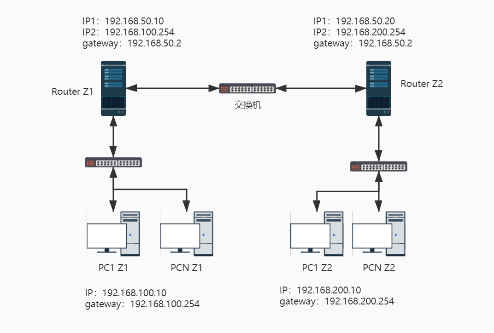
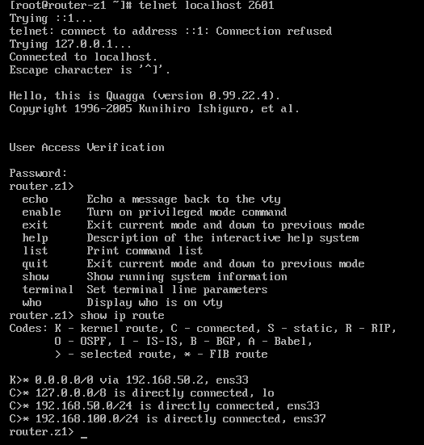
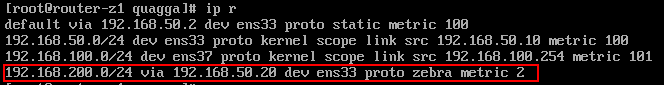
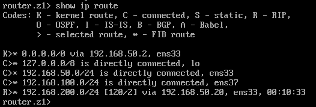

## 路由

### 路由表产生的类型

每一部主机都有自己的路由表：

```bash
root@sink:~# route -n
Kernel IP routing table
Destination     Gateway         Genmask         Flags Metric Ref    Use Iface
0.0.0.0         192.168.1.1     0.0.0.0         UG    600    0        0 wlan0
172.17.0.0      0.0.0.0         255.255.0.0     U     0      0        0 docker0
192.168.1.0     0.0.0.0         255.255.255.0   U     600    0        0 wlan0
```

- 依据网络接口产生的 IP 而存在的路由

    例如 192.168.1.0/24 这个路由的存在是由于鸟哥的这部主机上面拥有 192.168.1.112 这个 IP 的关系。

- 手动或预设路由(default route)

    你可以使用`route`这个指令手动的给予额外的路由设定，预设路由 (0.0.0.0/0) 就是额外的路由。使用该指令时，**你所规划的路由必须要是你的设备(如 eth0) 或 IP 可以直接沟通 (broadcast) 的情况**。

```bash
root@sink:~# route add -net 192.168.2.0 netmask 255.255.255.0 gw 192.168.2.254
SIOCADDRT: 网络不可达    
```

如果 *192.168.2.254* 真的是在我们的实体网络连接上，并且与我们的 *wlan0* 连接在一起，那其实你应该是这样做：

```bash
root@sink:~# route add -net 192.168.2.0 netmask 255.255.255.0 dev wlan0
root@sink:~# route -n
Kernel IP routing table
Destination     Gateway         Genmask         Flags Metric Ref    Use Iface
0.0.0.0         192.168.1.1     0.0.0.0         UG    600    0        0 wlan0
172.17.0.0      0.0.0.0         255.255.0.0     U     0      0        0 docker0
192.168.1.0     0.0.0.0         255.255.255.0   U     600    0        0 wlan0
192.168.2.0     0.0.0.0         255.255.255.0   U     0      0        0 wlan0
```

- 动态路由

    除了使用指令来增加路由规则之外，还有一种透过路由器与路由器之间的协商以达成动态路由的环境，不过，那就需要额外的软件支持了。`zebra`或centos的`Quagga`。

事实上，在 Linux 的路由规则都是透过内核来达成的，所以这些路由表的规则都是在内存中。

### 一个网卡绑多个 IP（IP Alias）

`eth0:0`这个装置可以在原本的 eth0 上面模拟出一个虚拟接口出来，以让我们原本的网络卡具有多个 IP，具有多个 IP 的功能就被称为`IP Alias`。

```
root@sink:~# ip a add 172.16.1.1/24 label wlan0:v0 br + dev wlan0
root@sink:~# ip a show wlan0
3: wlan0: <BROADCAST,MULTICAST,UP,LOWER_UP> mtu 1500 qdisc noqueue state UP group default qlen 1000
    link/ether 74:29:af:09:69:d5 brd ff:ff:ff:ff:ff:ff
    inet 192.168.1.112/24 brd 192.168.1.255 scope global dynamic noprefixroute wlan0
       valid_lft 7142sec preferred_lft 7142sec
    inet 172.16.1.1/24 brd 172.16.1.255 scope global wlan0:v0
       valid_lft forever preferred_lft forever
    inet6 fe80::8018:a56a:4c42:f8ec/64 scope link noprefixroute 
       valid_lft forever preferred_lft forever
```

IP Alias 的常见用途：

- 测试用

    建立一个虚拟的网络接口，不会改变你原来的网络参数设定。

- 在一个实体网域中含有多个 IP 网域

- 既有设备无法提供更多实体网卡时

所有的 IP Alias 都是由实体网卡仿真来的，所以当要启动 eth0:0 时，eth0 必须要先被启动才行。那么如何在开机的时候就启动 IP Alias 呢：

创建 `/etc/sysconfig/network-scripts/ifcfg-eth0:0` 配置文件即可。

**注意**：不论 ifcfg-eth0:0 内的 `ONBOOT` 设定值为何，只要 ifcfg-eth0 这个实体网卡的配置文件中， ONBOOT 为 yes 时，开机就会将全部的 eth0:n 都启动。

## 路由器架设

### 路由器

路由器的主要功能就是：**转发网络数据包**。也就是说，`路由器`会分析来源端包的 IP 表头，在表头内找出要送达的目标 IP 后，透过路由器本身的`路由表` (routing table) 来将这个包向下一个目标(next hop) 传送。

路由器的功能分为两种方式来达成：

- 硬件：路由器内有嵌入式的操作系统，可以负责不同网域间的包转译与转递等功能；
- 软件：例如 Linux 这个操作系统的内核就有提供包转递的能力。

#### 使用 Linux 作为路由器

只需要打开路由转发功能就可以了。

##### 打开内核的路由转发（IP Forward）功能

就如同路由表是由 Linux 的内核功能所提供的，这个转发包的能力也是 Linux 内核所提供。

查看是否开启：

```
root@sink:~# cat /proc/sys/net/ipv4/ip_forward
1
```

`1`代表开启，`0`代表关闭。可以直接向此文件写入来临时地开启或关闭该功能。

但是若想改变默认配置则需要添加/修改：

```
root@sink:~# vi /etc/sysctl.conf
……
# IP Forward
net.ipv4.ip_forward=1
……

# 立即生效
root@sink:~# sysctl -p
```

打开此功能后就完成路由器的设置啦！下面就是根据实际情况设置路由了。

通常Linux路由器规划其路由表的方式有两种：

- 静态路由：直接以类似 route 这个指令来直接设定路由表到核心功能当中，设定值只要与网域环境相符即可。 不过，当你的网络有变化时，路由器就得要重新设定；
- 动态路由：透过类似 Quagga 或 zebra 软件的功能，这些软件可以安装在 Linux 路由器上，而这些软件可以动态的侦测网络的变化，并直接修改 Linux 核心的路由表信息。

<br/>

了解了路由器之后，接下来你可能需要了解到什么是 NAT (Network Address Translation， 网络地址转换) 服务器。NAT 本身就是一个路由器，只是 NAT 比路由器多了一个`IP 替换`的功能。

- 一般来说，路由器会有两个网络接口，透过路由器本身的 IP 转递功能让两个网域可以互相沟通网络封包。 那如果两个接口一边是公共 IP (public IP) 但一边是私有 IP (private IP)呢? 由于私有 IP 不能直接与公共 IP 沟通其路由信息，此时就得要额外的 `IP 替换`功能了；
- Linux 的 NAT 服务器可以透过修改封包的 IP 表头数据之来源或目标 IP ，让来自私有 IP的封包可以转成 NAT 服务器的公共 IP ，就可以连上 Internet !

### 何时需要路由器

一般来说，计算机数量小于数十部的小型企业是无须路由器的，只需要利用 hub/switch 串接各部计算机，然后透过单一线路连接到 Internet 上即可。

- 实体线路之布线及效能的考虑：

    计算机太多时，使用路由器可以方便管理；架设路由器将实体线路分隔，就有助于这方面的网络效能；

- 部门独立与保护数据的考虑：

    只要实体线路是连接在一起的，那么当数据透过广播时，你就可以透过类似 tcpdump 的指令来监听封包数据；可以将那些重要的计算机放到一个独立的实体网络，并额外加设防火墙、路由器等连接上公司内部的网络。

## Linux 静态路由


按照鸟哥的网络拓扑图使用 VMware Workstation 搭建上图的环境：

- 首先新建一个虚拟网络*VMnet2*（使用仅主机模式，取消*将主机虚拟适配器连接到此网络*及*使用本地DHCP服务*的勾选），模拟*192.168.50.0/24*网段；新建一个LAN网段，取名*192.168.100.0/24*，用于模拟局域网。

- Router：使用CentOS7模拟，ens33网卡使用桥接模式，ens37使用 VMnet2；开启IP转发功能；
- Linux Router：ens33使用 VMnet2，ens37网卡使用 LAN网段；开启IP转发功能；CentOS 6.x 默认的防火墙规则会将来自不同网卡的沟通包剔除，所以还得要暂时关闭防火墙才行。  
- Client：ens33网卡使用 LAN网段；
- Work Station：ens33使用 VMnet2。

### 设置

搭建好环境后，你会发现 Router 与 Client 是不能互相ping通的，Work Station 与 Client 也不能互相ping通。原因从包的流动过程可以找到：

- Client ping 192.168.1.20：192.168.100.1->192.168.100.254->192.168.50.1->192.168.50.254->192.168.1.20，发送的时候是OK的；
- Router 回应 Client：Router要回应的地址是192.168.100.1，但是此时会通过路由规则把包直接丢给192.168.1.1，不会沿原路返回了，所以不能ping通。

Work Station 与 Client 之间的沟通也是同理，所以此时需要添加一条路由规则，在Router上将 192.168.100.0/24 的包发送到Linux Router上面：

```
[root@router ~]# ip r add 192.168.100.0/24 via 192.168.50.1
[root@router ~]# ping -c 1 192.168.100.1
PING 192.168.100.1 (192.168.100.1) 56(84) bytes of data.
64 bytes from 192.168.100.1: icmp_seq=1 ttl=63 time=0.524 ms

--- 192.168.100.1 ping statistics ---
1 packets transmitted, 1 received, 0% packet loss, time 0ms
rtt min/avg/max/mdev = 0.524/0.524/0.524/0.000 ms
```

此时 Work Station 与 Client 的沟通是这样的：

- Client ping Work Station：Client --> Linux Router (OK) --> Work Station (OK) 
- Work Station replay Client：Work Station --> Router (OK) --> Linux Router (OK) --> Client(OK)

Work Station 回应时会经过Router，可以加一条路由规则直接交给Linux Router转发。

### 写入配置文件

需要注意的是，通过命令编写规则并不会写入到配置文件，重启之后就会消失，需要手动编写配置文件（可以直接复制喽）：

```
[root@router ~]# ip r
……
192.168.100.0/24 via 192.168.50.1 dev ens37
[root@router ~]# vi /etc/sysconfig/network-scripts/route-ens37
192.168.100.0/24 via 192.168.50.1 dev ens37
```

## 动态路由器架设：quagga (zebra + ripd)

如果每次网络发生变化时，都要像上一小节中去手动修改的话，那岂不是要累死？**动态路由**可以让路由器自己学习新的路由，来达成自动增加该笔路由的信息的目的。

路由器必须通过共同的路由协议来沟通，进行路由信息的交换，常见的协议：RIPv1，RIPv2，OSPF，BGP 。

### 安装与启动

CentOS使用 [quagga](https://www.quagga.net/docs/quagga.html) 来实现动态路由机制。

```bash
yum install quagga
```

quagga 的 daemon 分为两类，一种是`zebra`，一种是路由协议的 daemon：

- `zebra`这个 daemon 用于更新核心的路由规则；
- `ripd`：RIPv1/v2协议的 daemon，这个 daemon 则是在向附近的其他 Router 沟通协调路由规则的传送与否。 

!!! note
	部分协议必须先启动`zebra`，再启动路由协议的 daemon，重启daemon也是如此！！！防火墙设置不对也会阻止路由规则之间的交流。

下面以 RIPv2 协议为例来说明。//TODO 设置防火墙再来测试一次。

各个 daemon 的配置文件都必须要以 `/etc/quagga/*.conf` 的文件名来储存才行 。

```bash
systemctl enable zebra
systemctl enable ripd
```

### 实验



按照上图使用 VMware Workstation 搭建实验环境，搭建过程可参考镜头路由环境。

#### 设置zebra

先设置 Router Z1：

```bash
[root@router-z1 ~]# vim /etc/quagga/zebra.conf
hostname router.z1		# 给路由器起一个名字
password z1				# 设置一个密码
enable password z1		# 将这个密码生效
log file /var/log/quagga/zebra.log		# 将所有 zebra 产生的信息存到日志文件中

[root@router-z1 ~]# systemctl restart zebra
[root@router-z1 ~]# netstat -tunlp
Active Internet connections (only servers)
Proto 	Recv-Q 	Send-Q 	Local Address 		Foreign Address 	State 		PID/Program name
tcp 	0 		0 		127.0.0.1:2601 		0.0.0.0:* 			LISTEN 			7204/zebra
……
```

zebra 这个服务的任务主要是在修改 Linux 系统内核的路由， 所以他仅监听本机端口而已。根据刚才设置的密码，我们可以登录到 zebra 查看信息： 	



上图中路由所表示的意义：

- K：代表以类似 route 指令加入内核的路由规则，包括 route-ethN 所产生的规则； 
- C：代表由你的网络接口所设定的 IP 而产生的相关的路由规则；
- S：用 zebra 功能所设定的静态路由信息； 
- R：透过 RIP 协议所增加的路由规则 。

通过 zebra 设置静态路由：

```bash
[root@router-z1 ~]# vim /etc/quagga/zebra.conf
# 添加一行：
# 把 172.15.1.1/24 交给 ens33 处理
ip route 172.15.1.1/24 ens33

[root@router-z1 ~]# systemctl restart zebra
[root@router-z1 ~]# telnet localhost 2601
……
S>* 172.15.1.0/24 [1/0] is directly connected, ens33
……
```

#### 设置 ripd

```bash
[root@router-z1 ~]# vim /etc/quagga/ripd.conf
hostname router.z1.rip
password z1
debug rip events                    # 可以记录较多的错误信息
debug rip packet                    
router rip                          # 启动 Router 的 rip 功能
 version 2                          # 启动的是 RIPv2 的服务 (默认值)
 network 192.168.50.0/24            # 管理的网络
 network ens37						# 还可以写管理的网卡
interface ens33                     # 对针对外面网络的 ens33 进行设置
 no ip rip authentication mode      # 取消身份验证
log file /var/log/quagga/ripd.log

[root@router-z1 ~]# systemctl restart ripd
[root@router-z1 ~]# netstat -tunlp
Active Internet connections (only servers)
Proto 	Recv-Q 	Send-Q 	Local Address 		Foreign Address 	State 		PID/Program name
tcp        0      0 	127.0.0.1:2602 		0.0.0.0:*       	LISTEN  		7818/ripd
udp        0      0 	0.0.0.0:520    		0.0.0.0:*               			7818/ripd
……
```

注意`520`端口是对外开放的。

那么在 Router Z1、Router Z2 都设置完成之后，并开启IP转发功能，两部路由器就可以进行动态路由的交流了。

#### 验证

在 Router Z1 上面查看路由信息：



登录进入zebra看看：



可以看到多出来一条由RIP协议产生的路由规则。

现在在 PC Z1 上面和任何主机都可以通信啦！

## 特殊状况：路由器两边是同一个 IP 网段

当你遇到路由器两边必须是同一网段的情况时，可以选择配置镜头路由来实现PC的通信，但是这样更改的设备较多，下面以下图的拓扑情况来说明该如何只设置 Linux Router 实现主机之间的通信。

实验环境使用 VMware Workstation 进行搭建：

- 使用一台CentOS7模拟Gateway，设置IP为 192.168.100.254/24，网络类型使用*LAN区段1*；
- 使用一台CentOS7作为PC1，网络类型使用*LAN区段1；*
- 使用一台CentOS7作为 Linux Router，ens33网络类型使用*LAN区段1*，ens33网络类型使用*LAN区段2*；
- 使用一台CentOS7作为PC2，网络类型使用*LAN区段2*，模拟被独立出来的网域。

### 设置

让PC之间进行通信的设置思路（以下网卡都指的是Linux Router上面的，PC1代指除Linux Router和独立网域之外的主机，PC2代指独立网域内的主机）：

1. PC1 到 PC2 需要欺骗 PC1 ，让它认为 PC2 的 IP 都是和 ens33 绑定的；
2. Linux Router 通过 ens33 接收到 PC1 的包之后，再转发给 ens37 将这些包传给PC2；
3. PC2 到 PC1呢，就需要欺骗 PC2，让它认为除了独立网域和 Linux Router 之外的 IP 都是和 ens37 绑定的；
4. Linux Router 通过 ens37 接收到PC2的包之后，再转发给 ens33 将这些包传给 PC1；
5. Linux Router 要发送 192.168.100.0/24 且非 PC2 的时候，通过 ens33 来发送。

这样一来，PC 之间就能互相通信了。上述步骤中的1和3使用 `ARP Proxy` 功能来实现，该功能的作用就是将 IP 与 MAC 地址绑定，让其他的想要连接到此 IP 的包由我将他劫取下来。下面进行具体的设置。

`ARP Proxy`可以使用`arp`指令实现 ，但是此指令已过时，建议使用`ip neigh`来替代。

安装 `arp`：

```
yum install net-tools
```

```
arp [-v]          [-i <if>] -d  <host> [pub]               <-Delete ARP entry
arp [-v]   [<HW>] [-i <if>] -s  <host> <hwaddr> [temp]            <-Add entry
arp [-v]   [<HW>] [-i <if>] -Ds <host> <if> [netmask <nm>] pub          <-''-

		-s, --set                set a new ARP entry
        -d, --delete             delete a specified entry
        -v, --verbose            be verbose
        -n, --numeric            don't resolve names
        -i, --device             specify network interface (e.g. eth0)
        -D, --use-device         read <hwaddr> from given device
```

Linux Router - ens33 - MAC：00:50:56:27:0f:a4，对外

Linux Router - ens37 - MAC：00:0c:29:7d:07:2f，对内

```bash
# 先查看初始状态
[root@linux-router ~]# arp -n
Address                  HWtype  HWaddress           Flags Mask            Iface
192.168.100.254          ether   00:0c:29:d9:fe:e5   C                     ens33
192.168.100.101          ether   00:50:56:24:84:f7   C                     ens33
192.168.100.1                    (incomplete)                              ens33
[root@linux-router ~]# ip n
192.168.100.254 dev ens33 lladdr 00:0c:29:d9:fe:e5 DELAY
192.168.100.101 dev ens33 lladdr 00:50:56:24:84:f7 STALE
192.168.100.1 dev ens33  FAILED
[root@linux-router ~]# ip r
default via 192.168.100.254 dev ens33 proto static metric 100
192.168.100.0/24 dev ens33 proto kernel scope link src 192.168.100.100 metric 100
192.168.100.0/24 dev ens37 proto kernel scope link src 192.168.100.200 metric 101

# 1.设置欺骗 PC1 的 ARP Proxy：
[root@linux-router ~]# arp -i ens33 -s 192.168.100.1 00:50:56:27:0f:a4 pub
# 或者使用 ip n 指令
# [root@linux-router ~]# ip n add proxy 192.168.100.1 dev ens33
[root@linux-router ~]# arp -n
Address                  HWtype  HWaddress           Flags Mask            Iface
……
192.168.100.1            *       <from_interface>    MP                    ens33

# 2.让发送到 PC2 的包通过 ens37 发送
[root@linux-router ~]# ip r add 192.168.100.1 dev ens37
[root@linux-router ~]# route -n
Kernel IP routing table
Destination     Gateway         Genmask         Flags Metric Ref    Use Iface
……
192.168.100.1   0.0.0.0         255.255.255.255 UH    0      0        0 ens37

# 3.设置欺骗 PC2 的 ARP Proxy：
[root@linux-router ~]# arp -i ens37 -s 192.168.100.101 -D ens37 pub
[root@linux-router ~]# arp -i ens37 -s 192.168.100.254 -D ens37 pub
# 或者使用 ip n 指令
# [root@linux-router ~]# ip n add proxy 192.168.100.101 dev ens37
# [root@linux-router ~]# ip n add proxy 192.168.100.254 dev ens37
[root@linux-router ~]# arp -n
Address                  HWtype  HWaddress           Flags Mask            Iface
192.168.100.254          ether   00:0c:29:d9:fe:e5   C                     ens33
192.168.100.101          ether   00:50:56:24:84:f7   C                     ens33
192.168.100.1                    (incomplete)                              ens33
192.168.100.254          *       <from_interface>    MP                    ens37
192.168.100.1            *       <from_interface>    MP                    ens33
192.168.100.101          *       <from_interface>    MP                    ens37

# 4.删除 ens37 的 192.168.100.0/24 路由规则
[root@linux-router ~]# ip r del 192.168.100.0/24 dev ens37
[root@linux-router ~]# ip r
default via 192.168.100.254 dev ens33 proto static metric 100
192.168.100.0/24 dev ens33 proto kernel scope link src 192.168.100.100 metric 100
192.168.100.1 dev ens37 scope link
```

如此便设置完毕了！可是如果你重启了网络，这些又会消失不见喽！！！所以需要将上述的指令写成一个脚本，然后将该文件设置为可执行，并将它写入 `/etc/rc.d/rc.local` ，每次重新启动网络后， 就重新执行一次该脚本。

