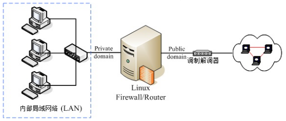
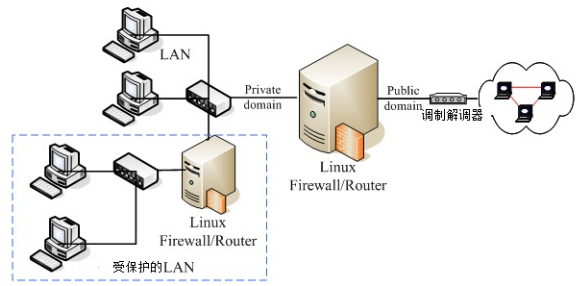
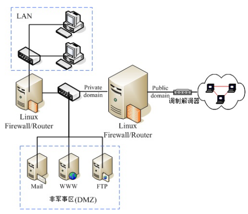
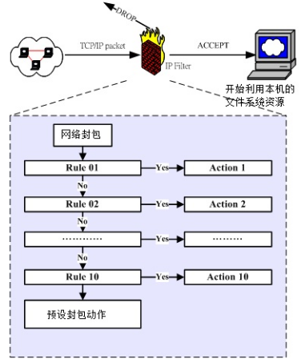
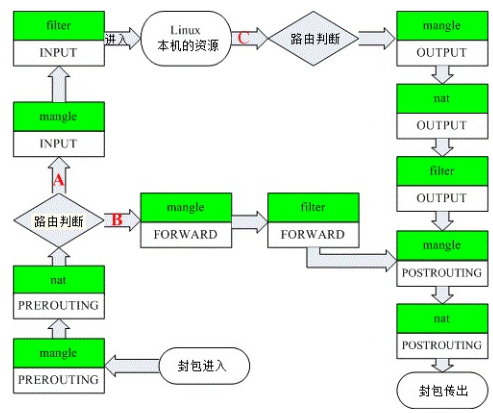
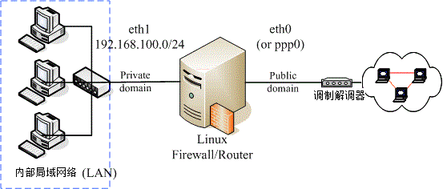
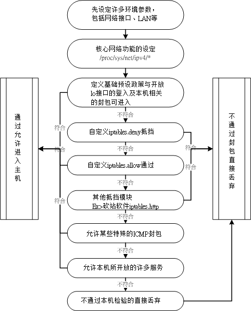

Linux 的防火墙主要是透过 `Netfilter` 与 `TCP Wrappers` 两个机制来管理的。

## 认识防火墙

只要能够分析与过滤进出我们管理的网络的数据包，就可以称为防火墙。

防火墙又可以分为硬件防火墙与本机的软件防火墙。硬件防火墙包过滤的效率较佳。

鸟哥建议利用 *shell script* 来撰写属于自己的防火墙机制比较好，因为对于规则的排序与汇总有比较好的观察性，可以让防火墙规则比较清晰一点。

### 防火墙的作用

防火墙最重要的任务就是规划出：

- 切割被信任（如子域）与不被信任（如 Internet）的网段；
- 划分出可提供 Internet 的服务与必须受保护的服务；
- 分析出可接受与不可接受的包状态。

Linux 的 `iptables` 防火墙软件还可以进行更细部深入的 NAT （Network Address Translation）的设定，进行更弹性的 IP 数据包伪装功能。

### Linux 系统上防火墙的分类

依据防火墙管理的范围，我们可以将防火墙区分为网域型与单一主机型的管控。

单一主机型的控管方面，主要的防火墙有包过滤型的 `Netfilter` 与依据服务软件程序作为分析的 `TCP Wrappers` 两种。

若以区域型的防火墙而言，由于此类防火墙都是当作路由器角色，因此防火墙类型主要则有 `Netfilter` 与利用`代理服务器` (proxy server) 进行存取代理的方式了。

#### Netfilter

分析进入主机的网络包，将包的表头数据拿出来进行分析，以决定对该联机实行放行或抵挡。

包括 *硬件地址(MAC), 软件地址 (IP), TCP, UDP, ICMP* 等包的信息都可以进行过滤分析的功能。主要分析的是 OSI 七层协议的 2, 3, 4 层。

在 Linux 上面使用`iptables`或`firewall`来实现。非常适合于一般小型环境。

#### TCP Wrappers

通过服务器程序的外挂 （`tcpd`）来处置的。分析谁对某**程序**进行存取，然后透过规则去分析该服务器程序谁能够联机、谁不能联机。

#### 代理服务器

其实代理服务器是一种网络服务，它可以**代理**用户的需求，而代为前往服务器取得相关的资源。

### 防火墙的一般网络布线示意

#### 单一网域，仅有一个路由器



将 Linux 架设在路由器上面以管控整个局域网络的包进出。

- 因为内外网域已经分开，所以安全维护在内部可以开放的权限较大
- 安全机制的设定可以针对 Linux 防火墙主机来维护即可
- 对外只看的到 Linux 防火墙主机，所以对于内部可以达到有效的安全防护

#### 内部网络包含安全性更高的子网，需内部防火墙切开子网



如果有特别重要的部门需要更安全的保护网络环境,那么将 LAN 里面再加设一个防火墙，将安全等级分类，可以防止一些内部破坏和盗取。

#### 在防火墙的后面架设网络服务器主机



将提供网络服务的服务器放在防火墙后面。通常像上图的环境中，将网络服务器独立放置在两个防火墙中间的网络，我们称之为非军事区域 (`DMZ`)，即缓冲地带的意思。

Web, Mail 与 FTP 都是透过防火墙连到 Internet 上面去，所以，这四部主机在 Internet 上面的 Public IP 都是一样的。

内部网络如果发生状况时，是不会影响到网络服务器的正常运作的。

在配置一个拥有DMZ区的网络的时候通常定义以下的[访问控制策略](https://baike.baidu.com/item/DMZ/631225?fr=aladdin#4)以实现DMZ区的屏障功能：

1. **内网可以访问外网**
2. **内网可以访问DMZ**
3. **外网不能访问内网**
4. **外网可以访问DMZ**
5. **DMZ访问内网有限制**
6. **DMZ不能访问外网**：邮件服务器等必须访问的除外。

DMZ的目的是把敏感的内部网络和其他提供访问服务的网络分开，阻止内网和外网直接通信，以保证内网安全。

### 防火墙的使用限制

- 防火墙并不能很有效的抵挡病毒或木马程序
- 防火墙对于来自内部 LAN 的攻击较无承受力

此时就需要前文的网络安全知识来预防了。

## TCP Wrappers

TCP wrappers 就是透过 `/etc/hosts.allow, /etc/hosts.deny`这两个文件来管理的一个类似防火墙的机制。

支持该规则的只有以下软件：

- 由 `super daemon (xinetd)` 所管理的服务，即

    配置文件在`/etc/xinetd.d/`下面的服务；//TODO 在centos6.x中查看

- 支持 `libwrap.so` 模块的服务。

可以使用`ldd`指令来查看一个服务是否包含`libwrap.so`库文件：

```
root@sink:~# ldd $(which sshd) | grep libwrap.so
	libwrap.so.0 => /lib/x86_64-linux-gnu/libwrap.so.0 (0x00007f2618235000)
```

### 配置文件的语法

`/etc/hosts.allow, /etc/hosts.deny`两个文件的语法（更复杂的语法参考`man hosts_access`）是一样的：

```
<service(program_name)> : <IP, domain, hostname>
```

这两个文件与规则的优先级是这样的：

1. 先以 /etc/hosts.allow 比对，该规则符合就予以放行；
2. 再以 /etc/hosts.deny 比对，规则符合就予以抵挡；
3. 若不在这两个文件内，亦即规则都不符合，最终则予以放行。

#### 举例说明

先开放本机的 127.0.0.1 可以进行任何本机的服务，然后,让区网 (192.168.1.0/24) 可以使用 rsync ，同时 10.0.0.100 也能够使用 rsync ，但其他来源则不允许使用 rsync。那么规则设置如下：

```
root@sink:~# cat /etc/hosts.allow
ALL: 127.0.0.1
rsync: 192.168.1.0/255.255.255.0, 10.0.0.100

root@sink:~# cat /etc/hosts.deny
rsync: ALL
```


tcp wrappers 理论上不支持 192.168.1.0/24 这种透过 bit 数值来定义的网段，只支持 netmask 的地址显示方式。

## iptables



上图的主要目的是告诉你：**规则是有顺序的**！当符合了一个规则时，就不会继续进行规则的对比了。使用`iptables-save`查看规则顺序，越靠下的顺序越靠前。

### iptables 的表（table）与链（chain）

`iptables`中有多个表，每个表格中又有多个链，每个链下又有规则。

那么 iptables 中主要有三张表：

- filter：管理本机进出的数据包，为默认的table
    - INPUT：过滤进入的数据包；
    - OUTPUT：过滤输出；
    - FORWARD：过滤转发包，即与 `ip forward`有关，和下面的`nat table`相关性较高。
- nat：主要在进行来源与目的的 IP 或 port 的转换
    - PREROUTING：在进行路由判断之前所要对比的规则；
    - POSTROUTING：路由判断之后；
    - OUTPUT。
- mangle：主要是与特殊的封包的路由旗标（flag）有关。

各个表之间的关系图：



由上图可以看出，iptables 可以控制三种包的流向：

- 包进入 Linux 主机使用资源（A）：路由判断之后确定是从主机获取资源；
- 包经由 Linux 主机的转发，向后端主机流动（B）；
- 包由 Linux 本机发送出去（C）。

!!! note
	因为网络是**双向的**，所以进入与输出要分开来看，故有两次路由判断！

### iptables 语法

#### 规则的查看

```
iptables [-t tables] [-L] [-nv]

	-t :后面接 table ，例如 nat 或 filter ，若省略此项目,则使用默认的 filter
	-L :列出目前的 table 的规则
	-n :不进行 IP 与 HOSTNAME 的反查，显示讯息的速度会快很多！
	-v :列出更多的信息
```

```
root@sink:~# iptables -L -n
Chain INPUT (policy ACCEPT)
target     prot opt source               destination         

Chain FORWARD (policy DROP)
target     prot opt source               destination                    
ACCEPT     all  --  0.0.0.0/0            0.0.0.0/0            ctstate RELATED,ESTABLISHED
……
```

表头的含义：

- policy：预设的政策（动作）
- target：本条规则的动作
- prot：是什么协议
- opt：额外的选项说明
- source：此规则针对的*源IP*
- destination：*目的IP*

```
iptables-save [-t table] [-f filename]

	-f, --file filename      Specify a filename to log the output to. 默认输出到STDOUT.
```

虽然`iptables-save`是一个存储指令，但是可以详细查看防火墙规则：

```
root@sink:~# iptables-save
# Generated by xtables-save v1.8.2 on Sun Mar 22 21:24:03 2020
*filter
:INPUT ACCEPT [0:0]
:FORWARD DROP [0:0]
:OUTPUT ACCEPT [0:0]
-A FORWARD -o docker0 -m conntrack --ctstate RELATED,ESTABLISHED -j ACCEPT
……
COMMIT
*nat
:PREROUTING ACCEPT [0:0]
:INPUT ACCEPT [0:0]
……
```

#### 规则的清除

```
iptables [-t tables] [-DFXZ]

	-D chain ：从 chain 中清除符合条件的规则；
	-D chain rulenum ：rulenum (1 = first)；
	
	-F ：清除所有的规则；
	-X ：清除所有使用者 "自定义" 的 chain (应该说的是 tables )啰；
	-Z ：将所有的 chain 的计数与流量统计都归零
```

#### 定义预设政策 (policy)

假设你对于内部的使用者有信心的话，那么 filter 内的 INPUT 链方面可以定义的比较严格一点，而 FORWARD 与 OUTPUT 则可以宽松一点。

```
iptables [-t nat] -P [INPUT,OUTPUT,FORWARD] [ACCEPT,DROP]

	-P ：定义政策( Policy )。
	ACCEPT ：该包可接受
	DROP   ：该包直接丢弃，不会让 client 端知道为何被丢弃。
```

```
root@sink:~# iptables -P INPUT DROP
root@sink:~# iptables -L
Chain INPUT (policy DROP)
……
```

#### 规则的制定

```
iptables -AI 链 [-io 网络接口] [-s 来源 IP/网域] [-p tcp,udp [--sport 端口范围] [-d 目标 IP/网域] [--dport 端口范围] [--syn]] -j [ACCEPT|DROP|REJECT|LOG]

	-A	在最后面新增一条规则
	-I num	若没有指定顺序，则插入变成第一条规则
	-i	包进入的网口，例如 eth0；需要与 INPUT 配合
	-o	
	-p	指定规则针对的协议类型。可以使用"all"
	-s	来源 IP/网域，格式为“address[/mask][...]”
	-d	
	-j	动作。LOG：仅仅记录到 /var/log/messages 中，不进行对比。
	--syn 主动联机旗标，与 -p tcp 联用，表示针对该旗标的联机定制规则
	
其中 i，o，s，d，p 选项的参数前面都是可以加前缀"!"的，表示相反的意思。若设置的时候没有指定某个参数，表示该参数完全接受！
```

```bash
# 将 lo 设置为信任网口
root@sink:~# iptables -A INPUT -i lo -j ACCEPT
root@sink:~# iptables -L INPUT
Chain INPUT (policy ACCEPT)
target     prot opt source               destination         
ACCEPT     all  --  anywhere             anywhere
```

一般来说， client 端启用的 port 都是大于 1024 以上的端口， 而 server 端则是启用小于 1023 以下的端口在监听的。 所以我们可以让来自远程的小于 1023 以下的端口数据的主动联机都给他丢弃（但不适用于 FTP 的主动联机中）：

```bash
# 将来自任何地方来源 port 1:1023 的主动联机到本机端的 1:1023 联机丢弃
[root@router ~]# iptables -i ens33 -A INPUT -p tcp --sport 1:1023 --dport 1:1023 --syn -j DROP
```

#### ICMP 封包规则的比对： 针对是否响应 ping 来设计 

ICMP 的类型相当的多， 而且很多 ICMP 封包的类型都是为了要用来进行网络检测用的！ 所以最好不要将所有的 ICMP 封包都丢弃 。

```
iptables -AI 链 [-io 网络接口] [-s 来源 IP/网域] [-p icmp [--icmp-type 类型]] -j [ACCEPT|DROP|REJECT|LOG]
```

如果不是做为路由器的主机时，通常我们会把 ICMP type 8 (echo request) 拿掉而已，让远程主机不知道我们是否存在，也不会接受 ping 的响应：

```
[root@router ~]# iptables -A INPUT -p icmp --icmp-type 8 -j DROP
```


#### iptables 外挂模块： mac 与 state 

模块查询：`man iptables-extensions`

```
iptables -A INPUT [-m state] [!] [--state 状态] [-j ACCEPT|DROP|REJECT|LOG]

	-m ： 一些 iptables 的外挂模块， 主要常见的有：
		state ： 状态模块
	--state ： 一些封包的状态， 主要有：
		INVALID ： 无效的封包， 例如数据破损的封包状态
		ESTABLISHED： 已经联机成功的联机状态；
		NEW ： 想要新建立联机的封包状态；
		RELATED ： 这个最常用！ 表示这个封包是与我们主机发送出去的封包有关
```

如果你想要联机到远程主机的 port 22 时， 你必须要针对两条规则来设定： 

- 本机端的 1024:65535 到远程的 port 22 必须要放行 (OUTPUT 链)；
- 远程主机 port 22 到本机的 1024:65535 必须放行 (INPUT 链)； 

当主机比较多时，会变得很麻烦！那如果开启全部的 port 22 呢？ 又担心某些恶意主机会主动以 port 22 联机到你的机器上！ 

好在 iptables 可以透过一个状态模块来分析 *这个想要进入的封包是否为刚刚我发出去的响应？*如果是刚刚我发出去的响应， 那么就可以予以接受放行：

```
[root@router ~]# iptables -A INPUT -m state --stat INVALID -j DROP
[root@router ~]# iptables -L
Chain INPUT (policy DROP)
target     prot opt source               destination
ACCEPT     tcp  --  anywhere             anywhere             tcp dpt:ssh
DROP       tcp  --  anywhere             anywhere             tcp spts:tcpmux:1023 dpts:tcpmux:1023 flags:FIN,SYN,RST,ACK/SYN
ACCEPT     all  --  anywhere             anywhere             state RELATED,ESTABLISHED
DROP       all  --  anywhere             anywhere             state INVALID
```

下面是针对一个MAC地址的模块：

```
iptables -A INPUT [-m mac] [!] [--mac-source MAC地址] [-j ACCEPT|DROP|REJECT|LOG]

	mac ： 网络卡硬件地址 (hardware address)模块
```

MAC 是不能跨路由的， 因此在局域网内才有效。

### 超简单客户端防火墙设计与防火墙规则储存 

如果站在客户端且不提供网络服务的 Linux 本机角度时，理论上，应该要有的规则如下：

1. 规则归零： 清除所有已经存在的规则 (iptables -F...)
2. 预设政策： 除了 INPUT 这个自定义链设为 DROP 外，其他为预设 ACCEPT；
3. 信任本机： 由于 lo 对本机来说是相当重要的，因此 lo 必须设定为信任设备；
4. 回应封包： 让本机主动向外要求而响应的封包可以进入本机 (ESTABLISHED,RELATED)；
5. 信任用户： 这是非必要的，如果你想要让区网的来源可用你的主机资源时。

CentOS6 对防火墙规则的存储：

你这次修改的各种设定想要在下次开机还保存， 那就得要进行`/etc/init.d/iptables save`这个指令加参数。 或者直接去修改 `/etc/sysconfig/iptables`  。当然还可以将执行的命令保存在脚本中。

CentOS7 对防火墙规则的存储：

//TODO

指定好规则之后一定要**测试**！！！

## IPv4 的内核管理功能 

除了 iptables 这个防火墙软件之外， 其实咱们 Linux kernel 提供很多内核预设的攻击抵挡机制喔！由于是内核的网络功能，所以相关的设定数据都是放置在 `/proc/sys/net/ipv4/` 这个目录当中。 至于该目录下各个文件的详细资料，可以参考核心的说明文件 (你得要先安装 `kernel-doc` 软件)： 

`/usr/share/doc/kernel-doc-3.10.0/Documentation/networking/ip-sysctl.txt`

下面介绍几个简单的。

- /proc/sys/net/ipv4/tcp_syncookies

    阻断式服务 (DoS) 攻击法当中的一种方式，就是利用 TCP 封包的 SYN 三向交握原理所达成的，这种方式称为 SYN Flooding 。 

    SYN Cookie 模块可以预防这种攻击，它在系统用来启动随机联机的端口 (1024:65535) 即将用完时自动启动。主机在发送 SYN/ACK 确认封包前， 会要求 Client 端在短时间内回复一个序号， 这个序号包含许多原本 SYN 封包内的信息， 包括 IP、 port 等。 若Client 端可以回复正确的序号， 那么主机就确定该封包为可信的， 因此会发送 SYN/ACK 封包， 否则就不理会此封包。 

    但是这个设定值由于违反 TCP 的三次握手 ，所以可能会造成某些服务的延迟现象。不适合用在负载已经很高的服务器，因为负载太高的主机有时会让核心误判遭受 SYN Flooding 的攻击。如果是为了系统的 TCP 封包联机优化， 则可以参考 tcp_max_syn_backlog, tcp_synack_retries, tcp_abort_on_overflow 这几个设定值。

- /proc/sys/net/ipv4/icmp_echo_ignore_broadcasts

    我们知道系统其实可以接受使用 ping 的响应，而 ping 的封包数据量是可以给很大的！如果有个搞破坏的人使用 1000 台主机传送 ping 给你的主机， 而且每个 ping 都高达数百 K bytes时， 你的网络带宽会被吃光， 要嘛可能系统会宕机！ 这种方式分别被称为 ping flooding (不断发 ping) 及 ping of death (发送大的 ping 封包)。  

    避免的方式是取消 ICMP 类型 8 的 ICMP 封包回应。除了防火墙可以做到这点之外，内核也可以达到效果。不过你必须要了解， 某些局域网络内常见的服务 (例如动态 IP 分配 DHCP 协议) 会使用 ping 的方式来侦测是否有重复的 IP ， 所以你最好不要取消所有的 ping 响应比较好。

- /proc/sys/net/ipv4/conf/网络接口/* 

    针对不同的网络接口进行不一样的参数设定。

    - rp_filter：逆向路径过滤 (Reverse Path Filtering) 。可以通过分析网络接口的路由信息配合封包的来源地址， 来分析该封包是否合理。 
    - log_martians： 这个设定数据可以用来启动记录不合法的 IP 来源 。例如来源为 0.0.0.0、127.x.x.x、及 Class E 的 IP 来源， 因为这些来源的 IP 不应该应用于 Internet 啊。 记录在`/var/log/messages `中。
    - accept_redirects：接受 ICMP 重定向消息。建议关闭。
    - send_redirects： 发送 ICMP 重定向消息。建议关闭。

以上这些内核提供的功能都建议使用`sysctl`来修改保存！

## NAT 服务器的设定

NAT（Network Address Translation）：网络地址转换。

NAT 服务器与路由器有啥不同？基本上，NAT 服务器一定是路由器，不过， NAT 服务器由于会修改 IP 表头数据， 因此与单纯转递封包的路由器不同。最常见的 IP 分享器就是一个路由器，但是这个 IP 分享器一定会有一个 Public IP 与一个 Private IP，让 LAN 内的 Private IP 可以透过 IP 分享器的 Public IP 传送出去喔！ 至于路由器通常两边都是 Public IP 或同时为 Private IP。

根据上图 iptables 表与链的关系，若内部 LAN 有任何一部主机想要传送封包出去时，它的流程是这样的：

1. 先经过 NAT table 的 PREROUTING 链；
2. 经由路由判断确定这个封包是要进入本机与否，若不进入本机，则下一步；
3. 再经过 Filter table 的 FORWARD 链；
4. 通过 NAT table 的 POSTROUTING 链，最后传送出去。

PREROUTING 则在修改目标 IP ， POSTROUTING 在修改来源 IP 。 由于修改的 IP 不一样，所以就称为来源 NAT (Source NAT, `SNAT`) 及目标 NAT (Destination NAT, `DNAT`)。

关于 SNAT 与 DNAT 的详细解释参考《鸟哥的linux私房菜-服务器篇》网页版喽：http://cn.linux.vbird.org/linux_server/0250simple_firewall_5.php，下面简要说明以下原理。

### SNAT

主要针对的是内部局域网的 PC 连网情况。

1. NAT 服务器的 POSTROUTING 链将内部 PC 发送包的 源IP 改成 NAT 服务器的 public IP，然后记录一些数据到内存中；
2. internet 的主机返回相应给 NAT 服务器后，NAT 服务器会分析网络包的序号，并与内存数据作对比，对比成功后在 PREROUTING 链会将 目的IP 改成内部 PC 的IP，然后经过路由分析之后继续向下流通，最终到达内部 PC。

### DNAT

主要针对的是外部 Internet 访问搭建的服务器的情况，例如非军事区 DMZ 内的服务器。

1. internet 将请求发送到NAT 服务器的 public IP ；
2. NAT 服务器通过预设的端口分析规则，由 PREROUTING 链将包的 目的IP 改成对应内部服务器的 IP，并在内存记录一些信息，等待内部服务器的响应；
3. 包在经过路由分析之后到达了内部服务器，内部服务器响应发送响应包；
4. NAT 服务器通过对比内存中的记录，在  POSTROUTING 链中将 源IP 改成 public IP，再发送到 internet。

!!! note
	通过上述解释知道，凡是在 NAT 服务器中需要修改的包，只要是出去的包都是通过 POSTROUTING 链修改；只要是进来的包都是通过 PREROUTING 链修改。

### 设置

#### SNAT 设置

```
iptables -t nat -A|-I POSTROUTING -s 网段 -o 网卡 -j MASQUERADE|(SNAT --to-source [ipaddr[-ipaddr]][:port[-port]])
	
	网段：你要修改掉的网段
	网卡：你要伪装的IP所在的网卡
	MASQUERADE：IP 伪装成为封包出去 (-o) 的那块网卡上的 IP，适用于 NAT 服务器的Public IP是动态IP。只能应用于 nat 表的 POSTROUTING 链
	SNAT：与MASQUERADE相同，但是适用于静态IP的情况。只能应用于 nat 表的 POSTROUTING、INPUT 链
	--to-source：与 SNAT 联用，指定静态IP
```

若根据《路由与路由器》中的 *Linux 静态路由* 小节的拓扑来看，那么可以在 Router 上这样设置 SNAT：

```
[root@router ~]# iptables -t nat -A POSTROUTING -s 192.168.50.0/24 -o ens33 -j MASQUERADE
```

或者这样设置：

```
[root@router ~]# iptables -t nat -A POSTROUTING -s 192.168.50.0/24 -o ens33 -j SNAT --to-source 192.168.1.20
```

若 NAT 服务器对外 IP 有好几个，想要轮流使用不同的 IP 时：

```
[root@router ~]# iptables -t nat -A POSTROUTING -s 192.168.50.0/24 -o ens33 -j SNAT --to-source 192.168.1.20-192.168.1.30
```

不过，除非你使用的是固定 IP ，且有多个 IP 可以对外联机，否则一般使用 IP 伪装即可，不需要使用到这个 SNAT 啦！

#### DNAT 设置

```
iptables -t nat -A|-I PREROUTING -p 协议 --dport 端口 -i 网卡 -j DNAT --to-destination [ipaddr[-ipaddr]][:port[-port]]

	DNAT：只能应用于 nat 表的 PREROUTING、OUTPUT 链
```

### 其他设置

#### 重定向设置

```
-j REDIRECT --to-ports port[-port]

	REDIRECT：它将数据包重定向到计算机本身，将目标 IP 更改为传入接口的主地址。只能应用于 nat 表的 PREROUTING、OUTPUT 链
```

最常见的使用场景是在本机上进行端口转换。

## iptables 的额外内核模块功能

 iptables 提供很多模块，这些模块可以辅助封包的过滤用途，让我们可以节省很多 iptables 规则的制定。后续会详细的说明这部分内容。// TODO

## 单机防火墙的一个实例



最重要的防火墙政策是：**关闭所有的联机，仅开放特定的服务**。而且假设内部使用者已经受过良好的训练，因此在 filter table 的三条链个预设政策是：

- INPUT 为 DROP
- OUTPUT 及 FORWARD 为 ACCEPT

这样的规划是很不合格的， 因为你不能保证内部所有的人都可以**按照你的规定来使用 Network** ！

鸟哥底下预计提供的防火墙流程是这样的：



### 脚本

鸟哥将整个 script 拆成三部分，分别是：

- iptables.rule：设定最基本的规则，包括清除防火墙规则、加载模块、设定服务可接受等；
- iptables.deny：设定抵挡某些恶意主机的进入；
- iptables.allow：设定允许某些自定义的后门来源主机！

注意，这是CentOS6版本的脚本：

iptables.rule

```shell
#!/bin/bash

# 请先输入您的相关参数，不要输入错误了！
  EXTIF="eth0"             # 这个是可以连上 Public IP 的网络接口
  INIF="eth1"              # 内部 LAN 的连接接口；若无则写成 INIF=""
  INNET="192.168.100.0/24" # 若无内部网域接口，请填写成 INNET=""
  ${iptables_scripts_dir} = /usr/local/virus/iptables/
  export EXTIF INIF INNET

# 第一部份，针对本机的防火墙设定！##########################################
# 1. 先设定好核心的网络功能：
  echo "1" > /proc/sys/net/ipv4/tcp_syncookies
  echo "1" > /proc/sys/net/ipv4/icmp_echo_ignore_broadcasts
  for i in /proc/sys/net/ipv4/conf/*/{rp_filter,log_martians}; do
        echo "1" > $i
  done
  for i in /proc/sys/net/ipv4/conf/*/{accept_source_route,accept_redirects,send_redirects}; do
        echo "0" > $i
  done

# 2. 清除规则、设定默认政策及开放 lo 与相关的设定值
  PATH=/sbin:/usr/sbin:/bin:/usr/bin:/usr/local/sbin:/usr/local/bin; export PATH
  iptables -F
  iptables -X
  iptables -Z
  iptables -P INPUT   DROP
  iptables -P OUTPUT  ACCEPT
  iptables -P FORWARD ACCEPT
  iptables -A INPUT -i lo -j ACCEPT
  iptables -A INPUT -m state --state RELATED,ESTABLISHED -j ACCEPT

# 3. 启动额外的防火墙 script 模块
  if [ -f ${iptables_scripts_dir}iptables.deny ]; then
        sh ${iptables_scripts_dir}iptables.deny
  fi
  if [ -f ${iptables_scripts_dir}ipbles.allow ]; then
        sh ${iptables_scripts_dir}iptables.allow
  fi
  if [ -f ${iptables_scripts_dir}iptables.http ]; then
        sh ${iptables_scripts_dir}iptables.http
  fi

# 4. 允许某些类型的 ICMP 封包进入
  AICMP="0 3 3/4 4 11 12 14 16 18"
  for tyicmp in $AICMP
  do
    iptables -A INPUT -i $EXTIF -p icmp --icmp-type $tyicmp -j ACCEPT
  done

# 5. 允许某些服务的进入，请依照你自己的环境开启
# iptables -A INPUT -p TCP -i $EXTIF --dport  21 --sport 1024:65534 -j ACCEPT # FTP
# iptables -A INPUT -p TCP -i $EXTIF --dport  22 --sport 1024:65534 -j ACCEPT # SSH
# iptables -A INPUT -p TCP -i $EXTIF --dport  25 --sport 1024:65534 -j ACCEPT # SMTP
# iptables -A INPUT -p UDP -i $EXTIF --dport  53 --sport 1024:65534 -j ACCEPT # DNS
# iptables -A INPUT -p TCP -i $EXTIF --dport  53 --sport 1024:65534 -j ACCEPT # DNS
# iptables -A INPUT -p TCP -i $EXTIF --dport  80 --sport 1024:65534 -j ACCEPT # WWW
# iptables -A INPUT -p TCP -i $EXTIF --dport 110 --sport 1024:65534 -j ACCEPT # POP3
# iptables -A INPUT -p TCP -i $EXTIF --dport 443 --sport 1024:65534 -j ACCEPT # HTTPS


# 第二部份，针对后端主机的防火墙设定！###############################
# 1. 先加载一些有用的模块
  modules="ip_tables iptable_nat ip_nat_ftp ip_nat_irc ip_conntrack ip_conntrack_ftp ip_conntrack_irc"
  for mod in $modules
  do
      testmod=`lsmod | grep "^${mod} " | awk '{print $1}'`
      if [ "$testmod" == "" ]; then
            modprobe $mod
      fi
  done

# 2. 清除 NAT table 的规则吧！
  iptables -F -t nat
  iptables -X -t nat
  iptables -Z -t nat
  iptables -t nat -P PREROUTING  ACCEPT
  iptables -t nat -P POSTROUTING ACCEPT
  iptables -t nat -P OUTPUT      ACCEPT

# 3. 若有内部接口的存在 (双网卡) 开放成为路由器，且为 IP 分享器！
  if [ "$INIF" != "" ]; then
    iptables -A INPUT -i $INIF -j ACCEPT
    echo "1" > /proc/sys/net/ipv4/ip_forward
    if [ "$INNET" != "" ]; then
        for innet in $INNET
        do
            iptables -t nat -A POSTROUTING -s $innet -o $EXTIF -j MASQUERADE
        done
    fi
  fi
  # 如果你的 MSN 一直无法联机，或者是某些网站 OK 某些网站不 OK，
  # 可能是 MTU 的问题，那你可以将底下这一行给他取消批注来启动 MTU 限制范围
  # iptables -A FORWARD -p tcp -m tcp --tcp-flags SYN,RST SYN -m tcpmss \
  #          --mss 1400:1536 -j TCPMSS --clamp-mss-to-pmtu

# 4. NAT 服务器后端的 LAN 内对外之服务器设定
# iptables -t nat -A PREROUTING -p tcp -i $EXTIF --dport 80 \
#          -j DNAT --to-destination 192.168.1.210:80 # WWW

# 5. 特殊的功能，包括 Windows 远程桌面所产生的规则，假设桌面主机为 1.2.3.4
# iptables -t nat -A PREROUTING -p tcp -s 1.2.3.4  --dport 6000 \
#          -j DNAT --to-destination 192.168.100.10
# iptables -t nat -A PREROUTING -p tcp -s 1.2.3.4  --sport 3389 \
#          -j DNAT --to-destination 192.168.100.20

# 6. 最终将这些功能储存下来吧！
  /etc/init.d/iptables save
```

iptables.allow

```shell
#!/bin/bash
# 底下则填写你允许进入本机的其他网域或主机啊！
  iptables -A INPUT -i $EXTIF -s 140.116.44.0/24 -j ACCEPT
```

iptables.deny

```shell
#!/bin/bash
# 底下填写的是『你要抵挡的那个咚咚！』
  iptables -A INPUT -i $EXTIF -s 140.116.44.254 -j DROP
```

```bash
chmod 700 iptables.*
```

以防万一可以写入到`/etc/rc.d/rc.local`文件中

