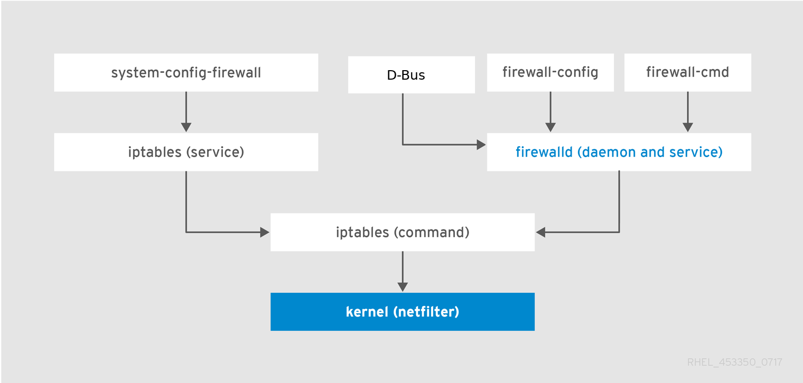

在阅读此文之前，先阅读上一篇[防火墙与 NAT 服务器](../08 防火墙与 NAT 服务器)。

<br/>

参考：https://access.redhat.com/documentation/en-us/red_hat_enterprise_linux/7/html-single/security_guide/index#sec-Using_Firewalls

由于 firewalld 是动态的，因此无需在每次更改规则时重新启动防火墙守护程序。

firewalld 使用 *zones* 和 *services* 的概念来简化流量管理。*zones* 是预定义的规则集。可以将网络接口和源分配给区域。*services* 是预定义的规则，涵盖了所有必要设置以允许特定服务的传入流量，它们应用于区域内部。

服务使用一个或多个端口或地址进行网络通信。防火墙根据端口过滤通信。

## firewalld 和 iptables（及 ip6tables） service 的区别

下文中的 iptables service 包括  `iptables` 和 `ip6tables` 服务。

- **iptables service** 在 `/etc/sysconfig/{iptables,iptables}` 中储存配置，而 `firewalld` 将配置储存在 `/usr/lib/firewalld/` 和 `/etc/firewalld/` 中的各种 XML 文件里，。要注意，当 `firewalld` 在Red Hat Enterprise Linux上安装失败时， `/etc/sysconfig/iptables` 文件就不存在。
- 使用 **iptables service**，每一个单独更改意味着清除所有旧有的规则并从 `/etc/sysconfig/iptables`里读取所有新的规则；然而使用 `firewalld` 却不会重新创建新规则，仅仅应用规则中的不同之处。因此，`firewalld` 可以在运行时改变设置且不丢失现有连接。

但两者都使用 **iptables tool** 来跟内核的包过滤器交流。



## Zones

基于用户对网络的接口和流量的信任级别，⁠firewalld 可将网络划分为不同的区域。一个连接只能是一个区域的一部分，但是一个区域可以用于许多网络连接。

**NetworkManager** 通知 `firewalld` 一个接口归属某个区域。可以使用**NetworkManager**、 **firewall-config** 或 **firewall-cmd** 来为接口分配区域。

预定义的区域存储在 `/usr/lib/firewalld/zones/` 目录中，并且可以立即应用于任何可用的网络接口。这些文件仅在修改后才复制到 `/etc/firewalld/zones/` 目录。下面描述了预定义区域的默认设置：


- `drop`（丢弃）

    任何接收的网络数据包都被丢弃，没有任何回复。仅能有发送出去的网络连接。

- `block`（限制）

    任何接收的网络连接都被 `IPv4` 的 icmp-host-prohibited 信息和 `IPv6` 的 icmp6-adm-prohibited 信息所拒绝。只能有从系统内部发起的连接。

- `public`（公共）

    适用于您不信任网络上其他计算机的公共区域。只能接收经过选择的连接。

- `external`（外部）

    适用于启用了伪装的外部网络，尤其是路由器。不信任来自网络的其他计算机，不相信它们不会对您的计算机造成危害，只能接收经过选择的连接。

- `dmz`（非军事区）

    用于您的非军事区内的电脑，此区域内可公开访问，对内部网络的访问受限。仅仅接收经过选择的连接。

- `work`（工作）

    用于工作区。您可以基本相信网络内的其他电脑不会危害您的电脑。仅仅接收经过选择的连接。

- `home`（家庭）

    用于家庭网络。您可以基本信任网络内的其他计算机不会危害您的计算机。仅仅接收经过选择的连接。

- `internal`（内部）

    当您最信任网络上的其他计算机时，可在内部网络上使用。仅仅接受经过选择的连接。

- `trusted`（信任）

    可接受所有的网络连接。

在安装时，firewalld 中的默认区域设置为`public`区域。默认区域是可更改的。

## Predefined Services

一项服务可以是本地端口，协议，源端口和目标的列表，如果服务被允许的话，也可以是一系列自动加载的防火墙辅助模块。使用服务可以节省时间。

`firewalld.service(5)` 中描述了服务配置选项和通用文件信息。服务通过单个的 XML 配置文件来指定，这些配置文件则按以下格式命名：`service-name.xml`。在firewalld中，协议名称优先于服务或应用程序名称。

## 运行时和永久性设置

在运行时模式下提交的所有更改仅在防火墙运行时适用。重新启动 firewalld 后，设置将恢复为 *permanent* 值。

如果你在执行 `firewall-cmd` 的时候只使用了 `--permanent` 选项，那么在重启 firewalld 之前不会生效。但是重新启动 firewalld 将关闭所有打开的端口并停止网络通信。可以使用 `--runtime-to-permanent` 选项来进行运行时和永久性的更改。

要在两种模式下更改设置，可以使用两种方法：

1. 更改运行时设置，然后将其永久化：

```
firewall-cmd <other options>
firewall-cmd --runtime-to-permanent
```

2. 设置永久化设置并将其**覆盖**到运行时模式：

```
firewall-cmd --permanent <other options>
firewall-cmd --reload
```

!!! note
	在远程系统上，不正确的设置有可能导致用户将自己锁定在机器之外。为避免这种情况，请使用`--timeout`选项。在指定的时间后，所有更改都将恢复为之前的状态。不与`--permanent`选项共同使用此选项。

## 查看当前配置

图形化界面使用`firewall-config`查看。

命令行使用`firewall-cmd`。

列出默认区域的所有相关信息：

```
[root@centos7 ~]# firewall-cmd --list-all
public (active)
  target: default
  icmp-block-inversion: no
  interfaces: ens33
  sources:
  services: dhcpv6-client ssh
  ports:
  protocols:
  masquerade: no
  forward-ports:
  source-ports:
  icmp-blocks:
  rich rules:
```

列出指定区域的相关信息可使用`--zone`选项：

```
firewall-cmd --list-all --zone home
```

## 流量控制

可以使用`--zone=<zone-name>`指定zone。

### 预定义服务

service 既可以通过命令修改，也可以直接编辑 `/etc/firewalld/services/` 下的配置文件。若一个服务没有被添加或修改，那么在 `/etc/firewalld/services/` 目录下就不会有对应的XML文件。`/usr/lib/firewalld/services/`下的文件可以当作模板使用。

### 在紧急情况下禁用所有流量

在紧急情况下，比如遭到了攻击，可以禁用所有网络流量并切断攻击者。

```
firewall-cmd --panic-on
```

关闭紧急模式可将防火墙恢复到**永久性设置**。要关闭紧急模式：

```
firewall-cmd --panic-off
```

查看是否开启了紧急模式：

```
firewall-cmd --query-panic
```

### 使用预定义服务控制流量

控制流量最直接的方法是将预定义的服务添加到Firewalld。这将打开所有必需的端口，并根据服务定义文件修改其他设置。

1. 检查服务是否已被允许：

```
firewall-cmd --list-services
```

2. 列出所有预定义的服务：

```
firewall-cmd --get-services
```

3. 将服务添加到允许的服务中：

```
firewall-cmd --add-service=<service-name>
```

4. 保留新设置：

```
firewall-cmd --runtime-to-permanent
```

### 添加新服务

可以直接在 `/etc/firewalld/services/` 下面添加XML文件：

```xml
[root@centos7 docs]# cat /etc/firewalld/services/mkdocs.xml
<?xml version="1.0" encoding="utf-8"?>
<service>
  <short>mkdocs</short>
  <description>mkdocs serve port 9001</description>
  <port protocol="tcp" port="9001"/>
</service>
```

也可以使用命令行来添加：

```bash
# 创建服务
[root@centos7 docs]# firewall-cmd --permanent --new-service=nginx-mkdocs
success

# 设置服务的属性
[root@centos7 docs]# firewall-cmd --permanent --service=nginx-mkdocs --set-short=nginx-mkdocs
success
[root@centos7 docs]# firewall-cmd --permanent --service=nginx-mkdocs --set-description="nginx proxy mkdocs server, port 8080"
success
[root@centos7 docs]# firewall-cmd --permanent --service=nginx-mkdocs --add-port=8080/tcp
success

# 加载服务
[root@centos7 services]# firewall-cmd --permanent --add-service=nginx-mkdocs
success
[root@centos7 services]# firewall-cmd --reload
success
[root@centos7 services]# firewall-cmd --list-services
dhcpv6-client nginx-mkdocs ssh zabbix-agen
```

或使用本地文件添加新服务：

```
firewall-cmd --permanent --new-service-from-file=<service-name>.xml [--name=<service-name>]
```

可以使用附加的`--name=service-name`选项更改服务名称。

<br/>

更改服务设置后，该服务的更新副本将被放置到`/etc/firewalld/services/`中。

firewalld 首先从 `/usr/lib/firewalld/services` 加载文件，如果在 `/etc/firewalld/services` 下的文件合规就会覆盖掉匹配的文件。

### 控制端口

#### 打开端口

1. 列出所有允许端口

```
firewall-cmd --list-ports
```

**注意**：该命令只会显示已作为端口打开的端口列表。看不到已作为服务打开的任何端口。因此，应该考虑使用`--list-all`选项而不是`--list-ports`。

2. 将端口添加到允许端口以打开它以接收传入流量：

```
firewall-cmd --add-port=<port-number>/<port-type>
```

3. 使设置持久化：

```
firewall-cmd --runtime-to-permanent
```

*port-type*必须与网络通信的类型匹配，只能是 `tcp`, `udp`, `sctp`,  `dccp`中的一种。

#### 关闭端口

```
firewall-cmd --list-ports
```

```
firewall-cmd --remove-port=port-number/port-type
```

```
firewall-cmd --runtime-to-permanent
```

## 使用 zone

 `firewalld.zone` 

### 列出 zone

只列出 zone 的名称：

```
firewall-cmd --get-zones
```

列出所有 zone 的细节信息：

```
firewall-cmd --list-all-zones
```

列出指定 zone 的细节信息：

```
firewall-cmd --zone=<zone-name> --list-all
```

### 修改默认 zone

```
firewall-cmd --get-default-zone
```

```
firewall-cmd --set-default-zone zone-name
```

### 分配一个网络接口给 zone

```
firewall-cmd --get-active-zones
```

```
firewall-cmd --zone=zone-name --change-interface=<interface-name>
```

### 为网络连接分配默认 zone

使用`NetworkManager`来设置：

```
nmcli c modify ens33 connection.zone public
```

或者直接修改`/etc/sysconfig/network-scripts/ifcfg-connection-name`文件，添加一行：

```
ZONE=zone-name
```

### 创建新的 zone

```
firewall-cmd --permanent --new-zone=zone-name

firewall-cmd --permanent --zone=testzone --set-short=testzone
firewall-cmd --permanent --zone=testzone --set-description='testing create zone'
firewall-cmd --permanent --zone=testzone --add-service=ssh
firewall-cmd --permanent --zone=testzone --add-port=8080/tcp
```

```
firewall-cmd --permanent --get-zones
```

```
firewall-cmd --runtime-to-permanent
```

#### 使用配置文件创建新 zone

与 service 类似，这里就不再赘述了。

```xml
<?xml version="1.0" encoding="utf-8"?>
<zone>
  <short>My zone</short>
  <description>Here you can describe the characteristic features of the zone.</description>
  <service name="ssh"/>
  <port port="1025-65535" protocol="tcp"/>
  <port port="1025-65535" protocol="udp"/>
</zone>
```

### 设置默认行为

target 字段表示进入流量的默认行为：

- `default`
- `ACCEPT`
- `REJECT`：拒绝进入，通知源计算机有关拒绝的信息，
- `DROP`：丢弃流量包，不发送信息。

```
firewall-cmd --permanent --zone=zone-name --set-target=<default|ACCEPT|REJECT|DROP>
```

## 使用 source 管理流量

可以使用 zone 根据 source 来管理传入流量。如果将 source 添加到 zone ，则该 zone 将变为活动状态，并且来自该 source 的任何传入流量都将通过该 zone ，其余的配置和该配置配合使用。这样即使只有一个网络接口，也可以使用很多 zone 。

### 添加 Source

向当前 zone 添加 source ：

```
firewall-cmd --add-source=<source>
```

向指定 zone 添加 source ：

```
firewall-cmd --zone=zone-name --add-source=<source>
```

```
firewall-cmd --runtime-to-permanent
```

### 添加 Source Port

可以跟 `--add-source` 选项组合使用。

```
firewall-cmd --zone=zone-name --add-source-port=<port-name>/<tcp|udp|sctp|dccp>
```

### 删除 Source Port

```
firewall-cmd --zone=zone-name --remove-source-port=<port-name>/<tcp|udp|sctp|dccp>
```

### 举例

```
[root@nginx-server ~]# firewall-cmd --zone=testzone --add-source=192.168.17.201
success
[root@nginx-server ~]# firewall-cmd --runtime-to-permanent
success
[root@nginx-server ~]# firewall-cmd --zone=testzone --list-all
testzone (active)
  target: default
  icmp-block-inversion: no
  interfaces:
  sources: 192.168.17.201
  services: ssh
  ports: 8080/tcp
  protocols:
  masquerade: no
  forward-ports:
  source-ports:
  icmp-blocks:
  rich rules:
```

### 基于 Protocol 配置流量控制

添加一个协议到 zone 之后，所有属于该协议的流量都会被该 zone 接收。

```
firewall-cmd --zone=zone-name --add-protocol=tcp|udp|sctp|dccp|igmp
```

```
firewall-cmd --zone=zone-name --remove-protocol=tcp|udp|sctp|dccp|igmp
```

`igmp`表示多播协议。

## 端口转发

将输入到某个端口的流量重新转发给另一个本机或其他计算机端口。

### 添加一个转发端口

重定向到另一个端口：

```
firewall-cmd --add-forward-port=port=<port-number>:proto=<tcp|udp|sctp|dccp>:toport=<port-number>
```

```
firewall-cmd --runtime-to-permanent
```

将端口重定向到其他IP地址的另一个端口:

```
firewall-cmd --add-forward-port=port=<port-number>:proto=<tcp|udp>:toport=<port-number>:toaddr=<IP/mask>
```

```
firewall-cmd --add-masquerade
```

```
firewall-cmd --runtime-to-permanent
```

<br/>

例子：

```
[root@nginx-server ~]# firewall-cmd --add-forward-port=port=8080:proto=tcp:toport=9001
success
[root@nginx-server ~]# firewall-cmd --runtime-to-permanent
success
```

### 删除一个转发端口

```
firewall-cmd --remove-forward-port=port=<port-number>:proto=<tcp|udp>:toport=<port-number>:toaddr=<IP/mask>
```

```
firewall-cmd --remove-masquerade
```

```
firewall-cmd --runtime-to-permanent
```

## 配置 IP 地址伪装

查看是否开启了伪装：

```
firewall-cmd --zone=<zone-name> --query-masquerade
```

开启伪装：

```
firewall-cmd --zone=<zone-name> --add-masquerade
```

删除伪装：

```
firewall-cmd --zone=<zone-name> --remove-masquerade
```

开启或删除伪装可以加上`--permanent`参数将设置持久化。

## 管理 ICMP 请求

`Internet Control Message Protocol` (`ICMP`) 被各种网络设备用来发送错误消息和指示连接问题的当前信息。它与传输层协议不同，不会在系统之间交换数据。

### 列出 ICMP 请求

XML 文件位于`/usr/lib/firewalld/icmptypes/` 。

列出可用的 ICMP 类型：

```
firewall-cmd --get-icmptypes
```

IPv4 和 IPv6 协议都可以使用 ICMP，查看 ICMP 使用哪些协议：

```
firewall-cmd --info-icmptype=<icmptype>
```

如果该请求当前被阻止，则 ICMP 请求的状态显示为`yes`，否则显示为`no`：

```
firewall-cmd --query-icmp-block=<icmptype>
```

### 阻止或取消阻止 ICMP 请求

若服务器组止了 ICMP 请求，那么它不会正常的提供信息。这不意味着不会提供任何信息，客户端接收到的是请求被阻止的信息。

查看 ICMP 请求是否被阻止：

```
firewall-cmd --query-icmp-block=<icmptype>
```

阻止某个请求：

```
firewall-cmd --add-icmp-block=<icmptype>
```

删除某个请求：

```
firewall-cmd --remove-icmp-block=<icmptype>
```

### 阻止  ICMP 请求且不提供任何信息

#### 阻止所有的流量

```
firewall-cmd --permanent --set-target=DROP
```

```
firewall-cmd --reload
```

现在，**所有流量**，包括ICMP请求，都将被丢弃，但明确允许的流量除外。

#### 允许某些 ICMP 请求并阻止和丢弃其他请求

1. 设置当前 zone 的默认动作是 DROP

```
firewall-cmd --permanent --set-target=DROP
```

2. 立即反转所有的设置

```
firewall-cmd --add-icmp-block-inversion
```

3. 添加要**允许**的 ICMP 请求

```
firewall-cmd --add-icmp-block=<icmptype>
```

4. 持久化设置

```
firewall-cmd --runtime-to-permanent
```

`--add-icmp-block-inversion`会反转所有的 ICMP 请求阻止设置。所有阻止的请求都将通过；所有通过的请求都将被阻止。意味着若你想要取消阻止某个请求，就要使用`--add-icmp-block`命令。

要将其还原为完全允许的设置：

1. 将 zone 的默认动作设置为 `default` 或 `ACCEPT`：

```
firewall-cmd --permanent --set-target=default
```

```
firewall-cmd --remove-icmp-block=<icmptype>
```

```
firewall-cmd --remove-icmp-block-inversion
```

```
firewall-cmd --runtime-to-permanent
```

## 使用 firewalld 设置和控制 IP集

IP集（IP sets）可以被用于 zone 的 sources，也可以被用于 rich rules 的 sources。

### 配置 IP集 选项

查看系统支持的 IP集 类型：

```
[root@nginx-server ~]# firewall-cmd --get-ipset-types
hash:ip hash:ip,mark hash:ip,port hash:ip,port,ip hash:ip,port,net hash:mac hash:net hash:net,iface hash:net,net hash:net,port hash:net,port,net
```

列出已知 IP集 ：

```
firewall-cmd [--permanent] --get-ipsets
```

创建一个 IP集 ：

```
firewall-cmd --permanent --new-ipset=<ipset-name> --type=<ipset-type>
```

若想使用 IPv6，那么需要加上 `--option=family=inet6` 选项。

```
firewall-cmd --reload
```

删除一个 IP集 ：

```
firewall-cmd --permanent --delete-ipset=<ipset-name>
```

向 IP集 添加一个条目：

```
firewall-cmd --ipset=<ipset-name> --add-entry=<entry>
```

从文件中添加条目：

```
cat > ips.txt <<EOF
> 192.168.17.2
> 192.168.17.5/24  # 代表网段
> EOF

firewall-cmd --ipset=<ipset-name> --add-entries-from-file=ips.txt
```

删除条目：

```
firewall-cmd --ipset=<ipset-name> --remove-entry=<entry>
```

从文件中删除条目：

```
firewall-cmd --ipset=<ipset-name> --remove-entries-from-file=ips.txt
```

查看条目：

```
firewall-cmd --ipset=<ipset-name> --get-entries
```

查看一个 IP集 的详细信息：

```
firewall-cmd --info-ipset=<ipset-name>
```


将 IP集 添加到 zone 的源中：

```
firewall-cmd [--zone=<zone-name>] --add-source=ipset:<ipset-name>
```

`--add-source`选项的参数需要使用`ipset`来表明这是一个 IP集 。

### 为IP集配置自定义服务

如果不知道这是什么意思请看下一小节：使用 iptables service 设置和控制 IP集。

在 `firewalld` 启动之前配置定制服务（systemd service）以创建和加载IP集结构：

1. 编辑配置文件

```
# vi /etc/systemd/system/ipset_name.service
[Unit]
Description=ipset_name
Before=firewalld.service

[Service]
Type=oneshot
RemainAfterExit=yes
ExecStart=/usr/local/bin/ipset_name.sh start
ExecStop=/usr/local/bin/ipset_name.sh stop

[Install]
WantedBy=basic.target
```

2. 在firewalld中永久使用IP集：

```
# vi /etc/firewalld/direct.xml
<?xml version="1.0" encoding="utf-8"?>
<direct>
	<rule ipv="ipv4" table="filter" chain="INPUT" priority="0">-m set --match-set <replaceable>ipset_name</replaceable> src -j DROP</rule>
</direct>
```

3. 激活配置

```
firewall-cmd --reload
```

这样可以在不丢失状态信息的情况下重新加载防火墙（TCP会话不会终止），但是在重新加载期间可能会中断服务。

!!! warning
	红帽建议不要使用不通过firewalld管理的IP集。要使用此类IP集，需要永久的 direct 规则来引用该IP集，并且必须添加自定义服务才能创建这些IP集。这些服务还必须在 firewalld 之前启动。

## 使用 iptables service 设置和控制 IP集

首先关闭 firewalld：

```
systemctl stop firewalld.service
systemctl disable firewalld.service
```

安装 iptables service 服务：、

```
yum -y install iptables-services
```

启动：

```
systemctl start iptables.service ip6tables.service
systemctl enable iptables.service ip6tables.service
```

<br/>

内核使用`ipset`指令管理 *IP sets* 。只要有一个引用指向该集合时，该集合就无法销毁。

```
ipset [options] COMMAND

Commands
	create SETNAME TYPENAME [type-specific-options]
       		
    add SETNAME ENTRY
            
    del SETNAME ENTRY
            
    test SETNAME ENTRY
            
    destroy [SETNAME]
            Destroy a named set or all sets
    list [SETNAME]
            List the entries of a named set or all sets
    save [SETNAME]
            Save the named set or all sets to stdout
    restore
    
    rename FROM-SETNAME TO-SETNAME
            Rename two sets
    swap FROM-SETNAME TO-SETNAME
            Swap the contect of two existing sets
```

这些是一串指令：

```
iptables -A INPUT -s 10.0.0.0/8 -j DROP
iptables -A INPUT -s 172.16.0.0/12 -j DROP
iptables -A INPUT -s 192.168.0.0/16 -j DROP
```

它可以使用集合来代替：

```
~]# ipset create my-block-set hash:net
~]# ipset add my-block-set 10.0.0.0/8
~]# ipset add my-block-set 172.16.0.0/12
~]# ipset add my-block-set 192.168.0.0/16
```

```
iptables -A INPUT -m set --set my-block-set src -j DROP
```

`--set`已被废弃，使用新的`--match-set`选项。

查看 ipsets 时你会发现 firewalld 设置的 IP set 也被 ipset 管理。

## 使用 direct 接口

通过 `--direct` 选项可以直接修改防火墙表中的链。

!!! warning
	如果对 iptables 不太熟悉，则使用直接接口是很危险的，因为可能会无意中导致防火墙崩溃。

要持久化设置，可以与`--permanent`联用，或者直接修改`/etc/firewalld/direct.xml`文件，详细说明参考 `firewalld.direct(5)` 。

向一条链中添加一条规则：

```
firewall-cmd --direct --add-rule ipv4 filter IN_public_allow 0 -m tcp -p tcp --dport 666 -j ACCEPT
```

从一条链中删除一条规则：

```
firewall-cmd --direct --remove-rule ipv4 filter IN_public_allow 0 -m tcp -p tcp --dport 666 -j ACCEPT
```

列出一条链中的规则：

```
firewall-cmd --direct --get-rules ipv4 filter IN_public_allow
```

**注意**：列出命令只会列出使用`--add-rule`添加的规则，不会列出使用其它方式添加的规则。

## 使用 rich language 语法配置复杂的防火墙规则

使用`rich language`使用键值对的形式配置防火墙规则，好处是比使用 direct 接口易于理解。

添加规则的命令格式如下：

```
firewall-cmd [--zone=zone] --add-rich-rule='rule' [--timeout=timeval]
```

timeval： `s` (seconds), `m` (minutes), or `h` (hours)

删除一个规则：

```
firewall-cmd [--zone=zone] --remove-rich-rule='rule'
```

`--add-rich-rule`和`--remove-rich-rule`可以在同一条命令上多次使用。

`rule`的语法：

```
rule [family="rule family"]
    [ source [NOT] [address="address"] [mac="mac-address"] [ipset="ipset"] ]
    [ destination [NOT] address="address" ]
    [ element ]
    [ log [prefix="prefix text"] [level="log level"] [limit value="rate/duration"] ]
    [ audit ]
    [ action ]
```

详细说明参考 [红帽 rich-language 说明](https://access.redhat.com/documentation/en-us/red_hat_enterprise_linux/7/html/security_guide/configuring_complex_firewall_rules_with_the_rich-language_syntax) 或 `firewalld.richlanguage (5)`

## 配置防火墙锁定（LOCKDOWN）

如果本地应用程序或服务以 root 身份运行（例如，libvirt），则它们能够更改防火墙配置。

所以，为管理员提供了锁定防火墙配置的功能。管理员可以通过白名单来配置允许某些东东去修改防火墙。

锁定配置默认是关闭的。

### 配置 Lockdown

```
firewall-cmd --query-lockdown
```

```
firewall-cmd --lockdown-on
```

```
firewall-cmd --lockdown-off
```

### 配置锁定白名单选项

#### 使用命令行配置

lockdown whitelist 可以包括：`命令、安全性文本、用户及用户ID`。如果命令可以使用`*`结尾，否则是包含参数的绝对匹配。

查看进程的安全性文本：

```
ps -e --context
```

相关命令：

```
object:
	command
	context
	user
	uid

firewall-cmd --list-lockdown-whitelist-<object>s
firewall-cmd --query-lockdown-whitelist-<object>=<item>
firewall-cmd --add-lockdown-whitelist-<object>=<item>
firewall-cmd --remove-lockdown-whitelist-<object>=<item>
```

四种对象对应的条目如下：

- command：'/usr/bin/python -Es /usr/bin/*command*'
- context：*context*
- user：*user*
- uid：*uid*

#### 使用配置文件配置

`/etc/firewalld/lockdown-whitelist.xml`

```xml
<?xml version="1.0" encoding="utf-8"?>
<whitelist>
  <command name="/usr/bin/python2 -Es /usr/bin/firewall-config"/>
  <!-- <user name="root"/> -->
  <user id="0"/>
  <selinux context="system_u:system_r:NetworkManager_t:s0"/>
  <selinux context="system_u:system_r:virtd_t:s0-s0:c0.c1023"/>
</whitelist>
```

可以直接在此文件直接进行修改。

## 配置阻挡流量包的日志记录

使用 firewalld 中的 LogDenied 选项，可以为拒绝的数据包添加简单的日志记录机制。

若启用了 LogDenied ，那么在则在默认规则以及区域中的最终拒绝和丢弃规则之前添加 INPUT，FORWARD 和 OUTPUT 链的日志记录规则。

```
firewall-cmd --get-log-denied
```

```
irewall-cmd --set-log-denied=<all|unicast|broadcast|multicast|off>
```

 `unicast`, `broadcast`, and `multicast` 只匹配对应的链路层包类型；`all`则匹配所有的链路层包。

```
[root@nginx-server ~]# firewall-cmd --set-log-denied=all
success
[root@nginx-server ~]# iptables-save | grep LOG
-A INPUT -m conntrack --ctstate INVALID -j LOG --log-prefix "STATE_INVALID_DROP: "
-A INPUT -j LOG --log-prefix "FINAL_REJECT: "
-A FORWARD -m conntrack --ctstate INVALID -j LOG --log-prefix "STATE_INVALID_DROP: "
-A FORWARD -j LOG --log-prefix "FINAL_REJECT: "
```

```
[root@nginx-server ~]# firewall-cmd --set-log-denied=unicast
success
[root@nginx-server ~]# iptables-save | grep LOG
-A INPUT -m conntrack --ctstate INVALID -m pkttype --pkt-type unicast -j LOG --log-prefix "STATE_INVALID_DROP: "
-A INPUT -m pkttype --pkt-type unicast -j LOG --log-prefix "FINAL_REJECT: "
-A FORWARD -m conntrack --ctstate INVALID -m pkttype --pkt-type unicast -j LOG --log-prefix "STATE_INVALID_DROP: "
-A FORWARD -m pkttype --pkt-type unicast -j LOG --log-prefix "FINAL_REJECT: "
```