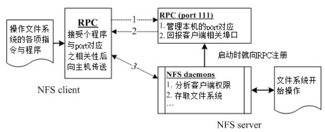

**NFS （Network FileSystem）**

## RPC (Remote Procedure Call)

因为 NFS 支持的功能相当的多 ， 而不同的功能都会使用不同的程序来启动， 每启动一个功能就会启用一些端口来传输数据， 因此， NFS 的功能所对应的端口才 没有固定住， 而是**随机**取用一些未被使用的小于 1024 的端口来作为传输之用 。 但客户端如何得知是哪些端口呢？

此时就需要 RPC 来协助了！ RPC 使用固定的`111`端口进行通信，当 nfs 服务启动时会主动向  RPC 注册， RPC 再指定每个 NFS 功能所对应的端口，并且回送给客户端，这样客户端就能连接上了。

!!! important
	在启动 NFS 之前， RPC 服务就要先行启动了。若 RPC 重启，原先注册的数据会丢失，所以在它重启之后，其管理的所有服务都要重启。



1. 客户端会向服务端的 RPC (port 111 ) 发出 NFS 文件存取功能的询问要求；
2. 服务器端找到对应的已注册的 NFS daemon 端口后，会发送给客户端；
3. 客户端了解正确的端口后，就可以直接与 NFS daemon 来联机。

还有很多其它的服务也是由 RPC 管理的，例如后续介绍的 NIS (Network Information Service)。

## NFS 的文件访问权限

 NFS 服务不会对登录的身份进行识别，所以服务端会以**客户端的使用者 UID 及 GID** 来尝试读取服务器的文件系统。所以可能会发生如下几个情况：

- NFS server / NFS client 刚好有相同的账号与群组则此时使用者可以直接以 dmtsai 的身份进行服务器所提供的文件系统之存取。
- NFS server 的 501 这个 UID 账号对应为 vbird ，若 NFS 服务器上的 /etc/passwd 里面 UID 501 的使用者名称为 vbird 时，则客户端的 dmtsai 可以存取服务器端的 vbird 这个使用者的文件喔！只因为两者具有相同的 UID 而已。 这就造成很大的问题了！因为没有人可以保证客户端的 UID 所对应的账号会与服务器端相同，那服务器所提供的数据不就可能会被错误的使用者乱改？
- NFS server 并没有 501 这个 UID 另 一个极端的情况是， 在服务器端并没有 501 这个UID 的存在，则此时 dmtsai 的身份在该目录下会被压缩（squash）成匿名者，一般 NFS 的匿 名者会以 UID 为 65534 为其使用者，早期的 Linux distributions 这个 65534 的账号名称通常是 nobody ， CentOS 则取名为 nfsnobody 。但有时也会有特殊的情况，例如在服务器端分享 /tmp 的情况下， dmtsain 的身份还是会保持 501 但建立的各项数据在服务器端来看，就会属于无拥有者的资料。
- 如果使用者身份是 root 这个比较特殊的使用者，那就是每个 Linux 主机都有的 UID 为 0 的 root 。想一想，如果客户端可以用 root 的身份去存取服务器端的文件系统时，那服务器端的数据哪有什么保护性？所以在预设的情况下， root 的身份会被主动的压缩成为匿名者。

要在客户端以 NFS 取用服务器端的文件系统时，你还得需要具有：

- NFS 服务器有开放可读写的权限 (与 /etc/exports 设定有关)；
- 实际的文件权限具有可写 入 (w) 的权限。

## NFS 的软件结构

- 主要配置文件： `/etc/exports`
- NFS 文件系统维护指令： `/usr/sbin/exportfs`
- 分享资源的日志 ： `/var/lib/nfs/*tab` 
- 客户端查询服务器分享资源的指令： `/usr/sbin/showmount` 

## 服务端

### /etc/exports 配置文件

使用`#`作为注释符号。

```
/tmp 192.168.100.0/24(ro) localhost(rw) *.ev.ncku.edu.tw(ro,sync)
[分享目录] [第一部主机(权限)] [可用主机名] [可用通配符]
```

至于主机名 的设定主要有几个方式：

- 可以使用完整的 IP 或者是网域， 例 如 192.168.100.10 或 192.168.100.0/24 ，或 192.168.100.0/255.255.255.0 都可以接受！
- 也可以使用主机名，但这个主机名必须要能够被解析成 IP 地址 。如果是主机名的话，那么他可以支持通配符， 例如 \* 或 ? 均可接受。

至于权限方面 (就是小括号内的参数) 常见的参数（`man exports`）则有：

| 参数                           | 说明                                                         |
| ------------------------------ | ------------------------------------------------------------ |
| rw<br/>ro                      | 该目录分享的权限是可读写 (read-write) 或只 读 (read-only)， 但最终能不能读写，还是与文件系统的 rwx 及身份有关。 |
| sync<br/>async                 | sync 代表数据会同步写入到内存与硬盘中，async 则代表数据会先暂存于内存当中，而非直接写入硬盘！ |
| no_root_squash<br/>root_squash | 预设的情况下， 客户端 root 的身份会由 root_squash 的设定压缩成 nfsnobody，如此对服务器的系统会较有保障。相反就有设置 no_root_squash 才行。 |
| all_squash                     | 不论登入 NFS 的使用者身份为何，他的身份都会被压缩成为匿名用户 ， 通常也就是 nobody(nfsnobody) 啦！ |
| anonuid<br/>anongid            | 指定匿名用户的 UID、GID；但它们必须存在于 /etc/passwd、/etc/group。经常与 all_squash 配合使用。 |

### NFS 的安全设定

#### 防火墙

你可以在`/etc/sysconfig/nfs`文件中固定服务端口，以方便防火墙的配置。

设定举例：

```bash
iptables -A INPUT -i $EXTIF -p tcp -s 120.114.140.0/24 -m multiport --dport 111,2049,1001,1002,30001 -j ACCEPT
iptables -A INPUT -i $EXTIF -p udp -s 120.114.140.0/24 -m multiport --dport 111,2049,1001,1002,30001 -j ACCEPT
```

#### NFS 服务器 关机前的注意事项（centos6）

由于 NFS 使用的这个 RPC 服务，当客户端连上服务器时，那么你的服务器想要关机，那可就会成为『不可能的任务』！ 如果你的服务器上面还有客户端在联机， 那么你要关机，可能得要等到数个钟头才能够正常的关机成功！

centos7 没有这个问题。

## 客户端

### 手动挂载

需要安装`nfs-utils`软件。

1. 确认本地端已经**启动了 rpcbind 服务**！
2. 扫描 NFS 服务器分享的目录有哪些，并了解我们是否可以使用 (showmount)；
3. 在本地端建立挂载点目录 (mkdir)；
4. 利用 mount 将远程主机直接挂载到相关目录。

另外，如果服务器端有启动 nfslock 的话，客户端也要启动才能生效！

### 挂载参数与开机挂载

除了 NFS 服务器需要保护之外，我们使用人家的 NFS 文件系统也需要**自我保护**。 

#### 挂载参数

常用的挂载参数（`man nfs`）：

| 参数            | 说明                                                         | 默认值                      |
| --------------- | ------------------------------------------------------------ | --------------------------- |
| suid<br/>nosuid | 如果挂载的 partition 上面有任何 SUID 的 binary 程序时，你只要使用 nosuid 就能够取消 SUID 的功能了。 | suid                        |
| rw<br/>ro       | 服务器 可以提供给你可读写，但是客户端可以仅允许只读的参数设定值。 | rw                          |
| dev<br/>nodev   | 是否可以保留设备文件的特殊功能？ 一般来说只有 /dev 这个目 录才会有特殊的设备。 | dev                         |
| exec<br/>noexec | 是否具有执行 binary file 的权限。                            | exec                        |
| user<br/>nouser | 是否允许使用者进行目录的挂载与卸载功能。                     | nouser                      |
| auto<br/>noauto | 这个 auto 指的是 `mount -a` 时，会不会被挂载。               | auto                        |
| fg<br/>bg       | 若在前景执行时，则 mount 会持续尝试挂载，直到成功或 time out 为止， 若为背景执行，则 mount 会在背景持续多次进行 mount ，而不会影响到前景的程序操作。如果你的网络联机有点不稳定，或是服务器常常需要开关机， 那建议使用 bg 比较妥当 。 | fg                          |
| soft<br/>hard   | 如果是 hard 的情况， 则当两者之间有任何一部主机脱机，则 RPC 会持续的呼叫，直到对方恢复联机为止。如果是 soft 的话，那 RPC 会在 time out 后**重复** 呼叫 ， 而非**持续**呼叫，因此系统的延迟会比较不这么明显。同上，如果你的服务器可能开开关关，建议用 soft 喔！ | hard                        |
| intr            | 当你使用上头提到的 hard 方式挂载时，若加上 intr 这个参数，则当 RPC 持续呼叫中，该次的呼叫是可以被中断的(interrupted)。 | 无                          |
| rsize<br/>wsize | 读出 (rsize)与写 入(wsize)的区 块大小 (block size)。这个设定值可以影响客户端与服务器端传输数据的缓冲记忆容量。 一般来说， 如果在局域网络内 (LAN) ，并且客户端与服务器端都具有足够的内存，那这个值可以设定大一点，比如说 32768 (bytes)等，提升缓冲记忆区块将可提升 NFS 文件系统的传输能力！但要注意设定的值也不要太大，最好是达到网络能够传输的最大值为限。 | rsize=1 024<br/>wsize=1 024 |

除了在挂载的时候使用，还可以在`/etc/nfsmount.conf`中设置全局挂载参数，参考`man nfsmount.conf`。

#### 开机挂载

centos6 不能写入将挂载参数写入 `/etc/fstab` ，需要写入到`/etc/rc. d/rc. local`：

```
[root@centos6 ~] # vim /etc/rc.d/rc.local
mount -t nfs -o nosuid,noexec,nodev,rw,bg,soft,rsize=32768,wsize=32768 \
192.168.100.254:/home/public /home/nfs/public
```

### 自动挂载 autofs

autofs 这个服务在客户端计算机上面，会持续的侦测某个指定的目录，并预先设定当使用到该目录下的某个次目录时，将会取得来自服务器端的 NFS 文件系统资源，并进行自动挂载的动作；若过一段时间后不使用，又会自动的卸载。


步骤：

1. 创建 映射文件`/etc/auto.master.d/nfs.autofs`：

```
# define top dir
/home/share /etc/auto.nfs.d/dev.nfs
```

2. 编辑配置文件`/etc/auto.nfs.d/dev.nfs`，若要指定参数，只需在参数前加上`-`符号即可：

```
sanlock -ro,bg,soft,nosuid 192.168.75.5:/sanlock_test
```

3. 重启服务：

```
systemctl restart autofs
```

!!! warning
	`/home/share`是 autofs 自动创建的，不要手动创建！！！

观察结果：

```bash
# 一开始什么都开不到
[root@controller etc]# ll /home/share/
total 0
# 但当你访问该目录时会自动挂载
[root@controller etc]# ll /home/share/sanlock
total 2052
……
```

