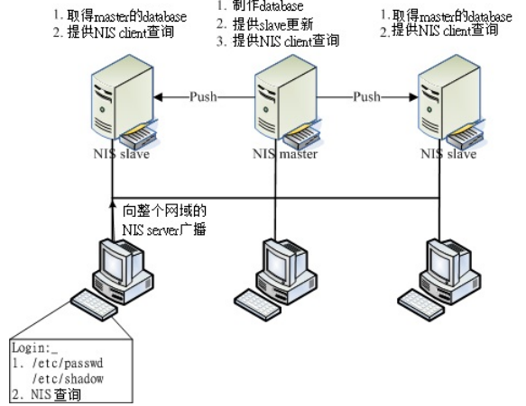
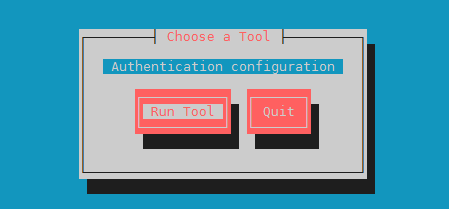
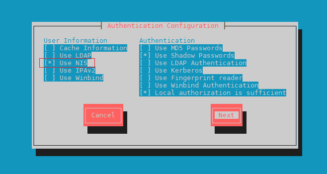
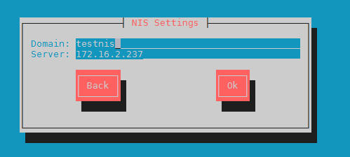

**NIS （Network Information Service）**，管理其它 Linux 主机的账号。最早应该是称为 Sun Yellow Pages (简 称 yp)。现在已经基本上被 `LDAP` 所取代，没多大的用处了。

主要提供以下基本的数据：

| 服务器端文件名    | 文件内容                                           |
| ----------------- | -------------------------------------------------- |
| /etc/passwd       | 提供用户账号、UID、GID、家目录所在、Shell 等       |
| /etc/group        | 提供群组数据以及 GID 的对应，还有该群组的加入人员  |
| /etc/hosts        | 主机名与 IP 的对应，常用于 private IP 的主机名对应 |
| /etc/services     | 每一种服务 (daemons) 所对应的端口 (port number)    |
| /etc/protocols    | 基础的 TCP/IP 封包协议，如 TCP , UDP , ICMP 等     |
| /etc/rpc          | 每种 RPC 服务器所对应的程序号码                    |
| /var/yp/ypservers | NIS 服务器所提供的数据库                           |

## **NIS** 的运作流程

NIS 需要用到传输与读写比较快速的数据库文件系统，而不是传统的纯文本数据。和 NFS 一样也是通过 RPC 来进行通信的。

**在较为大型的企业环境当中**， NIS 服务器可以使用 master/slave (主控/辅助服务器)架构。



使用者有登入的需求时，整个 NIS 的执行流程是：

- 关于 NIS Server ( master/slave )的运作程序：
    1. NIS Master 先将本身的账号密码相关档案制作成为数据库档案；
    2. NIS Master 可以主动的告知 NIS slave  server 来更新；
    3. NIS slave 亦可主动的前往 NIS master  server 取得更新后的数据库档案；
    4. 若有账号密码的异动时，需要重新制作 database 与重新同步化 master/slave 。
- 关于当 NIS Client 有任何登入查询的需求时：
    1. NIS client 若有登入需求时，**会先查询其本机的 /etc/passwd , /etc/shadow 等档案**；
    2. 若在 NIS Client 本机找不到相关的账号数据，才开始向整个 NIS 网域的主机广播查询；
    3. 每部 NIS server (不论 master/slave )都可以响应，基本上是 **先响应者优先** 文件。

所以，一般来说，在这样的环境下， NIS client 或 NIS slave server 会主动拿掉自己本机的一般使用者账号，仅会保留系统所需要的 root 及系统账号而已。如此一来，一般使用者才都会经由 NIS master server 所控管啊！

其实， NIS 服务使用的环境大概越来越仅局限在学术数值模式仿真的丛集计算机架构中( PC cluster )，在那样的架构中，老实说，鸟哥认为仅要学会 NIS master 即可。如果还有其他账号方面的要求，例如跨平台的帐户信息提供，那可能就得要参考 Samba 或更进阶的 LDAP 才行。

## server

```
yum install ypserv
```

### 配置文件

- `/etc/ypserv. conf `：这是最主要的 ypserv 软件所提供的配置文件，可以规范 NIS 客户端是否可登入的权限。
- `/etc/hosts` ： NIS server/client 会用到网络主机名与 IP 的对应。
- `/etc/sysconfig/network` ：可以在这个文件内指定 NIS 的网域( nisdomainname )。
- `/var/yp/Makefile` ：前面不是说账号数据要转成数据库文件吗？这就是与建立数据库有关的动作配置文件。

NIS 服务器提供的主要服务方面有底下两个：

- `/usr/sbin/ypserv` ：就是 NIS 服务器的主要提供服务；
- `/usr/sbin/rpc.yppasswdd` ：提供给 NIS 客户端的用户密码修改服务，通过这个服务， NIS 客户端可以直接修改在 NIS 服务器上的密码。相关的使用程序则是 `yppasswd` 指令。

与账号密码的数据库有关的指令方面有底下几个：

- `/usr/lib64/yp/ypinit`： 建立数据库的指令，非常常用 (在 32 位的系统下，文件名则是 `/usr/lib/yp/ypinit` 喔！ )；
- `/usr/bin/yppasswd`： 与 NIS 客户端有关，主要在让用户修改服务器上的密码。

### 设定与启动

1. 先设定 NIS 的域名( NIS domain name )

修改`/etc/sysconfig/network`文件，添加下面两行：

```
# 设定 NIS 领域名
NISDOMAIN=vbirdnis
设定 NIS 每次都启动在固定的埠口
YPSERV_ARGS="-p 1011"
```

2. 主要配置文件 `/etc/ypserv.conf`

```
dns: no
# NIS 服务器大多使用于内部局域网络，只要有 /etc/hosts 即可，不用 DNS 啦 (或者使用 dnsmasq 之类的工具) 

files : 30
# 预设会有 30 个数据库被读入内存当中，其实我们的账号文件并不多， 30 个够用了。

# 底下则是设定限制客户端或 slave server 查询的权限，利用冒号隔成四部分：
# **[主机名 /IP ]:[ NIS 域名]:[可用数据库名称]:[安全限制]**
# [主机名 /IP ]：可以使用 network/netmask 如 192 . 168 . 1 0 0 . 0/255 . 255 . 255 . 0
# [ NIS 域名]：例如本案例中的 vbirdnis
# [可用数据库名称]：就是由 NIS 制作出来的数据库名称；
# [安全限制]：包括没有限制( none )、仅能使用& lt ; 1 0 24 ( port )及拒绝( deny )
# 一般来说，你可以依照我们的网域来设定成为底下的模样：
# Host                     : Domain  : Map              : Security
# 开放本地接口
127.0.0.0/255.255.255.0    : *       : *			    : none
# 你信任的网段
192.168.100.0/255.255.255.0    : *       : *			    : none
# 拒绝所有其它的网段
*						   : *       : *                : deny
# 这些都可以不设置，直接使用 防火墙 来管理
```

3. 修改`/etc/sysconfig/yppasswdd`文件，设置固定端口：

```
YPPASSWDD_ARGS="--port 1012"
```

4. 设定主机名与 IP 的对应( /etc/hosts )

5. 启动与观察所有相关的服务

```
systemctl start ypserv
systemctl start yppasswdd
```

```
rpcinfo
```

6. 处理账号并建立数据库

可以新增一些账号，原来的账号也能使用。

转换成数据库：

```
/usr/lib64/yp/ypinit - m
```

!!! important
	如果你的用户或密码有变动过，那么你就得要重新制作数据库，重新启动 ypserv 及 yppasswdd ！

7. 防火墙设置（iptables）

```
iptables -A INPUT -i $EXTIF -p tcp -s 192.168.100.0/24 --dport 1011 -j ACCEPT
iptables -A INPUT -i $EXTIF -p udp -s 192.168.100.0/24 -m multiport --dport 1011,1012 -j ACCEPT
```

还要打开 rpcbind 端口 `111/tcp` 、`111/udp`。

## client

NIS 服务器同时也可以作为客户端。

```
yum install ypbind setup-tools
```

yp-tools 是提供查询的软件，至于 ypbind 则是与 ypserv 互相沟通的客户端联机软件。setup-tools 是图形设置认证的软件，由于需要改动的文件有点多，所以使用 `setup` 指令来辅助设置。

设定 NIS client 你可能需要动到底下的文件：

- /etc/sysconfig/network ：就是 NIS 的域名嘛
- /etc/hosts ：至少需要有各个 NIS 服务器的 IP 与主机名对应；
- /etc/yp.conf ：这个则是 ypbind 的主要配置文件，里面主要设定 NIS 服务器所在
- /etc/sysconfig/authconfig：规范账号登入时的允许认证机制；
- /etc/pam.d/system-auth ：这个最容易忘记！因为账号通常由 PAM 模块所管理，所以你必须要在 PAM 模块内加入 NIS 的支持才行！
- /etc/nsswitch.conf ：这个文件可以规范账号密码与相关信息的查询顺序，默认是先找 /etc/passwd 再找 NIS 数据库

### 设定与启动

执行`setup`指令，然后会出现字符界面，选中 `Authentication configuration`：



选中 `Use NIS` 然后点击 `Next`：



填写 NIS 网域名及 Server IP：



如果系统很快的就跳回到第一个的画面，代表你的设定理论上是没有问题的。

<br/>

完成之后若没有报错则大概率是成功了，现在可以看下上述的配置文件。

### 检验

利用 `yptest` 检验数据库：

```
[root@controller ~]# yptest
Test 1: domainname
Configured domainname is "testnis"

Test 2: ypbind
Used NIS server: dev.myself

Test 3: yp_match
WARNING: No such key in map (Map passwd.byname, key nobody)

……

Test 9: yp_all
ftp_u ftp_u:$6$QWwSGHU.$Tn/gPujRfixKUET1SKi1tYhom7Wh2IKt1tZDYbW7Rl7GiCZRb3MEkHh63MMymLUQ4wpZmcwKMUTcT4/70Lp4g.:1004:1004::/home/ftp_u:/sbin/nologin
sink sink:$6$OhUVB8CR$3HABmKfEU9Q.vq.VKXWzK9DKOlBaGBNIYil0kBTuXwIf19Ug8RBygoL9bYjMMuPyQiFZf5TAcZrr19463Ds5R1:1000:1000:sink:/home/sink:/bin/bash
1 tests failed
```

!!! note
	因为早期的 nobody 的 UID 都设定在 65534 ，但 CentOS 则将 nobody 设定为系统账号的 99 ，所以当然不会被记录，也就出现这一个警告。可忽略。

使用`ypwhich`检验数据库：

```
[root@controller ~]# ypwhich -x
Use "ethers"    for map "ethers.byname"
Use "aliases"   for map "mail.aliases"
Use "services"  for map "services.byname"
Use "protocols" for map "protocols.bynumber"
Use "hosts"     for map "hosts.byname"
Use "networks"  for map "networks.byaddr"
Use "group"     for map "group.byname"
Use "passwd"    for map "passwd.byname"
```

利用` ypcat` 读取数据库内容：

```
[root@controller ~]# ypcat passwd.byname
ftp_u:$6$QWwSGHU.$Tn/gPujRfixKUET1SKi1tYhom7Wh2IKt1tZDYbW7Rl7GiCZRb3MEkHh63MMymLUQ4wpZmcwKMUTcT4/70Lp4g.:1004:1004::/home/ftp_u:/sbin/nologin
sink:$6$OhUVB8CR$3HABmKfEU9Q.vq.VKXWzK9DKOlBaGBNIYil0kBTuXwIf19Ug8RBygoL9bYjMMuPyQiFZf5TAcZrr19463Ds5R1:1000:1000:sink:/home/sink:/bin/bash
```

### 使用者参数修改： yppasswd ,  ypchsh

yppasswdd 可以接收 NIS client 端传来的密码修改，藉此而处理 NIS server 的 /etc/passwd ,  /etc/shadow ，然后 yppasswdd 还能够重建密码数据库，让 NIS server 同步更新数据库！

- yppasswd ： 与 passwd 指令相同功能；
- ypchsh ： 与 chsh 相同功能。

更新了之后即可在 NIS Server 上面看到 `/var/yp/testnis/` 下的数据库文件被更新了。