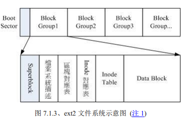
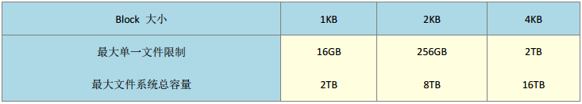
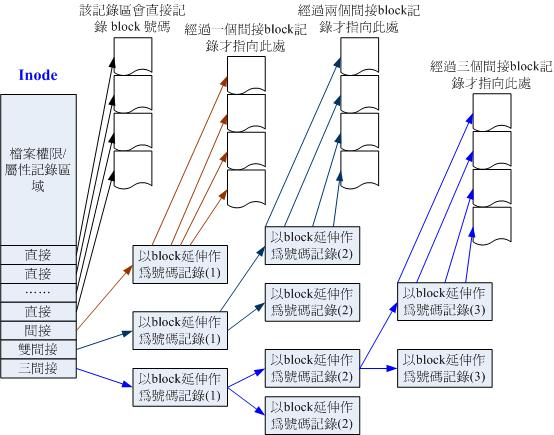

## EXT文件系统



文件系统最前面的是启动扇区（boot sector），用于安装开机管理程序。

其余的部分下面按顺序介绍：

### data block

存放数据的地方。



- 格式化完成之后block的大小与数量就固定了。
- 一个block内只能存放一个文件的数据。若文件小于block，那么会造成空间浪费。

### inode table

inode主要记录的数据有以下几种：

- 文件的读、写、执行权限
- 文件的所属用户、组
- 文件的容量
- 文件的创建时间、修改时间、最后的读取时间
- 文件的隐藏属性（SUID，SGID，SBIT）
- 文件内容指向的block

特性：

- 每个文件只占用一个inode
- 格式化之后每个inode的大小都是相同的。每个 inode 大小均固定为 128 Bytes （ 新的 ext4 与 xfs 可设置到 256 Bytes） 

inode 记录一个 block 号码要花掉 4Byte，那不是记录不了多少吗？所以系统将 inode 记录 block 号码的区域定义为12个直接， 一个间接, 一个双间接与一个三间接记录区。 



若 block 的大小为1K，每个 block 要花费 4bytes，所以1K大小能够记录 256 个block。那么一个文件的最大大小为 `12*1 + 256*1 + 256*256*1 + 256*256*256*1(K) = 16G`。

### inode bitmap

记录已使用与未使用的inode号。

### block bitmap

记录已使用与未使用的block号。

### 文件系统描述

描述每个block group的开始与结束的block号，以及说明每个区段分别介于哪个block之间。

### superblock

记录的是整个fiesystem的信息，主要有：

- 全部的inode、block的数量
- 未使用和已使用的inode、block的数量
- inode、block的大小
- filesystem 的挂载时间、 最近一次写入数据的时间、 最近一次检验磁盘 （ fsck） 的时间等文件系统的相关信息 
- 一个 valid bit 数值， 若此文件系统已被挂载， 则 valid bit 为 0 ， 若未被挂载， 则 valid bit 为 1 。 

一个文件系统中可能不只有一个superblock，其余的是第一个superblock的备份。


### EXT的查看

使用`blkid`命令可以列出格式化的分区；使用`dumpe2fs`命令可以查询ext家族的磁盘信息。

```bash
[root@dev tmp]# blkid
/dev/sda1: UUID="decc4fd4-a5a2-487d-bcdc-9125218509c4" TYPE="xfs"
/dev/sda2: UUID="rYAGTT-BICS-GotJ-tQR0-dx3q-hcR0-ZTwDgv" TYPE="LVM2_member"
/dev/sdb1: UUID="fC445p-tGHZ-ULDg-oQOJ-jSQa-mVtR-Q0KQfN" TYPE="LVM2_member"
/dev/mapper/cl_vdsm--dev-root: UUID="77579961-708a-449b-ac26-3f30f16fbfb5" TYPE="xfs"
/dev/mapper/cl_vdsm--dev-swap: UUID="66ef502a-63c0-4d37-b69a-c0ced8436c8f" TYPE="swap"
/dev/mapper/cl_vdsm--dev-test_lv: UUID="8192f79a-5fed-451c-bac8-5fadecb467da" TYPE="ext2"
/dev/sr0: PTTYPE="PMBR"
```

```bash
[root@dev tmp]# dumpe2fs /dev/mapper/cl_vdsm--dev-test_lv
```

### 日志式文件系统

inode table与data block成为数据存放区域；其它的区段称为metadata。

新建文件或目录时发生的动作：

1. 先确认用户对新建文件的目录权限（w、x），通过了才能新建
2. 根据inode bitmap找到未使用的inode号，将新文件的属性、权限写入inode
3. 根据block bitmap找到未使用的block号，将文件内容写入block，并更新inode的block指向数据
4. 将刚刚写入的inode和block数据同步到bitmap，并更新superblock

为了避免上述过程中出现意外情况而导致的数据不一致问题，出现了日志式文件系统，在filesystem中划分出一个专门记录写入与修改文件时的步骤，来简化一致性检查的步骤：

1. 预备：当系统要写入一个文件时，会先在日志记录区块中记录要写入的信息
2. 写入：开始写入文件的权限与数据；开始更新metadata数据
3. 结束：完成写入之后，在日志记录区块中完成该文件的记录

## XFS文件系统

EXT家族最大的问题是格式化过慢。在格式化时就预分配好所有的inode、block等数据，如果磁盘很大的话，就会格式化好长时间。XFS也是一个日志式文件系统，用于高容量磁盘和高性能文件系统。

xfs主要划分为三个区域：数据区（data section）、日志区（log section）和实时运作区（realtime section）。

### 数据区

与ext类似，也分为多个存储区群组（allocation groups）来分别放置fs所需的数据。每个群组都包含了：

- 整个fs的superblock
- 剩余空间的管理机制
- inode的分配与追踪

inode与block在需要的时候才会动态配置产生，故格式化的动作很快。

### 日志区

类似与ext的日志区类似。这里会记录文件的变化，直到改变后完全被写入到数据区之后才终结该记录。

可以指定外部的磁盘作为xfs的日志区。

### 实时运作区

当文件要被建立时，先在此区找一个或多个extent区块，将文件放在这些区块中，等inode与block分配完毕之后，再写入到数据区。此区的大小需要在格式化的时候就指定，4K~1G，非磁盘阵列的默认64K。

### XFS的查看

使用`xfs_info`即可。

```bash
[root@dev tmp]# xfs_info /dev/sda1
meta-data=/dev/sda1              isize=512    agcount=4, agsize=65536 blks
         =                       sectsz=512   attr=2, projid32bit=1
         =                       crc=1        finobt=0 spinodes=0
data     =                       bsize=4096   blocks=262144, imaxpct=25
         =                       sunit=0      swidth=0 blks
naming   =version 2              bsize=4096   ascii-ci=0 ftype=1
log      =internal               bsize=4096   blocks=2560, version=2
         =                       sectsz=512   sunit=0 blks, lazy-count=1
realtime =none                   extsz=4096   blocks=0, rtextents=0
```


使用`df`命令时会发现一个`/dev/shm`的挂载点，这是**利用内存虚拟出来的空间**，通常是总物理内存的一半，因此在此目录下的数据访问速度非常快。

