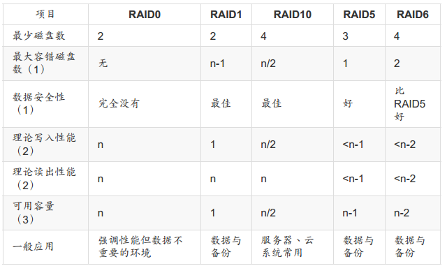

RAID：Redundant Arrays of Inexpensive Disks，廉价磁盘的冗余阵列，可通过硬件或软件实现。

## 类型

[redhat 介绍](https://access.redhat.com/documentation/en-us/red_hat_enterprise_linux/7/html/storage_administration_guide/ch-raid)。

### RAID-0

也被称为“条带化”（ striping ）。 这种模式的 RAID 会将磁盘先切出 等量的区块（名为 chunk， 一般可设置 4K~1 M 之间 ），然后当一个文件要写 入 RAID 时，该文件会依据 chunk 的大小切割好，之后再依序放到各个磁盘里面去，所以每个磁盘所存储的每个文件的数据量都是相同的（在每个磁盘容量足够的情况下）。 

以较低的固有成本实现了较高的 I/O 性能，但没有提供冗余。如果使用相同型号与容量的磁盘来组成时，效果较佳。不允许丢失磁盘。

### RAID-1

“镜像化”（mirroring）。将数据在每个磁盘上都完整的存储一份。

提供了很好的数据可靠性，并提高了读取密集型应用程序的性能，但写入性能差，成本较高。可以丢失到只剩一个磁盘。

### RAID-4

级别4使用集中在单个磁盘上的奇偶校验保护数据。由于专用的奇偶校验磁盘决定了对RAID阵列的所有写入事务的固有瓶颈，所以很少使用。

RAID 4阵列的性能始终是不对称的，这意味着读取将胜过写入。只允许丢失任意一个非奇偶校验磁盘。

### RAID-5

最常见的RAID类型。通过在阵列的所有成员磁盘上分配奇偶校验，RAID 5消除了4级固有的写瓶颈。唯一的性能瓶颈是奇偶校验计算过程本身，但对于现代CPU和软件RAID而言这根本算不上瓶颈。但如果磁盘数量太多，也会影响速度。

与级别4一样，级别5具有非对称性能，读取操作明显优于写入操作。RAID级别5的存储容量的计算方法与级别4相同。只允许丢失任意一个磁盘。

### RAID-6

当数据冗余和保护而非性能是最重要的考虑因素，但不能接受级别1低下的空间效率时，这是RAID的常见级别。级别6使用复杂的奇偶校验方案，能够从阵列中任何两个磁盘丢失中恢复。这种复杂的奇偶校验方案在软件RAID设备上显着增加了CPU负担，并且在写入事务期间也增加了负担。

RAID级别6阵列的总容量的计算方法类似于RAID级别5和4，不同之处在于，必须为额外的奇偶校验存储空间从设备数中减去2个设备（而不是1个）。只允许丢失任意两个磁盘。

### RAID-10，RAID-01

此RAID级别将级别0的性能优势与级别1的冗余相结合。

RAID-10 是指先将磁盘组成各自的RAID-1冗余阵列，再将每个冗余阵列作为一个磁盘组成RAID-0阵列，是最推荐的存储方式。RAID-01则刚好相反。

提高了空间利用率与读写性能。

### Spare Disk

磁盘阵列中的磁盘坏掉时，需要**手动**的更换新磁盘，然后阵列会主动的rebuild数据到新磁盘上。如果系统不支持热插拔，还需要关机才能更换磁盘。

Spare Disk（备用磁盘）的作用就是一个或多个没有在阵列中的磁盘，在阵列中的磁盘有损坏时，自动地将损坏磁盘更换为备用磁盘，将损坏的磁盘移除阵列，立即rebuild数据系统。若OS支持热插拔，那么将损坏的拔出，更换一块新的磁盘，再将它设置为备用磁盘，简直完美！

### 各等级RAID对比



## 软件磁盘阵列与硬件磁盘阵列

硬件组成磁盘阵列需要磁盘阵列卡实现。优点：卡上面有专门的芯片处理RAID任务，所以很多任务（奇偶校验的运算）不会消耗OS的I/O总线。高级的阵列卡还支持热插拔。缺点：很贵；低阶主板的阵列芯片不支持高阶功能；OS必须有阵列卡的驱动，才能识别所产生的磁盘。

软件磁盘阵列通过软件来仿真阵列，centos使用的是`mdadm`，支持partition或disk为磁盘单位，支持热插拔。

!!! note
	硬件磁盘阵列在linux的设备名是`/dev/sd?`；软件仿真的则是`/dev/md?`。Intel 的南桥芯片磁盘阵列，在 Linux 下面反而会是 /dev/md126, /dev/md127 等等设备文件名。

### Firmware RAID

固件 RAID 也称为 ATARAID，是一种软件 RAID，可以使用基于固件的菜单配置 RAID 集。这种类型的 RAID 使用的固件也挂钩到 BIOS 中，允许您从其 RAID 集启动。不同的供应商使用不同的磁盘元数据格式来标记 RAID 集成员。

### 软件磁盘阵列

```
mdadm [mode] <raiddevice> [options] <component-devices>
管理 MD 设备（又名 Linux 软件 RAID）

OPTIONS

Options for selecting a mode are(意思是使用了哪些特定的选项就处于特定的模式下):
	-B, --build				Build a legacy array without superblocks.构造模式
	-C, --create			Create a new array.创建模式
	-F, --follow, --monitor	Select Monitor mode.
	-I, --incremental		Add/remove a single device to/from an appropriate array, and possibly start the array.
	--add, --re-add, --add-spare, --fail, --remove, or --replace	MANAGE mode。管理模式

For create, build, or grow:
	-n, --raid-devices=		Specify  the number of active devices in the array.This number can only be changed using --grow for RAID1, RAID4, RAID5 and RAID6 arrays
	-x, --spare-devices=	Specify  the  number of spare (eXtra) devices in the initial array.预备磁盘与阵列磁盘的数量加起来必须等于列出的设备的数量
	-c, --chunk=			Specify  chunk  size  of kilobytes，默认512KB。该值必须是 4KB 的倍数。RAID4, RAID5, RAID6, and RAID10 还要求必须是2的n次幂。其他单位：'K', 'M' or 'G'.
	-l, --level=			Set RAID level.
	-a, --auto{=yes,md,mdp,part,p}{NN}	指示需要创建设备时如何创建。对于可分区数组，mdadm 将为整个阵列和前 4 个分区创建设备文件；可以在此选项的末尾指定不同数量的分区(e.g.  --auto=p7)。yes是默认值。各值意义如下：
		yes：要求命名的 md 设备具有"标准"格式(/dev/mdNN)，并且确定类型和次要编号。
		md：使用 non-partitionable 的阵列（尽管自 Linux 2.6.28 以来，这些阵列设备实际上是可分区的）
		mdp,part,p：使用 partitionable 的阵列
	-z, --size=				Amount (in Kilobytes) of space to use from each drive in RAID levels 1/4/5/6. 其他单位：'K', 'M' or 'G'.

For Misc mode:
	-Q, --query				检查：1、是否是一个 md 设备；2、是否为一个 md 阵列的一个成员
	-D, --detail			Print details of one or more md devices.
```

#### 创建磁盘阵列

```bash
# 使用 gdisk 在 /dev/sdb 创建分区
Number  Start (sector)    End (sector)  Size       Code  Name
   1            2048          206847   100.0 MiB   FD00  Linux RAID
   2          206848          411647   100.0 MiB   FD00  Linux RAID
   3          411648          616447   100.0 MiB   FD00  Linux RAID
   4          616448          821247   100.0 MiB   FD00  Linux RAID
   5          821248         1026047   100.0 MiB   FD00  Linux RAID

# 创建RAID5磁盘阵列，命名为 /dev/md0，使用4个分区作为阵列磁盘，使用1个分区作为预备磁盘，chunck大小512KB
[root@dev ~]# mdadm -C /dev/md0 -n 4 -x 1 -c 512K -l 5 --auto=yes /dev/sdb1 /dev/sdb2 /dev/sdb3 /dev/sdb4 /dev/sdb5
mdadm: Defaulting to version 1.2 metadata
mdadm: array /dev/md0 started.

# 查看磁盘阵列
[root@dev ~]# mdadm -D /dev/md0 
/dev/md0:
        Raid Level : raid5
             State : clean 
        Array Size : 301056 (294.00 MiB 308.28 MB)
     Used Dev Size : 100352 (98.00 MiB 102.76 MB)
    Active Devices : 4
   Working Devices : 5
    Failed Devices : 0
     Spare Devices : 1
        Chunk Size : 512K
        		……
    Number   Major   Minor   RaidDevice State
       0       8       17        0      active sync   /dev/sdb1
       1       8       18        1      active sync   /dev/sdb2
       2       8       19        2      active sync   /dev/sdb3
       5       8       20        3      active sync   /dev/sdb4

       4       8       21        -      spare   /dev/sdb5
# 通过系统状态查看磁盘阵列
[root@dev ~]# cat /proc/mdstat 
Personalities : [raid6] [raid5] [raid4] 
md0 : active raid5 sdb4[5] sdb5[4](S) sdb3[2] sdb2[1] sdb1[0]
      301056 blocks super 1.2 level 5, 512k chunk, algorithm 2 [4/4] [UUUU]
# blocks 单位是1K，大概就是294M，[m/n]表示阵列需要m个设备，现在n个设备正常运行， [UUUU]表示设备运行情况，U代表正常，_代表不正常
```

#### 使用磁盘阵列

与普通的磁盘一样，需要先格式化再挂载使用。但是会涉及到FS的优化。

```
mkfs.xfs [options] device

OPTIONS
# 优化选项
    -d data_section_options			
        data_section_options:
        su=value		specify the stripe unit for a RAID device or a striped logical volume.单位是 bytes
        sw=value		specify the stripe width for a RAID device or striped logical volume.通常与逻辑卷配置中的条带成员数或 RAID 设备中的数据磁盘数相同。

    -r realtime_section_options
        realtime_section_options:
        extsize=value	specify the size of the blocks in the real-time section of the filesystem.默认值是 the stripe width for striped volumes or 64 KiB for non-striped volumes。最小为4k，最大为1G。
```


- srtipe（chunk）容量为 512K，所以 su=512k
- 共有 4 颗组成 RAID5，因此容量少一颗，所以 sw=3
- 由上面两项计算出数据宽度为：512K*3=1536k

```bash
[root@dev ~]# mkfs.xfs -d su=512k,sw=3 -r extsize=1536k /dev/md0
[root@dev ~]# mkdir raid1
[root@dev ~]# mount /dev/md0 raid1/
[root@dev ~]# df -hT /dev/md0
Filesystem     Type  Size  Used Avail Use% Mounted on
/dev/md0       xfs   292M   16M  277M   6% /root/raid1
```

#### RAID错误仿真

```
mdadm --manage <raiddevice> [options] <component-devices>

OPTIONS

For Manage mode:
	-f, --fail		Mark  listed  devices  as  faulty（故障）.
	-r, --remove	remove listed devices. They must not be active. i.e. they should be failed or spare devices.
	-a, --add		hot-add  listed  devices.不适用于非冗余磁盘阵列 RAID0 or Linear
```

```bash
# 手动标记 sdb1 为故障磁盘
[root@dev ~]# mdadm --manage /dev/md0 --fail /dev/sdb1 
mdadm: set /dev/sdb1 faulty in /dev/md0
# 立即查看可以看到原先的备份磁盘已经顶替了故障磁盘，正在进行数据 rebuild 
[root@dev ~]# mdadm -D /dev/md0
			……
    Active Devices : 3
   Working Devices : 4
    Failed Devices : 1
     Spare Devices : 1
    		……
    Rebuild Status : 32% complete

              Name : dev:0  (local to host dev)
              UUID : caf10429:ec50770c:ddad512d:93ace6dc
            Events : 25

    Number   Major   Minor   RaidDevice State
       4       8       21        0      spare rebuilding   /dev/sdb5
       1       8       18        1      active sync   /dev/sdb2
       2       8       19        2      active sync   /dev/sdb3
       5       8       20        3      active sync   /dev/sdb4

       0       8       17        -      faulty   /dev/sdb1
# rebuild 完毕
[root@dev ~]# mdadm -D /dev/md0
    Active Devices : 4
   Working Devices : 4
    Failed Devices : 1
     Spare Devices : 0
				……
   Number   Major   Minor   RaidDevice State
       4       8       21        0      active sync   /dev/sdb5
       1       8       18        1      active sync   /dev/sdb2
       2       8       19        2      active sync   /dev/sdb3
       5       8       20        3      active sync   /dev/sdb4

       0       8       17        -      faulty   /dev/sdb1
```

磁盘损坏替换步骤：

1. 从阵列中移除损坏磁盘
2. 关机，将损坏的磁盘拔除，更换新的磁盘。支持热插拔的系统不需要关机。
3. 开机，将新磁盘加入阵列

下面通过软件模拟上述过程：

```bash
# 删除坏盘
[root@dev ~]# mdadm --manage /dev/md0 --remove /dev/sdb1 
mdadm: hot removed /dev/sdb1 from /dev/md0
# 添加新盘
[root@dev ~]# mdadm --manage /dev/md0 --add /dev/sdb1 
mdadm: added /dev/sdb1
# 又恢复原来的样子喽
[root@dev ~]# cat /proc/mdstat 
Personalities : [raid6] [raid5] [raid4] 
md0 : active raid5 sdb1[6](S) sdb4[5] sdb5[4] sdb3[2] sdb2[1]
      301056 blocks super 1.2 level 5, 512k chunk, algorithm 2 [4/4] [UUUU]
```

#### 开机自动启动 RAID 并自动挂载

```bash
# 先获取 uuid
[root@dev ~]# mdadm -D /dev/md0 | grep -i uuid
              UUID : caf10429:ec50770c:ddad512d:93ace6dc
# 编辑 mdadm 配置文件,让系统自动启动 RAID
[root@dev ~]# cat /etc/mdadm.conf
ARRAY /dev/md0 UUID=caf10429:ec50770c:ddad512d:93ace6dc
# 编辑挂载文件
[root@dev ~]# blkid /dev/md0
/dev/md0: UUID="a558b7d2-37a2-481f-806e-822781435313" TYPE="xfs"
[root@dev ~]# cat /etc/fstab | grep raid
UUID=a558b7d2-37a2-481f-806e-822781435313 /root/raid1		xfs	defaults        0 0
```

#### 关闭软件 RAID 

确定不再使用阵列时，需要关闭，否则将来再次重新分区时会出现一些错误。

有以下几个步骤：

```bash
# 1. 卸载
[root@dev ~]# umount -v /dev/md0
[root@dev ~]# sed -i '/raid/d' /etc/fstab
# 2. 先覆盖 RAID 的 metadata 与 XFS 的 superblock
[root@dev ~]# dd if=/dev/zero of=/dev/md0 bs=1M count=50
50+0 records in
50+0 records out
52428800 bytes (52 MB) copied, 1.48123 s, 35.4 MB/s
# 3. 再关闭 RAID
[root@dev ~]# mdadm --stop /dev/md0 
mdadm: stopped /dev/md0
# 4. 再覆盖掉分区的 metadata、superblock。因为 RAID 的相关数据其实也会存一份在磁盘当中，若只是关闭了 RAID， 那么重新开机过后，系统还是会将这颗磁盘阵列创建起来
[root@dev ~]# dd if=/dev/zero of=/dev/sdb1 bs=1M count=10
[root@dev ~]# dd if=/dev/zero of=/dev/sdb2 bs=1M count=10
[root@dev ~]# dd if=/dev/zero of=/dev/sdb3 bs=1M count=10
[root@dev ~]# dd if=/dev/zero of=/dev/sdb4 bs=1M count=10
[root@dev ~]# dd if=/dev/zero of=/dev/sdb5 bs=1M count=10
[root@dev ~]# cat /proc/mdstat 
Personalities : [raid6] [raid5] [raid4] 
unused devices: <none>
# 5. 删除或注解 RAID
[root@dev ~]# vi /etc/mdadm.conf
```

