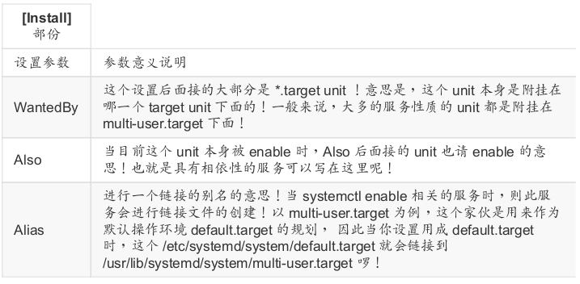

达成 `service` 的程序我们就称呼他为 `daemon`。可以将这两者视为等价关系。

## 早期 System V 的 init

旧版的centos 启动系统服务的管理方式被称为 `SysV` 的 `init` 脚本程序的处理方式，系统内核第一支呼叫的程序是 init ， 然后 init 去唤起所有的系统所需要的服务。

init 的管理机制有几个特点：

- 所有的服务启动脚本通通放置于 /etc/init.d/ 底下，基本上都是使用 bash shell script 所写成的脚本程序。
- 服务是独立启动或被一只总管程序管理而分为两大类：
  - 独立启动模式 (stand alone)：服务独立启动，该服务直接常驻于内存中，提供本机或用户的服务行为，反应速度快。
  - 总管程序 (super daemon)：由特殊的 xinetd 或 inetd 这两个总管程序提供 socket 对应或 port 对应的管理。当没有用户要求某 socket 或 port 时， 所需要的服务是不会被启动的。若有用户要求时，xinetd 总管才会去唤醒相对应的服务程序。当该要求结束时，这个服务也会被结束掉~ 因为透过xinetd 所总管，因此这个家伙就被称为 super daemon。好处是可以透过 super daemon 来进行服务的时程、联机需求等的控制，缺点是唤醒服务需要一点时间的延迟。

- 服务的依赖性问题。init 在管理员自己手动处理这些服务时，是没有办法协助依赖服务的唤醒的。
- 执行等级的分类。init 是开机后核心主动呼叫的， 然后 init 可以根据用户自定义的执行等级（`runlevel`）来唤醒不同的服务，以进入不同的操作界面。基本上 Linux 提供 7 个执行等级，分别是 0， 1， 2...6 ， 比较重要的是 1)单人维护模式、3)纯文本模式、5)文字加图形界面。而各个执行等级的启动脚本是透`/etc/rc.d/rc[0-6]/SXXdaemon` （S 为启动该服务， XX 是数字，为启动的顺序）连结到 `/etc/init.d/daemon`。在开机时可以*依序执行*所有需要的服务，同时也能解决依赖服务的问题。
- 执行等级的切换行为。当你要从纯文本界面 (runlevel 3) 切换到图形界面 (runlevel 5)， 不需要手动启动、关闭该执行等级的相关服务，只要`init 5`即可切换。

附：[鸟哥对于init的详细介绍](http://linux.vbird.org/linux_basic/0560daemons/0560daemons-centos5.php) TODO

## systemd

还可以看看这篇文章：http://www.ruanyifeng.com/blog/2016/03/systemd-tutorial-commands.html


CentOS 7.x 以后，从 init 启动转为 systemd 启动服务。特色：

- 平行处理所有服务，加速开机流程。

  旧的 init 启动脚本是*一项一项任务依序启动*的模式，因此不相依的服务也是得要一个一个的等待。

- 一经要求就响应的 on-demand 启动方式。

  systemd 由于常驻内存，因此任何要求(on-demand) 都可以立即处理后续的 daemon 启动的任务。

- 服务依赖性的自我检查。

  systemd 可以自定义服务依赖性的检查。

- 依 daemon 功能分类。

  首先 systemd 先定义所有的服务为一个服务单位 (unit)，并将该 unit 归类到不同的服务类型 (type) 去。

- 将多个 daemons 集合成为一个群组。

  如同 systemV 的 init 里头有个 runlevel 的特色，systemd 亦将许多的功能集合成为一个所谓的 `target` 项目。

- 向下兼容旧有的 init 服务脚本。

  旧的 init 启动脚本也能够透过 systemd 来管理，只是更进阶的 systemd 功能就没有办法支持就是了。

不过 systemd 也是有些地方**无法完全取代 init **的：

- 在 runlevel 的对应上，大概仅有 runlevel 1， 3， 5 有对应到 systemd 的某些 target 类型而已；
- systemctl 支持的语法有限制，不像`/etc/init.d/daemon`就是纯脚本可以自定义参数，systemctl 不可自定义参数；
- 如果某个服务启动是管理员自己手动执行启动，而不是使用 systemctl 去启动的，那么 systemd 将无法侦测到该服务，而无法进一步管理；
- systemd 启动过程中，无法与管理员透过 standard input 传入讯息。自行撰写 systemd 的启动设定时，务必要取消交互机制和启动时的标准输入信息。

### 配置文件的存放目录

- `/usr/lib/systemd/system/`：每个服务最主要的启动脚本设定，有点类似以前的 /etc/init.d 底下的文件；
- `/run/systemd/system/`：系统执行过程中所产生的服务脚本；
- `/etc/systemd/system/`：管理员依据主机系统的需求所建立的执行脚本，其实这个目录有点像以前
  /etc/rc.d/rc5.d/Sxx 之类的功能。

这三个文件夹下的文件的执行**优先级依次递增**。

### 常见服务类型

`/usr/lib/systemd/system/`以**扩展名**区分不同的服务类型。

```
[sink@dev ~]$ ll /usr/lib/systemd/system/ | egrep '(vsftpd|crond|multi)'
-rw-r--r--. 1 root root  318 Aug  9 07:07 crond.service
-rw-r--r--. 1 root root  623 Aug  9 07:08 multipathd.service
-rw-r--r--. 1 root root  492 Aug  8 19:58 multi-user.target
drwxr-xr-x. 2 root root  258 Oct 22 16:17 multi-user.target.wants
lrwxrwxrwx. 1 root root   17 Oct 22 16:01 runlevel2.target -> multi-user.target
lrwxrwxrwx. 1 root root   17 Oct 22 16:01 runlevel3.target -> multi-user.target
lrwxrwxrwx. 1 root root   17 Oct 22 16:01 runlevel4.target -> multi-user.target
-rw-r--r--. 1 root root  171 Oct 31  2018 vsftpd.service
-rw-r--r--. 1 root root  184 Oct 31  2018 vsftpd@.service
-rw-r--r--. 1 root root   89 Oct 31  2018 vsftpd.target
```

 常见的服务类型：

| 扩展名                | 主要服务功能                                                 |
| --------------------- | ------------------------------------------------------------ |
| .service              | 一般服务类型 (service unit)：主要是系统服务，包括服务器本身所需要的本机服务以及网络服务。 |
| .socket               | 内部程序数据交换的插槽服务 (socket unit)：主要是 IPC (Inter-process communication) 的传输讯息插槽文件 (socket file) 功能。 |
| .target               | 执行环境类型 (target unit)：其实是一群 unit 的集合。         |
| .mount<br/>.automount | 文件系统挂载相关的服务 (automount unit / mount unit)。       |
| .path                 | 侦测特定文件或目录类型 (path unit)：某些服务需要侦测某些特定的目录来提供队列服务。 |
| .timer                | 循环执行的服务 (timer unit)：类似于 anacrontab 。不过是由 systemd 主动提供的，比 anacrontab 更加有弹性 |

### 服务状态

- static：这个 daemon 不可以自己启动 (enable 不可)，不过可能会被其他的 enabled 的服务来唤醒 (依赖
  的服务)
- mask：这个 daemon 无论如何都无法被启动!因为已经被强制注销 (非删除)。可透过 systemctl unmask 方
  式改回原本状态

### 服务管理

```
systemctl mask <unit-name>			强制注销服务，增强版的 disable，无论如何都不能启动该服务
systemctl unmask <unit-name>
```

本质上就是利用`/etc/systemd/system/`优先级最高，建立一条指向`/dev/null`的无用链接。

```bash
[root@dev ~]# systemctl is-active cups.service 
active
[root@dev ~]# systemctl is-enabled cups.service 
enabled
[root@dev ~]# systemctl mask cups.service 
Created symlink from /etc/systemd/system/cups.service to /dev/null.
[root@dev ~]# systemctl is-enabled cups.service 
masked
# 注意这里仍然是启动状态，所以正确的做法是先关闭服务，再注销服务
[root@dev ~]# systemctl is-active cups.service 
active
[root@dev ~]# ll /etc/systemd/system/cups.service 
lrwxrwxrwx. 1 root root 9 Nov 25 14:11 /etc/systemd/system/cups.service -> /dev/null
```

### 查看socket文件

```
systemctl list-sockets [--all]
```

### 查看服务

```
systemctl							显示 enabled 服务
systemctl list-unit-files			列出所有已经安装的服务
systemctl list-units [--type=unit-type] [--all]	列出目前启动的 unit， --all：把 inactive 的unit也列出来
```

### 管理不同的操作环境

#### 查看

```bash
[root@dev ~]# systemctl list-units --type target --all
  UNIT                       LOAD      ACTIVE   SUB    DESCRIPTION
  basic.target               loaded    active   active Basic System
  cryptsetup.target          loaded    active   active Local Encrypted Volumes
  ……
```

与操作界面相关性比较高的 target：

- multi-user.target：纯文本多用户模式
- graphical.target：文本加上图形界面，包含 multi-user.target
- rescue.target：救援模式。在无法使用 root 登入的情况下，systemd 在开机时会多加一个额外的暂时系统，与你原本的系统无关。
- emergency.target：急救模式。还是需要使用 root 登入的情况，在无法使用 rescue.target 时可以尝试
- shutdown.target：关机的流程
- getty.target：可以设定你需要几个 tty 之类的，如果想要降低 tty 的项目，可以修改这个东西的配置文件

#### 管理

```
systemctl [command] [unit.target]

commands:
	get-default
	set-default		修改系统的默认操作模式
	isolate			切换模式
```

```bash
[sink@dev ~]$ systemctl get-default 
graphical.target
# 注意这里修改的是全部用户的默认配置
[sink@dev ~]$ systemctl set-default multi-user.target 
Removed symlink /etc/systemd/system/default.target.
Created symlink from /etc/systemd/system/default.target to /usr/lib/systemd/system/multi-user.target.
# 切换到文本模式
[sink@dev ~]$ systemctl isolate multi-user.target
```

#### 暂停与休眠模式

- suspend：暂停模式会将系统的状态数据保存到内存中，然后关闭掉大部分的系统硬件，并没有实际关机。唤醒的速度较快。
- hibernate：休眠模式则是将系统状态保存到硬盘当中，保存完毕后，将计算机关机。当用户尝试唤醒系统时，系统会开始正常运作， 然后将保存在硬盘中的系统状态恢复回来。唤醒的速度与你的硬盘速度有关。

除了使用`isolate`来切换各种模式，systemd 还提供了简单的指令来切换模式：

```
systemctl suspend
systemctl hibernate
```

### 分析服务之间的依赖关系

```
systemctl list-dependencies [NAME]

Options 
	--reverse		列出谁依赖该 unit
	--after			位于该 unit 之前的 unit（你没看错，我没有写反）
	--before		位于该 unit 之后的 unit
	--all			默认只会列出 target unit 的依赖，使用该选项列出全部
```

```bash
[sink@dev ~]$ systemctl get-default 
multi-user.target
[sink@dev ~]$ systemctl list-dependencies 
default.target
● ├─abrt-ccpp.service
● ├─abrt-oops.service
● ├─abrt-vmcore.service
……
# 在该 unit 启动之后再启动的 unit，即该 unit 需要在哪些 unit 之前就启动了
[sink@dev ~]$ systemctl list-dependencies --before
default.target
● ├─systemd-readahead-done.service
● ├─systemd-readahead-done.timer
● ├─systemd-update-utmp-runlevel.service
● └─graphical.target
●   └─systemd-update-utmp-runlevel.service
# target 中只有图形界面使用到了 multi-user.target
[sink@dev ~]$ systemctl list-dependencies --reverse
default.target
● └─graphical.target

[sink@dev ~]$ systemctl list-dependencies vsftpd
vsftpd.service
● ├─system.slice
● └─basic.target
●   ├─firewalld.service
●   ├─microcode.service
……
```

### 与 systemd 的 daemon 运行过程相关的目录

哪些目录跟系统的 daemon 运作有关：

- `/usr/lib/systemd/system/`

  默认的启动脚本配置文件都放在这里，这里的数据尽量不要修改（到`/etc/systemd/system`修改）

- `/run/systemd/system/`

  系统执行过程中所产生的服务脚本，这些脚本的优先序要比`/usr/lib/systemd/system/`高。

- `/etc/systemd/system/`

  管理员依据主机系统的需求所建立的执行脚本，执行优先序又比`/run/systemd/system/`高。

- `/etc/sysconfig/*`

  几乎所有的服务都会将**初始化的一些选项**设定写入到这个目录下。

- `/var/lib/`

  一些会产生数据的服务都会将他的数据写入到该目录下。

- `/run/`

  放置了好多 daemon 的临时文件，包括 lock file 以及 PID file 等等。

### service 类型配置文件

修改配置文件最好在`/etc/systemd/system/`下面新增或者修改，而不要改动原先在`/usr/lib/systemd/system/`就有的配置文件。

以`vsftpd.service`为例，对目录的作用进行说明：

- /usr/lib/systemd/system/vsftpd.service：安装时预设的配置文件；
- /etc/systemd/system/vsftpd.service.d/custom.conf：自定义配置文件，以`.conf`为后缀，该目录下的文件会累加到 /usr/lib/systemd/system/vsftpd.service 里面；
- /etc/systemd/system/vsftpd.service.wants/*：此目录下都是链接文件，意思是启动了 vsftpd.service 之后，最好这些服务也启动；
- /etc/systemd/system/vsftpd.service.requires/*：此目录下都是链接文件，意思是启动 vsftpd.service 之前，这些服务必须启动。

#### 配置文件内容

以`/usr/lib/systemd/system/sshd.service`为例：

```bash
[root@dev ~]# cat /usr/lib/systemd/system/sshd.service 
[Unit]
Description=OpenSSH server daemon
Documentation=man:sshd(8) man:sshd_config(5)
After=network.target sshd-keygen.service
Wants=sshd-keygen.service

[Service]
Type=notify
EnvironmentFile=/etc/sysconfig/sshd
ExecStart=/usr/sbin/sshd -D $OPTIONS
ExecReload=/bin/kill -HUP $MAINPID
KillMode=process
Restart=on-failure
RestartSec=42s

[Install]
WantedBy=multi-user.target
```

查看上面的文件，其内容主要分为三个部分：

- [Unit]：unit 本身的说明、文档、依赖等；
- [Service]：Service 表明这是service类型的服务，其他 unit 类型也有自己对应的名称，这部分与实际执行的指令参数有关，包括如何启动、环境配置文件等；
- [Install]：此 unit 挂载到哪个 target 下面。

```bash
[root@dev ~]# ll /etc/systemd/system/multi-user.target.wants/sshd.service
lrwxrwxrwx. 1 root root 36 Oct 18 19:48 /etc/systemd/system/multi-user.target.wants/sshd.service -> /usr/lib/systemd/system/sshd.service
```

##### 配置文件规则

- 设定参数通常是可以重复的，不过后面的会覆盖掉前面的设定，那么归零可以这样写：`After=`；
- 如果设定参数需要有`是/否`的项目 (布尔值， boolean)，则可以使用下面的任意值及其相反值：`1，on，true，yes`；
- 开头为`# 或 ;`的那一行，都代表注释。

##### 配置文件参数

每个部分的部分参数如下所示（所有参数的查阅：`man systemd.unit`中有`[Unit] 和 [Install]`部分的说明，各种类型的说明在各自的`man systemd.<unit_type>`中。）：




以`vsftpd2.service`为例新建一个ftp服务：

```bash
[root@dev vsftpd]# cd /etc/vsftpd/
[root@dev vsftpd]# cp vsftpd.conf vsftpd2.conf
# 在前面的 SELinux 章节修改了端口号为 555，把它改回来 21
[root@dev vsftpd]# vi vsftpd.conf
[root@dev vsftpd]# cd /etc/systemd/system/
[root@dev system]# cp /usr/lib/systemd/system/vsftpd.service vsftpd2.service
# 把里面的启动配置文件换成 vsftpd2.conf
[root@dev system]# vi vsftpd2.service
# 因为已经在 SELinux 的规则中添加了 555 端口，所以这里不会报错啦
[root@dev system]# systemctl restart vsftpd.service vsftpd2.service
[root@dev system]# netstat -ntlp | grep ftp
tcp6       0      0 :::555                  :::*                    LISTEN      10565/vsftpd        
tcp6       0      0 :::21                   :::*                    LISTEN      10564/vsftpd
```

#### 配置多个重复设定的服务

`vsftpd`可以存在多个实例，那如果每个几乎相同的实例都要在`/etc/systemd/system/`下面编写配置岂不是要累死人了？

```bash
[root@dev ~]# cd /etc/vsftpd
# 把端口改为 9003
[root@dev vsftpd]# vi vsftpd3.conf
# 不要 enable 该服务！！！
[root@dev vsftpd]# systemctl start vsftpd@vsftpd3.service
[root@dev vsftpd]# netstat -ntlp | grep ftp
tcp6       0      0 :::9003                 :::*                    LISTEN      11681/vsftpd        
tcp6       0      0 :::555                  :::*                    LISTEN      10565/vsftpd        
tcp6       0      0 :::21                   :::*                    LISTEN      10564/vsftpd
```

怎么样，是不是很神奇，居然只复制了一份ftp运行时配置就可以直接起来一个服务！主要发挥作用的就是下面这个文件啦：

```bash
[root@dev vsftpd]# cat /usr/lib/systemd/system/vsftpd@.service 
[Unit]
Description=Vsftpd ftp daemon
After=network.target
PartOf=vsftpd.target

[Service]
Type=forking
ExecStart=/usr/sbin/vsftpd /etc/vsftpd/%i.conf

[Install]
WantedBy=vsftpd.target
```

在启动的脚本设定当中， `%i 或 %I` 就是代表 @ 后面接的范例文件名的意思，有了这个文件，就能像上面那样重复启动服务啦。

!!! note
	这次增加端口却不需要更改SELinux的配置了，这是因为默认启动小于 1024 号码以下的端口口时， 需要使用到 root 的权限，因此小于 1024 以下端口的启动较可怕。而这次范例中，我们使用 9003 端口，他对于系统的影响可能小一些 (其实一样可怕!)， 所以就忽略了 SELinux 的限制了。

#### 制作服务示例

只执行一次的服务。

```bash
# 具有执行权限的脚本
[root@dev ~]# ll /home/backup.sh 
-rwxr-xr-x. 1 root root 199 Nov 25 17:25 /home/backup.sh
[root@dev ~]# cat /home/backup.sh 
#!/bin/sh

[ ! -d /tmp/boot_backup ] && mkdir /tmp/boot_backup
date_str=$(date +%Y%m%d)
tar -zcf /tmp/boot_backup/boot_backup_${date_str}.tar.gz /boot &> /tmp/boot_backup/boot_backup_${date_str}.log
# 服务配置文件
[root@dev ~]# cat /etc/systemd/system/backup.service
[Unit]
Description=/boot backup service
Requires=atd.service

[Service]
Type=simple
# 这里好像不支持 shell 拓展，只能写在 bash 参数里面作为支持？？？
ExecStart=/bin/bash -c "/usr/bin/echo /home/backup.sh | at now"

[Install]
WantedBy=multi-user.target
[root@dev ~]# systemctl daemon-reload
# 执行一次
[root@dev ~]# systemctl start backup.service
# 因为是一次性的服务，所以这里是 inactive
[root@dev ~]# systemctl status backup.service
● backup.service - /boot backup service
   Loaded: loaded (/etc/systemd/system/backup.service; disabled; vendor preset: disabled)  # vendor preset：供应商预设
   Active: inactive (dead)

Nov 25 17:31:34 dev systemd[1]: Started /boot backup service.
Nov 25 17:31:34 dev bash[12851]: job 7 at Mon Nov 25 17:31:00 2019
# 查看结果
[root@dev ~]# ll /tmp/boot_backup/
total 186324
-rw-r--r--. 1 root root        44 Nov 25 17:31 boot_backup_20191125.log
-rw-r--r--. 1 root root 190790040 Nov 25 17:31 boot_backup_20191125.tar.gz
```

### timer 类型的配置文件

systemd.timer 的优势

- 由于所有的 systemd 的服务产生的信息都会被纪录 (log)，因此比 crond 在 debug 上面要更清楚方便的多;

- 各项 timer 的工作可以跟 systemd 的服务相结合;
- 各项 timer 的工作可以跟 control group (cgroup，用来取代 /etc/secure/limit.conf 的功能) 结合，来限制该工作的资源利用。

使用 timer 的前提：

- 系统的 timer.target 一定要启动
- 要有个 sname.service 的服务存在 (sname 是你自己指定的名称)
- 要有个 sname.timer 的时间启动服务存在

#### 配置文件内容

timer 配置文件的基本内容（man systemd.timer & man systemd.time）：


##### OnCalendar参数的设置

基本上的格式如下所示：

```
语法: 英文周名		YYYY-MM-DD		HH:MM:SS
范例: Thu		   	  2015-08-13		13:40:00
```

也可以直接使用间隔时间来处理：

- us	或	usec：微秒	(10<sup>-6 </sup>秒)
- ms	或	msec：毫秒	(10<sup>-3 </sup> 秒)
- s，	sec，	second，	seconds
- m，	min，	minute，	minutes
- h，	hr，	hour，	hours
- d，	day，	days
- w，	week，	weeks
- month，	months
- y，	year，	years

```bash
# 通常英文的写法，小单位写前面，大单位写后面~所以先秒、再分、再小时、再天数等~
隔	3	小时:						 3h	或 3hr 或 3hours
隔	300	分钟过	10	秒:				10s 300m
隔	5	天又	100	分钟:				100m 5day
```

此外，你也可以使用英文常用的口语化日期代表，例如today，tomorrow等。

#### 配置文件示例

##### 循环周期配置

采用上一小节编写的`backup.service`来作为服务，为其编写 timer：

```bash
[root@dev ~]# cd /etc/systemd/system/
[root@dev system]# cat backup.timer 
[Unit]
Description=back up /boot timer

[Timer]
# 系统启动 2小时 后执行
OnBootSec=2h
# 服务第一次执行完毕后每隔 2天 执行一次
OnUnitActiveSec=2d

[Install]
WantedBy=multi-user.target

[root@dev system]# systemctl daemon-reload
[root@dev system]# systemctl enable backup.timer
[root@dev system]# systemctl start backup.timer
# service 无需 enable
[root@dev system]# systemctl list-unit-files | grep backup
backup.service                                disabled
backup.timer                                  enabled

[root@dev system]# systemctl show timers.target | grep ConditionTimestamp=
ConditionTimestamp=Mon 2019-11-25 08:32:25 CST
[root@dev system]# systemctl show backup.service | grep ExecMainExitTimestamp=
ExecMainExitTimestamp=Tue 2019-11-26 09:36:24 CST
# .timer 的时间是根据 .service 与 timers.target 的时间差来计算的，这里时间有点对不上，不过误差不大
[root@dev system]# systemctl show backup.timer | egrep "NextElapseUSecMonotonic|LastTriggerUSecMonotonic="
NextElapseUSecMonotonic=3d 1h 7min 5.741522s	# 下次在什么时候执行
LastTriggerUSecMonotonic=1d 1h 7min 5.739590s	# 上次是什么时候执行的
# Monotonic：单调时间，即从某个时间点开始到现在过去的时间。
```

##### 固定日期配置

```bash
[root@dev system]# cat backup2.timer 
[Unit]
Description=back up /boot timer2

[Timer]
OnCalendar=Sun *-*-* 00:00:00
Persistent=yes
Unit=backup.service

[Install]
WantedBy=multi-user.target

[root@dev system]# systemctl daemon-reload
[root@dev system]# systemctl enable backup2.timer
[root@dev system]# systemctl start backup2.timer

[root@dev system]# systemctl show backup2.timer | grep NextElapseUSecRealtime=
NextElapseUSecRealtime=49y 10month 4w 1d 1h
# Realtime：是实际的时间。是Unix的标准时间 1970-01-01 00:00:00 以来的时间
```

